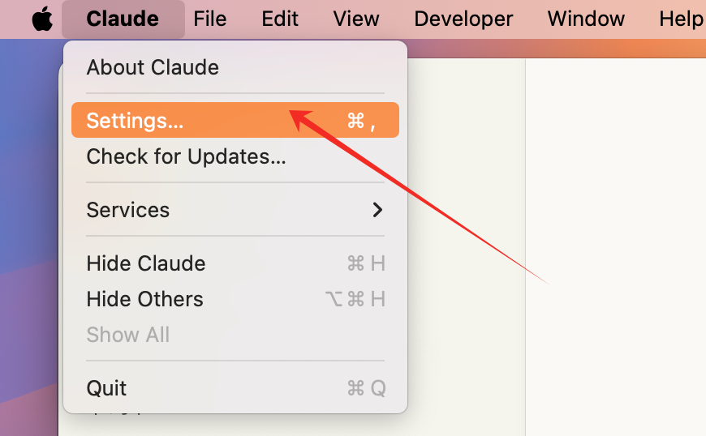
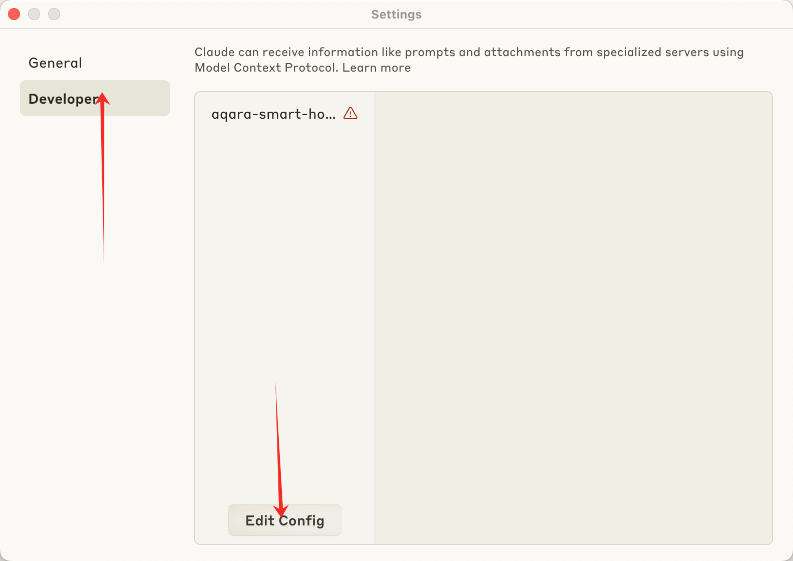
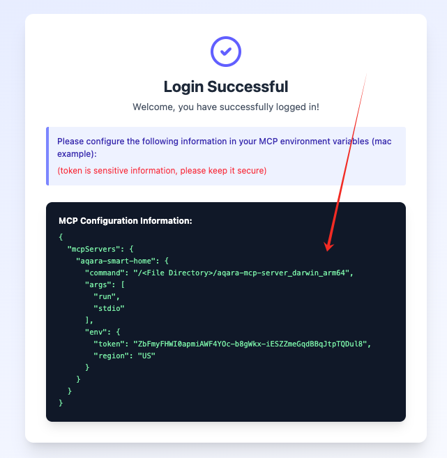
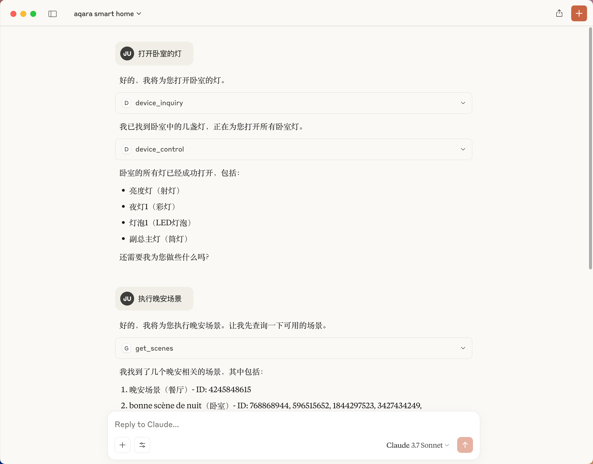

# Aqara MCP Server

[](https://github.com/aqara/aqara-mcp-server)
[](https://golang.org/dl/)
[](https://github.com/aqara/aqara-mcp-server/releases)
[](https://opensource.org/licenses/MIT)

Aqara MCP Server 是一个基于 [MCP (Model Context Protocol)](https://modelcontextprotocol.io/introduction) 协议开发的智能家居控制服务。它允许任何支持 MCP 协议的 AI 助手（例如 Claude、Cursor、VS Code Copilot 等）与您的 Aqara 智能家居设备进行交互，实现通过自然语言控制设备、查询状态、执行场景等功能。

## 目录

- [特性](#特性)
- [工作原理](#工作原理)
- [快速开始](#快速开始)
  - [先决条件](#先决条件)
  - [安装](#安装)
  - [Aqara 账户认证](#aqara-账户认证)
  - [配置示例 (Claude for Desktop)](#配置示例-claude-for-desktop)
  - [运行服务](#运行服务)
- [可用工具](#可用工具)
  - [device_control](#device_control)
  - [device_inquiry](#device_inquiry)
  - [search_device_status](#search_device_status)
  - [search_device_history](#search_device_history)
  - [get_scenes](#get_scenes)
  - [run_scenes](#run_scenes)
  - [get_homes](#get_homes)
  - [switch_home](#switch_home)
- [项目结构](#项目结构)
- [贡献指南](#贡献指南)
- [许可证](#许可证)

## 特性

-   **全面的设备控制**：支持对 Aqara 智能设备的开关、亮度、色温、模式等多种属性进行精细控制。
-   **灵活的设备查询**：能够按房间、设备类型查询设备列表及其详细状态。
-   **历史状态追溯**：查询设备在指定时间范围内的历史状态变更记录。
-   **便捷的场景管理**：支持查询和执行用户预设的智能家居场景。
-   **多家庭支持**：支持查询和切换用户账户下的不同家庭。
-   **MCP 协议兼容**：完全遵循 MCP 协议规范，易于与各类 AI 助手集成。
-   **智能推荐**：基于用户行为提供下一步操作建议，提升交互体验。
-   **跨平台运行**：基于 Go 语言开发，可编译为多平台可执行文件。
-   **易于扩展**：可以方便地添加新的工具和提示来扩展功能。

## 工作原理

Aqara MCP Server 作为 AI 助手与 Aqara 智能家居平台之间的桥梁：

1.  **AI 助手 (MCP 客户端)**：用户通过 AI 助手发出指令 (例如，"打开客厅的灯")。
2.  **MCP 客户端**：将用户指令解析，并根据 MCP 协议调用 Aqara MCP Server 提供的相应工具 (例如 `device_control`)。
3.  **Aqara MCP Server (本项目)**：接收来自客户端的请求，验证后调用 `smh.go` 模块。
4.  **`smh.go` 模块**：使用配置好的 Aqara 凭据，与 Aqara 云端 API 进行通信，执行实际的设备操作或数据查询。
5.  **响应流程**：Aqara 云端 API 返回结果，经由 Aqara MCP Server 传递回 MCP 客户端，最终呈现给用户。

## 快速开始

### 先决条件

-   Go (版本 1.24 或更高)
-   Git (用于从源码构建)
-   Aqara 账户及已绑定的智能设备

### 安装

您可以选择下载预编译的可执行文件或从源码构建。

**选项 1: 下载预编译版本 (推荐)**

访问下面链接,下载适用于您操作系统的最新可执行文件包。

[Releases 页面](https://github.com/aqara/aqara-mcp-server/releases)

解压后即可使用。

**选项 2: 从源码构建**

```bash
# 克隆仓库
git clone https://github.com/aqara/aqara-mcp-server.git
cd aqara-mcp-server

# 下载依赖
go mod tidy

# 构建可执行文件
go build -o aqara-mcp-server
```
构建完成后，会在当前目录下生成 `aqara-mcp-server` 可执行文件。

### Aqara 账户认证

为了使 MCP Server 能够访问您的 Aqara 账户并控制设备，您需要先进行登录授权。

请访问以下地址完成登录授权：
[https://ai-echo.aqara.cn/echo/mcp/login](https://ai-echo.aqara.cn/echo/mcp/login)

登录成功后，您将获得必要的认证信息（如 `token`, `region`），这些信息将在后续配置步骤中使用。

**请妥善保管这些信息，尤其是 `token` 不要泄露给他人。**

### 配置示例 (Claude for Desktop)

不同的 MCP 客户端的配置方法略有不同。以下是如何配置 Claude for Desktop 以使用此 MCP Server 的示例：

1.  打开 Claude for Desktop 的设置 (Settings)。
2.  切换到开发者 (Developer) 标签页。
3.  点击编辑配置 (Edit Config)，使用文本编辑器打开配置文件。

    
    

4.  将"登录成功页面"的配置信息，添加到客户端的配置文件(claude_desktop_config.json)中。

    

### 运行服务

重启 Claude for Desktop。然后就可以通过对话来调用 MCP Server 提供的工具执行设备控制、设备查询等操作。



## 可用工具

MCP 客户端可以通过调用这些工具与 Aqara 智能家居设备进行交互。

### device_control

-   **描述**: 控制智能家居设备的状态或属性（例如开关、温度、亮度、颜色、色温等）。
-   **参数**:
    -   `endpoint_ids` (Array<Integer>, 必需): 需要控制的设备 ID 列表。
    -   `control_params` (Object, 必需): 控制参数对象，包含具体操作。
        -   `action` (String, 必需): 要执行的操作。例如: `"on"`, `"off"`, `"set"`, `"up"`, `"down"`, `"cooler"`, `"warmer"`。
        -   `attribute` (String, 必需): 要控制的设备属性。例如: `"on_off"`, `"brightness"`, `"color_temperature"`, `"ac_mode"`。
        -   `value` (String | Number, 必需): 目标值。
        -   `unit` (String, 可选): 值的单位 (例如: `"%"`, `"K"`, `"℃"`)。
-   **返回**: (String) 设备控制的操作结果消息。

### device_inquiry

-   **描述**: 根据指定的位置（房间）和设备类型获取设备列表（不包含实时状态信息，仅列出设备及其 ID）。
-   **参数**:
    -   `positions` (Array<String>, 可选): 房间名称列表。如果为空数组或未提供，则表示查询所有房间。
    -   `device_types` (Array<String>, 可选): 设备类型列表。例如: `"Light"`, `"WindowCovering"`, `"AirConditioner"`, `"Button"` 等。如果为空数组或未提供，则表示查询所有类型。
-   **返回**: (String) Markdown 格式的设备列表，包含设备名称和 ID。

### search_device_status

-   **描述**: 获取设备的当前状态信息（用于查询颜色、亮度、开关等与状态相关的属性）。
-   **参数**:
    -   `positions` (Array<String>, 可选): 房间名称列表。如果为空数组或未提供，则表示查询所有房间。
    -   `device_types` (Array<String>, 可选): 设备类型列表。可选值同 `device_inquiry`。如果为空数组或未提供，则表示查询所有类型。
-   **返回**: (String) Markdown 格式的设备状态信息。

### search_device_history

-   **描述**: 查询设备的历史状态变更记录。
-   **参数**:
    -   `endpoint_ids` (Array<Integer>, 必需): 需要查询历史记录的设备 ID 列表。
    -   `start_datetime` (String, 必需): 查询起始时间，格式为 `YYYY-MM-DD HH:MM:SS` (例如: `"2023-05-16 12:00:00"`)。
    -   `end_datetime` (String, 必需): 查询结束时间，格式为 `YYYY-MM-DD HH:MM:SS`。
    -   `attribute` (String, 可选): 要查询的特定设备属性名称 (例如: `on_off`, `brightness`)。如果未提供，则查询该设备所有已记录属性的历史记录。
-   **返回**: (String) Markdown 格式的设备历史状态信息。 (注意: 当前实现可能提示 "This feature will be available soon."，表示功能待完善。)

### get_scenes

-   **描述**: 查询用户家庭下所有场景，或指定房间内的场景。
-   **参数**:
    -   `positions` (Array<String>, 可选): 房间名称列表。如果为空数组或未提供，则表示查询整个家庭的场景。
-   **返回**: (String) Markdown 格式的场景信息。

### run_scenes

-   **描述**: 根据场景 ID 执行指定的场景。
-   **参数**:
    -   `scenes` (Array<Integer>, 必需): 需要执行的场景 ID 列表。
-   **返回**: (String) 场景执行的结果消息。

### get_homes

-   **描述**: 获取用户账户下的所有家庭列表。
-   **参数**: 无。
-   **返回**: (String) 以逗号分隔的家庭名称列表。如果无数据则返回空字符串或相应的提示信息。

### switch_home

-   **描述**: 切换用户当前操作的家庭。切换后，后续的设备查询、控制等操作将针对新切换的家庭。
-   **参数**:
    -   `home_name` (String, 必需): 目标家庭的名称（应来自 `get_homes` 工具提供的可用列表）。
-   **返回**: (String) 切换操作的结果消息。

## 项目结构

```
.
├── cmd.go                # Cobra CLI 命令定义，程序入口 (包含 main 函数)
├── server.go             # MCP 服务核心逻辑，定义和注册工具与提示，处理客户端请求
├── smh.go                # Smart Home (Aqara) 平台接口封装，负责与 Aqara API 通信
├── go.mod                # Go 模块依赖文件
├── go.sum                # Go 模块校验和文件
├── img/                  # README 中使用的图片资源
└── README.md             # 本文档
```
-   `cmd.go`: 定义了应用的命令行接口 (CLI)，包括 `run stdio` 和 `run sse` 子命令。程序的 `main` 函数也在此文件中，调用 Cobra 执行命令。
-   `server.go`: 实现了 MCP 服务器的核心功能。它初始化服务器，定义所有可用的 MCP 工具 (如 `device_control`) 和提示 (如 `recommend`)，并将它们注册到服务器。同时，它还包含处理来自 MCP 客户端的工具调用请求的处理器函数。
-   `smh.go`: (Smart Home) 封装了与 Aqara 智能家居平台 API 交互的逻辑。当 `server.go` 中的工具处理器接收到请求时 (例如控制一个设备)，它会调用 `smh.go` 中相应的函数。`smh.go` 负责构造发送给 Aqara API 的请求、处理响应，并使用在服务器配置中提供的凭据进行认证。

## 贡献指南

欢迎通过提交 Issue 或 Pull Request 来参与项目贡献！

在提交代码前，请确保：
1.  代码遵循 Go 语言的编码规范。
2.  相关的 MCP 工具和提示接口定义保持一致性和清晰性。
3.  添加或更新单元测试以覆盖您的更改。
4.  如有必要，更新相关的文档 (如本 README)。
5.  确保您的提交信息清晰明了。

## 许可证

本项目基于 [MIT License](./LICENSE) 授权。
Copyright (c) 2025 Aqara-Copliot
```