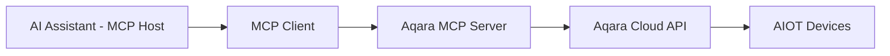

<div align="center" style="display: flex; align-items: center; justify-content: center; ">

  
  <h1>Aqara MCP Server</h1>

</div>

<div align="center">

English | [中文](/readme/README_CN.md) | [繁體中文](/readme/README_CHT.md) | [Français](/readme/README_FR.md) | [한국어](/readme/README_KR.md) | [Español](/readme/README_ES.md) | [日本語](/readme/README_JP.md) | [Deutsch](/readme/README_DE.md) | [Italiano](/readme/README_IT.md)

[](https://github.com/aqara/aqara-mcp-server)
[](https://golang.org/dl/)
[](https://github.com/aqara/aqara-mcp-server/releases)
[](https://opensource.org/licenses/MIT)
[](https://modelcontextprotocol.io/)

</div>

**Aqara MCP Server** is a smart home automation control service built on the [Model Context Protocol (MCP)](https://modelcontextprotocol.io/introduction). This platform enables seamless integration between AI assistants (like Claude, Cursor, etc.) and the Aqara smart home ecosystem.

## Table of Contents

- [Table of Contents](#table-of-contents)
- [Features](#features)
- [How It Works](#how-it-works)
- [Quick Start](#quick-start)
  - [Prerequisites](#prerequisites)
  - [Step 1: Account Authentication](#step-1-account-authentication)
  - [Step 2: How to Use](#step-2-how-to-use)
    - [Option A: Remote MCP Server (Recommended)](#option-a-remote-mcp-server-recommended)
    - [Option B: Local MCP Server](#option-b-local-mcp-server)
  - [Step 3: Verification](#step-3-verification)
- [API Reference](#api-reference)
  - [Core Tools Overview](#core-tools-overview)
  - [Device Control API](#device-control-api)
    - [`device_control`](#device_control)
  - [Device Query API](#device-query-api)
    - [`device_query`](#device_query)
    - [`device_status_query`](#device_status_query)
    - [`device_log_query`](#device_log_query)
  - [Scene Management API](#scene-management-api)
    - [`get_scenes`](#get_scenes)
    - [`run_scenes`](#run_scenes)
  - [Home Management API](#home-management-api)
    - [`get_homes`](#get_homes)
    - [`switch_home`](#switch_home)
  - [Automation Configuration API](#automation-configuration-api)
    - [`automation_config`](#automation_config)
- [Project Structure](#project-structure)
  - [Directory Structure](#directory-structure)
  - [Core File Descriptions](#core-file-descriptions)
- [Development \& Contribution](#development--contribution)
  - [Development Environment Setup](#development-environment-setup)
  - [Code Quality Standards](#code-quality-standards)
  - [Contribution Guidelines](#contribution-guidelines)
- [License](#license)

## Features

- ✨ **Comprehensive Device Control**: Fine-grained control over various attributes of Aqara smart devices, including on/off, brightness, color temperature, and modes.
- 🔍 **Flexible Device Query**: Ability to query device lists and their detailed statuses by room or device type.
- 🎬 **Smart Scene Management**: Supports querying and executing user-predefined smart home scenes.
- 📈 **Device History**: Query the historical status change records of devices within a specified time range.
- ⏰ **Automation Configuration**: Supports configuring scheduled or delayed device control tasks.
- 🏠 **Multi-Home Support**: Supports querying and switching between different homes under a user's account.
- 🔌 **MCP Protocol Compatibility**: Fully compliant with the MCP specification, allowing for easy integration with various AI assistants.
- 🔐 **Secure Authentication**: Utilizes a login authorization + signature-based security mechanism to protect user data and device security.
- 🌐 **Cross-Platform**: Developed in Go, can be compiled into executables for multiple platforms.
- 🔧 **Easily Extensible**: Modular design allows for the convenient addition of new tools and features.

## How It Works

Aqara MCP Server acts as a bridge between AI assistants and the Aqara smart home platform:



1.  **AI Assistant**: The user issues a command through an AI assistant (e.g., "Turn on the living room light").
2.  **MCP Client**: Parses the user's command and calls the corresponding tool provided by the Aqara MCP Server (e.g., `device_control`) according to the MCP protocol.
3.  **Aqara MCP Server (This Project)**: Receives the request from the client, communicates with the Aqara Cloud API using the configured Aqara credentials, and executes the actual device operation or data query.
4.  **Response Flow**: The Aqara Cloud API returns the result, which is passed back to the MCP client via the Aqara MCP Server and finally presented to the user.

---

## Quick Start

### Prerequisites

-   **Aqara Account** with registered smart devices.
-   **MCP-enabled Client** (e.g., Claude for Desktop, Cursor).
-   **Go 1.24+** (only required for local deployment from source).

### Step 1: Account Authentication

Regardless of the deployment mode, you first need to obtain Aqara authentication credentials:

1.  **Visit the Login Page**:
    🔗 [https://cdn.aqara.com/app/mcpserver/login.html](https://cdn.aqara.com/app/mcpserver/login.html)

2.  **Complete the Login Process**:
    -   Log in with your Aqara credentials.
    -   Obtain the `api_key` and `base_url`.

3.  **Store Credentials Securely**:
    > ⚠️ Please keep your `api_key` information safe and do not disclose it to others.

    

### Step 2: How to Use

Choose the deployment method that suits your needs:

#### Option A: Remote MCP Server (Recommended)

**Suitable for**: Users who want to get started quickly without local environment setup.

**Advantages**:

-   ✅ **Ready to Use**: No need to download or compile; configure and use directly.
-   ✅ **Automatic Updates**: The server is automatically maintained and updated.
-   ✅ **High Availability**: Professional operations ensure service stability.
-   ✅ **Multi-Platform Compatibility**: No operating system restrictions.

**Configure MCP Client**:

1.  **Open Settings**:
    -   Launch Cursor.

    

2.  **Add Server Configuration**:

    ```json
    {
      "mcpServers": {
        "aqara": {
          "type": "http",
          "url": "https://[mcp-server-domain]/echo/mcp",  // base_url
          "headers": {
            "Authorization": "Bearer [YOUR_API_KEY_HERE]"  // api_key
          }
        }
      }
    }
    ```

3.  **Restart the Application**:
    -   Restart Cursor for the changes to take effect.

#### Option B: Local MCP Server

**Suitable for**: Users who require data sovereignty, custom configurations, or offline use.

**Advantages**:

-   ✅ **Data Privacy**: All data is processed locally.
-   ✅ **Full Control**: Customizable configuration and extensible features.
-   ✅ **Offline Availability**: Basic functions are not affected by network interruptions.
-   ✅ **No Restrictions**: Not limited by cloud services.

**Installation Steps**:

1.  **Download the Program** (choose one):

    **Recommended: Download Pre-compiled Version**

    Visit [GitHub Releases](https://github.com/aqara/aqara-mcp-server/releases) to download the latest version for your operating system.

    **Alternatively: Build from Source**

    ```bash
    git clone https://github.com/aqara/aqara-mcp-server.git
    cd aqara-mcp-server
    go mod tidy
    go build -ldflags="-s -w" -o aqara-mcp-server
    ```

2.  **Set Environment Variables**:

    ```bash
    export aqara_api_key="your_api_key_here"
    export aqara_base_url="your_base_url_here"
    ```

**Configure MCP Client (e.g., **Claude for Desktop**)**:

1.  **Open Settings**:
    -   Launch Claude for Desktop.
    -   Navigate to: Settings → Developer.

    

2.  **Edit Configuration File**:
    -   Click "Edit Configuration".

    

3.  **Add Server Configuration (claude_desktop_config.json)**:

    ```json
    {
      "mcpServers": {
        "aqara": {
          "command": "/path/to/aqara-mcp-server",
          "args": ["run", "stdio"],
          "env": {
            "aqara_api_key": "your_api_key_here",
            "aqara_base_url": "your_base_url_here"
          }
        }
      }
    }
    ```

4.  **Restart the Application**:
    -   Restart Claude for Desktop for the changes to take effect.

### Step 3: Verification

Use the following test commands to verify that the configuration is successful:

```
User: "Show all devices in my home"
Assistant: [Queries device list via MCP]

User: "Turn on the living room light"
Assistant: [Executes device control via MCP]

User: "Run the evening scene"
Assistant: [Executes scene via MCP]
```

If you see a message like "🔧 Connected to Aqara MCP Server," the configuration is successful!

---

## API Reference

### Core Tools Overview

| Tool Category        | Tool                                                 | Description                          |
| -------------------- | ---------------------------------------------------- | ------------------------------------ |
| **Device Control**   | `device_control`                                     | Direct device operations             |
| **Device Query**     | `device_query`, `device_status_query`, `device_log_query` | Comprehensive device information     |
| **Scene Management** | `get_scenes`, `run_scenes`                           | Automated scene control              |
| **Home Management**  | `get_homes`, `switch_home`                           | Multi-home environment support       |
| **Automation**       | `automation_config`                                  | Scheduled task configuration         |

### Device Control API

#### `device_control`

Controls the state or attributes of smart home devices (e.g., on/off, temperature, brightness, color, color temperature).

**Parameters:**

-   `endpoint_ids` _(Array\<Integer\>, required)_: A list of device IDs to be controlled.
-   `control_params` _(Object, required)_: A control parameter object containing specific actions:
    -   `action` _(String, required)_: The action to perform (e.g., `"on"`, `"off"`, `"set"`, `"up"`, `"down"`, `"cooler"`, `"warmer"`).
    -   `attribute` _(String, required)_: The device attribute to control (e.g., `"on_off"`, `"brightness"`, `"color_temperature"`, `"ac_mode"`).
    -   `value` _(String | Number, optional)_: The target value (required when `action` is "set").
    -   `unit` _(String, optional)_: The unit of the value (e.g., `"%"`, `"K"`, `"℃"`).

**Returns:** A message indicating the result of the device control operation.

### Device Query API

#### `device_query`

Retrieves a comprehensive list of devices based on specified locations (rooms) and device types, with support for filtering (does not include real-time status information).

**Parameters:**

-   `positions` _(Array\<String\>, optional)_: A list of room names. An empty array queries all rooms.
-   `device_types` _(Array\<String\>, optional)_: A list of device types (e.g., `"Light"`, `"WindowCovering"`, `"AirConditioner"`, `"Button"`). An empty array queries all types.

**Returns:** A Markdown-formatted list of devices, including device names and IDs.

#### `device_status_query`

Gets the current status information of devices (used to query real-time status like color, brightness, on/off).

**Parameters:**

-   `positions` _(Array\<String\>, optional)_: A list of room names. An empty array queries all rooms.
-   `device_types` _(Array\<String\>, optional)_: A list of device types. Same options as `device_query`. An empty array queries all types.

**Returns:** Markdown-formatted device status information.

#### `device_log_query`

Queries the historical log information of devices.

**Parameters:**

-   `endpoint_ids` _(Array\<Integer\>, required)_: A list of device IDs for which to query history.
-   `start_datetime` _(String, optional)_: The query start time in `YYYY-MM-DD HH:MM:SS` format (e.g., `"2023-05-16 12:00:00"`).
-   `end_datetime` _(String, optional)_: The query end time in `YYYY-MM-DD HH:MM:SS` format.
-   `attributes` _(Array\<String\>, optional)_: A list of device attribute names to query (e.g., `["on_off", "brightness"]`). If not provided, all logged attributes are queried.

**Returns:** Markdown-formatted historical device status information.

### Scene Management API

#### `get_scenes`

Queries all scenes in a user's home or scenes in specified rooms.

**Parameters:**

-   `positions` _(Array\<String\>, optional)_: A list of room names. An empty array queries scenes for the entire home.

**Returns:** Markdown-formatted scene information.

#### `run_scenes`

Executes specified scenes by their scene IDs.

**Parameters:**

-   `scenes` _(Array\<Integer\>, required)_: A list of scene IDs to be executed.

**Returns:** A message indicating the result of the scene execution.

### Home Management API

#### `get_homes`

Gets a list of all homes under the user's account.

**Parameters:** None

**Returns:** A comma-separated list of home names. Returns an empty string or a corresponding message if no data is available.

#### `switch_home`

Switches the user's currently active home. After switching, subsequent device queries, controls, etc., will target the newly switched home.

**Parameters:**

-   `home_name` _(String, required)_: The name of the target home.

**Returns:** A message indicating the result of the switch operation.

### Automation Configuration API

#### `automation_config`

Configures automation (currently only supports scheduled or delayed device control tasks).

**Parameters:**

-   `scheduled_time` _(String, required)_: The scheduled execution time in standard Crontab format `"min hour day month week"`. E.g., `"30 14 * * *"` (execute at 14:30 every day), `"0 9 * * 1"` (execute at 9:00 every Monday).
-   `endpoint_ids` _(Array\<Integer\>, required)_: A list of device IDs to be controlled on a schedule.
-   `control_params` _(Object, required)_: Device control parameters, in the same format as the `device_control` tool (including action, attribute, value, etc.).
-   `task_name` _(String, required)_: The name or description of this automation task (for identification and management).
-   `execution_once` _(Boolean, optional)_: Whether to execute only once.
    -   `true`: Executes the task only once at the specified time (default).
    -   `false`: Executes the task periodically (e.g., daily, weekly).

**Returns:** A message indicating the result of the automation configuration.

## Project Structure

### Directory Structure

```text
.
├── cmd.go                # Cobra CLI command definitions and program entry point (contains main function)
├── server.go             # Core MCP server logic, tool definitions, and request handling
├── smh.go                # Aqara smart home platform API interface wrapper
├── middleware.go         # Middleware: user authentication, timeout control, panic recovery
├── config.go             # Global configuration management and environment variable handling
├── go.mod                # Go module dependency management file
├── go.sum                # Go module dependency checksum file
├── readme/               # README documents and image resources
│   ├── img/              # Image resource directory
│   └── *.md              # Multi-language README files
├── LICENSE               # MIT open source license
└── README.md             # Main project document
```

### Core File Descriptions

-   **`cmd.go`**: CLI implementation based on the Cobra framework, defining `run stdio` and `run http` start modes and the main entry function.
-   **`server.go`**: Core MCP server implementation, responsible for tool registration, request handling, and protocol support.
-   **`smh.go`**: Aqara smart home platform API wrapper layer, providing device control, authentication, and multi-home support.
-   **`middleware.go`**: Request handling middleware, providing authentication validation, timeout control, and exception handling.
-   **`config.go`**: Global configuration management, responsible for handling environment variables and API configuration.

## Development & Contribution

### Development Environment Setup

```bash
# Clone the repository
git clone https://github.com/aqara/aqara-mcp-server.git
cd aqara-mcp-server

# Install dependencies
go mod tidy

# Run tests
go test ./...

# Optimized build
go build -ldflags="-s -w" -o aqara-mcp-server
```

### Code Quality Standards

-   **Go Language**: Follows official Go coding standards.
-   **Documentation**: Comprehensive API documentation.
-   **Testing**: Minimum 80% code coverage.
-   **Security**: Regular security audits.

### Contribution Guidelines

1.  **Fork the repository**
2.  **Create a feature branch**: `git checkout -b feature/amazing-feature`
3.  **Commit your changes**: `git commit -m 'Add some amazing feature'`
4.  **Push to the branch**: `git push origin feature/amazing-feature`
5.  **Open a Pull Request**

---

## License

This project is licensed under the [MIT License](/LICENSE) - see the [LICENSE](LICENSE) file for details.

---

**Copyright © 2025 Aqara-Copilot. All rights reserved.**
