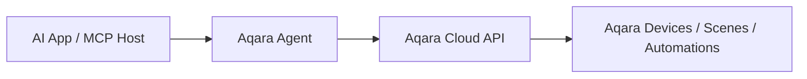

<div align="center" style="display: flex; align-items: center; justify-content: center; ">

  
  <h1>Aqara MCP Server</h1>

</div>

<div align="center">

English | [中文](README_CN.md) | [Français](README_FR.md) | [한국어](README_KR.md) | [Español](README_ES.md) | [日本語](README_JP.md) | [Deutsch](README_DE.md) | [Italiano](README_IT.md)

[](https://opensource.org/licenses/MIT)
[](https://modelcontextprotocol.io/)

</div>

**Aqara MCP Server** is a remote MCP service provided by Aqara Agent. It lets MCP-enabled AI applications securely connect to Aqara smart home capabilities. When you need MCP integration, configure the remote MCP URL provided by Aqara Agent.

> [!TIP]
> **Recommended: Official Aqara Agent Skills**
>
> If your application supports Agent Skills (such as Codex, Cursor, or OpenClaw), we recommend using the official **Aqara Agent Skills** first. You can query and control homes/spaces, devices, scenes, automations, energy consumption, and more in natural language—without configuring an MCP Server.
>
> - GitHub: [aqara/aqara-agent-skills](https://github.com/aqara/aqara-agent-skills)
> - ClawHub: [aqara/aqara-agent](https://clawhub.ai/aqara/aqara-agent)

## Table of Contents

- [Overview](#overview)
- [Features](#features)
- [How It Works](#how-it-works)
- [Quick Start](#quick-start)
  - [Prerequisites](#prerequisites)
  - [Step 1: Account Authentication](#step-1-account-authentication)
  - [Step 2: Configure Remote MCP](#step-2-configure-remote-mcp)
  - [Step 3: Verification](#step-3-verification)
- [Configuration Notes](#configuration-notes)
- [MCP Tool Reference](#mcp-tool-reference)
  - [Core Tools Overview](#core-tools-overview)
  - [Home and Positions](#home-and-positions)
  - [Device Query and Control](#device-query-and-control)
  - [Scenes](#scenes)
  - [Automations](#automations)
  - [Energy Consumption](#energy-consumption)
  - [Lighting Effects](#lighting-effects)
  - [Firmware](#firmware)
  - [Parameter Conventions](#parameter-conventions)
- [License](#license)

## Overview

The recommended MCP integration today centers on Aqara Agent:

- **Remote MCP**: For applications that support Streamable HTTP / HTTP MCP via `https://agent.aqara.com/open/mcp`.
- **Aqara Agent Skills**: For applications with Agent Skills—install skills without manually configuring an MCP Server.
- **MCP Tool capabilities**: Cover smart home operations across homes/spaces, devices, scenes, automations, energy consumption, lighting effects, and firmware.

## Features

- 🔍 **Flexible device queries**: Query device basics, real-time status, and control logs by home/space, device type, or device ID.
- ✨ **Comprehensive device control**: Control power, brightness, color temperature, temperature, fan speed, mode, curtain percentage, and more on Aqara devices.
- 🎬 **Smart scene management**: Query and run scenes, and review scene execution history.
- ⏰ **Automation queries**: Query automation rules and their execution history.
- 📈 **Energy statistics**: Query electricity usage and cost by room/space or device, with aggregated and detailed views.
- 💡 **Lighting effect management**: Query lighting scenarios/effects, apply specified effects, and query effect configuration parameters.
- 🔄 **Firmware management**: Query current and available firmware versions, and start device firmware upgrades.
- 🏠 **Multiple homes and spaces**: List homes on your Aqara account and rooms/spaces in the current home.
- 🔌 **Remote MCP integration**: Connect via HTTP MCP URL for apps such as Cursor and Codex.
- 🔐 **Secure authentication**: Obtain `aqara_api_key` after signing in to Aqara Agent—keep credentials safe when configuring.

## How It Works

In remote MCP mode, the application connects over HTTP to Aqara Agent’s MCP service and includes the Bearer token generated on the login page. Aqara Agent validates credentials, executes Tool calls, and returns results to the application:


```mermaid
graph LR
    A[AI App / MCP Host] --> B[Aqara Agent]
    B --> C[Aqara Cloud API]
    C --> D[Aqara Devices / Scenes / Automations]
```

1. **AI App / MCP Host**: The user sends natural-language instructions from Cursor, Codex, and similar apps.
2. **Aqara Agent**: Validates user credentials, interprets, and runs the corresponding Tools.
3. **Aqara Cloud API**: Performs data queries or control actions for devices, scenes, automations, energy consumption, lighting effects, firmware, and more.

---

## Quick Start

### Prerequisites

- An **Aqara account** with registered smart devices.
- An **application that supports remote MCP**, such as Cursor or Codex.
- **Aqara Agent credentials**: `aqara_api_key` and `aqara_mcp_url` from the login page.

### Step 1: Account Authentication

1. **Open the login page**:
   [https://agent.aqara.com/login](https://agent.aqara.com/login)

2. **Complete sign-in**:
   - Sign in with your Aqara account.
   - After sign-in, copy the `aqara_api_key` shown on the page.
   - For MCP configuration, use the `aqara_mcp_url` on the page—typically `https://agent.aqara.com/open/mcp`.

3. **Store credentials securely**:

   > Keep your `aqara_api_key` safe. Do not commit it to a repository, publish it in screenshots, or share it with others.

   

### Step 2: Configure Remote MCP

#### Cursor

1. Open Cursor Settings, go to `Tools & MCPs`, and click `New MCP Server`.

   

2. Add the remote MCP configuration. Use the `aqara_mcp_url` from the login page; if entering manually, use the `/open/mcp` path.

   ```json
   {
     "mcpServers": {
       "aqara": {
         "type": "http",
         "url": "https://agent.aqara.com/open/mcp",
         "headers": {
           "Authorization": "Bearer <YOUR_AQARA_API_KEY>"
         }
       }
     }
   }
   ```

3. Save the configuration and restart Cursor for MCP settings to take effect.

#### Codex

1. In Codex settings, add a custom MCP Server.
2. Select type `Streamable HTTP`.
3. Enter the `aqara_mcp_url` from the login page, e.g. `https://agent.aqara.com/open/mcp`.
4. For the Bearer token, enter the value of `aqara_api_key`.


### Step 3: Verification

After configuration succeeds, you can test with natural-language requests such as:

```text
User: Show all devices in my home
Assistant: Query the device list via MCP

User: Turn on the living room light
Assistant: Run device control via MCP

User: Run the movie night scene
Assistant: Run the scene via MCP
```

If the app’s MCP panel shows Aqara as connected and Aqara Tools are visible, the configuration is active.

---

## Configuration Notes

- Use `https://agent.aqara.com/open/mcp` or the `aqara_mcp_url` from the login page as the MCP URL—do not use the login page URL as the MCP URL.
- Tools for device control, scene execution, and firmware upgrades affect real home devices. On first use, run query Tools first to confirm home, space, device, and scene information.
- If connection fails, check: MCP type is HTTP / Streamable HTTP, URL includes `/open/mcp`, credentials are not expired, and the app was restarted or MCP reloaded after configuration changes.

---

## MCP Tool Reference

The Tool list below is based on function definitions registered on the current Aqara Agent service. Applications may display different Tool names in the UI, but parameter semantics and capability scope stay the same.

### Core Tools Overview

| Tool Category | Tool | Description |
| --- | --- | --- |
| **Home and Positions** | `all_homes_inquiry`, `position_base_inquiry` | Query home and room/space information |
| **Device Query and Control** | `device_base_inquiry`, `device_status_inquiry`, `device_status_control`, `fuzzy_device_batch_control`, `device_log_inquiry` | Query device basics and real-time status, control devices, and view control logs |
| **Scenes** | `scene_base_inquiry`, `scene_run`, `scene_execution_history_inquiry` | Query and run scenes, and query scene execution history |
| **Automations** | `automation_base_inquiry`, `automation_execution_history_inquiry` | Query automation rules and execution history |
| **Energy Consumption** | `energy_consumption_inquiry_for_position`, `energy_consumption_inquiry_for_device` | Query electricity usage/cost by room/space or device |
| **Lighting Effects** | `lighting_effect_inquiry`, `device_lighting_effect_inquiry`, `lighting_effect_control`, `lighting_effect_config_params_inquiry` | Query and apply lighting effects, and query effect configuration parameters |
| **Firmware** | `device_firmware_inquiry`, `device_firmware_upgrade` | Query and upgrade device firmware |

### Home and Positions

#### `all_homes_inquiry`

Query all homes under the current Aqara account.

**Parameters:** none

**Returns:** A list of homes with home name, home ID, and related fields.

#### `position_base_inquiry`

Query basic information for all rooms/spaces in the current home.

**Parameters:** none

**Returns:** A list of rooms/spaces with position name, position ID, and related fields.

### Device Query and Control

#### `device_base_inquiry`

Query device basic information by room/space and device type, without real-time status.

**Parameters:**

- `position_ids` _(Array\<String\>, optional)_: List of room/space IDs. When empty, no position filter is applied.
- `device_types` _(Array\<String\>, optional)_: Device types, e.g. `Light`, `Switch`, `Outlet`, `AirConditioner`, `WindowCovering`, `Camera`. When empty, no device type filter is applied.

**Returns:** A list of device basics including device name, device ID, position, and device type.

#### `device_status_inquiry`

Query real-time device status such as power, brightness, color temperature, temperature, fan speed, and mode.

**Parameters:**

- `device_ids` _(Array\<String\>, optional)_: Device IDs. When provided, query prioritizes device ID.
- `position_ids` _(Array\<String\>, optional)_: Room/space IDs.
- `device_types` _(Array\<String\>, optional)_: Device types.

**Returns:** A list of device states with current readable values.

#### `device_status_control`

Control state or attributes of specified devices, such as power, brightness, color temperature, temperature, fan speed, mode, and curtain percentage.

**Parameters:**

- `device_ids` _(Array\<String\>, required)_: Target device IDs.
- `attribute` _(String, required)_: Attribute to control, e.g. `on_off`, `brightness`, `color_temperature`, `temperature`, `percentage`, `mode`.
- `action` _(String, required)_: Control action, e.g. `on`, `off`, `set`, `up`, `down`, `warmer`, `cooler`, `start`, `stop`.
- `value` _(String, optional)_: Target value, e.g. `50`, `max`, `min`, `cool`, `heat`, `red`.

**Returns:** Device control execution result.

#### `fuzzy_device_batch_control`

Batch-control devices by room/space and device type—for example, “turn off all lights,” “turn off everything in the living room,” or “set all AC units to 26°.”

**Parameters:**

- `position_ids` _(Array\<String\>, optional)_: Room/space IDs. When empty, may mean the entire home.
- `device_types` _(Array\<String\>, optional)_: Device types.
- `attribute` _(String, required)_: Attribute to control.
- `action` _(String, required)_: Control action.
- `value` _(String, optional)_: Target value.

**Returns:** Batch control execution result.

#### `device_log_inquiry`

Query device control logs within a time range, including control time, content, and result.

**Parameters:**

- `time_range` _(Array\<String\>, optional)_: Time interval, e.g. `["2026-01-01 00:00:00", "2026-01-01 23:59:59"]`.
- `device_ids` _(Array\<String\>, optional)_: Device IDs. When provided, query prioritizes device ID.
- `position_ids` _(Array\<String\>, optional)_: Room/space IDs.
- `device_types` _(Array\<String\>, optional)_: Device types.

**Returns:** Control log list and the actual queried time range.

### Scenes

#### `scene_base_inquiry`

Query scene basic information, filterable by scene ID, position ID, or device ID.

**Parameters:**

- `scene_ids` _(Array\<String\>, optional)_: Scene IDs. When provided, query prioritizes scene ID.
- `position_ids` _(Array\<String\>, optional)_: Room/space IDs.
- `device_ids` _(Array\<String\>, optional)_: Device IDs for device-related scenes.

**Returns:** A list of scene basic information.

#### `scene_run`

Run one or more specified scenes.

**Parameters:**

- `scene_ids` _(Array\<String\>, required)_: Scene IDs to run.

**Returns:** Scene execution result.

#### `scene_execution_history_inquiry`

Query scene execution history within a time range.

**Parameters:**

- `time_range` _(Array\<String\>, optional)_: Time interval.
- `scene_ids` _(Array\<String\>, optional)_: Scene IDs.
- `position_ids` _(Array\<String\>, optional)_: Room/space IDs.
- `device_ids` _(Array\<String\>, optional)_: Device IDs.

**Returns:** Scene execution history and the actual queried time range.

### Automations

#### `automation_base_inquiry`

Query automation rule basics, filterable by automation ID, position ID, or device ID.

**Parameters:**

- `automation_ids` _(Array\<String\>, optional)_: Automation IDs. When provided, query prioritizes automation ID.
- `position_ids` _(Array\<String\>, optional)_: Room/space IDs.
- `device_ids` _(Array\<String\>, optional)_: Device IDs for device-related automations.

**Returns:** A list of automation rules.

#### `automation_execution_history_inquiry`

Query automation execution history within a time range.

**Parameters:**

- `time_range` _(Array\<String\>, optional)_: Time interval.
- `automation_ids` _(Array\<String\>, optional)_: Automation IDs.
- `position_ids` _(Array\<String\>, optional)_: Room/space IDs.
- `device_ids` _(Array\<String\>, optional)_: Device IDs.

**Returns:** Automation execution history and the actual queried time range.

### Energy Consumption

#### `energy_consumption_inquiry_for_position`

Query electricity usage or cost by home/room/space, with aggregated and detailed views.

**Parameters:**

- `data_type` _(String, required)_: Query type—`1` for electricity usage, `2` for electricity cost, `3` for both.
- `time_range` _(Array\<String\>, required)_: Time interval.
- `time_gradient` _(String, optional)_: Granularity: `30min`, `1hour`, `1day`, `1week`, `1month`.
- `data_aggregation_mode` _(String, optional)_: `total` = aggregated summary, `detail` = detail view.
- `positions` _(Array\<String\>, optional)_: Room/space IDs. When empty, queries all valid rooms.

**Returns:** Electricity usage/cost statistics by room/space.

#### `energy_consumption_inquiry_for_device`

Query electricity usage or cost by device, filterable by position or device, with aggregated and detailed views.

**Parameters:**

- `data_type` _(String, required)_: `1` = electricity usage, `2` = electricity cost, `3` = both.
- `time_range` _(Array\<String\>, required)_: Time interval.
- `time_gradient` _(String, optional)_: `30min`, `1hour`, `1day`, `1week`, `1month`.
- `data_aggregation_mode` _(String, optional)_: `total` = aggregated summary, `detail` = detail view.
- `positions` _(Array\<String\>, optional)_: Room/space IDs.
- `device_ids` _(Array\<String\>, optional)_: Device IDs. When provided, query prioritizes device.

**Returns:** Electricity usage/cost statistics by device.

### Lighting Effects

#### `lighting_effect_inquiry`

Query available lighting scenarios/effects in the home.

**Parameters:** none

**Returns:** A list of effects with names and applicable scope for control.

#### `device_lighting_effect_inquiry`

Query supported lighting effect names per device.

**Parameters:**

- `device_ids` _(Array\<String\>, required)_: Device IDs to query for effects.

**Returns:** Device-to-effect name mapping list.

#### `lighting_effect_control`

Apply the specified lighting effect to target devices or rooms/spaces.

**Parameters:**

- `effect_name` _(String, required)_: Effect name.
- `device_ids` _(Array\<String\>, optional)_: Target device IDs. When provided, control prioritizes device.
- `position_ids` _(Array\<String\>, optional)_: Room/space IDs.

**Returns:** Lighting effect control execution result.

#### `lighting_effect_config_params_inquiry`

Query parameters required to configure lighting effects on light devices.

**Parameters:**

- `device_ids` _(Array\<String\>, required)_: Target light device IDs.

**Returns:** Effect configuration parameters, including configurable items, value ranges, and saved user effects.

### Firmware

#### `device_firmware_inquiry`

Batch-query current firmware version and available upgrade version for devices.

**Parameters:**

- `device_ids` _(Array\<String\>, optional)_: Device IDs. When provided, query prioritizes device.
- `position_ids` _(Array\<String\>, optional)_: Room/space IDs.
- `device_types` _(Array\<String\>, optional)_: Device types.

**Returns:** Firmware information including device name, online status, current version, and available version.

#### `device_firmware_upgrade`

Start firmware upgrades for eligible devices after filtering by device, position, or type.

**Parameters:**

- `device_ids` _(Array\<String\>, optional)_: Device IDs. When provided, upgrades those devices first.
- `position_ids` _(Array\<String\>, optional)_: Room/space IDs.
- `device_types` _(Array\<String\>, optional)_: Device types.

**Returns:** Firmware upgrade submission result.

### Parameter Conventions

- `position_ids` / `positions`: Room/space ID lists; when omitted, query or control scope follows each Tool’s description.
- `device_ids`: Device ID or device endpoint ID lists, resolved via client-side identification and server mapping.
- `device_types`: Device types, e.g. `Light`, `Switch`, `Outlet`, `AirConditioner`, `WindowCovering`, `Camera`, `TemperatureSensor`.
- `attribute`: Control attributes, e.g. `on_off`, `brightness`, `color_temperature`, `temperature`, `wind_speed`, `mode`, `percentage`, `volume`, `color`.
- `action`: Control actions, e.g. `on`, `off`, `set`, `up`, `down`, `warmer`, `cooler`, `start`, `stop`, `pause`, `resume`.
- `value`: Target values, e.g. `50`, `100`, `max`, `min`, `red`, `cool`, `heat`, lighting effect names.
- `time_range`: Time interval array, usually `["YYYY-MM-DD HH:MM:SS", "YYYY-MM-DD HH:MM:SS"]`.
- `data_type`: Energy query type—`1` = electricity usage, `2` = electricity cost, `3` = both.
- `time_gradient`: Energy statistics granularity: `30min`, `1hour`, `1day`, `1week`, `1month`.
- `data_aggregation_mode`: Energy aggregation mode—`total` = aggregated summary, `detail` = detail view.

## License

This project is licensed under the [MIT License](LICENSE). See the [LICENSE](LICENSE) file for details.

---

Copyright © 2025 Aqara-Agent. All rights reserved.
