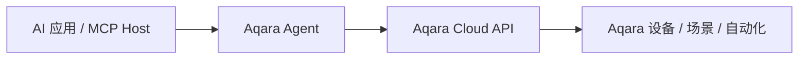

<div align="center" style="display: flex; align-items: center; justify-content: center; ">

  
  <h1>Aqara MCP Server</h1>

</div>

<div align="center">

[English](README.md) | 中文 | [Français](README_FR.md) | [한국어](README_KR.md) | [Español](README_ES.md) | [日本語](README_JP.md) | [Deutsch](README_DE.md) | [Italiano](README_IT.md)

[](https://opensource.org/licenses/MIT)
[](https://modelcontextprotocol.io/)

</div>

**Aqara MCP Server** 是 Aqara Agent 提供的远程 MCP 服务，用于让支持 MCP 的 AI 应用安全接入 Aqara 智能家居能力。需要 MCP 接入时，直接配置 Aqara Agent 提供的远程 MCP URL 即可。

> [!TIP]
> **推荐：Aqara 官方 Agent Skills**
>
> 如果您使用的应用支持 Agent Skills（如 Codex、Cursor、OpenClaw 等），优先推荐直接使用官方 **Aqara Agent Skills**。无需配置 MCP Server，即可通过自然语言完成家庭 / 空间、设备、场景、自动化、能耗等查询与控制。
>
> - GitHub：[aqara/aqara-agent-skills](https://github.com/aqara/aqara-agent-skills)
> - ClawHub：[aqara/aqara-agent](https://clawhub.ai/aqara/aqara-agent)

## 目录

- [概览](#概览)
- [特性](#特性)
- [工作原理](#工作原理)
- [快速开始](#快速开始)
  - [先决条件](#先决条件)
  - [第一步：账户认证](#第一步账户认证)
  - [第二步：配置远程 MCP](#第二步配置远程-mcp)
  - [第三步：验证](#第三步验证)
- [配置注意事项](#配置注意事项)
- [MCP Tool 参考](#mcp-tool-参考)
  - [核心工具概述](#核心工具概述)
  - [家庭与位置](#家庭与位置)
  - [设备查询与控制](#设备查询与控制)
  - [场景](#场景)
  - [自动化](#自动化)
  - [能耗](#能耗)
  - [灯效](#灯效)
  - [固件](#固件)
  - [参数约定](#参数约定)
- [许可证](#许可证)

## 概览

当前推荐的 MCP 接入方式围绕 Aqara Agent 展开：

- **Remote MCP**：适合支持 Streamable HTTP / HTTP MCP 的应用通过 `https://agent.aqara.com/open/mcp` 接入。
- **Aqara Agent Skills**：适合支持 Agent Skills 的应用直接安装技能，无需手动配置 MCP Server。
- **MCP Tool 能力**：覆盖家庭 / 空间、设备、场景、自动化、能耗、灯效和固件等智能家居操作。

## 特性

- 🔍 **灵活的设备查询**：支持按家庭 / 空间、设备类型或设备 ID 查询设备基础信息、实时状态和控制日志。
- ✨ **全面的设备控制**：支持对 Aqara 设备执行开关、亮度、色温、温度、风速、模式、窗帘百分比等控制。
- 🎬 **智能场景管理**：支持查询、执行场景，并查询场景执行历史。
- ⏰ **自动化查询**：支持查询自动化规则，并查看自动化执行历史。
- 📈 **能耗统计**：支持按房间 / 空间或设备维度查询电量、电费，支持汇总和明细统计。
- 💡 **灯效管理**：支持查询灯光情景 / 灯效、设置指定灯效，以及查询灯效配置参数。
- 🔄 **固件管理**：支持查询设备当前固件版本、可升级版本，并发起设备固件升级。
- 🏠 **多家庭与多空间支持**：支持查询 Aqara 账户下的家庭，以及当前家庭下的房间 / 空间。
- 🔌 **远程 MCP 接入**：通过 HTTP MCP URL 接入，支持 Cursor、Codex 等应用。
- 🔐 **安全认证机制**：通过 Aqara Agent 登录获取 `aqara_api_key`，配置时请妥善保管凭据。

## 工作原理

远程 MCP 模式下，应用通过 HTTP 连接 Aqara Agent 的 MCP 服务，并在请求中携带登录页生成的 Bearer 令牌。Aqara Agent 负责校验凭据、执行 Tool 调用，并将结果返回给应用：



1. **AI 应用 / MCP Host**：用户通过 Cursor、Codex 等应用发出自然语言指令。
2. **Aqara Agent**：校验用户凭据，解析并执行对应 Tool。
3. **Aqara Cloud API**：完成设备、场景、自动化、能耗、灯效、固件等数据查询或控制动作。

---

## 快速开始

### 先决条件

- **Aqara 账户** 及已注册的智能设备。
- **支持远程 MCP 的应用**，例如 Cursor、Codex 等。
- **Aqara Agent 凭据**：通过登录页获取 `aqara_api_key` 与 `aqara_mcp_url`。

### 第一步：账户认证

1. **访问登录页面**：
   [https://agent.aqara.com/login](https://agent.aqara.com/login)

2. **完成登录流程**：
   - 使用您的 Aqara 账户登录。
   - 登录完成后复制页面提供的 `aqara_api_key`。
   - 配置 MCP 时使用页面提供的 `aqara_mcp_url`，通常为 `https://agent.aqara.com/open/mcp`。

3. **安全保存凭据**：

   > 请妥善保管 `aqara_api_key`，不要提交到仓库、截图公开页面或分享给他人。

   

### 第二步：配置远程 MCP

#### Cursor

1. 打开 Cursor 设置，进入 `Tools & MCPs`，点击 `New MCP Server`。

   

2. 添加远程 MCP 配置。URL 使用登录页返回的 `aqara_mcp_url`；如果手动填写，请使用 `/open/mcp` 路径。

   ```json
   {
     "mcpServers": {
       "aqara": {
         "type": "http",
         "url": "https://agent.aqara.com/open/mcp",
         "headers": {
           "Authorization": "Bearer <YOUR_AQARA_API_KEY>"
         }
       }
     }
   }
   ```

3. 保存配置并重启 Cursor，使 MCP 配置生效。

#### Codex

1. 在 Codex 设置中添加自定义 MCP Server。
2. 类型选择 `流式 HTTP`。
3. URL 填写登录页返回的 `aqara_mcp_url`，例如 `https://agent.aqara.com/open/mcp`。
4. Bearer 令牌填写 `aqara_api_key` 的值。


### 第三步：验证

配置成功后，可以用以下自然语言请求测试：

```text
用户: 显示我家里的所有设备
助手: 通过 MCP 查询设备列表

用户: 打开客厅的灯
助手: 通过 MCP 执行设备控制

用户: 执行观影场景
助手: 通过 MCP 执行场景
```

如果应用的 MCP 面板中显示 Aqara 已连接，并能看到 Aqara 相关工具，说明配置已生效。

---

## 配置注意事项

- MCP URL 应使用 `https://agent.aqara.com/open/mcp` 或登录页返回的 `aqara_mcp_url`，不要把登录页地址当作 MCP URL。
- 控制设备、执行场景、升级固件等 Tool 会影响真实家庭设备。首次使用时建议先用查询类 Tool 确认家庭、空间、设备和场景信息。
- 如果连接失败，优先检查 MCP 类型是否为 HTTP / Streamable HTTP、URL 是否包含 `/open/mcp`、凭据是否过期，以及配置变更后应用是否已重启或重新加载 MCP。

---

## MCP Tool 参考

以下 Tool 列表根据当前 Aqara Agent 服务注册的函数定义整理。不同应用可能会在界面上包装工具名，但参数语义与能力范围保持一致。

### 核心工具概述

| Tool 类别 | Tool | 描述 |
| --- | --- | --- |
| **家庭与位置** | `all_homes_inquiry`, `position_base_inquiry` | 查询家庭、房间 / 空间信息 |
| **设备查询与控制** | `device_base_inquiry`, `device_status_inquiry`, `device_status_control`, `fuzzy_device_batch_control`, `device_log_inquiry` | 查询设备基础信息、实时状态、控制设备并查看设备控制日志 |
| **场景** | `scene_base_inquiry`, `scene_run`, `scene_execution_history_inquiry` | 查询、执行场景，并查询场景执行历史 |
| **自动化** | `automation_base_inquiry`, `automation_execution_history_inquiry` | 查询自动化规则和自动化执行历史 |
| **能耗** | `energy_consumption_inquiry_for_position`, `energy_consumption_inquiry_for_device` | 查询房间 / 空间或设备维度的电量、电费 |
| **灯效** | `lighting_effect_inquiry`, `device_lighting_effect_inquiry`, `lighting_effect_control`, `lighting_effect_config_params_inquiry` | 查询和设置灯效，查询灯效配置参数 |
| **固件** | `device_firmware_inquiry`, `device_firmware_upgrade` | 查询和升级设备固件 |

### 家庭与位置

#### `all_homes_inquiry`

查询当前 Aqara 账户下的所有家庭列表。

**参数：** 无

**返回：** 家庭列表，包含家庭名称和家庭 ID 等信息。

#### `position_base_inquiry`

查询当前家庭下的所有房间 / 空间基础信息。

**参数：** 无

**返回：** 房间 / 空间列表，包含位置名称和位置 ID 等信息。

### 设备查询与控制

#### `device_base_inquiry`

按房间 / 空间和设备类型查询设备基础信息，不包含实时状态。

**参数：**

- `position_ids` _(Array\<String\>, 可选)_：房间 / 空间 ID 列表。为空时不按位置过滤。
- `device_types` _(Array\<String\>, 可选)_：设备类型列表，例如 `Light`、`Switch`、`Outlet`、`AirConditioner`、`WindowCovering`、`Camera` 等。为空时不按设备类型过滤。

**返回：** 设备基础信息列表，包含设备名称、设备 ID、所属位置和设备类型等信息。

#### `device_status_inquiry`

查询设备实时状态，例如开关、亮度、色温、温度、风速、模式等。

**参数：**

- `device_ids` _(Array\<String\>, 可选)_：设备 ID 列表。提供时优先按设备 ID 查询。
- `position_ids` _(Array\<String\>, 可选)_：房间 / 空间 ID 列表。
- `device_types` _(Array\<String\>, 可选)_：设备类型列表。

**返回：** 设备状态信息列表，包含设备当前可读状态。

#### `device_status_control`

控制指定设备的状态或属性，例如开关、亮度、色温、温度、风速、模式、窗帘百分比等。

**参数：**

- `device_ids` _(Array\<String\>, 必需)_：目标设备 ID 列表。
- `attribute` _(String, 必需)_：需要控制的属性，例如 `on_off`、`brightness`、`color_temperature`、`temperature`、`percentage`、`mode` 等。
- `action` _(String, 必需)_：控制动作，例如 `on`、`off`、`set`、`up`、`down`、`warmer`、`cooler`、`start`、`stop` 等。
- `value` _(String, 可选)_：目标值，例如 `50`、`max`、`min`、`cool`、`heat`、`red` 等。

**返回：** 设备控制执行结果。

#### `fuzzy_device_batch_control`

按房间 / 空间和设备类型批量控制设备，适用于“关闭全屋灯”“客厅全关”“把所有空调调到 26 度”等批量控制场景。

**参数：**

- `position_ids` _(Array\<String\>, 可选)_：房间 / 空间 ID 列表。为空时可表示全屋范围。
- `device_types` _(Array\<String\>, 可选)_：设备类型列表。
- `attribute` _(String, 必需)_：需要控制的属性。
- `action` _(String, 必需)_：控制动作。
- `value` _(String, 可选)_：目标值。

**返回：** 批量控制执行结果。

#### `device_log_inquiry`

查询指定时间范围内的设备控制日志，包括控制时间、控制内容和控制结果等信息。

**参数：**

- `time_range` _(Array\<String\>, 可选)_：时间区间，格式如 `["2026-01-01 00:00:00", "2026-01-01 23:59:59"]`。
- `device_ids` _(Array\<String\>, 可选)_：设备 ID 列表。提供时优先按设备 ID 查询。
- `position_ids` _(Array\<String\>, 可选)_：房间 / 空间 ID 列表。
- `device_types` _(Array\<String\>, 可选)_：设备类型列表。

**返回：** 设备控制日志列表及实际查询时间范围。

### 场景

#### `scene_base_inquiry`

查询场景基础信息，可按场景 ID、位置 ID 或设备 ID 筛选。

**参数：**

- `scene_ids` _(Array\<String\>, 可选)_：场景 ID 列表。提供时优先按场景 ID 查询。
- `position_ids` _(Array\<String\>, 可选)_：房间 / 空间 ID 列表。
- `device_ids` _(Array\<String\>, 可选)_：设备 ID 列表，用于查询与设备相关的场景。

**返回：** 场景基础信息列表。

#### `scene_run`

执行一个或多个指定场景。

**参数：**

- `scene_ids` _(Array\<String\>, 必需)_：需要执行的场景 ID 列表。

**返回：** 场景执行结果。

#### `scene_execution_history_inquiry`

查询指定时间范围内的场景执行历史。

**参数：**

- `time_range` _(Array\<String\>, 可选)_：时间区间。
- `scene_ids` _(Array\<String\>, 可选)_：场景 ID 列表。
- `position_ids` _(Array\<String\>, 可选)_：房间 / 空间 ID 列表。
- `device_ids` _(Array\<String\>, 可选)_：设备 ID 列表。

**返回：** 场景执行历史列表及实际查询时间范围。

### 自动化

#### `automation_base_inquiry`

查询自动化规则基础信息，可按自动化 ID、位置 ID 或设备 ID 筛选。

**参数：**

- `automation_ids` _(Array\<String\>, 可选)_：自动化 ID 列表。提供时优先按自动化 ID 查询。
- `position_ids` _(Array\<String\>, 可选)_：房间 / 空间 ID 列表。
- `device_ids` _(Array\<String\>, 可选)_：设备 ID 列表，用于查询与设备相关的自动化。

**返回：** 自动化规则信息列表。

#### `automation_execution_history_inquiry`

查询指定时间范围内自动化规则的执行历史。

**参数：**

- `time_range` _(Array\<String\>, 可选)_：时间区间。
- `automation_ids` _(Array\<String\>, 可选)_：自动化 ID 列表。
- `position_ids` _(Array\<String\>, 可选)_：房间 / 空间 ID 列表。
- `device_ids` _(Array\<String\>, 可选)_：设备 ID 列表。

**返回：** 自动化执行历史列表及实际查询时间范围。

### 能耗

#### `energy_consumption_inquiry_for_position`

按家庭 / 房间 / 空间维度查询电量或电费，支持汇总和明细。

**参数：**

- `data_type` _(String, 必需)_：查询类型，`1` 表示电量，`2` 表示电费，`3` 表示电量和电费。
- `time_range` _(Array\<String\>, 必需)_：时间区间。
- `time_gradient` _(String, 可选)_：统计粒度，可取 `30min`、`1hour`、`1day`、`1week`、`1month`。
- `data_aggregation_mode` _(String, 可选)_：聚合模式，`total` 表示汇总，`detail` 表示明细。
- `positions` _(Array\<String\>, 可选)_：房间 / 空间 ID 列表。为空时按全部有效房间查询。

**返回：** 房间 / 空间维度的电量 / 电费统计结果。

#### `energy_consumption_inquiry_for_device`

按设备维度查询电量或电费，可按位置或设备筛选，支持汇总和明细。

**参数：**

- `data_type` _(String, 必需)_：查询类型，`1` 表示电量，`2` 表示电费，`3` 表示电量和电费。
- `time_range` _(Array\<String\>, 必需)_：时间区间。
- `time_gradient` _(String, 可选)_：统计粒度，可取 `30min`、`1hour`、`1day`、`1week`、`1month`。
- `data_aggregation_mode` _(String, 可选)_：聚合模式，`total` 表示汇总，`detail` 表示明细。
- `positions` _(Array\<String\>, 可选)_：房间 / 空间 ID 列表。
- `device_ids` _(Array\<String\>, 可选)_：设备 ID 列表。提供时优先按设备查询。

**返回：** 设备维度的电量 / 电费统计结果。

### 灯效

#### `lighting_effect_inquiry`

查询家庭内可用的灯光情景 / 灯效信息。

**参数：** 无

**返回：** 灯效列表，包含可用于控制的灯效名称和适用范围。

#### `device_lighting_effect_inquiry`

按设备查询其支持的灯效名称。

**参数：**

- `device_ids` _(Array\<String\>, 必需)_：需要查询灯效的设备 ID 列表。

**返回：** 设备与灯效名称的对应列表。

#### `lighting_effect_control`

将指定设备或房间 / 空间内的灯切换为指定灯效。

**参数：**

- `effect_name` _(String, 必需)_：灯效名称。
- `device_ids` _(Array\<String\>, 可选)_：目标设备 ID 列表。提供时优先按设备控制。
- `position_ids` _(Array\<String\>, 可选)_：房间 / 空间 ID 列表。

**返回：** 灯效控制执行结果。

#### `lighting_effect_config_params_inquiry`

查询灯类设备配置灯效时所需的参数信息。

**参数：**

- `device_ids` _(Array\<String\>, 必需)_：目标灯类设备 ID 列表。

**返回：** 灯效配置参数列表，例如可配置项、取值范围和已保存的用户灯效等。

### 固件

#### `device_firmware_inquiry`

批量查询设备当前固件版本和可升级版本。

**参数：**

- `device_ids` _(Array\<String\>, 可选)_：设备 ID 列表。提供时优先按设备查询。
- `position_ids` _(Array\<String\>, 可选)_：房间 / 空间 ID 列表。
- `device_types` _(Array\<String\>, 可选)_：设备类型列表。

**返回：** 固件信息列表，包含设备名称、在线状态、当前固件版本和可升级版本。

#### `device_firmware_upgrade`

按设备、位置或类型筛选后，对可升级设备发起固件升级。

**参数：**

- `device_ids` _(Array\<String\>, 可选)_：设备 ID 列表。提供时优先按设备升级。
- `position_ids` _(Array\<String\>, 可选)_：房间 / 空间 ID 列表。
- `device_types` _(Array\<String\>, 可选)_：设备类型列表。

**返回：** 固件升级提交结果。

### 参数约定

- `position_ids` / `positions`：房间 / 空间 ID 列表；未指定时的查询或控制范围以对应 Tool 描述为准。
- `device_ids`：设备 ID 或设备端点 ID 列表，具体由上游识别和服务端映射处理。
- `device_types`：设备类型列表，例如 `Light`、`Switch`、`Outlet`、`AirConditioner`、`WindowCovering`、`Camera`、`TemperatureSensor` 等。
- `attribute`：控制属性，例如 `on_off`、`brightness`、`color_temperature`、`temperature`、`wind_speed`、`mode`、`percentage`、`volume`、`color` 等。
- `action`：控制动作，例如 `on`、`off`、`set`、`up`、`down`、`warmer`、`cooler`、`start`、`stop`、`pause`、`resume` 等。
- `value`：目标值，例如 `50`、`100`、`max`、`min`、`red`、`cool`、`heat`、灯效名称等。
- `time_range`：时间区间数组，格式通常为 `["YYYY-MM-DD HH:MM:SS", "YYYY-MM-DD HH:MM:SS"]`。
- `data_type`：能耗查询类型，`1` 表示电量，`2` 表示电费，`3` 表示电量和电费。
- `time_gradient`：能耗统计粒度，可取 `30min`、`1hour`、`1day`、`1week`、`1month`。
- `data_aggregation_mode`：能耗聚合模式，`total` 表示汇总，`detail` 表示明细。

## 许可证

本项目基于 [MIT 许可证](LICENSE) 授权，详情请参阅 [LICENSE](LICENSE) 文件。

---

版权所有 © 2025 Aqara-Agent。保留所有权利。
