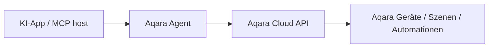

<div align="center" style="display: flex; align-items: center; justify-content: center; ">

  
  <h1>Aqara MCP Server</h1>

</div>

<div align="center">

[English](README.md) | [中文](README_CN.md) | [Français](README_FR.md) | [한국어](README_KR.md) | [Español](README_ES.md) | [日本語](README_JP.md) | Deutsch | [Italiano](README_IT.md)

[](https://opensource.org/licenses/MIT)
[](https://modelcontextprotocol.io/)

</div>

**Aqara MCP Server** ist ein von Aqara Agent bereitgestellter Remote-MCP-Dienst, mit dem MCP-fähige KI-Anwendungen sicher auf Aqara-Smart-Home-Funktionen zugreifen können. Für die MCP-Anbindung genügt die Konfiguration der von Aqara Agent bereitgestellten Remote-MCP-URL.

> [!TIP]
> **Empfohlen: Offizielle Aqara Agent Skills**
>
> Wenn Ihre Anwendung Agent Skills unterstützt (z. B. Codex App, Cursor, OpenClaw), empfehlen wir die offiziellen **Aqara Agent Skills**. Ohne manuelle MCP-Server-Konfiguration können Sie per natürlicher Sprache Homes/Räume/Bereiche, Geräte, Szenen, Automationen, Energieverbrauch usw. abfragen und steuern.
>
> - GitHub: [aqara/aqara-agent-skills](https://github.com/aqara/aqara-agent-skills)
> - ClawHub: [aqara/aqara-agent](https://clawhub.ai/aqara/aqara-agent)

## Inhaltsverzeichnis

- [Übersicht](#übersicht)
- [Funktionen](#funktionen)
- [Funktionsweise](#funktionsweise)
- [Schnellstart](#schnellstart)
  - [Voraussetzungen](#voraussetzungen)
  - [Schritt 1: Kontoauthentifizierung](#schritt-1-kontoauthentifizierung)
  - [Schritt 2: Remote-MCP konfigurieren](#schritt-2-remote-mcp-konfigurieren)
  - [Schritt 3: Überprüfung](#schritt-3-überprüfung)
- [Hinweise zur Konfiguration](#hinweise-zur-konfiguration)
- [MCP-Tool-Referenz](#mcp-tool-referenz)
  - [Überblick über die Kern-Tools](#überblick-über-die-kern-tools)
  - [Home, Räume und Bereiche](#home-räume-und-bereiche)
  - [Geräteabfrage und -steuerung](#geräteabfrage-und--steuerung)
  - [Szenen](#szenen)
  - [Automationen](#automationen)
  - [Energieverbrauch](#energieverbrauch)
  - [Lichtszenarien und Lichteffekte](#lichtszenarien-und-lichteffekte)
  - [Firmware](#firmware)
  - [Parameterkonventionen](#parameterkonventionen)
- [Lizenz](#lizenz)

## Übersicht

Die aktuell empfohlene MCP-Anbindung basiert auf Aqara Agent:

- **Remote MCP**: Für Anwendungen mit Streamable HTTP über `https://agent.aqara.com/open/mcp`.
- **Aqara Agent Skills**: Für Anwendungen mit Agent Skills – Skills installieren, ohne MCP-Server manuell zu konfigurieren.
- **MCP-Tool-Funktionen**: Abdeckung von Home/Raum/Bereich, Geräten, Szenen, Automationen, Energieverbrauch, Lichtszenarien und Lichteffekten sowie Firmware.

## Funktionen

- 🔍 **Flexible Geräteabfrage**: Abfrage von Basisinformationen, Echtzeitstatus und Steuerungslogs nach Home/Raum/Bereich, Gerätetyp oder Geräte-ID.
- ✨ **Umfassende Gerätesteuerung**: Steuerung von Ein/Aus, Helligkeit, Farbtemperatur, Temperatur, Ventilatorstufe, Modus, Rolladen-/Jalousieposition (%) usw. bei Aqara-Geräten.
- 🎬 **Intelligentes Szenenmanagement**: Abfrage und Ausführung von Szenen sowie Abfrage des Ausführungsverlaufs.
- ⏰ **Automationsabfrage**: Abfrage von Automationsregeln und deren Ausführungsverlauf.
- 📈 **Energieverbrauchsstatistik**: Abfrage von Stromverbrauch und Stromkosten nach Raum/Bereich oder Gerät, mit Summen- und Detailstatistik.
- 💡 **Lichtszenarien und Lichteffektverwaltung**: Abfrage von Lichtszenarien/-effekten, Setzen bestimmter Effekte und Abfrage der Konfigurationsparameter.
- 🔄 **Firmwareverwaltung**: Abfrage der aktuellen und verfügbaren Firmware-Version sowie Start von Firmware-Updates.
- 🏠 **Mehrere Homes und Räume/Bereiche**: Abfrage der Homes im Aqara-Konto und der Räume/Bereiche im aktuellen Home.
- 🔌 **Remote-MCP-Anbindung**: Anbindung über eine MCP-URL, z. B. für Cursor und Codex App.
- 🔐 **Sichere Authentifizierung**: `aqara_api_key` nach Anmeldung bei Aqara Agent – Zugangsdaten bei der Konfiguration sicher aufbewahren.

## Funktionsweise

Im Remote-MCP-Modus verbindet sich die Anwendung per HTTP mit dem MCP-Dienst von Aqara Agent und sendet den auf der Anmeldeseite erzeugten Bearer-Token mit. Aqara Agent prüft die Anmeldedaten, führt Tool-Aufrufe aus und gibt Ergebnisse zurück:



1. **KI-App / MCP host**: Der Nutzer gibt Befehle in natürlicher Sprache in Cursor, Codex App usw. ein.
2. **Aqara Agent**: Prüft die Anmeldedaten und interpretiert sowie führt die entsprechenden Tools aus.
3. **Aqara Cloud API**: Führt Datenabfragen oder Steuerungen für Geräte, Szenen, Automationen, Energieverbrauch, Lichtszenarien und Lichteffekte, Firmware usw. aus.

---

## Schnellstart

### Voraussetzungen

- **Aqara-Konto** mit registrierten Smart-Geräten.
- **Anwendung mit Remote-MCP-Unterstützung**, z. B. Cursor oder Codex App.
- **Aqara-Agent-Anmeldedaten**: `aqara_api_key` und `aqara_mcp_url` über die Anmeldeseite.

### Schritt 1: Kontoauthentifizierung

1. **Anmeldeseite öffnen**:
   [https://agent.aqara.com/login](https://agent.aqara.com/login)

2. **Anmeldung abschließen**:
   - Mit Ihrem Aqara-Konto anmelden.
   - Nach der Anmeldung den auf der Seite angezeigten `aqara_api_key` kopieren.
   - Für die MCP-Konfiguration die angezeigte `aqara_mcp_url` verwenden, in der Regel `https://agent.aqara.com/open/mcp`.

3. **Anmeldedaten sicher speichern**:

   > Bewahren Sie `aqara_api_key` sicher auf. Geben Sie ihn nicht in ein Repository ein, veröffentlichen Sie ihn nicht per Screenshot und teilen Sie ihn nicht mit anderen.

   

### Schritt 2: Remote-MCP konfigurieren

#### Cursor

1. Cursor-Einstellungen öffnen, zu `Tools & MCPs` wechseln und `New MCP Server` klicken.

   

2. Remote-MCP-Konfiguration hinzufügen. URL: `aqara_mcp_url` von der Anmeldeseite; bei manueller Eingabe Pfad `/open/mcp` verwenden.

   ```json
   {
     "mcpServers": {
       "aqara": {
         "type": "http",
         "url": "https://agent.aqara.com/open/mcp",
         "headers": {
           "Authorization": "Bearer <YOUR_AQARA_API_KEY>"
         }
       }
     }
   }
   ```

3. Konfiguration speichern und Cursor neu starten, damit die MCP-Konfiguration wirksam wird.

#### Codex App

1. Speichern Sie zunächst den auf der Anmeldeseite angezeigten `aqara_api_key` in einer Umgebungsvariable. Fügen Sie unter macOS mit zsh Folgendes zu `~/.zshrc` hinzu:

   ```bash
   export AQARA_API_KEY="<YOUR_AQARA_API_KEY>"
   ```

2. Starten Sie Codex App neu und verbinden Sie sich dann in den Einstellungen mit einem benutzerdefinierten MCP.
3. Wählen Sie `Streamable HTTP`.
4. Geben Sie die `aqara_mcp_url` von der Anmeldeseite ein, z. B. `https://agent.aqara.com/open/mcp`.
5. Geben Sie unter `Bearer-Token-Umgebungsvariable` den Namen der Umgebungsvariable `AQARA_API_KEY` ein, nicht den eigentlichen API-Schlüssel. Codex App liest das Token aus dieser Variable.


### Schritt 3: Überprüfung

Nach erfolgreicher Konfiguration können Sie mit folgenden Anfragen in natürlicher Sprache testen:

```text
Nutzer: Zeige alle Geräte in meinem Zuhause
Assistent: Geräteliste per MCP abfragen

Nutzer: Schalte das Licht im Wohnzimmer ein
Assistent: Gerätesteuerung per MCP ausführen

Nutzer: Führe die Filmabend-Szene aus
Assistent: Szene per MCP ausführen
```

Wenn im MCP-Panel der Anwendung Aqara als verbunden angezeigt wird und Aqara Tools sichtbar sind, ist die Konfiguration aktiv.

---

## Hinweise zur Konfiguration

- MCP-URL: `https://agent.aqara.com/open/mcp` oder `aqara_mcp_url` von der Anmeldeseite – nicht die Anmeldeseiten-URL als MCP-URL verwenden.
- Tools für Gerätesteuerung, Szenenausführung, Firmware-Updates usw. wirken auf echte Geräte im Home. Beim ersten Einsatz zuerst Abfrage-Tools nutzen, um Home, Räume/Bereiche, Geräte und Szenen zu prüfen.
- Bei Verbindungsfehlern prüfen: MCP-Typ Streamable HTTP, URL enthält `/open/mcp`, Anmeldedaten nicht abgelaufen, Anwendung nach Konfigurationsänderung neu gestartet oder MCP neu geladen.

---

## MCP-Tool-Referenz

Die folgende Tool-Liste basiert auf den aktuell bei Aqara Agent registrierten Funktionsdefinitionen. Anwendungen können Tool-Namen unterschiedlich darstellen; Bedeutung der Parameter und Funktionsumfang bleiben gleich.

### Überblick über die Kern-Tools

| Tool-Kategorie | Tool | Beschreibung |
| --- | --- | --- |
| **Home, Räume und Bereiche** | `all_homes_inquiry`, `position_base_inquiry` | Abfrage von Home-, Raum- und Bereichsinformationen |
| **Geräteabfrage und -steuerung** | `device_base_inquiry`, `device_status_inquiry`, `device_status_control`, `fuzzy_device_batch_control`, `device_log_inquiry` | Basis- und Echtzeitstatus, Steuerung, Steuerungslogs |
| **Szenen** | `scene_base_inquiry`, `scene_run`, `scene_execution_history_inquiry` | Szenen abfragen und ausführen, Ausführungsverlauf |
| **Automationen** | `automation_base_inquiry`, `automation_execution_history_inquiry` | Automationsregeln und Ausführungsverlauf |
| **Energieverbrauch** | `energy_consumption_inquiry_for_position`, `energy_consumption_inquiry_for_device` | Stromverbrauch/Stromkosten nach Raum/Bereich oder Gerät |
| **Lichtszenarien und Lichteffekte** | `lighting_effect_inquiry`, `device_lighting_effect_inquiry`, `lighting_effect_control`, `lighting_effect_config_params_inquiry` | Lichtszenarien/-effekte abfragen/setzen, Konfigurationsparameter |
| **Firmware** | `device_firmware_inquiry`, `device_firmware_upgrade` | Firmware abfragen und aktualisieren |

### Home, Räume und Bereiche

#### `all_homes_inquiry`

Listet alle Homes des aktuellen Aqara-Kontos auf.

**Parameter:** keine

**Rückgabe:** Home-Liste mit Name, Home-ID usw.

#### `position_base_inquiry`

Listet alle Räume und Bereiche des aktuellen Homes mit Basisinformationen auf.

**Parameter:** keine

**Rückgabe:** Liste der Räume/Bereiche mit Positionsname und Positions-ID usw.

### Geräteabfrage und -steuerung

#### `device_base_inquiry`

Abfrage von Gerätebasisinformationen nach Raum/Bereich und Gerätetyp, ohne Echtzeitstatus.

**Parameter:**

- `position_ids` _(Array\<String\>, optional)_: Liste der Raum-/Bereichs-IDs. Leer = keine Filterung nach Position.
- `device_types` _(Array\<String\>, optional)_: Gerätetypen, z. B. `Light`, `Switch`, `Outlet`, `AirConditioner`, `WindowCovering`, `Camera`. Leer = keine Filterung nach Typ.

**Rückgabe:** Liste mit Gerätename, Geräte-ID, zugehöriger Position, Gerätetyp usw.

#### `device_status_inquiry`

Abfrage des Echtzeitstatus (Ein/Aus, Helligkeit, Farbtemperatur, Temperatur, Ventilatorstufe, Modus usw.).

**Parameter:**

- `device_ids` _(Array\<String\>, optional)_: Geräte-IDs. Bei Angabe wird zuerst nach Geräte-ID abgefragt.
- `position_ids` _(Array\<String\>, optional)_: Raum-/Bereichs-IDs.
- `device_types` _(Array\<String\>, optional)_: Gerätetypen.

**Rückgabe:** Liste mit aktuellem lesbarem Gerätestatus.

#### `device_status_control`

Steuert Status oder Attribute bestimmter Geräte (Ein/Aus, Helligkeit, Farbtemperatur, Temperatur, Ventilatorstufe, Modus, Rolladen-/Jalousieposition (%) usw.).

**Parameter:**

- `device_ids` _(Array\<String\>, erforderlich)_: Ziel-Geräte-IDs.
- `attribute` _(String, erforderlich)_: Zu steuerndes Attribut, z. B. `on_off`, `brightness`, `color_temperature`, `temperature`, `percentage`, `mode`.
- `action` _(String, erforderlich)_: Steueraktion, z. B. `on`, `off`, `set`, `up`, `down`, `warmer`, `cooler`, `start`, `stop`.
- `value` _(String, optional)_: Zielwert, z. B. `50`, `max`, `min`, `cool`, `heat`, `red`.

**Rückgabe:** Ergebnis der Gerätesteuerung.

#### `fuzzy_device_batch_control`

Steuert Geräte nach Raum/Bereich und Typ gesammelt, z. B. „alle Lichter aus“, „Wohnzimmer komplett aus“, „alle Klimaanlagen auf 26 °C“.

**Parameter:**

- `position_ids` _(Array\<String\>, optional)_: Raum-/Bereichs-IDs. Leer kann gesamtes Home bedeuten.
- `device_types` _(Array\<String\>, optional)_: Gerätetypen.
- `attribute` _(String, erforderlich)_: Zu steuerndes Attribut.
- `action` _(String, erforderlich)_: Steueraktion.
- `value` _(String, optional)_: Zielwert.

**Rückgabe:** Ergebnis der Sammelsteuerung.

#### `device_log_inquiry`

Abfrage von Gerätesteuerungsprotokollen in einem Zeitraum (Zeit, Inhalt, Ergebnis).

**Parameter:**

- `time_range` _(Array\<String\>, optional)_: Zeitintervall, z. B. `["2026-01-01 00:00:00", "2026-01-01 23:59:59"]`.
- `device_ids` _(Array\<String\>, optional)_: Geräte-IDs. Bei Angabe zuerst nach Geräte-ID.
- `position_ids` _(Array\<String\>, optional)_: Raum-/Bereichs-IDs.
- `device_types` _(Array\<String\>, optional)_: Gerätetypen.

**Rückgabe:** Steuerungslogs und tatsächlich abgefragter Zeitraum.

### Szenen

#### `scene_base_inquiry`

Abfrage von Szenenbasisinformationen, filterbar nach Szenen-ID, Positions-ID oder Geräte-ID.

**Parameter:**

- `scene_ids` _(Array\<String\>, optional)_: Szenen-IDs. Bei Angabe zuerst nach Szenen-ID.
- `position_ids` _(Array\<String\>, optional)_: Raum-/Bereichs-IDs.
- `device_ids` _(Array\<String\>, optional)_: Geräte-IDs für szenenbezogene Abfragen.

**Rückgabe:** Liste der Szenenbasisinformationen.

#### `scene_run`

Führt eine oder mehrere angegebene Szenen aus.

**Parameter:**

- `scene_ids` _(Array\<String\>, erforderlich)_: Auszuführende Szenen-IDs.

**Rückgabe:** Ergebnis der Szenenausführung.

#### `scene_execution_history_inquiry`

Abfrage des Szenenausführungsverlaufs in einem Zeitraum.

**Parameter:**

- `time_range` _(Array\<String\>, optional)_: Zeitintervall.
- `scene_ids` _(Array\<String\>, optional)_: Szenen-IDs.
- `position_ids` _(Array\<String\>, optional)_: Raum-/Bereichs-IDs.
- `device_ids` _(Array\<String\>, optional)_: Geräte-IDs.

**Rückgabe:** Ausführungsverlauf und tatsächlich abgefragter Zeitraum.

### Automationen

#### `automation_base_inquiry`

Abfrage von Automationsregeln, filterbar nach Automations-ID, Positions-ID oder Geräte-ID.

**Parameter:**

- `automation_ids` _(Array\<String\>, optional)_: Automations-IDs. Bei Angabe zuerst nach Automations-ID.
- `position_ids` _(Array\<String\>, optional)_: Raum-/Bereichs-IDs.
- `device_ids` _(Array\<String\>, optional)_: Geräte-IDs für gerätebezogene Automationen.

**Rückgabe:** Liste der Automationsregeln.

#### `automation_execution_history_inquiry`

Abfrage des Ausführungsverlaufs von Automationsregeln in einem Zeitraum.

**Parameter:**

- `time_range` _(Array\<String\>, optional)_: Zeitintervall.
- `automation_ids` _(Array\<String\>, optional)_: Automations-IDs.
- `position_ids` _(Array\<String\>, optional)_: Raum-/Bereichs-IDs.
- `device_ids` _(Array\<String\>, optional)_: Geräte-IDs.

**Rückgabe:** Automationsverlauf und tatsächlich abgefragter Zeitraum.

### Energieverbrauch

#### `energy_consumption_inquiry_for_position`

Abfrage von Stromverbrauch oder Stromkosten nach Home/Raum/Bereich, mit Summen- und Detailansicht.

**Parameter:**

- `data_type` _(String, erforderlich)_: `1` = Stromverbrauch, `2` = Stromkosten, `3` = beides.
- `time_range` _(Array\<String\>, erforderlich)_: Zeitintervall.
- `time_gradient` _(String, optional)_: Granularität: `30min`, `1hour`, `1day`, `1week`, `1month`.
- `data_aggregation_mode` _(String, optional)_: `total` = aggregiert, `detail` = Einzelansicht.
- `positions` _(Array\<String\>, optional)_: Raum-/Bereichs-IDs. Leer = alle gültigen Räume/Bereiche.

**Rückgabe:** Stromverbrauchs-/Stromkostenstatistik nach Raum/Bereich.

#### `energy_consumption_inquiry_for_device`

Abfrage von Stromverbrauch oder Stromkosten nach Gerät, filterbar nach Position oder Gerät, mit Summen- und Detailansicht.

**Parameter:**

- `data_type` _(String, erforderlich)_: `1` = Stromverbrauch, `2` = Stromkosten, `3` = beides.
- `time_range` _(Array\<String\>, erforderlich)_: Zeitintervall.
- `time_gradient` _(String, optional)_: `30min`, `1hour`, `1day`, `1week`, `1month`.
- `data_aggregation_mode` _(String, optional)_: `total` = aggregiert, `detail` = Einzelansicht.
- `positions` _(Array\<String\>, optional)_: Raum-/Bereichs-IDs.
- `device_ids` _(Array\<String\>, optional)_: Geräte-IDs. Bei Angabe zuerst nach Gerät.

**Rückgabe:** Stromverbrauchs-/Stromkostenstatistik nach Gerät.

### Lichtszenarien und Lichteffekte

#### `lighting_effect_inquiry`

Listet verfügbare Lichtszenarien/-effekte im Home auf.

**Parameter:** keine

**Rückgabe:** Effektliste mit Namen und Geltungsbereich.

#### `device_lighting_effect_inquiry`

Listet pro Gerät unterstützte Lichteffektnamen auf.

**Parameter:**

- `device_ids` _(Array\<String\>, erforderlich)_: Geräte-IDs für die Effektabfrage.

**Rückgabe:** Zuordnung Gerät ↔ Effektname.

#### `lighting_effect_control`

Schaltet Beleuchtung bestimmter Geräte oder Räume/Bereiche auf einen angegebenen Effekt.

**Parameter:**

- `effect_name` _(String, erforderlich)_: Effektname.
- `device_ids` _(Array\<String\>, optional)_: Ziel-Geräte-IDs. Bei Angabe zuerst nach Gerät.
- `position_ids` _(Array\<String\>, optional)_: Raum-/Bereichs-IDs.

**Rückgabe:** Ergebnis der Lichteffektsteuerung.

#### `lighting_effect_config_params_inquiry`

Abfrage der Parameter zum Konfigurieren von Lichteffekten an Leuchten.

**Parameter:**

- `device_ids` _(Array\<String\>, erforderlich)_: Ziel-Leuchtgeräte-IDs.

**Rückgabe:** Konfigurationsparameter (Optionen, Wertebereiche, gespeicherte Nutzereffekte usw.).

### Firmware

#### `device_firmware_inquiry`

Sammelabfrage der aktuellen und verfügbaren Firmware-Versionen.

**Parameter:**

- `device_ids` _(Array\<String\>, optional)_: Geräte-IDs. Bei Angabe zuerst nach Gerät.
- `position_ids` _(Array\<String\>, optional)_: Raum-/Bereichs-IDs.
- `device_types` _(Array\<String\>, optional)_: Gerätetypen.

**Rückgabe:** Firmware-Infos mit Gerätename, Online-Status, aktueller und verfügbarer Version.

#### `device_firmware_upgrade`

Startet Firmware-Updates für aktualisierbare Geräte nach Filterung nach Gerät, Position oder Typ.

**Parameter:**

- `device_ids` _(Array\<String\>, optional)_: Geräte-IDs. Bei Angabe zuerst diese Geräte.
- `position_ids` _(Array\<String\>, optional)_: Raum-/Bereichs-IDs.
- `device_types` _(Array\<String\>, optional)_: Gerätetypen.

**Rückgabe:** Ergebnis der Firmware-Update-Anfrage.

### Parameterkonventionen

- `position_ids` / `positions`: Raum-/Bereichs-IDs; ohne Angabe gilt der jeweiligen Tool-Beschreibung für Abfrage-/Steuerungsbereich.
- `device_ids`: Geräte- oder Endpunkt-IDs; Zuordnung durch Upstream-Identifikation und Server-Mapping.
- `device_types`: z. B. `Light`, `Switch`, `Outlet`, `AirConditioner`, `WindowCovering`, `Camera`, `TemperatureSensor`.
- `attribute`: z. B. `on_off`, `brightness`, `color_temperature`, `temperature`, `wind_speed`, `mode`, `percentage`, `volume`, `color`.
- `action`: z. B. `on`, `off`, `set`, `up`, `down`, `warmer`, `cooler`, `start`, `stop`, `pause`, `resume`.
- `value`: z. B. `50`, `100`, `max`, `min`, `red`, `cool`, `heat`, Lichteffektname.
- `time_range`: Zeitintervall, üblicherweise `["YYYY-MM-DD HH:MM:SS", "YYYY-MM-DD HH:MM:SS"]`.
- `data_type`: `1` = Stromverbrauch, `2` = Stromkosten, `3` = beides.
- `time_gradient`: `30min`, `1hour`, `1day`, `1week`, `1month`.
- `data_aggregation_mode`: `total` = aggregiert, `detail` = Einzelansicht.

## Lizenz

Dieses Projekt steht unter der [MIT-Lizenz](LICENSE). Details siehe [LICENSE](LICENSE).

---

Copyright © 2025 Aqara-Agent. Alle Rechte vorbehalten.
