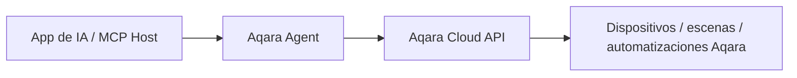

<div align="center" style="display: flex; align-items: center; justify-content: center; ">

  
  <h1>Aqara MCP Server</h1>

</div>

<div align="center">

[English](README.md) | [中文](README_CN.md) | [Français](README_FR.md) | [한국어](README_KR.md) | Español | [日本語](README_JP.md) | [Deutsch](README_DE.md) | [Italiano](README_IT.md)

[](https://opensource.org/licenses/MIT)
[](https://modelcontextprotocol.io/)

</div>

**Aqara MCP Server** es un servicio MCP remoto proporcionado por Aqara Agent que permite a las aplicaciones de IA compatibles con MCP conectarse de forma segura a las capacidades del hogar inteligente Aqara. Cuando necesite conectarse mediante MCP, basta con configurar la URL MCP remota que proporciona Aqara Agent.

> [!TIP]
> **Recomendado: Aqara Agent Skills oficiales**
>
> Si su aplicación admite Agent Skills (por ejemplo, Codex, Cursor, OpenClaw), se recomienda usar directamente las **Aqara Agent Skills** oficiales. Sin configurar un MCP Server, puede consultar y controlar hogares/espacios, dispositivos, escenas, automatizaciones, consumo energético, etc., mediante lenguaje natural.
>
> - GitHub: [aqara/aqara-agent-skills](https://github.com/aqara/aqara-agent-skills)
> - ClawHub: [aqara/aqara-agent](https://clawhub.ai/aqara/aqara-agent)

## Índice

- [Descripción general](#descripción-general)
- [Características](#características)
- [Cómo funciona](#cómo-funciona)
- [Inicio rápido](#inicio-rápido)
  - [Requisitos previos](#requisitos-previos)
  - [Paso 1: Autenticación de la cuenta](#paso-1-autenticación-de-la-cuenta)
  - [Paso 2: Configurar MCP remoto](#paso-2-configurar-mcp-remoto)
  - [Paso 3: Verificación](#paso-3-verificación)
- [Notas de configuración](#notas-de-configuración)
- [Referencia de MCP Tool](#referencia-de-mcp-tool)
  - [Resumen de Tools principales](#resumen-de-tools-principales)
  - [Hogar y ubicación](#hogar-y-ubicación)
  - [Consulta y control de dispositivos](#consulta-y-control-de-dispositivos)
  - [Escenas](#escenas)
  - [Automatizaciones](#automatizaciones)
  - [Consumo energético](#consumo-energético)
  - [Escenarios y efectos de iluminación](#escenarios-y-efectos-de-iluminación)
  - [Firmware](#firmware)
  - [Convenciones de parámetros](#convenciones-de-parámetros)
- [Licencia](#licencia)

## Descripción general

La integración MCP recomendada actualmente se centra en Aqara Agent:

- **Remote MCP**: Para aplicaciones con Streamable HTTP / HTTP MCP mediante `https://agent.aqara.com/open/mcp`.
- **Aqara Agent Skills**: Para aplicaciones con Agent Skills; instale las skills sin configurar manualmente el MCP Server.
- **Funcionalidades de MCP Tool**: Hogar/espacio, dispositivos, escenas, automatizaciones, consumo energético, escenarios y efectos de iluminación, firmware.

## Características

- 🔍 **Consulta flexible de dispositivos**: Información básica, estado en tiempo real y registros de control por hogar/espacio, tipo o ID de dispositivo.
- ✨ **Control integral de dispositivos**: Encendido/apagado, brillo, temperatura de color, temperatura, velocidad de ventilación, modo, porcentaje de persiana, etc., en dispositivos Aqara.
- 🎬 **Gestión inteligente de escenas**: Consulta y ejecución de escenas, e historial de ejecución.
- ⏰ **Consulta de automatizaciones**: Reglas de automatización e historial de ejecución.
- 📈 **Estadísticas de consumo**: Consulta de consumo eléctrico y costo de la electricidad por habitación/espacio o dispositivo, con totales y detalle.
- 💡 **Gestión de escenarios y efectos de iluminación**: Consulta de escenarios/efectos, aplicación de efectos y parámetros de configuración.
- 🔄 **Gestión de firmware**: Versión actual y disponible, e inicio de actualización de firmware.
- 🏠 **Varios hogares y espacios**: Lista de hogares de la cuenta Aqara y habitaciones/espacios del hogar actual.
- 🔌 **Integración MCP remota**: URL HTTP MCP para Cursor, Codex y otras aplicaciones.
- 🔐 **Autenticación segura**: `aqara_api_key` tras iniciar sesión en Aqara Agent; guarde las credenciales con cuidado.

## Cómo funciona

En modo MCP remoto, la aplicación se conecta por HTTP al servicio MCP de Aqara Agent e incluye el token Bearer generado en la página de inicio de sesión. Aqara Agent valida las credenciales, ejecuta las Tools y devuelve los resultados:



1. **App de IA / MCP Host**: El usuario envía instrucciones en lenguaje natural desde Cursor, Codex, etc.
2. **Aqara Agent**: Valida credenciales e interpreta y ejecuta la Tool correspondiente.
3. **Aqara Cloud API**: Realiza consultas o acciones sobre dispositivos, escenas, automatizaciones, consumo, efectos de luz, firmware, etc.

---

## Inicio rápido

### Requisitos previos

- **Cuenta Aqara** con dispositivos inteligentes registrados.
- **Aplicación con MCP remoto**, por ejemplo Cursor o Codex.
- **Credenciales de Aqara Agent**: `aqara_api_key` y `aqara_mcp_url` desde la página de inicio de sesión.

### Paso 1: Autenticación de la cuenta

1. **Acceda a la página de inicio de sesión**:
   [https://agent.aqara.com/login](https://agent.aqara.com/login)

2. **Complete el inicio de sesión**:
   - Inicie sesión con su cuenta Aqara.
   - Copie el `aqara_api_key` mostrado tras iniciar sesión.
   - Para MCP use el `aqara_mcp_url` de la página, normalmente `https://agent.aqara.com/open/mcp`.

3. **Guarde las credenciales de forma segura**:

   > Proteja su `aqara_api_key`. No lo suba al repositorio, no lo publique en capturas ni lo comparta con terceros.

   

### Paso 2: Configurar MCP remoto

#### Cursor

1. Abra la configuración de Cursor, vaya a `Tools & MCPs` y haga clic en `New MCP Server`.

   

2. Añada la configuración MCP remota. URL: `aqara_mcp_url` de la página de inicio de sesión; si la escribe manualmente, use la ruta `/open/mcp`.

   ```json
   {
     "mcpServers": {
       "aqara": {
         "type": "http",
         "url": "https://agent.aqara.com/open/mcp",
         "headers": {
           "Authorization": "Bearer <YOUR_AQARA_API_KEY>"
         }
       }
     }
   }
   ```

3. Guarde la configuración y reinicie Cursor para aplicar MCP.

#### Codex

1. En la configuración de Codex, añada un MCP Server personalizado.
2. Tipo: `Streamable HTTP`.
3. URL: `aqara_mcp_url` de la página de inicio de sesión, p. ej. `https://agent.aqara.com/open/mcp`.
4. Token Bearer: valor de `aqara_api_key`.


### Paso 3: Verificación

Tras configurar correctamente, puede probar con solicitudes en lenguaje natural como:

```text
Usuario: Muestra todos los dispositivos de mi casa
Asistente: Consulta la lista de dispositivos por MCP

Usuario: Enciende la luz del salón
Asistente: Ejecuta el control del dispositivo por MCP

Usuario: Ejecuta la escena de cine
Asistente: Ejecuta la escena por MCP
```

Si el panel MCP de la aplicación muestra Aqara conectado y las Tools de Aqara visibles, la configuración está activa.

---

## Notas de configuración

- URL MCP: `https://agent.aqara.com/open/mcp` o `aqara_mcp_url` de la página de inicio de sesión; no use la URL de la página de inicio de sesión como URL MCP.
- Las Tools de control de dispositivos, ejecución de escenas y actualización de firmware afectan a dispositivos reales. La primera vez, use Tools de consulta para confirmar hogar, espacios, dispositivos y escenas.
- Si falla la conexión, compruebe: tipo MCP HTTP / Streamable HTTP, URL con `/open/mcp`, credenciales no caducadas y reinicio o recarga de MCP tras cambios.

---

## Referencia de MCP Tool

La siguiente lista se basa en las definiciones de funciones registradas en el servicio Aqara Agent actual. Las aplicaciones pueden mostrar nombres distintos; el significado de los parámetros y el alcance de las capacidades son los mismos.

### Resumen de Tools principales

| Categoría Tool | Tool | Descripción |
| --- | --- | --- |
| **Hogar y ubicación** | `all_homes_inquiry`, `position_base_inquiry` | Consulta de hogares y habitaciones/espacios |
| **Consulta y control de dispositivos** | `device_base_inquiry`, `device_status_inquiry`, `device_status_control`, `fuzzy_device_batch_control`, `device_log_inquiry` | Información básica, estado en tiempo real, control y registros |
| **Escenas** | `scene_base_inquiry`, `scene_run`, `scene_execution_history_inquiry` | Consulta y ejecución de escenas e historial |
| **Automatizaciones** | `automation_base_inquiry`, `automation_execution_history_inquiry` | Reglas de automatización e historial de ejecución |
| **Consumo energético** | `energy_consumption_inquiry_for_position`, `energy_consumption_inquiry_for_device` | Consumo eléctrico/costo de la electricidad por habitación/espacio o dispositivo |
| **Escenarios y efectos de iluminación** | `lighting_effect_inquiry`, `device_lighting_effect_inquiry`, `lighting_effect_control`, `lighting_effect_config_params_inquiry` | Consulta y configuración de escenarios/efectos y parámetros |
| **Firmware** | `device_firmware_inquiry`, `device_firmware_upgrade` | Consulta y actualización de firmware |

### Hogar y ubicación

#### `all_homes_inquiry`

Consulta todos los hogares de la cuenta Aqara actual.

**Parámetros:** ninguno

**Devuelve:** Lista de hogares con nombre, ID de hogar, etc.

#### `position_base_inquiry`

Consulta la información básica de todas las habitaciones/espacios del hogar actual.

**Parámetros:** ninguno

**Devuelve:** Lista de habitaciones/espacios con nombre e ID de posición, etc.

### Consulta y control de dispositivos

#### `device_base_inquiry`

Consulta información básica de dispositivos por habitación/espacio y tipo, sin estado en tiempo real.

**Parámetros:**

- `position_ids` _(Array\<String\>, opcional)_: IDs de habitación/espacio. Vacío = sin filtro por posición.
- `device_types` _(Array\<String\>, opcional)_: Tipos de dispositivo, p. ej. `Light`, `Switch`, `Outlet`, `AirConditioner`, `WindowCovering`, `Camera`. Vacío = sin filtro por tipo.

**Devuelve:** Lista con nombre, ID, posición y tipo de dispositivo, etc.

#### `device_status_inquiry`

Consulta el estado en tiempo real (encendido, brillo, temperatura de color, temperatura, velocidad de ventilación, modo, etc.).

**Parámetros:**

- `device_ids` _(Array\<String\>, opcional)_: IDs de dispositivo. Si se indican, se consulta con prioridad por ID.
- `position_ids` _(Array\<String\>, opcional)_: IDs de habitación/espacio.
- `device_types` _(Array\<String\>, opcional)_: Tipos de dispositivo.

**Devuelve:** Lista con el estado legible actual de cada dispositivo.

#### `device_status_control`

Controla el estado o atributos de dispositivos concretos (encendido, brillo, temperatura de color, temperatura, velocidad de ventilación, modo, porcentaje de persiana, etc.).

**Parámetros:**

- `device_ids` _(Array\<String\>, obligatorio)_: IDs de dispositivos de destino.
- `attribute` _(String, obligatorio)_: Atributo a controlar, p. ej. `on_off`, `brightness`, `color_temperature`, `temperature`, `percentage`, `mode`.
- `action` _(String, obligatorio)_: Acción, p. ej. `on`, `off`, `set`, `up`, `down`, `warmer`, `cooler`, `start`, `stop`.
- `value` _(String, opcional)_: Valor de destino, p. ej. `50`, `max`, `min`, `cool`, `heat`, `red`.

**Devuelve:** Resultado del control del dispositivo.

#### `fuzzy_device_batch_control`

Controla dispositivos por habitación/espacio y tipo en lote; útil para «apagar todas las luces», «apagar todo el salón», «poner todos los aires a 26 °C», etc.

**Parámetros:**

- `position_ids` _(Array\<String\>, opcional)_: IDs de habitación/espacio. Vacío puede significar todo el hogar.
- `device_types` _(Array\<String\>, opcional)_: Tipos de dispositivo.
- `attribute` _(String, obligatorio)_: Atributo a controlar.
- `action` _(String, obligatorio)_: Acción de control.
- `value` _(String, opcional)_: Valor de destino.

**Devuelve:** Resultado del control por lotes.

#### `device_log_inquiry`

Consulta registros de control de dispositivos en un intervalo (hora, contenido, resultado).

**Parámetros:**

- `time_range` _(Array\<String\>, opcional)_: Intervalo, p. ej. `["2026-01-01 00:00:00", "2026-01-01 23:59:59"]`.
- `device_ids` _(Array\<String\>, opcional)_: IDs de dispositivo. Si se indican, se consulta con prioridad por ID.
- `position_ids` _(Array\<String\>, opcional)_: IDs de habitación/espacio.
- `device_types` _(Array\<String\>, opcional)_: Tipos de dispositivo.

**Devuelve:** Registros de control e intervalo de consulta efectivo.

### Escenas

#### `scene_base_inquiry`

Consulta información básica de escenas; filtrable por ID de escena, posición o dispositivo.

**Parámetros:**

- `scene_ids` _(Array\<String\>, opcional)_: IDs de escena. Si se indican, se consulta con prioridad por escena.
- `position_ids` _(Array\<String\>, opcional)_: IDs de habitación/espacio.
- `device_ids` _(Array\<String\>, opcional)_: IDs de dispositivo para escenas relacionadas.

**Devuelve:** Lista de información básica de escenas.

#### `scene_run`

Ejecuta una o más escenas indicadas.

**Parámetros:**

- `scene_ids` _(Array\<String\>, obligatorio)_: IDs de escenas a ejecutar.

**Devuelve:** Resultado de la ejecución de la escena.

#### `scene_execution_history_inquiry`

Consulta el historial de ejecución de escenas en un intervalo.

**Parámetros:**

- `time_range` _(Array\<String\>, opcional)_: Intervalo de tiempo.
- `scene_ids` _(Array\<String\>, opcional)_: IDs de escena.
- `position_ids` _(Array\<String\>, opcional)_: IDs de habitación/espacio.
- `device_ids` _(Array\<String\>, opcional)_: IDs de dispositivo.

**Devuelve:** Historial de ejecución e intervalo de consulta efectivo.

### Automatizaciones

#### `automation_base_inquiry`

Consulta información básica de reglas de automatización; filtrable por ID de automatización, posición o dispositivo.

**Parámetros:**

- `automation_ids` _(Array\<String\>, opcional)_: IDs de automatización. Si se indican, se consulta con prioridad por automatización.
- `position_ids` _(Array\<String\>, opcional)_: IDs de habitación/espacio.
- `device_ids` _(Array\<String\>, opcional)_: IDs de dispositivo para automatizaciones relacionadas.

**Devuelve:** Lista de reglas de automatización.

#### `automation_execution_history_inquiry`

Consulta el historial de ejecución de automatizaciones en un intervalo.

**Parámetros:**

- `time_range` _(Array\<String\>, opcional)_: Intervalo de tiempo.
- `automation_ids` _(Array\<String\>, opcional)_: IDs de automatización.
- `position_ids` _(Array\<String\>, opcional)_: IDs de habitación/espacio.
- `device_ids` _(Array\<String\>, opcional)_: IDs de dispositivo.

**Devuelve:** Historial de automatización e intervalo de consulta efectivo.

### Consumo energético

#### `energy_consumption_inquiry_for_position`

Consulta consumo eléctrico o costo de la electricidad por hogar/habitación/espacio, con totales y detalle.

**Parámetros:**

- `data_type` _(String, obligatorio)_: `1` = consumo eléctrico, `2` = costo de la electricidad, `3` = ambos.
- `time_range` _(Array\<String\>, obligatorio)_: Intervalo de tiempo.
- `time_gradient` _(String, opcional)_: Granularidad: `30min`, `1hour`, `1day`, `1week`, `1month`.
- `data_aggregation_mode` _(String, opcional)_: `total` = resumen agregado, `detail` = detalle.
- `positions` _(Array\<String\>, opcional)_: IDs de habitación/espacio. Vacío = todas las habitaciones válidas.

**Devuelve:** Estadísticas de consumo eléctrico/costo de la electricidad por habitación/espacio.

#### `energy_consumption_inquiry_for_device`

Consulta consumo eléctrico o costo de la electricidad por dispositivo; filtrable por posición o dispositivo, con totales y detalle.

**Parámetros:**

- `data_type` _(String, obligatorio)_: `1` = consumo eléctrico, `2` = costo de la electricidad, `3` = ambos.
- `time_range` _(Array\<String\>, obligatorio)_: Intervalo de tiempo.
- `time_gradient` _(String, opcional)_: `30min`, `1hour`, `1day`, `1week`, `1month`.
- `data_aggregation_mode` _(String, opcional)_: `total` = resumen agregado, `detail` = detalle.
- `positions` _(Array\<String\>, opcional)_: IDs de habitación/espacio.
- `device_ids` _(Array\<String\>, opcional)_: IDs de dispositivo. Si se indican, se consulta con prioridad por dispositivo.

**Devuelve:** Estadísticas de consumo eléctrico/costo de la electricidad por dispositivo.

### Escenarios y efectos de iluminación

#### `lighting_effect_inquiry`

Consulta escenarios/efectos de luz disponibles en el hogar.

**Parámetros:** ninguno

**Devuelve:** Lista de efectos con nombres y ámbito de aplicación.

#### `device_lighting_effect_inquiry`

Consulta los nombres de efectos de luz admitidos por dispositivo.

**Parámetros:**

- `device_ids` _(Array\<String\>, obligatorio)_: IDs de dispositivos a consultar.

**Devuelve:** Lista de correspondencia dispositivo ↔ nombre de efecto.

#### `lighting_effect_control`

Aplica el efecto de iluminación indicado en los dispositivos o habitaciones/espacios especificados.

**Parámetros:**

- `effect_name` _(String, obligatorio)_: Nombre del efecto.
- `device_ids` _(Array\<String\>, opcional)_: IDs de dispositivos de destino. Si se indican, control prioritario por dispositivo.
- `position_ids` _(Array\<String\>, opcional)_: IDs de habitación/espacio.

**Devuelve:** Resultado del control del efecto de luz.

#### `lighting_effect_config_params_inquiry`

Consulta parámetros necesarios para configurar efectos en luminarias.

**Parámetros:**

- `device_ids` _(Array\<String\>, obligatorio)_: IDs de luminarias de destino.

**Devuelve:** Parámetros de configuración (opciones, rangos, efectos de usuario guardados, etc.).

### Firmware

#### `device_firmware_inquiry`

Consulta en lote la versión de firmware actual y la disponible para actualizar.

**Parámetros:**

- `device_ids` _(Array\<String\>, opcional)_: IDs de dispositivo. Si se indican, se consulta con prioridad por dispositivo.
- `position_ids` _(Array\<String\>, opcional)_: IDs de habitación/espacio.
- `device_types` _(Array\<String\>, opcional)_: Tipos de dispositivo.

**Devuelve:** Información de firmware con nombre, estado en línea y versiones actual/disponible.

#### `device_firmware_upgrade`

Inicia la actualización de firmware en dispositivos actualizables tras filtrar por dispositivo, posición o tipo.

**Parámetros:**

- `device_ids` _(Array\<String\>, opcional)_: IDs de dispositivo. Si se indican, actualización con prioridad de esos dispositivos.
- `position_ids` _(Array\<String\>, opcional)_: IDs de habitación/espacio.
- `device_types` _(Array\<String\>, opcional)_: Tipos de dispositivo.

**Devuelve:** Resultado del envío de la actualización de firmware.

### Convenciones de parámetros

- `position_ids` / `positions`: IDs de habitación/espacio; sin especificar, el alcance sigue la descripción de cada Tool.
- `device_ids`: lista de IDs de dispositivo o endpoint; la identificación ascendente y el mapeo del servidor los resuelven.
- `device_types`: p. ej. `Light`, `Switch`, `Outlet`, `AirConditioner`, `WindowCovering`, `Camera`, `TemperatureSensor`.
- `attribute`: p. ej. `on_off`, `brightness`, `color_temperature`, `temperature`, `wind_speed`, `mode`, `percentage`, `volume`, `color`.
- `action`: p. ej. `on`, `off`, `set`, `up`, `down`, `warmer`, `cooler`, `start`, `stop`, `pause`, `resume`.
- `value`: p. ej. `50`, `100`, `max`, `min`, `red`, `cool`, `heat`, nombre de efecto de luz.
- `time_range`: intervalo, habitualmente `["YYYY-MM-DD HH:MM:SS", "YYYY-MM-DD HH:MM:SS"]`.
- `data_type`: `1` = consumo eléctrico, `2` = costo de la electricidad, `3` = ambos.
- `time_gradient`: `30min`, `1hour`, `1day`, `1week`, `1month`.
- `data_aggregation_mode`: `total` = resumen agregado, `detail` = detalle.

## Licencia

Este proyecto se distribuye bajo la [licencia MIT](LICENSE). Consulte el archivo [LICENSE](LICENSE) para más detalles.

---

Copyright © 2025 Aqara-Agent. Todos los derechos reservados.
