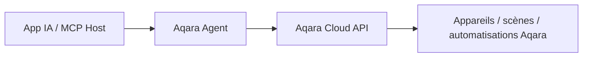
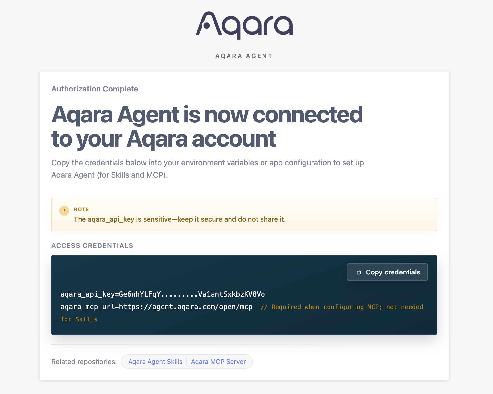
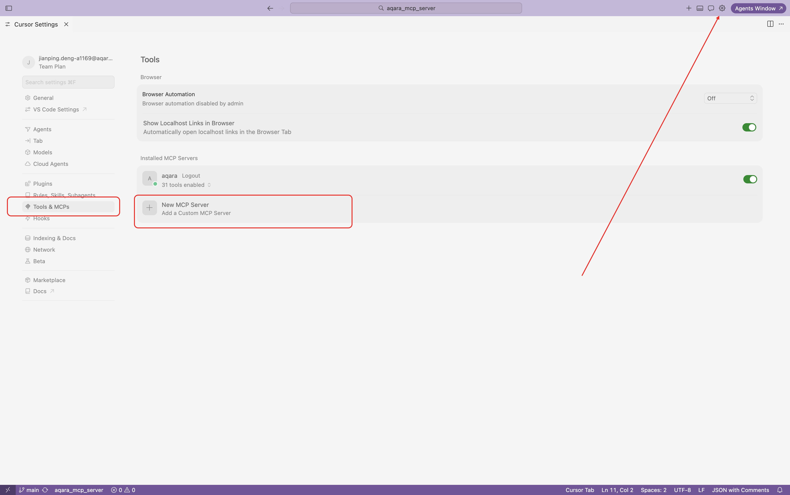
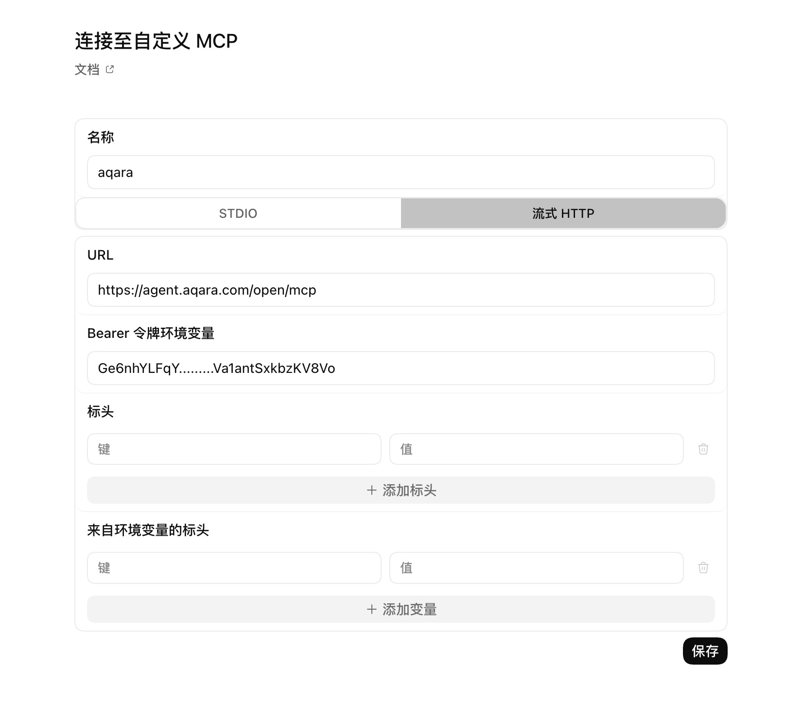

<div align="center" style="display: flex; align-items: center; justify-content: center; ">

  
  <h1>Aqara MCP Server</h1>

</div>

<div align="center">

[English](README.md) | [中文](README_CN.md) | Français | [한국어](README_KR.md) | [Español](README_ES.md) | [日本語](README_JP.md) | [Deutsch](README_DE.md) | [Italiano](README_IT.md)

[](https://opensource.org/licenses/MIT)
[](https://modelcontextprotocol.io/)

</div>

**Aqara MCP Server** est un service MCP distant fourni par Aqara Agent. Il permet aux applications IA compatibles MCP de se connecter en toute sécurité aux capacités domotiques Aqara. Pour l’intégration MCP, configurez simplement l’URL du MCP distant fournie par Aqara Agent.

> [!TIP]
> **Recommandé : Aqara Agent Skills officielles**
>
> Si votre application prend en charge les Agent Skills (Codex, Cursor, OpenClaw, etc.), nous recommandons d’utiliser directement les **Aqara Agent Skills** officielles. Sans configurer de MCP Server, vous pouvez interroger et contrôler maisons/espaces, appareils, scènes, automatisations, consommation d’énergie, etc., en langage naturel.
>
> - GitHub : [aqara/aqara-agent-skills](https://github.com/aqara/aqara-agent-skills)
> - ClawHub : [aqara/aqara-agent](https://clawhub.ai/aqara/aqara-agent)

## Sommaire

- [Vue d’ensemble](#vue-densemble)
- [Fonctionnalités](#fonctionnalités)
- [Fonctionnement](#fonctionnement)
- [Démarrage rapide](#démarrage-rapide)
  - [Prérequis](#prérequis)
  - [Étape 1 : Authentification du compte](#étape-1--authentification-du-compte)
  - [Étape 2 : Configurer le MCP distant](#étape-2--configurer-le-mcp-distant)
  - [Étape 3 : Vérification](#étape-3--vérification)
- [Notes de configuration](#notes-de-configuration)
- [Référence MCP Tool](#référence-mcp-tool)
  - [Aperçu des Tools principaux](#aperçu-des-tools-principaux)
  - [Maison et emplacement](#maison-et-emplacement)
  - [Consultation et contrôle des appareils](#consultation-et-contrôle-des-appareils)
  - [Scènes](#scènes)
  - [Automatisations](#automatisations)
  - [Consommation d’énergie](#consommation-dénergie)
  - [Scénarios et effets lumineux](#scénarios-et-effets-lumineux)
  - [Firmware](#firmware)
  - [Conventions de paramètres](#conventions-de-paramètres)
- [Licence](#licence)

## Vue d’ensemble

L’intégration MCP recommandée s’articule autour d’Aqara Agent :

- **Remote MCP** : pour les applications avec Streamable HTTP / HTTP MCP via `https://agent.aqara.com/open/mcp`.
- **Aqara Agent Skills** : pour les applications avec Agent Skills — installez les skills sans configurer manuellement le MCP Server.
- **Capacités MCP Tool** : maison/espace, appareils, scènes, automatisations, consommation d’énergie, scénarios et effets lumineux, firmware.

## Fonctionnalités

- 🔍 **Consultation flexible des appareils** : informations de base, état en temps réel et journaux de contrôle par maison/espace, type ou ID d’appareil.
- ✨ **Contrôle complet des appareils** : marche/arrêt, luminosité, température de couleur, température, vitesse de ventilation, mode, pourcentage d’ouverture du rideau, etc., sur les appareils Aqara.
- 🎬 **Gestion intelligente des scènes** : consultation et exécution de scènes, historique d’exécution.
- ⏰ **Consultation d’automatisations** : règles d’automatisation et historique d’exécution.
- 📈 **Statistiques de consommation** : consommation électrique et coût de l’électricité par pièce/espace ou appareil, avec totaux et détail.
- 💡 **Gestion des scénarios et effets lumineux** : scénarios/effets, application d’effets et paramètres de configuration.
- 🔄 **Gestion du firmware** : version actuelle et disponible, lancement de mise à jour.
- 🏠 **Plusieurs maisons et espaces** : liste des maisons du compte Aqara et des pièces/espaces de la maison actuelle.
- 🔌 **Intégration du MCP distant** : URL HTTP MCP pour Cursor, Codex et autres applications.
- 🔐 **Authentification sécurisée** : `aqara_api_key` après connexion à Aqara Agent — conservez les identifiants en lieu sûr.

## Fonctionnement

En mode MCP distant, l’application se connecte en HTTP au service MCP d’Aqara Agent et inclut le jeton Bearer généré sur la page de connexion. Aqara Agent valide les identifiants, exécute les Tools et renvoie les résultats :



1. **App IA / MCP Host** : l’utilisateur envoie des instructions en langage naturel depuis Cursor, Codex, etc.
2. **Aqara Agent** : valide les identifiants, interprète et exécute le Tool correspondant.
3. **Aqara Cloud API** : effectue les requêtes ou actions sur appareils, scènes, automatisations, consommation, scénarios et effets lumineux, firmware, etc.

---

## Démarrage rapide

### Prérequis

- **Compte Aqara** avec des appareils intelligents enregistrés.
- **Application avec MCP distant**, par exemple Cursor ou Codex.
- **Identifiants Aqara Agent** : `aqara_api_key` et `aqara_mcp_url` depuis la page de connexion.

### Étape 1 : Authentification du compte

1. **Accédez à la page de connexion** :
   [https://agent.aqara.com/login](https://agent.aqara.com/login)

2. **Terminez la connexion** :
   - Connectez-vous avec votre compte Aqara.
   - Copiez le `aqara_api_key` affiché après connexion.
   - Pour MCP, utilisez le `aqara_mcp_url` de la page, en général `https://agent.aqara.com/open/mcp`.

3. **Conservez les identifiants en sécurité** :

   > Protégez votre `aqara_api_key`. Ne l’ajoutez pas au dépôt Git, ne le publiez pas par capture d’écran et ne le partagez pas.

   

### Étape 2 : Configurer le MCP distant

#### Cursor

1. Ouvrez les paramètres Cursor, allez dans `Tools & MCPs` et cliquez sur `New MCP Server`.

   

2. Ajoutez la configuration MCP distant. URL : `aqara_mcp_url` de la page de connexion ; en saisie manuelle, utilisez le chemin `/open/mcp`.

   ```json
   {
     "mcpServers": {
       "aqara": {
         "type": "http",
         "url": "https://agent.aqara.com/open/mcp",
         "headers": {
           "Authorization": "Bearer <YOUR_AQARA_API_KEY>"
         }
       }
     }
   }
   ```

3. Enregistrez et redémarrez Cursor pour appliquer la configuration MCP.

#### Codex

1. Dans les paramètres Codex, ajoutez un MCP Server personnalisé.
2. Type : `Streamable HTTP`.
3. URL : `aqara_mcp_url` de la page de connexion, par ex. `https://agent.aqara.com/open/mcp`.
4. Jeton Bearer : valeur de `aqara_api_key`.



### Étape 3 : Vérification

Une fois configuré, testez avec des requêtes en langage naturel telles que :

```text
Utilisateur : Affiche tous les appareils de ma maison
Assistant : Interroge la liste des appareils via MCP

Utilisateur : Allume la lumière du salon
Assistant : Exécute le contrôle d’appareil via MCP

Utilisateur : Lance la scène cinéma
Assistant : Exécute la scène via MCP
```

Si le panneau MCP de l’application affiche Aqara connecté et les Tools Aqara visibles, la configuration est active.

---

## Notes de configuration

- URL MCP : `https://agent.aqara.com/open/mcp` ou `aqara_mcp_url` de la page de connexion — n’utilisez pas l’URL de la page de connexion comme URL MCP.
- Les Tools de contrôle d’appareils, d’exécution de scènes et de mise à jour du firmware agissent sur de vrais appareils. Lors de la première utilisation, utilisez d’abord les Tools de consultation pour vérifier la maison, les espaces, les appareils et les scènes.
- En cas d’échec de connexion, vérifiez : type MCP HTTP / Streamable HTTP, URL contenant `/open/mcp`, identifiants non expirés, redémarrage ou rechargement de la configuration MCP après modification.

---

## Référence MCP Tool

La liste suivante est basée sur les définitions de fonctions enregistrées sur le service Aqara Agent actuel. Les applications peuvent afficher des noms différents ; le sens des paramètres et l’étendue des capacités restent identiques.

### Aperçu des Tools principaux

| Catégorie Tool | Tool | Description |
| --- | --- | --- |
| **Maison et emplacement** | `all_homes_inquiry`, `position_base_inquiry` | Consultation des maisons et pièces/espaces |
| **Consultation et contrôle des appareils** | `device_base_inquiry`, `device_status_inquiry`, `device_status_control`, `fuzzy_device_batch_control`, `device_log_inquiry` | Infos de base, état temps réel, contrôle, journaux |
| **Scènes** | `scene_base_inquiry`, `scene_run`, `scene_execution_history_inquiry` | Consultation et exécution de scènes, historique |
| **Automatisations** | `automation_base_inquiry`, `automation_execution_history_inquiry` | Règles et historique d’automatisation |
| **Consommation d’énergie** | `energy_consumption_inquiry_for_position`, `energy_consumption_inquiry_for_device` | Consommation électrique/coût de l’électricité par pièce/espace ou appareil |
| **Scénarios et effets lumineux** | `lighting_effect_inquiry`, `device_lighting_effect_inquiry`, `lighting_effect_control`, `lighting_effect_config_params_inquiry` | Consultation et application des scénarios/effets, paramètres |
| **Firmware** | `device_firmware_inquiry`, `device_firmware_upgrade` | Consultation et mise à jour du firmware |

### Maison et emplacement

#### `all_homes_inquiry`

Liste toutes les maisons du compte Aqara actuel.

**Paramètres :** aucun

**Retour :** liste des maisons avec nom, ID de maison, etc.

#### `position_base_inquiry`

Liste les informations de base de toutes les pièces/espaces de la maison actuelle.

**Paramètres :** aucun

**Retour :** liste des pièces/espaces avec nom et ID de position, etc.

### Consultation et contrôle des appareils

#### `device_base_inquiry`

Interroge les informations de base des appareils par pièce/espace et type, sans état en temps réel.

**Paramètres :**

- `position_ids` _(Array\<String\>, optionnel)_ : liste d’IDs de pièce/espace. Vide = pas de filtre par position.
- `device_types` _(Array\<String\>, optionnel)_ : types d’appareils, p. ex. `Light`, `Switch`, `Outlet`, `AirConditioner`, `WindowCovering`, `Camera`. Vide = pas de filtre par type.

**Retour :** liste avec nom, ID, position et type d’appareil, etc.

#### `device_status_inquiry`

Interroge l’état en temps réel (marche/arrêt, luminosité, température de couleur, température, vitesse de ventilation, mode, etc.).

**Paramètres :**

- `device_ids` _(Array\<String\>, optionnel)_ : IDs d’appareils. Si fournis, requête prioritaire par ID.
- `position_ids` _(Array\<String\>, optionnel)_ : IDs de pièce/espace.
- `device_types` _(Array\<String\>, optionnel)_ : types d’appareils.

**Retour :** liste avec l’état lisible actuel de chaque appareil.

#### `device_status_control`

Contrôle l’état ou les attributs d’appareils donnés (marche/arrêt, luminosité, température de couleur, température, vitesse de ventilation, mode, pourcentage d’ouverture du rideau, etc.).

**Paramètres :**

- `device_ids` _(Array\<String\>, requis)_ : IDs des appareils cibles.
- `attribute` _(String, requis)_ : attribut à contrôler, p. ex. `on_off`, `brightness`, `color_temperature`, `temperature`, `percentage`, `mode`.
- `action` _(String, requis)_ : action, p. ex. `on`, `off`, `set`, `up`, `down`, `warmer`, `cooler`, `start`, `stop`.
- `value` _(String, optionnel)_ : valeur cible, p. ex. `50`, `max`, `min`, `cool`, `heat`, `red`.

**Retour :** résultat du contrôle d’appareil.

#### `fuzzy_device_batch_control`

Contrôle des appareils par pièce/espace et type en lot — utile pour « éteindre toutes les lumières », « tout éteindre au salon », « mettre tous les climatiseurs à 26 °C », etc.

**Paramètres :**

- `position_ids` _(Array\<String\>, optionnel)_ : IDs de pièce/espace. Vide peut signifier toute la maison.
- `device_types` _(Array\<String\>, optionnel)_ : types d’appareils.
- `attribute` _(String, requis)_ : attribut à contrôler.
- `action` _(String, requis)_ : action de contrôle.
- `value` _(String, optionnel)_ : valeur cible.

**Retour :** résultat du contrôle par lot.

#### `device_log_inquiry`

Interroge les journaux de contrôle d’appareils sur une période (heure, contenu, résultat).

**Paramètres :**

- `time_range` _(Array\<String\>, optionnel)_ : intervalle, p. ex. `["2026-01-01 00:00:00", "2026-01-01 23:59:59"]`.
- `device_ids` _(Array\<String\>, optionnel)_ : IDs d’appareils. Si fournis, requête prioritaire par ID.
- `position_ids` _(Array\<String\>, optionnel)_ : IDs de pièce/espace.
- `device_types` _(Array\<String\>, optionnel)_ : types d’appareils.

**Retour :** journaux de contrôle et période réellement interrogée.

### Scènes

#### `scene_base_inquiry`

Interroge les informations de base des scènes ; filtrable par ID de scène, position ou appareil.

**Paramètres :**

- `scene_ids` _(Array\<String\>, optionnel)_ : IDs de scènes. Si fournis, requête prioritaire par scène.
- `position_ids` _(Array\<String\>, optionnel)_ : IDs de pièce/espace.
- `device_ids` _(Array\<String\>, optionnel)_ : IDs d’appareils pour les scènes liées.

**Retour :** liste des informations de base des scènes.

#### `scene_run`

Exécute une ou plusieurs scènes indiquées.

**Paramètres :**

- `scene_ids` _(Array\<String\>, requis)_ : IDs des scènes à exécuter.

**Retour :** résultat de l’exécution de la scène.

#### `scene_execution_history_inquiry`

Interroge l’historique d’exécution des scènes sur une période.

**Paramètres :**

- `time_range` _(Array\<String\>, optionnel)_ : intervalle de temps.
- `scene_ids` _(Array\<String\>, optionnel)_ : IDs de scènes.
- `position_ids` _(Array\<String\>, optionnel)_ : IDs de pièce/espace.
- `device_ids` _(Array\<String\>, optionnel)_ : IDs d’appareils.

**Retour :** historique d’exécution et période réellement interrogée.

### Automatisations

#### `automation_base_inquiry`

Interroge les règles d’automatisation ; filtrable par ID d’automatisation, position ou appareil.

**Paramètres :**

- `automation_ids` _(Array\<String\>, optionnel)_ : IDs d’automatisation. Si fournis, requête prioritaire par automatisation.
- `position_ids` _(Array\<String\>, optionnel)_ : IDs de pièce/espace.
- `device_ids` _(Array\<String\>, optionnel)_ : IDs d’appareils pour les automatisations liées.

**Retour :** liste des règles d’automatisation.

#### `automation_execution_history_inquiry`

Interroge l’historique d’exécution des automatisations sur une période.

**Paramètres :**

- `time_range` _(Array\<String\>, optionnel)_ : intervalle de temps.
- `automation_ids` _(Array\<String\>, optionnel)_ : IDs d’automatisation.
- `position_ids` _(Array\<String\>, optionnel)_ : IDs de pièce/espace.
- `device_ids` _(Array\<String\>, optionnel)_ : IDs d’appareils.

**Retour :** historique d’automatisation et période réellement interrogée.

### Consommation d’énergie

#### `energy_consumption_inquiry_for_position`

Interroge la consommation électrique ou le coût de l’électricité par maison/pièce/espace, avec totaux et détail.

**Paramètres :**

- `data_type` _(String, requis)_ : `1` = consommation électrique, `2` = coût de l’électricité, `3` = les deux.
- `time_range` _(Array\<String\>, requis)_ : intervalle de temps.
- `time_gradient` _(String, optionnel)_ : granularité : `30min`, `1hour`, `1day`, `1week`, `1month`.
- `data_aggregation_mode` _(String, optionnel)_ : `total` = vue agrégée, `detail` = détail.
- `positions` _(Array\<String\>, optionnel)_ : IDs de pièce/espace. Vide = toutes les pièces valides.

**Retour :** statistiques consommation électrique/coût de l’électricité par pièce/espace.

#### `energy_consumption_inquiry_for_device`

Interroge la consommation électrique ou le coût de l’électricité par appareil ; filtrable par position ou appareil, avec totaux et détail.

**Paramètres :**

- `data_type` _(String, requis)_ : `1` = consommation électrique, `2` = coût de l’électricité, `3` = les deux.
- `time_range` _(Array\<String\>, requis)_ : intervalle de temps.
- `time_gradient` _(String, optionnel)_ : `30min`, `1hour`, `1day`, `1week`, `1month`.
- `data_aggregation_mode` _(String, optionnel)_ : `total` = vue agrégée, `detail` = détail.
- `positions` _(Array\<String\>, optionnel)_ : IDs de pièce/espace.
- `device_ids` _(Array\<String\>, optionnel)_ : IDs d’appareils. Si fournis, requête prioritaire par appareil.

**Retour :** statistiques consommation électrique/coût de l’électricité par appareil.

### Scénarios et effets lumineux

#### `lighting_effect_inquiry`

Liste les scénarios/effets lumineux disponibles dans la maison.

**Paramètres :** aucun

**Retour :** liste d’effets avec noms et portée d’application.

#### `device_lighting_effect_inquiry`

Liste par appareil les noms d’effets lumineux pris en charge.

**Paramètres :**

- `device_ids` _(Array\<String\>, requis)_ : IDs des appareils à interroger.

**Retour :** correspondance appareil ↔ nom d’effet.

#### `lighting_effect_control`

Bascule l’éclairage d’appareils ou de pièces/espaces vers l’effet indiqué.

**Paramètres :**

- `effect_name` _(String, requis)_ : nom de l’effet.
- `device_ids` _(Array\<String\>, optionnel)_ : IDs des appareils cibles. Si fournis, contrôle prioritaire par appareil.
- `position_ids` _(Array\<String\>, optionnel)_ : IDs de pièce/espace.

**Retour :** résultat du contrôle d’effet lumineux.

#### `lighting_effect_config_params_inquiry`

Interroge les paramètres nécessaires pour configurer les effets sur les luminaires.

**Paramètres :**

- `device_ids` _(Array\<String\>, requis)_ : IDs des luminaires cibles.

**Retour :** paramètres de configuration (options, plages, effets utilisateur enregistrés, etc.).

### Firmware

#### `device_firmware_inquiry`

Interroge en lot la version firmware actuelle et celle disponible.

**Paramètres :**

- `device_ids` _(Array\<String\>, optionnel)_ : IDs d’appareils. Si fournis, requête prioritaire par appareil.
- `position_ids` _(Array\<String\>, optionnel)_ : IDs de pièce/espace.
- `device_types` _(Array\<String\>, optionnel)_ : types d’appareils.

**Retour :** informations firmware avec nom, état en ligne, versions actuelle/disponible.

#### `device_firmware_upgrade`

Lance la mise à jour du firmware sur les appareils éligibles après filtrage par appareil, position ou type.

**Paramètres :**

- `device_ids` _(Array\<String\>, optionnel)_ : IDs d’appareils. Si fournis, mise à jour prioritaire de ces appareils.
- `position_ids` _(Array\<String\>, optionnel)_ : IDs de pièce/espace.
- `device_types` _(Array\<String\>, optionnel)_ : types d’appareils.

**Retour :** résultat de la demande de mise à jour du firmware.

### Conventions de paramètres

- `position_ids` / `positions` : IDs de pièce/espace ; sans spécification, la portée suit la description de chaque Tool.
- `device_ids` : IDs d’appareil ou de point de terminaison ; résolution par identification amont et mappage serveur.
- `device_types` : p. ex. `Light`, `Switch`, `Outlet`, `AirConditioner`, `WindowCovering`, `Camera`, `TemperatureSensor`.
- `attribute` : p. ex. `on_off`, `brightness`, `color_temperature`, `temperature`, `wind_speed`, `mode`, `percentage`, `volume`, `color`.
- `action` : p. ex. `on`, `off`, `set`, `up`, `down`, `warmer`, `cooler`, `start`, `stop`, `pause`, `resume`.
- `value` : p. ex. `50`, `100`, `max`, `min`, `red`, `cool`, `heat`, nom d’effet lumineux.
- `time_range` : intervalle, en général `["YYYY-MM-DD HH:MM:SS", "YYYY-MM-DD HH:MM:SS"]`.
- `data_type` : `1` = consommation électrique, `2` = coût de l’électricité, `3` = les deux.
- `time_gradient` : `30min`, `1hour`, `1day`, `1week`, `1month`.
- `data_aggregation_mode` : `total` = vue agrégée, `detail` = détail.

## Licence

Ce projet est distribué sous la [licence MIT](LICENSE). Voir le fichier [LICENSE](LICENSE) pour plus de détails.

---

Copyright © 2025 Aqara-Agent. Tous droits réservés.
