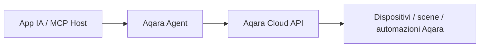

<div align="center" style="display: flex; align-items: center; justify-content: center; ">

  
  <h1>Aqara MCP Server</h1>

</div>

<div align="center">

[English](README.md) | [中文](README_CN.md) | [Français](README_FR.md) | [한국어](README_KR.md) | [Español](README_ES.md) | [日本語](README_JP.md) | [Deutsch](README_DE.md) | Italiano

[](https://opensource.org/licenses/MIT)
[](https://modelcontextprotocol.io/)

</div>

**Aqara MCP Server** è un servizio MCP remoto fornito da Aqara Agent che consente alle applicazioni IA compatibili con MCP di connettersi in modo sicuro alle funzionalità smart home Aqara. Per l’integrazione MCP è sufficiente configurare l’URL MCP remoto fornito da Aqara Agent.

> [!TIP]
> **Consigliato: Aqara Agent Skills ufficiali**
>
> Se l’applicazione supporta Agent Skills (ad es. Codex, Cursor, OpenClaw), si consiglia di usare direttamente le **Aqara Agent Skills** ufficiali. Senza configurare un MCP Server, è possibile consultare e controllare casa/spazi, dispositivi, scene, automazioni, consumo di energia elettrica, ecc., in linguaggio naturale.
>
> - GitHub: [aqara/aqara-agent-skills](https://github.com/aqara/aqara-agent-skills)
> - ClawHub: [aqara/aqara-agent](https://clawhub.ai/aqara/aqara-agent)

## Indice

- [Panoramica](#panoramica)
- [Funzionalità](#funzionalità)
- [Come funziona](#come-funziona)
- [Avvio rapido](#avvio-rapido)
  - [Prerequisiti](#prerequisiti)
  - [Passo 1: Autenticazione account](#passo-1-autenticazione-account)
  - [Passo 2: Configurare MCP remoto](#passo-2-configurare-mcp-remoto)
  - [Passo 3: Verifica](#passo-3-verifica)
- [Note sulla configurazione](#note-sulla-configurazione)
- [Riferimento MCP Tool](#riferimento-mcp-tool)
  - [Panoramica Tool principali](#panoramica-tool-principali)
  - [Casa e posizione](#casa-e-posizione)
  - [Consultazione e controllo dispositivi](#consultazione-e-controllo-dispositivi)
  - [Scene](#scene)
  - [Automazioni](#automazioni)
  - [Consumo energetico](#consumo-energetico)
  - [Scenari ed effetti di illuminazione](#scenari-ed-effetti-di-illuminazione)
  - [Firmware](#firmware)
  - [Convenzioni sui parametri](#convenzioni-sui-parametri)
- [Licenza](#licenza)

## Panoramica

L’integrazione MCP attualmente consigliata si basa su Aqara Agent:

- **Remote MCP**: per app con Streamable HTTP / HTTP MCP tramite `https://agent.aqara.com/open/mcp`.
- **Aqara Agent Skills**: per app con Agent Skills — installare le skill senza configurare manualmente il MCP Server.
- **Capacità MCP Tool**: casa/spazio, dispositivi, scene, automazioni, consumo di energia elettrica, scenari ed effetti di illuminazione, firmware.

## Funzionalità

- 🔍 **Consultazione flessibile dei dispositivi**: informazioni di base, stato in tempo reale e log di controllo per casa/spazio, tipo o ID dispositivo.
- ✨ **Controllo completo dei dispositivi**: accensione/spegnimento, luminosità, temperatura colore, temperatura, velocità ventola, modalità, percentuale tapparelle, ecc., sui dispositivi Aqara.
- 🎬 **Gestione intelligente delle scene**: consultazione ed esecuzione scene, cronologia esecuzioni.
- ⏰ **Consultazione automazioni**: regole di automazione e cronologia esecuzioni.
- 📈 **Statistiche consumo**: consumo di energia elettrica e costo dell’elettricità per stanza/spazio o dispositivo, con totali e dettaglio.
- 💡 **Gestione scenari ed effetti di illuminazione**: scenari/effetti, impostazione effetti e parametri di configurazione.
- 🔄 **Gestione firmware**: versione attuale e disponibile, avvio aggiornamento firmware.
- 🏠 **Più case e spazi**: elenco delle case dell’account Aqara e stanze/spazi della casa corrente.
- 🔌 **Integrazione MCP remoto**: URL HTTP MCP per Cursor, Codex e altre app.
- 🔐 **Autenticazione sicura**: `aqara_api_key` dopo l’accesso ad Aqara Agent — conservare le credenziali in modo sicuro.

## Come funziona

In modalità MCP remoto, l’app si connette via HTTP al servizio MCP di Aqara Agent e include il token Bearer generato nella pagina di login. Aqara Agent verifica le credenziali, esegue le Tool e restituisce i risultati:



1. **App IA / MCP Host**: l’utente invia istruzioni in linguaggio naturale da Cursor, Codex, ecc.
2. **Aqara Agent**: verifica le credenziali, interpreta ed esegue la Tool corrispondente.
3. **Aqara Cloud API**: esegue consultazioni o azioni su dispositivi, scene, automazioni, consumo, scenari ed effetti di illuminazione, firmware, ecc.

---

## Avvio rapido

### Prerequisiti

- **Account Aqara** con dispositivi smart registrati.
- **Applicazione con MCP remoto**, ad es. Cursor o Codex.
- **Credenziali Aqara Agent**: `aqara_api_key` e `aqara_mcp_url` dalla pagina di login.

### Passo 1: Autenticazione account

1. **Aprire la pagina di login**:
   [https://agent.aqara.com/login](https://agent.aqara.com/login)

2. **Completare l’accesso**:
   - Accedere con l’account Aqara.
   - Copiare il `aqara_api_key` mostrato dopo l’accesso.
   - Per MCP usare il `aqara_mcp_url` della pagina, di solito `https://agent.aqara.com/open/mcp`.

3. **Conservare le credenziali in sicurezza**:

   > Proteggi il tuo `aqara_api_key`. Non inserirlo nel repository, non pubblicarlo negli screenshot e non condividere.

   

### Passo 2: Configurare MCP remoto

#### Cursor

1. Aprire le impostazioni Cursor, andare in `Tools & MCPs` e fare clic su `New MCP Server`.

   

2. Aggiungere la configurazione MCP remoto. URL: `aqara_mcp_url` dalla pagina di login; in inserimento manuale usare il percorso `/open/mcp`.

   ```json
   {
     "mcpServers": {
       "aqara": {
         "type": "http",
         "url": "https://agent.aqara.com/open/mcp",
         "headers": {
           "Authorization": "Bearer <YOUR_AQARA_API_KEY>"
         }
       }
     }
   }
   ```

3. Salvare e riavviare Cursor per applicare la configurazione MCP.

#### Codex

1. Nelle impostazioni Codex, aggiungere un MCP Server personalizzato.
2. Tipo: `Streamable HTTP`.
3. URL: `aqara_mcp_url` dalla pagina di login, es. `https://agent.aqara.com/open/mcp`.
4. Token Bearer: valore di `aqara_api_key`.


### Passo 3: Verifica

Dopo la configurazione, è possibile testare con richieste in linguaggio naturale come:

```text
Utente: Mostra tutti i dispositivi di casa
Assistente: Consultazione dell'elenco dei dispositivi tramite MCP

Utente: Accendi la luce del soggiorno
Assistente: Controllo dispositivo eseguito tramite MCP

Utente: Esegui la scena cinema
Assistente: Scena eseguita tramite MCP
```

Se nel pannello MCP dell’app risulta Aqara connesso e sono visibili i Tool Aqara, la configurazione è attiva.

---

## Note sulla configurazione

- URL MCP: `https://agent.aqara.com/open/mcp` o `aqara_mcp_url` dalla pagina di login — non usare l’URL della pagina di login come URL MCP.
- Le Tool di controllo dispositivi, esecuzione scene e aggiornamento firmware agiscono su dispositivi reali. Al primo utilizzo, usare prima le Tool di consultazione per verificare casa, spazi, dispositivi e scene.
- In caso di errore di connessione, verificare: tipo MCP HTTP / Streamable HTTP, URL con `/open/mcp`, credenziali non scadute, riavvio o ricaricamento MCP dopo le modifiche.

---

## Riferimento MCP Tool

L’elenco seguente si basa sulle definizioni di funzione registrate sul servizio Aqara Agent attuale. Le app possono mostrare nomi diversi; il significato dei parametri e l’ambito delle capacità restano gli stessi.

### Panoramica Tool principali

| Categoria Tool | Tool | Descrizione |
| --- | --- | --- |
| **Casa e posizione** | `all_homes_inquiry`, `position_base_inquiry` | Consultazione case e stanze/spazi |
| **Consultazione e controllo dispositivi** | `device_base_inquiry`, `device_status_inquiry`, `device_status_control`, `fuzzy_device_batch_control`, `device_log_inquiry` | Info di base, stato tempo reale, controllo, log |
| **Scene** | `scene_base_inquiry`, `scene_run`, `scene_execution_history_inquiry` | Consultazione ed esecuzione scene, cronologia |
| **Automazioni** | `automation_base_inquiry`, `automation_execution_history_inquiry` | Regole e cronologia automazioni |
| **Consumo energetico** | `energy_consumption_inquiry_for_position`, `energy_consumption_inquiry_for_device` | Consumo energetico/costo dell’elettricità per stanza/spazio o dispositivo |
| **Scenari ed effetti di illuminazione** | `lighting_effect_inquiry`, `device_lighting_effect_inquiry`, `lighting_effect_control`, `lighting_effect_config_params_inquiry` | Consultazione/impostazione scenari/effetti e parametri |
| **Firmware** | `device_firmware_inquiry`, `device_firmware_upgrade` | Consultazione e aggiornamento firmware |

### Casa e posizione

#### `all_homes_inquiry`

Elenca tutte le case dell’account Aqara corrente.

**Parametri:** nessuno

**Restituisce:** elenco case con nome, ID casa, ecc.

#### `position_base_inquiry`

Elenca le informazioni di base di tutte le stanze/spazi della casa corrente.

**Parametri:** nessuno

**Restituisce:** elenco stanze/spazi con nome e ID posizione, ecc.

### Consultazione e controllo dispositivi

#### `device_base_inquiry`

Consulta le informazioni di base dei dispositivi per stanza/spazio e tipo, senza stato in tempo reale.

**Parametri:**

- `position_ids` _(Array\<String\>, opzionale)_: elenco ID stanza/spazio. Vuoto = nessun filtro per posizione.
- `device_types` _(Array\<String\>, opzionale)_: tipi dispositivo, es. `Light`, `Switch`, `Outlet`, `AirConditioner`, `WindowCovering`, `Camera`. Vuoto = nessun filtro per tipo.

**Restituisce:** elenco con nome, ID, posizione e tipo dispositivo, ecc.

#### `device_status_inquiry`

Consulta lo stato in tempo reale (accensione, luminosità, temperatura colore, temperatura, velocità ventola, modalità, ecc.).

**Parametri:**

- `device_ids` _(Array\<String\>, opzionale)_: ID dispositivi. Se indicati, consultazione prioritaria per ID.
- `position_ids` _(Array\<String\>, opzionale)_: ID stanza/spazio.
- `device_types` _(Array\<String\>, opzionale)_: tipi dispositivo.

**Restituisce:** elenco con lo stato leggibile attuale di ogni dispositivo.

#### `device_status_control`

Controlla stato o attributi di dispositivi specifici (accensione, luminosità, temperatura colore, temperatura, velocità ventola, modalità, percentuale tapparelle, ecc.).

**Parametri:**

- `device_ids` _(Array\<String\>, obbligatorio)_: ID dispositivi di destinazione.
- `attribute` _(String, obbligatorio)_: attributo da controllare, es. `on_off`, `brightness`, `color_temperature`, `temperature`, `percentage`, `mode`.
- `action` _(String, obbligatorio)_: azione, es. `on`, `off`, `set`, `up`, `down`, `warmer`, `cooler`, `start`, `stop`.
- `value` _(String, opzionale)_: valore obiettivo, es. `50`, `max`, `min`, `cool`, `heat`, `red`.

**Restituisce:** risultato del controllo dispositivo.

#### `fuzzy_device_batch_control`

Controlla dispositivi per stanza/spazio e tipo in blocco — utile per «spegnere tutte le luci», «spegnere tutto il soggiorno», «impostare tutti i condizionatori a 26 °C», ecc.

**Parametri:**

- `position_ids` _(Array\<String\>, opzionale)_: ID stanza/spazio. Vuoto può indicare l’intera casa.
- `device_types` _(Array\<String\>, opzionale)_: tipi dispositivo.
- `attribute` _(String, obbligatorio)_: attributo da controllare.
- `action` _(String, obbligatorio)_: azione di controllo.
- `value` _(String, opzionale)_: valore obiettivo.

**Restituisce:** risultato del controllo in batch.

#### `device_log_inquiry`

Consulta i log di controllo dispositivi in un intervallo (ora, contenuto, risultato).

**Parametri:**

- `time_range` _(Array\<String\>, opzionale)_: intervallo, es. `["2026-01-01 00:00:00", "2026-01-01 23:59:59"]`.
- `device_ids` _(Array\<String\>, opzionale)_: ID dispositivi. Se indicati, consultazione prioritaria per ID.
- `position_ids` _(Array\<String\>, opzionale)_: ID stanza/spazio.
- `device_types` _(Array\<String\>, opzionale)_: tipi dispositivo.

**Restituisce:** log di controllo e intervallo effettivamente consultato.

### Scene

#### `scene_base_inquiry`

Consulta le informazioni di base delle scene; filtrabile per ID scena, posizione o dispositivo.

**Parametri:**

- `scene_ids` _(Array\<String\>, opzionale)_: ID scene. Se indicati, consultazione prioritaria per scena.
- `position_ids` _(Array\<String\>, opzionale)_: ID stanza/spazio.
- `device_ids` _(Array\<String\>, opzionale)_: ID dispositivi per scene correlate.

**Restituisce:** elenco informazioni di base scene.

#### `scene_run`

Esegue una o più scene indicate.

**Parametri:**

- `scene_ids` _(Array\<String\>, obbligatorio)_: ID scene da eseguire.

**Restituisce:** risultato dell’esecuzione scena.

#### `scene_execution_history_inquiry`

Consulta la cronologia esecuzione scene in un intervallo.

**Parametri:**

- `time_range` _(Array\<String\>, opzionale)_: intervallo temporale.
- `scene_ids` _(Array\<String\>, opzionale)_: ID scene.
- `position_ids` _(Array\<String\>, opzionale)_: ID stanza/spazio.
- `device_ids` _(Array\<String\>, opzionale)_: ID dispositivi.

**Restituisce:** cronologia esecuzione e intervallo effettivamente consultato.

### Automazioni

#### `automation_base_inquiry`

Consulta le regole di automazione; filtrabile per ID automazione, posizione o dispositivo.

**Parametri:**

- `automation_ids` _(Array\<String\>, opzionale)_: ID automazioni. Se indicati, consultazione prioritaria per automazione.
- `position_ids` _(Array\<String\>, opzionale)_: ID stanza/spazio.
- `device_ids` _(Array\<String\>, opzionale)_: ID dispositivi per automazioni correlate.

**Restituisce:** elenco regole di automazione.

#### `automation_execution_history_inquiry`

Consulta la cronologia esecuzione automazioni in un intervallo.

**Parametri:**

- `time_range` _(Array\<String\>, opzionale)_: intervallo temporale.
- `automation_ids` _(Array\<String\>, opzionale)_: ID automazioni.
- `position_ids` _(Array\<String\>, opzionale)_: ID stanza/spazio.
- `device_ids` _(Array\<String\>, opzionale)_: ID dispositivi.

**Restituisce:** cronologia automazioni e intervallo effettivamente consultato.

### Consumo energetico

#### `energy_consumption_inquiry_for_position`

Consulta consumo di energia elettrica o costo dell’elettricità per casa/stanza/spazio, con totali e dettaglio.

**Parametri:**

- `data_type` _(String, obbligatorio)_: `1` = consumo di energia elettrica, `2` = costo dell’elettricità, `3` = entrambi.
- `time_range` _(Array\<String\>, obbligatorio)_: intervallo temporale.
- `time_gradient` _(String, opzionale)_: granularità: `30min`, `1hour`, `1day`, `1week`, `1month`.
- `data_aggregation_mode` _(String, opzionale)_: `total` = aggregato, `detail` = dettaglio.
- `positions` _(Array\<String\>, opzionale)_: ID stanza/spazio. Vuoto = tutte le stanze valide.

**Restituisce:** statistiche consumo di energia elettrica/costo dell’elettricità per stanza/spazio.

#### `energy_consumption_inquiry_for_device`

Consulta consumo di energia elettrica o costo dell’elettricità per dispositivo; filtrabile per posizione o dispositivo, con totali e dettaglio.

**Parametri:**

- `data_type` _(String, obbligatorio)_: `1` = consumo di energia elettrica, `2` = costo dell’elettricità, `3` = entrambi.
- `time_range` _(Array\<String\>, obbligatorio)_: intervallo temporale.
- `time_gradient` _(String, opzionale)_: `30min`, `1hour`, `1day`, `1week`, `1month`.
- `data_aggregation_mode` _(String, opzionale)_: `total` = aggregato, `detail` = dettaglio.
- `positions` _(Array\<String\>, opzionale)_: ID stanza/spazio.
- `device_ids` _(Array\<String\>, opzionale)_: ID dispositivi. Se indicati, consultazione prioritaria per dispositivo.

**Restituisce:** statistiche consumo di energia elettrica/costo dell’elettricità per dispositivo.

### Scenari ed effetti di illuminazione

#### `lighting_effect_inquiry`

Elenca scenari/effetti di illuminazione disponibili nella casa.

**Parametri:** nessuno

**Restituisce:** elenco effetti con nomi e ambito di applicazione.

#### `device_lighting_effect_inquiry`

Elenca per dispositivo i nomi degli effetti di illuminazione supportati.

**Parametri:**

- `device_ids` _(Array\<String\>, obbligatorio)_: ID dispositivi da consultare.

**Restituisce:** corrispondenza dispositivo ↔ nome effetto.

#### `lighting_effect_control`

Imposta l’illuminazione di dispositivi o stanze/spazi indicati sull’effetto specificato.

**Parametri:**

- `effect_name` _(String, obbligatorio)_: nome effetto.
- `device_ids` _(Array\<String\>, opzionale)_: ID dispositivi di destinazione. Se indicati, controllo prioritario per dispositivo.
- `position_ids` _(Array\<String\>, opzionale)_: ID stanza/spazio.

**Restituisce:** risultato del controllo effetto luce.

#### `lighting_effect_config_params_inquiry`

Consulta i parametri necessari per configurare gli effetti sulle lampade.

**Parametri:**

- `device_ids` _(Array\<String\>, obbligatorio)_: ID delle lampade di destinazione.

**Restituisce:** parametri di configurazione (opzioni, intervalli, effetti utente salvati, ecc.).

### Firmware

#### `device_firmware_inquiry`

Consulta in blocco la versione firmware attuale e quella disponibile.

**Parametri:**

- `device_ids` _(Array\<String\>, opzionale)_: ID dispositivi. Se indicati, consultazione prioritaria per dispositivo.
- `position_ids` _(Array\<String\>, opzionale)_: ID stanza/spazio.
- `device_types` _(Array\<String\>, opzionale)_: tipi dispositivo.

**Restituisce:** informazioni firmware con nome, stato online, versioni attuale/disponibile.

#### `device_firmware_upgrade`

Avvia l’aggiornamento firmware sui dispositivi aggiornabili dopo filtro per dispositivo, posizione o tipo.

**Parametri:**

- `device_ids` _(Array\<String\>, opzionale)_: ID dispositivi. Se indicati, aggiornamento prioritario di tali dispositivi.
- `position_ids` _(Array\<String\>, opzionale)_: ID stanza/spazio.
- `device_types` _(Array\<String\>, opzionale)_: tipi dispositivo.

**Restituisce:** risultato della richiesta di aggiornamento firmware.

### Convenzioni sui parametri

- `position_ids` / `positions`: ID stanza/spazio; se non specificati, l’ambito segue la descrizione di ciascuna Tool.
- `device_ids`: ID dispositivo o endpoint; risoluzione tramite identificazione a monte e mapping server.
- `device_types`: es. `Light`, `Switch`, `Outlet`, `AirConditioner`, `WindowCovering`, `Camera`, `TemperatureSensor`.
- `attribute`: es. `on_off`, `brightness`, `color_temperature`, `temperature`, `wind_speed`, `mode`, `percentage`, `volume`, `color`.
- `action`: es. `on`, `off`, `set`, `up`, `down`, `warmer`, `cooler`, `start`, `stop`, `pause`, `resume`.
- `value`: es. `50`, `100`, `max`, `min`, `red`, `cool`, `heat`, nome effetto luce.
- `time_range`: intervallo, di solito `["YYYY-MM-DD HH:MM:SS", "YYYY-MM-DD HH:MM:SS"]`.
- `data_type`: `1` = consumo di energia elettrica, `2` = costo dell’elettricità, `3` = entrambi.
- `time_gradient`: `30min`, `1hour`, `1day`, `1week`, `1month`.
- `data_aggregation_mode`: `total` = aggregato, `detail` = dettaglio.

## Licenza

Questo progetto è distribuito sotto [licenza MIT](LICENSE). Per i dettagli consultare il file [LICENSE](LICENSE).

---

Copyright © 2025 Aqara-Agent. Tutti i diritti riservati.
