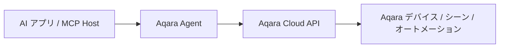

<div align="center" style="display: flex; align-items: center; justify-content: center; ">

  
  <h1>Aqara MCP Server</h1>

</div>

<div align="center">

[English](README.md) | [中文](README_CN.md) | [Français](README_FR.md) | [한국어](README_KR.md) | [Español](README_ES.md) | 日本語 | [Deutsch](README_DE.md) | [Italiano](README_IT.md)

[](https://opensource.org/licenses/MIT)
[](https://modelcontextprotocol.io/)

</div>

**Aqara MCP Server** は、Aqara Agent が提供するリモート MCP サービスです。MCP 対応の AI アプリケーションが、Aqara のスマートホーム機能に安全に接続できるようにします。MCP 連携が必要な場合は、Aqara Agent が提供するリモート MCP URL を設定するだけで利用できます。

> [!TIP]
> **推奨：Aqara 公式 Agent Skills**
>
> ご利用のアプリが Agent Skills に対応している場合（Codex、Cursor、OpenClaw など）、公式の **Aqara Agent Skills** の利用を優先することをおすすめします。MCP Server を個別に設定しなくても、自然言語でホーム／スペース、デバイス、シーン、オートメーション、エネルギー消費などの照会・制御が可能です。
>
> - GitHub: [aqara/aqara-agent-skills](https://github.com/aqara/aqara-agent-skills)
> - ClawHub: [aqara/aqara-agent](https://clawhub.ai/aqara/aqara-agent)

## 目次

- [概要](#概要)
- [機能](#機能)
- [動作の仕組み](#動作の仕組み)
- [クイックスタート](#クイックスタート)
  - [前提条件](#前提条件)
  - [ステップ 1：アカウント認証](#ステップ-1アカウント認証)
  - [ステップ 2：リモート MCP の設定](#ステップ-2リモート-mcp-の設定)
  - [ステップ 3：動作確認](#ステップ-3動作確認)
- [設定時の注意事項](#設定時の注意事項)
- [MCP Tool リファレンス](#mcp-tool-リファレンス)
  - [主要 Tool の概要](#主要-tool-の概要)
  - [ホームと位置](#ホームと位置)
  - [デバイスの照会と制御](#デバイスの照会と制御)
  - [シーン](#シーン)
  - [オートメーション](#オートメーション)
  - [エネルギー消費](#エネルギー消費)
  - [照明シナリオとライティングエフェクト](#照明シナリオとライティングエフェクト)
  - [ファームウェア](#ファームウェア)
  - [パラメータの規約](#パラメータの規約)
- [ライセンス](#ライセンス)

## 概要

現在推奨される MCP 連携は、Aqara Agent を中心に構成されています。

- **Remote MCP**: Streamable HTTP / HTTP MCP に対応するアプリが `https://agent.aqara.com/open/mcp` 経由で接続する場合に適しています。
- **Aqara Agent Skills**: Agent Skills に対応するアプリはスキルをインストールするだけで、MCP Server を手動設定する必要がありません。
- **MCP Tool の機能**: ホーム／スペース、デバイス、シーン、オートメーション、エネルギー消費、照明シナリオ／ライティングエフェクト、ファームウェアなどのスマートホーム操作をカバーします。

## 機能

- 🔍 **柔軟なデバイス照会**: ホーム／スペース、デバイスタイプ、デバイス ID による、基本情報・リアルタイム状態・制御ログの照会に対応。
- ✨ **包括的なデバイス制御**: Aqara デバイスの電源、明るさ、色温度、温度、風量、モード、カーテン開閉率などの制御に対応。
- 🎬 **スマートシーン管理**: シーンの照会・実行、実行履歴の照会に対応。
- ⏰ **オートメーション照会**: オートメーションルールの照会、実行履歴の確認に対応。
- 📈 **エネルギー消費統計**: 部屋／スペースまたはデバイス単位での電力・電気料金照会。集計・明細の両方に対応。
- 💡 **照明シナリオとライティングエフェクト管理**: 照明シナリオ／エフェクトの照会、指定エフェクトの設定、設定パラメータの照会に対応。
- 🔄 **ファームウェア管理**: 現在のファームウェアバージョン・更新可能バージョンの照会、ファームウェア更新の開始に対応。
- 🏠 **複数ホーム・複数スペース**: Aqara アカウントのホーム一覧、現在のホーム内の部屋／スペースの照会に対応。
- 🔌 **リモート MCP 連携**: HTTP MCP URL による接続。Cursor、Codex などのアプリに対応。
- 🔐 **安全な認証**: Aqara Agent へのログインで `aqara_api_key` を取得。設定時は認証情報を適切に管理してください。

## 動作の仕組み

リモート MCP モードでは、アプリが HTTP で Aqara Agent の MCP サービスに接続し、ログインページで生成した Bearer トークンをリクエストに付与します。Aqara Agent が認証情報の検証、Tool の実行、結果の返却を担当します。



1. **AI アプリ / MCP Host**: ユーザーが Cursor、Codex などで自然言語の指示を入力します。
2. **Aqara Agent**: ユーザー認証情報を検証し、該当 Tool を解釈・実行します。
3. **Aqara Cloud API**: デバイス、シーン、オートメーション、エネルギー消費、ライティングエフェクト、ファームウェアなどのデータ照会または制御を実行します。

---

## クイックスタート

### 前提条件

- **Aqara アカウント** および登録済みのスマートデバイス。
- **リモート MCP に対応したアプリ**（例: Cursor、Codex）。
- **Aqara Agent の認証情報**: ログインページで `aqara_api_key` と `aqara_mcp_url` を取得。

### ステップ 1：アカウント認証

1. **ログインページにアクセス**:
   [https://agent.aqara.com/login](https://agent.aqara.com/login)

2. **ログインを完了**:
   - Aqara アカウントでログインします。
   - ログイン後、ページに表示される `aqara_api_key` をコピーします。
   - MCP 設定にはページの `aqara_mcp_url` を使用します。通常は `https://agent.aqara.com/open/mcp` です。

3. **認証情報を安全に保管**:

   > `aqara_api_key` は厳重に管理してください。リポジトリへのコミット、スクリーンショットでの公開、第三者への共有は避けてください。

   

### ステップ 2：リモート MCP の設定

#### Cursor

1. Cursor の設定で `Tools & MCPs` を開き、`New MCP Server` をクリックします。

   

2. リモート MCP 設定を追加します。URL にはログインページの `aqara_mcp_url` を使用し、手動入力の場合は `/open/mcp` パスを指定してください。

   ```json
   {
     "mcpServers": {
       "aqara": {
         "type": "http",
         "url": "https://agent.aqara.com/open/mcp",
         "headers": {
           "Authorization": "Bearer <YOUR_AQARA_API_KEY>"
         }
       }
     }
   }
   ```

3. 設定を保存し、Cursor を再起動して MCP 設定を反映します。

#### Codex

1. Codex の設定でカスタム MCP Server を追加します。
2. タイプで `Streamable HTTP` を選択します。
3. URL にログインページの `aqara_mcp_url`（例: `https://agent.aqara.com/open/mcp`）を入力します。
4. Bearer トークンに `aqara_api_key` の値を入力します。


### ステップ 3：動作確認

設定が完了したら、次のような自然言語リクエストでテストできます。

```text
ユーザー: 家のすべてのデバイスを表示して
アシスタント: MCP でデバイス一覧を照会

ユーザー: リビングの照明をつけて
アシスタント: MCP でデバイス制御を実行

ユーザー: 映画鑑賞シーンを実行して
アシスタント: MCP でシーンを実行
```

アプリの MCP パネルに Aqara が接続済みと表示され、Aqara 関連の Tool が見えれば設定は有効です。

---

## 設定時の注意事項

- MCP URL は `https://agent.aqara.com/open/mcp` またはログインページの `aqara_mcp_url` を使用してください。ログインページの URL を MCP URL として使わないでください。
- デバイス制御、シーン実行、ファームウェア更新などの Tool は実際のホームデバイスに影響します。初回利用時は、照会系 Tool でホーム、スペース、デバイス、シーン情報を先に確認することをおすすめします。
- 接続に失敗した場合は、MCP タイプが HTTP / Streamable HTTP か、URL に `/open/mcp` が含まれるか、認証情報の有効期限、設定変更後のアプリ再起動または MCP の再読み込みを確認してください。

---

## MCP Tool リファレンス

以下の Tool 一覧は、現在の Aqara Agent サービスに登録されている関数定義に基づいています。アプリによって Tool 名の表示は異なる場合がありますが、パラメータの意味と機能範囲は同じです。

### 主要 Tool の概要

| Tool カテゴリ | Tool | 説明 |
| --- | --- | --- |
| **ホームと位置** | `all_homes_inquiry`, `position_base_inquiry` | ホーム、部屋／スペース情報の照会 |
| **デバイスの照会と制御** | `device_base_inquiry`, `device_status_inquiry`, `device_status_control`, `fuzzy_device_batch_control`, `device_log_inquiry` | デバイス基本情報・リアルタイム状態の照会、制御、制御ログの照会 |
| **シーン** | `scene_base_inquiry`, `scene_run`, `scene_execution_history_inquiry` | シーンの照会・実行、実行履歴の照会 |
| **オートメーション** | `automation_base_inquiry`, `automation_execution_history_inquiry` | オートメーションルールと実行履歴の照会 |
| **エネルギー消費** | `energy_consumption_inquiry_for_position`, `energy_consumption_inquiry_for_device` | 部屋／スペースまたはデバイス単位の電力・電気料金照会 |
| **照明シナリオとライティングエフェクト** | `lighting_effect_inquiry`, `device_lighting_effect_inquiry`, `lighting_effect_control`, `lighting_effect_config_params_inquiry` | 照明シナリオ／ライティングエフェクトの照会・設定、設定パラメータの照会 |
| **ファームウェア** | `device_firmware_inquiry`, `device_firmware_upgrade` | デバイスファームウェアの照会と更新 |

### ホームと位置

#### `all_homes_inquiry`

現在の Aqara アカウントに紐づくすべてのホーム一覧を照会します。

**パラメータ:** なし

**戻り値:** ホーム名、ホーム ID などを含むホーム一覧。

#### `position_base_inquiry`

現在のホーム内のすべての部屋／スペースの基本情報を照会します。

**パラメータ:** なし

**戻り値:** 位置名、位置 ID などを含む部屋／スペース一覧。

### デバイスの照会と制御

#### `device_base_inquiry`

部屋／スペースとデバイスタイプでデバイスの基本情報を照会します。リアルタイム状態は含みません。

**パラメータ:**

- `position_ids` _(Array\<String\>, 任意)_: 部屋／スペース ID のリスト。空の場合は位置でフィルタしません。
- `device_types` _(Array\<String\>, 任意)_: デバイスタイプのリスト（例: `Light`、`Switch`、`Outlet`、`AirConditioner`、`WindowCovering`、`Camera` など）。空の場合はデバイスタイプでフィルタしません。

**戻り値:** デバイス名、デバイス ID、所属位置、デバイスタイプなどを含む基本情報一覧。

#### `device_status_inquiry`

電源、明るさ、色温度、温度、風量、モードなど、デバイスのリアルタイム状態を照会します。

**パラメータ:**

- `device_ids` _(Array\<String\>, 任意)_: デバイス ID のリスト。指定時はデバイス ID を優先して照会。
- `position_ids` _(Array\<String\>, 任意)_: 部屋／スペース ID のリスト。
- `device_types` _(Array\<String\>, 任意)_: デバイスタイプのリスト。

**戻り値:** デバイスの現在の読み取り可能な状態を含む状態情報一覧。

#### `device_status_control`

指定デバイスの状態または属性（電源、明るさ、色温度、温度、風量、モード、カーテン開閉率など）を制御します。

**パラメータ:**

- `device_ids` _(Array\<String\>, 必須)_: 対象デバイス ID のリスト。
- `attribute` _(String, 必須)_: 制御する属性（例: `on_off`、`brightness`、`color_temperature`、`temperature`、`percentage`、`mode` など）。
- `action` _(String, 必須)_: 制御アクション（例: `on`、`off`、`set`、`up`、`down`、`warmer`、`cooler`、`start`、`stop` など）。
- `value` _(String, 任意)_: 目標値（例: `50`、`max`、`min`、`cool`、`heat`、`red` など）。

**戻り値:** デバイス制御の実行結果。

#### `fuzzy_device_batch_control`

部屋／スペースとデバイスタイプでデバイスを一括制御します。「家中の照明を消す」「リビングをすべてオフ」「すべてのエアコンを 26 度に」などの一括制御に適しています。

**パラメータ:**

- `position_ids` _(Array\<String\>, 任意)_: 部屋／スペース ID のリスト。空の場合は家中全体の範囲を表すことがあります。
- `device_types` _(Array\<String\>, 任意)_: デバイスタイプのリスト。
- `attribute` _(String, 必須)_: 制御する属性。
- `action` _(String, 必須)_: 制御アクション。
- `value` _(String, 任意)_: 目標値。

**戻り値:** 一括制御の実行結果。

#### `device_log_inquiry`

指定時間範囲のデバイス制御ログ（制御時刻、内容、結果など）を照会します。

**パラメータ:**

- `time_range` _(Array\<String\>, 任意)_: 時間区間。形式例: `["2026-01-01 00:00:00", "2026-01-01 23:59:59"]`。
- `device_ids` _(Array\<String\>, 任意)_: デバイス ID のリスト。指定時はデバイス ID を優先して照会。
- `position_ids` _(Array\<String\>, 任意)_: 部屋／スペース ID のリスト。
- `device_types` _(Array\<String\>, 任意)_: デバイスタイプのリスト。

**戻り値:** デバイス制御ログ一覧と実際の照会時間範囲。

### シーン

#### `scene_base_inquiry`

シーンの基本情報を照会します。シーン ID、位置 ID、デバイス ID でフィルタできます。

**パラメータ:**

- `scene_ids` _(Array\<String\>, 任意)_: シーン ID のリスト。指定時はシーン ID を優先して照会。
- `position_ids` _(Array\<String\>, 任意)_: 部屋／スペース ID のリスト。
- `device_ids` _(Array\<String\>, 任意)_: デバイス ID のリスト。デバイスに関連するシーンの照会に使用。

**戻り値:** シーン基本情報一覧。

#### `scene_run`

指定した 1 つ以上のシーンを実行します。

**パラメータ:**

- `scene_ids` _(Array\<String\>, 必須)_: 実行するシーン ID のリスト。

**戻り値:** シーン実行結果。

#### `scene_execution_history_inquiry`

指定時間範囲のシーン実行履歴を照会します。

**パラメータ:**

- `time_range` _(Array\<String\>, 任意)_: 時間区間。
- `scene_ids` _(Array\<String\>, 任意)_: シーン ID のリスト。
- `position_ids` _(Array\<String\>, 任意)_: 部屋／スペース ID のリスト。
- `device_ids` _(Array\<String\>, 任意)_: デバイス ID のリスト。

**戻り値:** シーン実行履歴一覧と実際の照会時間範囲。

### オートメーション

#### `automation_base_inquiry`

オートメーションルールの基本情報を照会します。オートメーション ID、位置 ID、デバイス ID でフィルタできます。

**パラメータ:**

- `automation_ids` _(Array\<String\>, 任意)_: オートメーション ID のリスト。指定時はオートメーション ID を優先して照会。
- `position_ids` _(Array\<String\>, 任意)_: 部屋／スペース ID のリスト。
- `device_ids` _(Array\<String\>, 任意)_: デバイス ID のリスト。デバイスに関連するオートメーションの照会に使用。

**戻り値:** オートメーションルール情報一覧。

#### `automation_execution_history_inquiry`

指定時間範囲のオートメーションルール実行履歴を照会します。

**パラメータ:**

- `time_range` _(Array\<String\>, 任意)_: 時間区間。
- `automation_ids` _(Array\<String\>, 任意)_: オートメーション ID のリスト。
- `position_ids` _(Array\<String\>, 任意)_: 部屋／スペース ID のリスト。
- `device_ids` _(Array\<String\>, 任意)_: デバイス ID のリスト。

**戻り値:** オートメーション実行履歴一覧と実際の照会時間範囲。

### エネルギー消費

#### `energy_consumption_inquiry_for_position`

ホーム／部屋／スペース単位で電力または電気料金を照会します。集計・明細の両方に対応。

**パラメータ:**

- `data_type` _(String, 必須)_: 照会タイプ。`1` は電力、`2` は電気料金、`3` は電力と電気料金。
- `time_range` _(Array\<String\>, 必須)_: 時間区間。
- `time_gradient` _(String, 任意)_: 統計粒度。`30min`、`1hour`、`1day`、`1week`、`1month` が指定可能。
- `data_aggregation_mode` _(String, 任意)_: 集計モード。`total` は集計、`detail` は明細。
- `positions` _(Array\<String\>, 任意)_: 部屋／スペース ID のリスト。空の場合は有効なすべての部屋を照会。

**戻り値:** 部屋／スペース単位の電力／電気料金統計結果。

#### `energy_consumption_inquiry_for_device`

デバイス単位で電力または電気料金を照会します。位置またはデバイスでフィルタでき、集計・明細の両方に対応。

**パラメータ:**

- `data_type` _(String, 必須)_: 照会タイプ。`1` は電力、`2` は電気料金、`3` は電力と電気料金。
- `time_range` _(Array\<String\>, 必須)_: 時間区間。
- `time_gradient` _(String, 任意)_: 統計粒度。`30min`、`1hour`、`1day`、`1week`、`1month` が指定可能。
- `data_aggregation_mode` _(String, 任意)_: 集計モード。`total` は集計、`detail` は明細。
- `positions` _(Array\<String\>, 任意)_: 部屋／スペース ID のリスト。
- `device_ids` _(Array\<String\>, 任意)_: デバイス ID のリスト。指定時はデバイスを優先して照会。

**戻り値:** デバイス単位の電力／電気料金統計結果。

### 照明シナリオとライティングエフェクト

#### `lighting_effect_inquiry`

ホーム内で利用可能な照明シナリオ／ライティングエフェクト情報を照会します。

**パラメータ:** なし

**戻り値:** 制御に利用できるエフェクト名と適用範囲を含むエフェクト一覧。

#### `device_lighting_effect_inquiry`

デバイスごとにサポートするライティングエフェクト名を照会します。

**パラメータ:**

- `device_ids` _(Array\<String\>, 必須)_: エフェクトを照会するデバイス ID のリスト。

**戻り値:** デバイスとエフェクト名の対応一覧。

#### `lighting_effect_control`

指定デバイスまたは部屋／スペース内の照明を、指定エフェクトに切り替えます。

**パラメータ:**

- `effect_name` _(String, 必須)_: エフェクト名。
- `device_ids` _(Array\<String\>, 任意)_: 対象デバイス ID のリスト。指定時はデバイスを優先して制御。
- `position_ids` _(Array\<String\>, 任意)_: 部屋／スペース ID のリスト。

**戻り値:** ライティングエフェクト制御の実行結果。

#### `lighting_effect_config_params_inquiry`

照明デバイスでエフェクトを設定する際に必要なパラメータ情報を照会します。

**パラメータ:**

- `device_ids` _(Array\<String\>, 必須)_: 対象の照明デバイス ID のリスト。

**戻り値:** 設定可能項目、値の範囲、保存済みユーザーエフェクトなどを含むエフェクト設定パラメータ一覧。

### ファームウェア

#### `device_firmware_inquiry`

デバイスの現在のファームウェアバージョンと更新可能バージョンを一括照会します。

**パラメータ:**

- `device_ids` _(Array\<String\>, 任意)_: デバイス ID のリスト。指定時はデバイスを優先して照会。
- `position_ids` _(Array\<String\>, 任意)_: 部屋／スペース ID のリスト。
- `device_types` _(Array\<String\>, 任意)_: デバイスタイプのリスト。

**戻り値:** デバイス名、オンライン状態、現在・更新可能ファームウェアバージョンを含むファームウェア情報一覧。

#### `device_firmware_upgrade`

デバイス、位置、タイプでフィルタしたうえで、更新可能なデバイスのファームウェア更新を開始します。

**パラメータ:**

- `device_ids` _(Array\<String\>, 任意)_: デバイス ID のリスト。指定時は該当デバイスを優先して更新。
- `position_ids` _(Array\<String\>, 任意)_: 部屋／スペース ID のリスト。
- `device_types` _(Array\<String\>, 任意)_: デバイスタイプのリスト。

**戻り値:** ファームウェア更新の送信結果。

### パラメータの規約

- `position_ids` / `positions`: 部屋／スペース ID のリスト。未指定時の照会・制御範囲は各 Tool の説明に従います。
- `device_ids`: デバイス ID またはデバイスエンドポイント ID のリスト。上位の識別とサーバー側マッピングで処理されます。
- `device_types`: デバイスタイプのリスト（例: `Light`、`Switch`、`Outlet`、`AirConditioner`、`WindowCovering`、`Camera`、`TemperatureSensor` など）。
- `attribute`: 制御属性（例: `on_off`、`brightness`、`color_temperature`、`temperature`、`wind_speed`、`mode`、`percentage`、`volume`、`color` など）。
- `action`: 制御アクション（例: `on`、`off`、`set`、`up`、`down`、`warmer`、`cooler`、`start`、`stop`、`pause`、`resume` など）。
- `value`: 目標値（例: `50`、`100`、`max`、`min`、`red`、`cool`、`heat`、ライティングエフェクト名など）。
- `time_range`: 時間区間の配列。一般的な形式: `["YYYY-MM-DD HH:MM:SS", "YYYY-MM-DD HH:MM:SS"]`。
- `data_type`: エネルギー照会タイプ。`1` は電力、`2` は電気料金、`3` は電力と電気料金。
- `time_gradient`: エネルギー統計粒度。`30min`、`1hour`、`1day`、`1week`、`1month` が指定可能。
- `data_aggregation_mode`: エネルギー集計モード。`total` は集計、`detail` は明細。

## ライセンス

本プロジェクトは [MIT ライセンス](LICENSE) の下で提供されています。詳細は [LICENSE](LICENSE) ファイルを参照してください。

---

Copyright © 2025 Aqara-Agent. 無断転載を禁じます。
