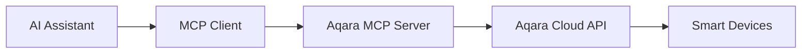

<div align="center" style="display: flex; align-items: center; justify-content: center; ">

  
  <h1>Aqara MCP Server</h1>

</div>

<div align="center">

English | [中文](/readme/README_CN.md) | [繁體中文](/readme/README_CHT.md) | [Français](/readme/README_FR.md) | [한국어](/readme/README_KR.md) | [Español](/readme/README_ES.md) | [日本語](/readme/README_JP.md) | [Deutsch](/readme/README_DE.md) | [Italiano](/readme/README_IT.md)

[](https://github.com/aqara/aqara-mcp-server)
[](https://golang.org/dl/)
[](https://github.com/aqara/aqara-mcp-server/releases)
[](https://opensource.org/licenses/MIT)

</div>

Aqara MCP Server is an intelligent home automation control service built on the [MCP (Model Context Protocol)](https://modelcontextprotocol.io/introduction). It enables any MCP-compatible AI assistant or API (such as Claude, Cursor, etc.) to interact with your Aqara smart home devices, providing natural language device control, status queries, and scene execution capabilities.

## Table of Contents

- [Table of Contents](#table-of-contents)
- [Features](#features)
- [How It Works](#how-it-works)
- [Quick Start](#quick-start)
  - [Prerequisites](#prerequisites)
  - [Installation](#installation)
    - [Option 1: Download Pre-built Binaries (Recommended)](#option-1-download-pre-built-binaries-recommended)
    - [Option 2: Build from Source](#option-2-build-from-source)
  - [Aqara Account Authentication](#aqara-account-authentication)
  - [Client Configuration](#client-configuration)
    - [Claude for Desktop Configuration Example](#claude-for-desktop-configuration-example)
    - [Configuration Parameters](#configuration-parameters)
    - [Other MCP Clients](#other-mcp-clients)
  - [Starting the Service](#starting-the-service)
    - [Standard Mode (Recommended)](#standard-mode-recommended)
    - [HTTP Mode (Coming Soon)](#http-mode-coming-soon)
- [API Tools Reference](#api-tools-reference)
  - [Device Control](#device-control)
    - [device\_control](#device_control)
  - [Device Query](#device-query)
    - [device\_query](#device_query)
    - [device\_status\_query](#device_status_query)
    - [device\_log\_query](#device_log_query)
  - [Scene Management](#scene-management)
    - [get\_scenes](#get_scenes)
    - [run\_scenes](#run_scenes)
  - [Home Management](#home-management)
    - [get\_homes](#get_homes)
    - [switch\_home](#switch_home)
  - [Automation Configuration](#automation-configuration)
    - [automation\_config](#automation_config)
- [Project Structure](#project-structure)
  - [Directory Structure](#directory-structure)
  - [Core Files](#core-files)
- [Development Guide](#development-guide)
- [License](#license)

## Features

- ✨ **Comprehensive Device Control**: Support for precise control of various Aqara smart device attributes including power, brightness, color temperature, and operating modes
- 🔍 **Flexible Device Queries**: Query device lists and detailed status by room or device type
- 🎬 **Smart Scene Management**: Query and execute user-configured smart home scenes
- 📈 **Device History**: Query device historical state changes within specified time ranges
- ⏰ **Automation Configuration**: Configure scheduled or delayed device control tasks
- 🏠 **Multi-Home Support**: Query and switch between different homes under your account
- 🔌 **MCP Protocol Compatibility**: Full compliance with MCP protocol specifications for seamless AI assistant integration
- 🔐 **Secure Authentication**: Login-based authorization with signature-based security to protect user data and devices
- 🌐 **Cross-Platform**: Built with Go for compilation to multiple platform executables
- 🔧 **Extensible**: Modular design for easy addition of new tools and functionality

## How It Works

Aqara MCP Server serves as a bridge between AI assistants and the Aqara smart home platform:



1. **AI Assistant**: Users issue commands through AI assistants (e.g., "Turn on the living room lights")
2. **MCP Client**: Parses user commands and calls appropriate Aqara MCP Server tools (e.g., `device_control`) per MCP protocol
3. **Aqara MCP Server (This Project)**: Receives client requests, communicates with Aqara Cloud API using configured credentials to execute device operations or data queries
4. **Response Flow**: Aqara Cloud API returns results through Aqara MCP Server back to the MCP client, ultimately presented to the user

## Quick Start

### Prerequisites

- **Go** (version 1.24 or higher) - Only required for building from source
- **Git** (for building from source) - Optional
- **Aqara Account** with registered smart devices
- **MCP-compatible client** (such as Claude for Desktop, Cursor, etc.)

### Installation

You can either download pre-built executables or build from source.

#### Option 1: Download Pre-built Binaries (Recommended)

Visit the GitHub Releases page to download the latest executable for your operating system:

**📥 [Go to Releases Page](https://github.com/aqara/aqara-mcp-server/releases)**

Simply download and extract the appropriate package for your platform.

#### Option 2: Build from Source

```bash
# Clone the repository
git clone https://github.com/aqara/aqara-mcp-server.git
cd aqara-mcp-server

# Download dependencies
go mod tidy

# Build executable
go build -o aqara-mcp-server
```

After building, you'll have an `aqara-mcp-server` executable in the current directory.

### Aqara Account Authentication

To enable MCP Server access to your Aqara account and device control, you must first complete login authorization.

Please visit the following URL to complete login authorization:
**🔗 [https://cdn.aqara.com/app/mcpserver/login.html](https://cdn.aqara.com/app/mcpserver/login.html)**

After successful login, you'll receive necessary authentication information (such as `token`, `region`) for use in subsequent configuration steps.

> ⚠️ **Security Notice**: Please keep your `token` information secure and do not share with others.

### Client Configuration

Configuration methods vary slightly between different MCP clients. Here's an example of how to configure Claude for Desktop to use this MCP Server:

#### Claude for Desktop Configuration Example

1. **Open Claude for Desktop Settings**

    

2. **Switch to the Developer tab, then click Edit Config to open the configuration file in a text editor**

    

3. **Add the configuration information from the "Login Success Page" to your client's configuration file `claude_desktop_config.json`**

    ```json
    {
      "mcpServers": {
        "aqara": {
          "command": "/path/to/aqara-mcp-server",
          "args": ["run", "stdio"],
          "env": {
            "token": "your_token_here",
            "region": "your_region_here"
          }
        }
      }
    }
    ```

    

#### Configuration Parameters

- `command`: Full path to your downloaded or built `aqara-mcp-server` executable
- `args`: Use `["run", "stdio"]` to start stdio transport mode
- `env`: Environment variable configuration
  - `token`: Access token obtained from Aqara login page
  - `region`: Your Aqara account region (supported regions: CN, US, EU, KR, SG, RU)

#### Other MCP Clients

For other MCP protocol-compatible clients (such as ChatGPT, Cursor, etc.), configuration is similar:

- Ensure the client supports MCP protocol
- Configure executable path and startup parameters
- Set environment variables `token` and `region`
- Select appropriate transport protocol (recommend `stdio`)

### Starting the Service

#### Standard Mode (Recommended)

Restart Claude for Desktop. You can then perform device control, device queries, scene execution, and other operations through natural language.

Example conversations:

- "Turn on the living room lights"
- "Set the bedroom air conditioner to cooling mode at 24 degrees"
- "Show me all devices in every room"
- "Run the goodnight scene"


#### HTTP Mode (Coming Soon)

## API Tools Reference

MCP clients can interact with Aqara smart home devices by calling these tools.

### Device Control

#### device_control

Control smart home device states or attributes (such as power, temperature, brightness, color, color temperature, etc.).

**Parameters:**

- `endpoint_ids` _(Array\<Integer\>, Required)_: List of device IDs to control
- `control_params` _(Object, Required)_: Control parameter object containing specific operations:
  - `action` _(String, Required)_: Operation to execute (e.g., `"on"`, `"off"`, `"set"`, `"up"`, `"down"`, `"cooler"`, `"warmer"`)
  - `attribute` _(String, Required)_: Device attribute to control (e.g., `"on_off"`, `"brightness"`, `"color_temperature"`, `"ac_mode"`)
  - `value` _(String | Number, Optional)_: Target value (required when action is "set")
  - `unit` _(String, Optional)_: Unit of the value (e.g., `"%"`, `"K"`, `"℃"`)

**Returns:** Device control operation result message

### Device Query

#### device_query

Get device list based on specified location (room) and device type (excludes real-time status information).

**Parameters:**

- `positions` _(Array\<String\>, Optional)_: List of room names. Empty array queries all rooms
- `device_types` _(Array\<String\>, Optional)_: List of device types (e.g., `"Light"`, `"WindowCovering"`, `"AirConditioner"`, `"Button"`). Empty array queries all types

**Returns:** Markdown formatted device list including device names and IDs

#### device_status_query

Get current device status information (for querying real-time status like color, brightness, power state, etc.).

**Parameters:**

- `positions` _(Array\<String\>, Optional)_: List of room names. Empty array queries all rooms
- `device_types` _(Array\<String\>, Optional)_: List of device types. Same options as `device_query`. Empty array queries all types

**Returns:** Markdown formatted device status information

#### device_log_query

Query device historical log information.

**Parameters:**

- `endpoint_ids` _(Array\<Integer\>, Required)_: List of device IDs to query history for
- `start_datetime` _(String, Optional)_: Query start time in format `YYYY-MM-DD HH:MM:SS` (e.g., `"2023-05-16 12:00:00"`)
- `end_datetime` _(String, Optional)_: Query end time in format `YYYY-MM-DD HH:MM:SS`
- `attributes` _(Array\<String\>, Optional)_: List of device attribute names to query (e.g., `["on_off", "brightness"]`). Queries all recorded attributes if not provided

**Returns:** Markdown formatted device historical status information

### Scene Management

#### get_scenes

Query all scenes under user's home, or scenes within specified rooms.

**Parameters:**

- `positions` _(Array\<String\>, Optional)_: List of room names. Empty array queries entire home's scenes

**Returns:** Markdown formatted scene information

#### run_scenes

Execute specified scenes by scene ID.

**Parameters:**

- `scenes` _(Array\<Integer\>, Required)_: List of scene IDs to execute

**Returns:** Scene execution result message

### Home Management

#### get_homes

Get list of all homes under user account.

**Parameters:** None

**Returns:** Comma-separated list of home names. Returns empty string or appropriate message if no data

#### switch_home

Switch user's current operating home. After switching, subsequent device queries, controls, and other operations will target the newly switched home.

**Parameters:**

- `home_name` _(String, Required)_: Name of target home

**Returns:** Switch operation result message

### Automation Configuration

#### automation_config

Automation configuration (currently supports only scheduled or delayed device control tasks).

**Parameters:**

- `scheduled_time` _(String, Required)_: Scheduled execution time using standard Crontab format `"minute hour day month weekday"`. Examples: `"30 14 * * *"` (daily at 14:30), `"0 9 * * 1"` (Mondays at 9:00)
- `endpoint_ids` _(Array\<Integer\>, Required)_: List of device IDs for scheduled control
- `control_params` _(Object, Required)_: Device control parameters using same format as `device_control` tool (including action, attribute, value, etc.)
- `task_name` _(String, Required)_: Name or description of this automation task (for identification and management)
- `execution_once` _(Boolean, Optional)_: Whether to execute only once
  - `true`: Execute task only once at specified time (default)
  - `false`: Execute task periodically (daily, weekly, etc.)

**Returns:** Automation configuration result message

## Project Structure

### Directory Structure

```text
.
├── cmd.go                # Cobra CLI command definitions and program entry point (contains main function)
├── server.go             # MCP server core logic, tool definitions, and request handling
├── smh.go                # Aqara smart home platform API interface wrapper
├── middleware.go         # Middleware: user authentication, timeout control, exception recovery
├── config.go             # Global configuration management and environment variable handling
├── go.mod                # Go module dependency management file
├── go.sum                # Go module dependency checksum file
├── readme/               # README documentation and image resources
│   ├── img/              # Image resources directory
│   └── *.md              # Multi-language README files
├── LICENSE               # MIT open source license
└── README.md             # Main project documentation
```

### Core Files

- **`cmd.go`**: Cobra framework-based CLI implementation defining `run stdio` and `run http` startup modes and main entry function
- **`server.go`**: MCP server core implementation responsible for tool registration, request handling, and protocol support
- **`smh.go`**: Aqara smart home platform API wrapper layer providing device control, authentication, and multi-home support
- **`middleware.go`**: Request processing middleware providing authentication verification, timeout control, and exception handling
- **`config.go`**: Global configuration management responsible for environment variable processing and API configuration

## Development Guide

We welcome contributions through Issues and Pull Requests!

Before submitting code, please ensure:

1. Code follows Go language coding standards
2. Related MCP tools and interface definitions maintain consistency and clarity
3. Add or update unit tests to cover your changes
4. Update relevant documentation (such as this README) if necessary
5. Ensure your commit messages are clear and descriptive

**🌟 If this project helps you, please give us a Star!**

**🤝 Welcome to join our community and make smart homes smarter together!**

## License

This project is licensed under the [MIT License](/LICENSE).

---

Copyright (c) 2025 Aqara-Copilot
