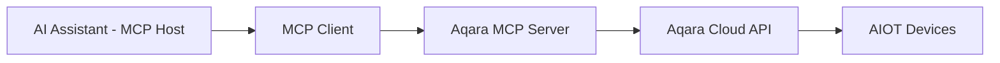

<div align="center" style="display: flex; align-items: center; justify-content: center; ">

  
  <h1>Aqara MCP Server</h1>

</div>

<div align="center">

[English](/README.md) | [中文](/readme/README_CN.md) | 繁體中文 | [Français](/readme/README_FR.md) | [한국어](/readme/README_KR.md) | [Español](/readme/README_ES.md) | [日本語](/readme/README_JP.md) | [Deutsch](/readme/README_DE.md) | [Italiano](/readme/README_IT.md)

[](https://github.com/aqara/aqara-mcp-server)
[](https://golang.org/dl/)
[](https://github.com/aqara/aqara-mcp-server/releases)
[](https://opensource.org/licenses/MIT)
[](https://modelcontextprotocol.io/)

</div>

**Aqara MCP Server** 是一個基於 [模型上下文協議 (MCP)](https://modelcontextprotocol.io/introduction) 建構的智慧家庭自動化控制服務。該平台實現了 AI 助理（例如 Claude、Cursor 等）與 Aqara 智慧家庭生態系統之間的無縫整合。

## 目錄

- [目錄](#目錄)
- [特性](#特性)
- [運作原理](#運作原理)
- [快速開始](#快速開始)
  - [先決條件](#先決條件)
  - [第一步：帳戶認證](#第一步帳戶認證)
  - [第二步：如何使用](#第二步如何使用)
    - [選項 A：遠端 MCP 伺服器（推薦）](#選項-a遠端-mcp-伺服器推薦)
    - [選項 B：本地 MCP 伺服器](#選項-b本地-mcp-伺服器)
  - [第三步：驗證](#第三步驗證)
- [API 參考](#api-參考)
  - [核心工具概覽](#核心工具概覽)
  - [裝置控制 API](#裝置控制-api)
    - [`device_control`](#device_control)
  - [裝置查詢 API](#裝置查詢-api)
    - [`device_query`](#device_query)
    - [`device_status_query`](#device_status_query)
    - [`device_log_query`](#device_log_query)
  - [場景管理 API](#場景管理-api)
    - [`get_scenes`](#get_scenes)
    - [`run_scenes`](#run_scenes)
  - [家庭管理 API](#家庭管理-api)
    - [`get_homes`](#get_homes)
    - [`switch_home`](#switch_home)
  - [自動化設定 API](#自動化設定-api)
    - [`automation_config`](#automation_config)
- [專案結構](#專案結構)
  - [目錄結構](#目錄結構)
  - [核心檔案說明](#核心檔案說明)
- [開發與貢獻](#開發與貢獻)
  - [開發環境設定](#開發環境設定)
  - [程式碼品質標準](#程式碼品質標準)
  - [貢獻指南](#貢獻指南)
- [授權條款](#授權條款)

## 特性

- ✨ **全面的裝置控制**：支援對 Aqara 智慧裝置的開關、亮度、色溫、模式等多種屬性進行精細控制
- 🔍 **靈活的裝置查詢**：能夠按房間、裝置類型查詢裝置列表及其詳細狀態
- 🎬 **智慧場景管理**：支援查詢和執行使用者預設的智慧家庭場景
- 📈 **裝置歷史記錄**：查詢裝置在指定時間範圍內的歷史狀態變更記錄
- ⏰ **自動化設定**：支援設定定時或延時裝置控制任務
- 🏠 **多家庭支援**：支援查詢和切換使用者帳戶下的不同家庭
- 🔌 **MCP 協議相容**：完全遵循 MCP 協議規範，易於與各類 AI 助理整合
- 🔐 **安全認證機制**：採用基於登入授權+簽章的安全認證，保護使用者資料和裝置安全
- 🌐 **跨平台執行**：基於 Go 語言開發，可編譯為多平台可執行檔
- 🔧 **易於擴充**：模組化設計，可以方便地新增新的工具和功能

## 運作原理

Aqara MCP Server 作為 AI 助理與 Aqara 智慧家庭平台之間的橋樑：



1. **AI 助理**：使用者透過 AI 助理發出指令（例如，「打開客廳的燈」）
2. **MCP 客戶端**：將使用者指令解析，並根據 MCP 協議呼叫 Aqara MCP Server 提供的相應工具（例如 `device_control`）
3. **Aqara MCP Server (本專案)**：接收來自客戶端的請求，使用設定好的 Aqara 憑證，與 Aqara 雲端 API 進行通訊，執行實際的裝置操作或資料查詢
4. **回應流程**：Aqara 雲端 API 回傳結果，經由 Aqara MCP Server 傳遞回 MCP 客戶端，最終呈現給使用者

---

## 快速開始

### 先決條件

- **Aqara 帳戶** 及已註冊的智慧裝置
- **支援 MCP 的客戶端** (如 Claude for Desktop、Cursor 等)
- **Go 1.24+** (僅本地部署需要，用於原始碼建構)

### 第一步：帳戶認證

無論選擇哪種部署模式，都需要先取得 Aqara 認證資訊：

1. **訪問登入頁面**:
   🔗 [https://cdn.aqara.com/app/mcpserver/login.html](https://cdn.aqara.com/app/mcpserver/login.html)

2. **完成登入流程**:
   - 使用您的 Aqara 憑證登入
   - 取得 `api_key` 和 `base_url`

3. **安全儲存憑證**:
   > ⚠️ 請妥善保管 `api_key` 資訊，不要洩露給他人。

  

### 第二步：如何使用

根據您的需求選擇合適的部署方式：

#### 選項 A：遠端 MCP 伺服器（推薦）

**適用於**: 希望快速上手，無需本地環境設定的使用者。

**優勢**：

- ✅ **即開即用**：無需下載或編譯，直接設定即可使用
- ✅ **自動更新**：伺服器端自動維護和更新
- ✅ **高可用性**：專業維運保障服務穩定性
- ✅ **多平台相容**：無作業系統限制

**設定 MCP 客戶端**：

1. **開啟設定**:
   - 啟動 Curosr

   

2. **新增伺服器設定**:

    ```json
    {
      "mcpServers": {
        "aqara": {
          "type": "http",
          "url": "https://[mcp-server-domain]/echo/mcp",  // base_url
          "headers": {
            "Authorization": "[YOUR_API_KEY_HERE]"  // api_key
          }
        }
      }
    }
    ```

3. **重新啟動應用程式**:
   - 重新啟動 Cursor 使設定生效

#### 選項 B：本地 MCP 伺服器

**適用於**: 需要資料主權、自訂設定或離線使用的使用者。

**優勢**：

- ✅ **資料隱私**：所有資料處理在本地進行
- ✅ **完全控制**：可自訂設定和擴充功能
- ✅ **離線可用**：網路中斷不影響基本功能
- ✅ **無限制**：不受雲端服務限制

**安裝步驟**：

1. **下載程式** (二選一)：

   **推薦：下載預編譯版本**

   訪問 [GitHub Releases](https://github.com/aqara/aqara-mcp-server/releases) 下載適用於您作業系統的最新版本。

   **或者：從原始碼建構**

   ```bash
   git clone https://github.com/aqara/aqara-mcp-server.git
   cd aqara-mcp-server
   go mod tidy
   go build -ldflags="-s -w" -o aqara-mcp-server
   ```

2. **設定環境變數**：

   ```bash
   export aqara_api_key="your_api_key_here"
   export aqara_base_url="your_base_url_here"
   ```

**設定 MCP 客戶端(以 **Claude for Desktop** 為例)**：

1. **開啟設定**:
   - 啟動 Claude for Desktop
   - 導覽至：設定 → 開發者

   

2. **編輯設定檔**:
   - 點擊「編輯設定」

   

3. **新增伺服器設定(claude_desktop_config.json)**:

  ```json
   {
     "mcpServers": {
       "aqara": {
         "command": "/path/to/aqara-mcp-server",
         "args": ["run", "stdio"],
         "env": {
           "aqara_api_key": "your_api_key_here",
           "aqara_base_url": "your_base_url_here"
         }
       }
     }
   }
   ```

1. **重新啟動應用程式**:
   - 重新啟動 Claude for Desktop 使設定生效

### 第三步：驗證

使用以下測試命令驗證設定是否成功：

```
使用者：「顯示我家裡的所有裝置」
助理：[透過 MCP 查詢裝置列表]

使用者：「打開客廳的燈」
助理：[透過 MCP 執行裝置控制]

使用者：「執行晚間場景」
助理：[透過 MCP 執行場景]
```

如果看到類似「🔧 已連接到 Aqara MCP Server」的訊息，說明設定成功！

---

## API 參考

### 核心工具概覽

| 工具類別 | 工具 | 描述 |
|----------|------|------|
| **裝置控制** | `device_control` | 直接裝置操作 |
| **裝置查詢** | `device_query`, `device_status_query`, `device_log_query` | 全面的裝置資訊 |
| **場景管理** | `get_scenes`, `run_scenes` | 自動化場景控制 |
| **家庭管理** | `get_homes`, `switch_home` | 多家庭環境支援 |
| **自動化** | `automation_config` | 定時任務設定 |

### 裝置控制 API

#### `device_control`

控制智慧家庭裝置的狀態或屬性（例如開關、溫度、亮度、顏色、色溫等）。

**參數：**

- `endpoint_ids` _(Array\<Integer\>, 必要)_：需要控制的裝置 ID 列表
- `control_params` _(Object, 必要)_：控制參數物件，包含具體操作：
  - `action` _(String, 必要)_：要執行的操作（如 `"on"`, `"off"`, `"set"`, `"up"`, `"down"`, `"cooler"`, `"warmer"`）
  - `attribute` _(String, 必要)_：要控制的裝置屬性（如 `"on_off"`, `"brightness"`, `"color_temperature"`, `"ac_mode"`）
  - `value` _(String | Number, 可選)_：目標值（當 action 為 "set" 時必要）
  - `unit` _(String, 可選)_：值的單位（如 `"%"`, `"K"`, `"℃"`）

**回傳：** 裝置控制的操作結果訊息

### 裝置查詢 API

#### `device_query`

根據指定的位置（房間）和裝置類型檢索全面的裝置清單，支援過濾功能（不包含即時狀態資訊）。

**參數：**

- `positions` _(Array\<String\>, 可選)_：房間名稱列表。空陣列表示查詢所有房間
- `device_types` _(Array\<String\>, 可選)_：裝置類型列表（如 `"Light"`, `"WindowCovering"`, `"AirConditioner"`, `"Button"`）。空陣列表示查詢所有類型

**回傳：** Markdown 格式的裝置列表，包含裝置名稱和 ID

#### `device_status_query`

取得裝置的目前狀態資訊（用於查詢顏色、亮度、開關等即時狀態資訊）。

**參數：**

- `positions` _(Array\<String\>, 可選)_：房間名稱列表。空陣列表示查詢所有房間
- `device_types` _(Array\<String\>, 可選)_：裝置類型列表。可選值同 `device_query`。空陣列表示查詢所有類型

**回傳：** Markdown 格式的裝置狀態資訊

#### `device_log_query`

查詢裝置的歷史日誌資訊。

**參數：**

- `endpoint_ids` _(Array\<Integer\>, 必要)_：需要查詢歷史記錄的裝置 ID 列表
- `start_datetime` _(String, 可選)_：查詢起始時間，格式為 `YYYY-MM-DD HH:MM:SS`（例如：`"2023-05-16 12:00:00"`）
- `end_datetime` _(String, 可選)_：查詢結束時間，格式為 `YYYY-MM-DD HH:MM:SS`
- `attributes` _(Array\<String\>, 可選)_：要查詢的裝置屬性名稱列表（如 `["on_off", "brightness"]`）。未提供時查詢所有已記錄屬性

**回傳：** Markdown 格式的裝置歷史狀態資訊

### 場景管理 API

#### `get_scenes`

查詢使用者家庭下所有場景，或指定房間內的場景。

**參數：**

- `positions` _(Array\<String\>, 可選)_：房間名稱列表。空陣列表示查詢整個家庭的場景

**回傳：** Markdown 格式的場景資訊

#### `run_scenes`

根據場景 ID 執行指定的場景。

**參數：**

- `scenes` _(Array\<Integer\>, 必要)_：需要執行的場景 ID 列表

**回傳：** 場景執行的結果訊息

### 家庭管理 API

#### `get_homes`

取得使用者帳戶下的所有家庭列表。

**參數：** 無

**回傳：** 以逗號分隔的家庭名稱列表。如果無資料則回傳空字串或相應的提示訊息

#### `switch_home`

切換使用者目前操作的家庭。切換後，後續的裝置查詢、控制等操作將針對新切換的家庭。

**參數：**

- `home_name` _(String, 必要)_：目標家庭的名稱

**回傳：** 切換操作的結果訊息

### 自動化設定 API

#### `automation_config`

自動化設定（目前僅支援定時或延時裝置控制任務）。

**參數：**

- `scheduled_time` _(String, 必要)_：定時執行的時間點，使用標準 Crontab 格式 `"分 時 日 月 週"`。例如：`"30 14 * * *"`（每天14:30執行）、`"0 9 * * 1"`（每週一9:00執行）
- `endpoint_ids` _(Array\<Integer\>, 必要)_：需要定時控制的裝置 ID 列表
- `control_params` _(Object, 必要)_：裝置控制參數，使用與 `device_control` 工具相同的格式（包含 action、attribute、value 等）
- `task_name` _(String, 必要)_：此自動化任務的名稱或描述（用於識別和管理）
- `execution_once` _(Boolean, 可選)_：是否只執行一次
  - `true`：僅在指定時間執行一次任務（預設值）
  - `false`：週期性重複執行任務（如每天、每週等）

**回傳：** 自動化設定結果訊息

## 專案結構

### 目錄結構

```text
.
├── cmd.go                # Cobra CLI 命令定義和程式進入點（包含 main 函數）
├── server.go             # MCP 伺服器核心邏輯，工具定義和請求處理
├── smh.go                # Aqara 智慧家庭平台 API 介面封裝
├── middleware.go         # 中介軟體：使用者認證、超時控制、異常恢復
├── config.go             # 全域設定管理和環境變數處理
├── go.mod                # Go 模組依賴管理檔案
├── go.sum                # Go 模組依賴校驗和檔案
├── readme/               # README 文件和圖片資源
│   ├── img/              # 圖片資源目錄
│   └── *.md              # 多語言 README 檔案
├── LICENSE               # MIT 開源授權條款
└── README.md             # 專案主文件
```

### 核心檔案說明

- **`cmd.go`**：基於 Cobra 框架的 CLI 實現，定義 `run stdio` 和 `run http` 啟動模式及主進入函數
- **`server.go`**：MCP 伺服器核心實現，負責工具註冊、請求處理和協議支援
- **`smh.go`**：Aqara 智慧家庭平台 API 封裝層，提供裝置控制、認證和多家庭支援
- **`middleware.go`**：請求處理中介軟體，提供認證驗證、超時控制和異常處理
- **`config.go`**：全域設定管理，負責環境變數處理和 API 設定

## 開發與貢獻

### 開發環境設定

```bash
# 複製倉庫
git clone https://github.com/aqara/aqara-mcp-server.git
cd aqara-mcp-server

# 安裝依賴
go mod tidy

# 執行測試
go test ./...

# 優化建構
go build -ldflags="-s -w" -o aqara-mcp-server
```

### 程式碼品質標準

- **Go 語言**: 遵循官方 Go 編碼標準
- **文件**: 全面的 API 文件
- **測試**: 最低 80% 程式碼覆蓋率
- **安全**: 定期安全審計

### 貢獻指南

1. **Fork 倉庫**
2. **建立功能分支**: `git checkout -b feature/amazing-feature`
3. **提交變更**: `git commit -m '新增令人驚嘆的功能'`
4. **推送到分支**: `git push origin feature/amazing-feature`
5. **開啟 Pull Request**

---

## 授權條款

本專案基於 [MIT 授權條款](/LICENSE) 授權 - 詳情請參閱 [LICENSE](LICENSE) 檔案。

---

**版權所有 © 2025 Aqara-Copilot。保留所有權利。**
