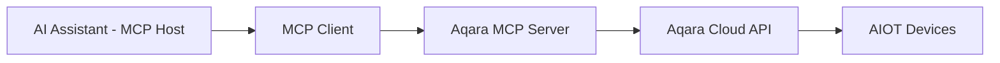

<div align="center" style="display: flex; align-items: center; justify-content: center; ">

  
  <h1>Aqara MCP Server</h1>

</div>

<div align="center">

[English](/README.md) | 中文 | [繁體中文](/readme/README_CHT.md) | [Français](/readme/README_FR.md) | [한국어](/readme/README_KR.md) | [Español](/readme/README_ES.md) | [日本語](/readme/README_JP.md) | [Deutsch](/readme/README_DE.md) | [Italiano](/readme/README_IT.md)

[](https://github.com/aqara/aqara-mcp-server)
[](https://golang.org/dl/)
[](https://github.com/aqara/aqara-mcp-server/releases)
[](https://opensource.org/licenses/MIT)
[](https://modelcontextprotocol.io/)

</div>

**Aqara MCP Server** 是一个基于 [模型上下文协议 (MCP)](https://modelcontextprotocol.io/introduction) 构建的智能家居自动化控制服务。该平台实现了 AI 助手（例如 Claude、Cursor 等）与 Aqara 智能家居生态系统之间的无缝集成

## 目录

- [目录](#目录)
- [特性](#特性)
- [工作原理](#工作原理)
- [快速开始](#快速开始)
  - [先决条件](#先决条件)
  - [第一步：账户认证](#第一步账户认证)
  - [第二步：如何使用](#第二步如何使用)
    - [选项 A：Remote MCP Server（推荐）](#选项-aremote-mcp-server推荐)
    - [选项 B：Local MCP Server](#选项-blocal-mcp-server)
  - [第三步：验证](#第三步验证)
- [API 参考](#api-参考)
  - [核心工具概述](#核心工具概述)
  - [设备控制 API](#设备控制-api)
    - [`device_control`](#device_control)
  - [设备查询 API](#设备查询-api)
    - [`device_query`](#device_query)
    - [`device_status_query`](#device_status_query)
    - [`device_log_query`](#device_log_query)
  - [场景管理 API](#场景管理-api)
    - [`get_scenes`](#get_scenes)
    - [`run_scenes`](#run_scenes)
  - [家庭管理 API](#家庭管理-api)
    - [`get_homes`](#get_homes)
    - [`switch_home`](#switch_home)
  - [自动化配置 API](#自动化配置-api)
    - [`automation_config`](#automation_config)
- [项目结构](#项目结构)
  - [目录结构](#目录结构)
  - [核心文件说明](#核心文件说明)
- [开发与贡献](#开发与贡献)
  - [开发环境设置](#开发环境设置)
  - [代码质量标准](#代码质量标准)
  - [贡献指南](#贡献指南)
- [许可证](#许可证)

## 特性

- ✨ **全面的设备控制**：支持对 Aqara 智能设备的开关、亮度、色温、模式等多种属性进行精细控制
- 🔍 **灵活的设备查询**：能够按房间、设备类型查询设备列表及其详细状态
- 🎬 **智能场景管理**：支持查询和执行用户预设的智能家居场景
- 📈 **设备历史记录**：查询设备在指定时间范围内的历史状态变更记录
- ⏰ **自动化配置**：支持配置定时或延时设备控制任务
- 🏠 **多家庭支持**：支持查询和切换用户账户下的不同家庭
- 🔌 **MCP 协议兼容**：完全遵循 MCP 协议规范，易于与各类 AI 助手集成
- 🔐 **安全认证机制**：采用基于登录授权+签名的安全认证，保护用户数据和设备安全
- 🌐 **跨平台运行**：基于 Go 语言开发，可编译为多平台可执行文件
- 🔧 **易于扩展**：模块化设计，可以方便地添加新的工具和功能

## 工作原理

Aqara MCP Server 作为 AI 助手与 Aqara 智能家居平台之间的桥梁：



1. **AI 助手**：用户通过 AI 助手发出指令（例如，"打开客厅的灯"）
2. **MCP 客户端**：将用户指令解析，并根据 MCP 协议调用 Aqara MCP Server 提供的相应工具（例如 `device_control`）
3. **Aqara MCP Server (本项目)**：接收来自客户端的请求，使用配置好的 Aqara 凭据，与 Aqara 云端 API 进行通信，执行实际的设备操作或数据查询
4. **响应流程**：Aqara 云端 API 返回结果，经由 Aqara MCP Server 传递回 MCP 客户端，最终呈现给用户

---

## 快速开始

### 先决条件

- **Aqara 账户** 及已注册的智能设备
- **支持 MCP 的客户端** (如 Claude for Desktop、Cursor 等)
- **Go 1.24+** (仅本地部署需要，用于源码构建)

### 第一步：账户认证

无论选择哪种部署模式，都需要先获取 Aqara 认证信息：

1. **访问登录页面**:
   🔗 [https://cdn.aqara.com/app/mcpserver/login.html](https://cdn.aqara.com/app/mcpserver/login.html)

2. **完成登录流程**:
   - 使用您的 Aqara 凭据登录
   - 获取 `api_key` 和 `base_url`

3. **安全存储凭据**:
   > ⚠️ 请妥善保管 `api_key` 信息，不要泄露给他人。

  

### 第二步：如何使用

根据您的需求选择合适的部署方式：

#### 选项 A：Remote MCP Server（推荐）

**适用于**: 希望快速上手，无需本地环境配置的用户。

**优势**：

- ✅ **即开即用**：无需下载或编译，直接配置即可使用
- ✅ **自动更新**：服务器端自动维护和更新
- ✅ **高可用性**：专业运维保障服务稳定性
- ✅ **多平台兼容**：无操作系统限制

**配置 MCP 客户端**：

1. **打开设置**:
   - 启动 Curosr

   

2. **添加服务器配置**:

    ```json
    {
      "mcpServers": {
        "aqara": {
          "type": "http",
          "url": "https://[mcp-server-domain]/echo/mcp",  // base_url
          "headers": {
            "Authorization": "Bearer [YOUR_API_KEY_HERE]"  // api_key
          }
        }
      }
    }
    ```

3. **重启应用程序**:
   - 重启 Cursor 使配置生效

#### 选项 B：Local MCP Server

**适用于**: 需要数据主权、自定义配置或离线使用的用户。

**优势**：

- ✅ **数据隐私**：所有数据处理在本地进行
- ✅ **完全控制**：可自定义配置和扩展功能
- ✅ **离线可用**：网络中断不影响基本功能
- ✅ **无限制**：不受云端服务限制

**安装步骤**：

1. **下载程序** (二选一)：

   **推荐：下载预编译版本**

   访问 [GitHub Releases](https://github.com/aqara/aqara-mcp-server/releases) 下载适用于您操作系统的最新版本。

   **或者：从源码构建**

   ```bash
   git clone https://github.com/aqara/aqara-mcp-server.git
   cd aqara-mcp-server
   go mod tidy
   go build -ldflags="-s -w" -o aqara-mcp-server
   ```

2. **设置环境变量**：

   ```bash
   export aqara_api_key="your_api_key_here"
   export aqara_base_url="your_base_url_here"
   ```

**配置 MCP 客户端(以 **Claude for Desktop** 为例)**：

1. **打开设置**:
   - 启动 Claude for Desktop
   - 导航到：设置 → 开发者

   

2. **编辑配置文件**:
   - 点击"编辑配置"

   

3. **添加服务器配置(claude_desktop_config.json)**:

  ```json
   {
     "mcpServers": {
       "aqara": {
         "command": "/path/to/aqara-mcp-server",
         "args": ["run", "stdio"],
         "env": {
           "aqara_api_key": "your_api_key_here",
           "aqara_base_url": "your_base_url_here"
         }
       }
     }
   }
   ```

1. **重启应用程序**:
   - 重启 Claude for Desktop 使配置生效

### 第三步：验证

使用以下测试命令验证配置是否成功：

```
用户: "显示我家里的所有设备"
助手: [通过 MCP 查询设备列表]

用户: "打开客厅的灯"
助手: [通过 MCP 执行设备控制]

用户: "运行晚间场景"
助手: [通过 MCP 执行场景]
```

如果看到类似 "🔧 已连接到 Aqara MCP Server" 的消息，说明配置成功！

---

## API 参考

### 核心工具概述

| 工具类别 | 工具 | 描述 |
|----------|------|------|
| **设备控制** | `device_control` | 直接设备操作 |
| **设备查询** | `device_query`, `device_status_query`, `device_log_query` | 全面的设备信息 |
| **场景管理** | `get_scenes`, `run_scenes` | 自动化场景控制 |
| **家庭管理** | `get_homes`, `switch_home` | 多家庭环境支持 |
| **自动化** | `automation_config` | 定时任务配置 |

### 设备控制 API

#### `device_control`

控制智能家居设备的状态或属性（例如开关、温度、亮度、颜色、色温等）。

**参数：**

- `endpoint_ids` _(Array\<Integer\>, 必需)_：需要控制的设备 ID 列表
- `control_params` _(Object, 必需)_：控制参数对象，包含具体操作：
  - `action` _(String, 必需)_：要执行的操作（如 `"on"`, `"off"`, `"set"`, `"up"`, `"down"`, `"cooler"`, `"warmer"`）
  - `attribute` _(String, 必需)_：要控制的设备属性（如 `"on_off"`, `"brightness"`, `"color_temperature"`, `"ac_mode"`）
  - `value` _(String | Number, 可选)_：目标值（当 action 为 "set" 时必需）
  - `unit` _(String, 可选)_：值的单位（如 `"%"`, `"K"`, `"℃"`）

**返回：** 设备控制的操作结果消息

### 设备查询 API

#### `device_query`

根据指定的位置（房间）和设备类型检索全面的设备清单，支持过滤功能（不包含实时状态信息）。

**参数：**

- `positions` _(Array\<String\>, 可选)_：房间名称列表。空数组表示查询所有房间
- `device_types` _(Array\<String\>, 可选)_：设备类型列表（如 `"Light"`, `"WindowCovering"`, `"AirConditioner"`, `"Button"`）。空数组表示查询所有类型

**返回：** Markdown 格式的设备列表，包含设备名称和 ID

#### `device_status_query`

获取设备的当前状态信息（用于查询颜色、亮度、开关等实时状态信息）。

**参数：**

- `positions` _(Array\<String\>, 可选)_：房间名称列表。空数组表示查询所有房间
- `device_types` _(Array\<String\>, 可选)_：设备类型列表。可选值同 `device_query`。空数组表示查询所有类型

**返回：** Markdown 格式的设备状态信息

#### `device_log_query`

查询设备的历史日志信息。

**参数：**

- `endpoint_ids` _(Array\<Integer\>, 必需)_：需要查询历史记录的设备 ID 列表
- `start_datetime` _(String, 可选)_：查询起始时间，格式为 `YYYY-MM-DD HH:MM:SS`（例如：`"2023-05-16 12:00:00"`）
- `end_datetime` _(String, 可选)_：查询结束时间，格式为 `YYYY-MM-DD HH:MM:SS`
- `attributes` _(Array\<String\>, 可选)_：要查询的设备属性名称列表（如 `["on_off", "brightness"]`）。未提供时查询所有已记录属性

**返回：** Markdown 格式的设备历史状态信息

### 场景管理 API

#### `get_scenes`

查询用户家庭下所有场景，或指定房间内的场景。

**参数：**

- `positions` _(Array\<String\>, 可选)_：房间名称列表。空数组表示查询整个家庭的场景

**返回：** Markdown 格式的场景信息

#### `run_scenes`

根据场景 ID 执行指定的场景。

**参数：**

- `scenes` _(Array\<Integer\>, 必需)_：需要执行的场景 ID 列表

**返回：** 场景执行的结果消息

### 家庭管理 API

#### `get_homes`

获取用户账户下的所有家庭列表。

**参数：** 无

**返回：** 以逗号分隔的家庭名称列表。如果无数据则返回空字符串或相应的提示信息

#### `switch_home`

切换用户当前操作的家庭。切换后，后续的设备查询、控制等操作将针对新切换的家庭。

**参数：**

- `home_name` _(String, 必需)_：目标家庭的名称

**返回：** 切换操作的结果消息

### 自动化配置 API

#### `automation_config`

自动化配置（目前仅支持定时或延时设备控制任务）。

**参数：**

- `scheduled_time` _(String, 必需)_：定时执行的时间点，使用标准 Crontab 格式 `"分 时 日 月 周"`。例如：`"30 14 * * *"`（每天14:30执行）、`"0 9 * * 1"`（每周一9:00执行）
- `endpoint_ids` _(Array\<Integer\>, 必需)_：需要定时控制的设备 ID 列表
- `control_params` _(Object, 必需)_：设备控制参数，使用与 `device_control` 工具相同的格式（包含 action、attribute、value 等）
- `task_name` _(String, 必需)_：此自动化任务的名称或描述（用于识别和管理）
- `execution_once` _(Boolean, 可选)_：是否只执行一次
  - `true`：仅在指定时间执行一次任务（默认值）
  - `false`：周期性重复执行任务（如每天、每周等）

**返回：** 自动化配置结果消息

## 项目结构

### 目录结构

```text
.
├── cmd.go                # Cobra CLI 命令定义和程序入口点（包含 main 函数）
├── server.go             # MCP 服务器核心逻辑，工具定义和请求处理
├── smh.go                # Aqara 智能家居平台 API 接口封装
├── middleware.go         # 中间件：用户认证、超时控制、异常恢复
├── config.go             # 全局配置管理和环境变量处理
├── go.mod                # Go 模块依赖管理文件
├── go.sum                # Go 模块依赖校验和文件
├── readme/               # README 文档和图片资源
│   ├── img/              # 图片资源目录
│   └── *.md              # 多语言 README 文件
├── LICENSE               # MIT 开源许可证
└── README.md             # 项目主文档
```

### 核心文件说明

- **`cmd.go`**：基于 Cobra 框架的 CLI 实现，定义 `run stdio` 和 `run http` 启动模式及主入口函数
- **`server.go`**：MCP 服务器核心实现，负责工具注册、请求处理和协议支持
- **`smh.go`**：Aqara 智能家居平台 API 封装层，提供设备控制、认证和多家庭支持
- **`middleware.go`**：请求处理中间件，提供认证验证、超时控制和异常处理
- **`config.go`**：全局配置管理，负责环境变量处理和 API 配置

## 开发与贡献

### 开发环境设置

```bash
# 克隆仓库
git clone https://github.com/aqara/aqara-mcp-server.git
cd aqara-mcp-server

# 安装依赖
go mod tidy

# 运行测试
go test ./...

# 优化构建
go build -ldflags="-s -w" -o aqara-mcp-server
```

### 代码质量标准

- **Go 语言**: 遵循官方 Go 编码标准
- **文档**: 全面的 API 文档
- **测试**: 最低 80% 代码覆盖率
- **安全**: 定期安全审计

### 贡献指南

1. **Fork 仓库**
2. **创建功能分支**: `git checkout -b feature/amazing-feature`
3. **提交更改**: `git commit -m '添加令人惊叹的功能'`
4. **推送到分支**: `git push origin feature/amazing-feature`
5. **打开 Pull Request**

---

## 许可证

本项目基于 [MIT 许可证](/LICENSE) 授权 - 详情请参阅 [LICENSE](LICENSE) 文件。

---

**版权所有 © 2025 Aqara-Copilot。保留所有权利。**
