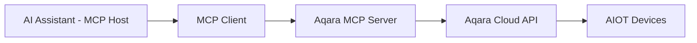

<div align="center" style="display: flex; align-items: center; justify-content: center; ">

  
  <h1>Aqara MCP Server</h1>

</div>

<div align="center">

[English](/README.md) | [中文](/readme/README_CN.md) | [繁體中文](/readme/README_CHT.md) | [Français](/readme/README_FR.md) | [한국어](/readme/README_KR.md) | [Español](/readme/README_ES.md) | [日本語](/readme/README_JP.md) | Deutsch | [Italiano](/readme/README_IT.md)

[](https://github.com/aqara/aqara-mcp-server)
[](https://golang.org/dl/)
[](https://github.com/aqara/aqara-mcp-server/releases)
[](https://opensource.org/licenses/MIT)
[](https://modelcontextprotocol.io/)

</div>

**Aqara MCP Server** ist ein Smart-Home-Automatisierungs- und Steuerungsdienst, der auf dem [Model Context Protocol (MCP)](https://modelcontextprotocol.io/introduction) basiert. Diese Plattform ermöglicht eine nahtlose Integration zwischen KI-Assistenten (wie Claude, Cursor usw.) und dem Aqara Smart-Home-Ökosystem.

## Inhaltsverzeichnis

- [Inhaltsverzeichnis](#inhaltsverzeichnis)
- [Funktionen](#funktionen)
- [Wie es funktioniert](#wie-es-funktioniert)
- [Schnellstart](#schnellstart)
  - [Voraussetzungen](#voraussetzungen)
  - [Schritt 1: Kontenauthentifizierung](#schritt-1-kontenauthentifizierung)
  - [Schritt 2: Wie man es benutzt](#schritt-2-wie-man-es-benutzt)
    - [Option A: Remote MCP Server (Empfohlen)](#option-a-remote-mcp-server-empfohlen)
    - [Option B: Lokaler MCP Server](#option-b-lokaler-mcp-server)
  - [Schritt 3: Überprüfung](#schritt-3-überprüfung)
- [API-Referenz](#api-referenz)
  - [Übersicht der Kernwerkzeuge](#übersicht-der-kernwerkzeuge)
  - [Gerätesteuerungs-API](#gerätesteuerungs-api)
    - [`device_control`](#device_control)
  - [Geräteabfrage-API](#geräteabfrage-api)
    - [`device_query`](#device_query)
    - [`device_status_query`](#device_status_query)
    - [`device_log_query`](#device_log_query)
  - [Szenenverwaltungs-API](#szenenverwaltungs-api)
    - [`get_scenes`](#get_scenes)
    - [`run_scenes`](#run_scenes)
  - [Heimverwaltungs-API](#heimverwaltungs-api)
    - [`get_homes`](#get_homes)
    - [`switch_home`](#switch_home)
  - [Automatisierungskonfigurations-API](#automatisierungskonfigurations-api)
    - [`automation_config`](#automation_config)
- [Projektstruktur](#projektstruktur)
  - [Verzeichnisstruktur](#verzeichnisstruktur)
  - [Beschreibung der Kerndateien](#beschreibung-der-kerndateien)
- [Entwicklung & Beitrag](#entwicklung--beitrag)
  - [Einrichtung der Entwicklungsumgebung](#einrichtung-der-entwicklungsumgebung)
  - [Code-Qualitätsstandards](#code-qualitätsstandards)
  - [Beitragsrichtlinien](#beitragsrichtlinien)
- [Lizenz](#lizenz)

## Funktionen

- ✨ **Umfassende Gerätesteuerung**: Feingranulare Steuerung verschiedener Attribute von Aqara-Smart-Geräten, einschließlich Ein/Aus, Helligkeit, Farbtemperatur und Modi.
- 🔍 **Flexible Geräteabfrage**: Möglichkeit, Gerätelisten und deren detaillierte Status nach Raum oder Gerätetyp abzufragen.
- 🎬 **Intelligente Szenenverwaltung**: Unterstützt die Abfrage und Ausführung von benutzerdefinierten Smart-Home-Szenen.
- 📈 **Geräteverlauf**: Abfrage der historischen Statusänderungsaufzeichnungen von Geräten innerhalb eines bestimmten Zeitraums.
- ⏰ **Automatisierungskonfiguration**: Unterstützt die Konfiguration von geplanten oder verzögerten Gerätesteuerungsaufgaben.
- 🏠 **Unterstützung für mehrere Heime**: Unterstützt die Abfrage und den Wechsel zwischen verschiedenen Heimen unter dem Konto eines Benutzers.
- 🔌 **MCP-Protokollkompatibilität**: Vollständig konform mit der MCP-Spezifikation, was eine einfache Integration mit verschiedenen KI-Assistenten ermöglicht.
- 🔐 **Sichere Authentifizierung**: Verwendet einen auf Anmeldeautorisierung + Signatur basierenden Sicherheitsmechanismus zum Schutz von Benutzerdaten und Gerätesicherheit.
- 🌐 **Plattformübergreifend**: In Go entwickelt, kann in ausführbare Dateien für mehrere Plattformen kompiliert werden.
- 🔧 **Leicht erweiterbar**: Modulares Design ermöglicht das bequeme Hinzufügen neuer Werkzeuge und Funktionen.

## Wie es funktioniert

Der Aqara MCP Server fungiert als Brücke zwischen KI-Assistenten und der Aqara Smart-Home-Plattform:



1.  **KI-Assistent**: Der Benutzer gibt einen Befehl über einen KI-Assistenten ein (z. B. "Schalte das Licht im Wohnzimmer ein").
2.  **MCP-Client**: Analysiert den Befehl des Benutzers und ruft das entsprechende Werkzeug auf, das vom Aqara MCP Server bereitgestellt wird (z. B. `device_control`), gemäß dem MCP-Protokoll.
3.  **Aqara MCP Server (Dieses Projekt)**: Empfängt die Anfrage vom Client, kommuniziert mit der Aqara Cloud API unter Verwendung der konfigurierten Aqara-Anmeldeinformationen und führt die eigentliche Geräteoperation oder Datenabfrage aus.
4.  **Antwortfluss**: Die Aqara Cloud API gibt das Ergebnis zurück, das über den Aqara MCP Server an den MCP-Client weitergeleitet und schließlich dem Benutzer angezeigt wird.

---

## Schnellstart

### Voraussetzungen

-   **Aqara-Konto** mit registrierten Smart-Geräten.
-   **MCP-fähiger Client** (z. B. Claude for Desktop, Cursor).
-   **Go 1.24+** (nur für die lokale Bereitstellung aus dem Quellcode erforderlich).

### Schritt 1: Kontenauthentifizierung

Unabhängig vom Bereitstellungsmodus müssen Sie zuerst die Aqara-Authentifizierungsdaten abrufen:

1.  **Besuchen Sie die Anmeldeseite**:
    🔗 [https://cdn.aqara.com/app/mcpserver/login.html](https://cdn.aqara.com/app/mcpserver/login.html)

2.  **Schließen Sie den Anmeldevorgang ab**:
    -   Melden Sie sich mit Ihren Aqara-Anmeldeinformationen an.
    -   Holen Sie sich den `api_key` und die `base_url`.

3.  **Anmeldeinformationen sicher speichern**:
    > ⚠️ Bitte bewahren Sie Ihre `api_key`-Informationen sicher auf und geben Sie sie nicht an andere weiter.

    

### Schritt 2: Wie man es benutzt

Wählen Sie die Bereitstellungsmethode, die Ihren Anforderungen entspricht:

#### Option A: Remote MCP Server (Empfohlen)

**Geeignet für**: Benutzer, die schnell loslegen möchten, ohne eine lokale Umgebung einrichten zu müssen.

**Vorteile**:

-   ✅ **Sofort einsatzbereit**: Kein Herunterladen oder Kompilieren erforderlich; direkt konfigurieren und verwenden.
-   ✅ **Automatische Updates**: Der Server wird automatisch gewartet und aktualisiert.
-   ✅ **Hohe Verfügbarkeit**: Professioneller Betrieb gewährleistet die Stabilität des Dienstes.
-   ✅ **Plattformübergreifende Kompatibilität**: Keine Betriebssystembeschränkungen.

**MCP-Client konfigurieren**:

1.  **Einstellungen öffnen**:
    -   Starten Sie Cursor.

    

2.  **Serverkonfiguration hinzufügen**:

    ```json
    {
      "mcpServers": {
        "aqara": {
          "type": "http",
          "url": "https://[mcp-server-domain]/echo/mcp",  // base_url
          "headers": {
            "Authorization": "Bearer [YOUR_API_KEY_HERE]"  // api_key
          }
        }
      }
    }
    ```

3.  **Anwendung neu starten**:
    -   Starten Sie Cursor neu, damit die Änderungen wirksam werden.

#### Option B: Lokaler MCP Server

**Geeignet für**: Benutzer, die Datensouveränität, benutzerdefinierte Konfigurationen oder Offline-Nutzung benötigen.

**Vorteile**:

-   ✅ **Datenschutz**: Alle Daten werden lokal verarbeitet.
-   ✅ **Volle Kontrolle**: Anpassbare Konfiguration und erweiterbare Funktionen.
-   ✅ **Offline-Verfügbarkeit**: Grundfunktionen werden durch Netzwerkunterbrechungen nicht beeinträchtigt.
-   ✅ **Keine Einschränkungen**: Nicht durch Cloud-Dienste eingeschränkt.

**Installationsschritte**:

1.  **Programm herunterladen** (wählen Sie eine Option):

    **Empfohlen: Vorkompilierte Version herunterladen**

    Besuchen Sie [GitHub Releases](https://github.com/aqara/aqara-mcp-server/releases), um die neueste Version für Ihr Betriebssystem herunterzuladen.

    **Alternativ: Aus dem Quellcode erstellen**

    ```bash
    git clone https://github.com/aqara/aqara-mcp-server.git
    cd aqara-mcp-server
    go mod tidy
    go build -ldflags="-s -w" -o aqara-mcp-server
    ```

2.  **Umgebungsvariablen festlegen**:

    ```bash
    export aqara_api_key="your_api_key_here"
    export aqara_base_url="your_base_url_here"
    ```

**MCP-Client konfigurieren (z. B. **Claude for Desktop**)**:

1.  **Einstellungen öffnen**:
    -   Starten Sie Claude for Desktop.
    -   Navigieren Sie zu: Einstellungen → Entwickler.

    

2.  **Konfigurationsdatei bearbeiten**:
    -   Klicken Sie auf "Konfiguration bearbeiten".

    

3.  **Serverkonfiguration hinzufügen (claude_desktop_config.json)**:

    ```json
    {
      "mcpServers": {
        "aqara": {
          "command": "/path/to/aqara-mcp-server",
          "args": ["run", "stdio"],
          "env": {
            "aqara_api_key": "your_api_key_here",
            "aqara_base_url": "your_base_url_here"
          }
        }
      }
    }
    ```

4.  **Anwendung neu starten**:
    -   Starten Sie Claude for Desktop neu, damit die Änderungen wirksam werden.

### Schritt 3: Überprüfung

Verwenden Sie die folgenden Testbefehle, um zu überprüfen, ob die Konfiguration erfolgreich ist:

```
Benutzer: "Zeige alle Geräte in meinem Haus"
Assistent: [Fragt die Geräteliste über MCP ab]

Benutzer: "Schalte das Licht im Wohnzimmer ein"
Assistent: [Führt die Gerätesteuerung über MCP aus]

Benutzer: "Führe die Abendszene aus"
Assistent: [Führt die Szene über MCP aus]
```

Wenn Sie eine Meldung wie "🔧 Verbunden mit Aqara MCP Server" sehen, ist die Konfiguration erfolgreich!

---

## API-Referenz

### Übersicht der Kernwerkzeuge

| Werkzeugkategorie | Werkzeug | Beschreibung |
|---|---|---|
| **Gerätesteuerung** | `device_control` | Direkte Geräteoperationen |
| **Geräteabfrage** | `device_query`, `device_status_query`, `device_log_query` | Umfassende Geräteinformationen |
| **Szenenverwaltung** | `get_scenes`, `run_scenes` | Automatisierte Szenensteuerung |
| **Heimverwaltung** | `get_homes`, `switch_home` | Unterstützung für Umgebungen mit mehreren Heimen |
| **Automatisierung** | `automation_config` | Konfiguration geplanter Aufgaben |

### Gerätesteuerungs-API

#### `device_control`

Steuert den Zustand oder die Attribute von Smart-Home-Geräten (z. B. Ein/Aus, Temperatur, Helligkeit, Farbe, Farbtemperatur).

**Parameter:**

-   `endpoint_ids` _(Array\<Integer\>, erforderlich)_: Eine Liste der zu steuernden Geräte-IDs.
-   `control_params` _(Object, erforderlich)_: Ein Steuerparameterobjekt, das spezifische Aktionen enthält:
    -   `action` _(String, erforderlich)_: Die auszuführende Aktion (z. B. `"on"`, `"off"`, `"set"`, `"up"`, `"down"`, `"cooler"`, `"warmer"`).
    -   `attribute` _(String, erforderlich)_: Das zu steuernde Geräteattribut (z. B. `"on_off"`, `"brightness"`, `"color_temperature"`, `"ac_mode"`).
    -   `value` _(String | Number, optional)_: Der Zielwert (erforderlich, wenn `action` "set" ist).
    -   `unit` _(String, optional)_: Die Einheit des Wertes (z. B. `"%"`, `"K"`, `"℃"`).

**Gibt zurück:** Eine Nachricht, die das Ergebnis der Gerätesteuerungsoperation anzeigt.

### Geräteabfrage-API

#### `device_query`

Ruft eine umfassende Liste von Geräten basierend auf angegebenen Standorten (Räumen) und Gerätetypen ab, mit Unterstützung für Filterung (enthält keine Echtzeit-Statusinformationen).

**Parameter:**

-   `positions` _(Array\<String\>, optional)_: Eine Liste von Raumnamen. Ein leeres Array fragt alle Räume ab.
-   `device_types` _(Array\<String\>, optional)_: Eine Liste von Gerätetypen (z. B. `"Light"`, `"WindowCovering"`, `"AirConditioner"`, `"Button"`). Ein leeres Array fragt alle Typen ab.

**Gibt zurück:** Eine Markdown-formatierte Liste von Geräten, einschließlich Gerätenamen und IDs.

#### `device_status_query`

Ruft die aktuellen Statusinformationen von Geräten ab (wird verwendet, um Echtzeitstatus wie Farbe, Helligkeit, Ein/Aus abzufragen).

**Parameter:**

-   `positions` _(Array\<String\>, optional)_: Eine Liste von Raumnamen. Ein leeres Array fragt alle Räume ab.
-   `device_types` _(Array\<String\>, optional)_: Eine Liste von Gerätetypen. Gleiche Optionen wie `device_query`. Ein leeres Array fragt alle Typen ab.

**Gibt zurück:** Markdown-formatierte Gerätestatusinformationen.

#### `device_log_query`

Fragt die historischen Protokollinformationen von Geräten ab.

**Parameter:**

-   `endpoint_ids` _(Array\<Integer\>, erforderlich)_: Eine Liste von Geräte-IDs, für die der Verlauf abgefragt werden soll.
-   `start_datetime` _(String, optional)_: Die Startzeit der Abfrage im Format `YYYY-MM-DD HH:MM:SS` (z. B. `"2023-05-16 12:00:00"`).
-   `end_datetime` _(String, optional)_: Die Endzeit der Abfrage im Format `YYYY-MM-DD HH:MM:SS`.
-   `attributes` _(Array\<String\>, optional)_: Eine Liste von Geräteattributnamen, die abgefragt werden sollen (z. B. `["on_off", "brightness"]`). Wenn nicht angegeben, werden alle protokollierten Attribute abgefragt.

**Gibt zurück:** Markdown-formatierte historische Gerätestatusinformationen.

### Szenenverwaltungs-API

#### `get_scenes`

Fragt alle Szenen im Heim eines Benutzers oder Szenen in bestimmten Räumen ab.

**Parameter:**

-   `positions` _(Array\<String\>, optional)_: Eine Liste von Raumnamen. Ein leeres Array fragt Szenen für das gesamte Heim ab.

**Gibt zurück:** Markdown-formatierte Szeneninformationen.

#### `run_scenes`

Führt angegebene Szenen anhand ihrer Szenen-IDs aus.

**Parameter:**

-   `scenes` _(Array\<Integer\>, erforderlich)_: Eine Liste der auszuführenden Szenen-IDs.

**Gibt zurück:** Eine Nachricht, die das Ergebnis der Szenenausführung anzeigt.

### Heimverwaltungs-API

#### `get_homes`

Ruft eine Liste aller Heime unter dem Konto des Benutzers ab.

**Parameter:** Keine

**Gibt zurück:** Eine durch Kommas getrennte Liste von Heimnamen. Gibt eine leere Zeichenfolge oder eine entsprechende Nachricht zurück, wenn keine Daten verfügbar sind.

#### `switch_home`

Wechselt das aktuell aktive Heim des Benutzers. Nach dem Wechsel zielen nachfolgende Geräteabfragen, Steuerungen usw. auf das neu gewechselte Heim.

**Parameter:**

-   `home_name` _(String, erforderlich)_: Der Name des Zielheims.

**Gibt zurück:** Eine Nachricht, die das Ergebnis der Wechseloperation anzeigt.

### Automatisierungskonfigurations-API

#### `automation_config`

Konfiguriert die Automatisierung (unterstützt derzeit nur geplante oder verzögerte Gerätesteuerungsaufgaben).

**Parameter:**

-   `scheduled_time` _(String, erforderlich)_: Die geplante Ausführungszeit im Standard-Crontab-Format `"min stunde tag monat woche"`. Z. B. `"30 14 * * *"` (jeden Tag um 14:30 Uhr ausführen), `"0 9 * * 1"` (jeden Montag um 9:00 Uhr ausführen).
-   `endpoint_ids` _(Array\<Integer\>, erforderlich)_: Eine Liste von Geräte-IDs, die nach einem Zeitplan gesteuert werden sollen.
-   `control_params` _(Object, erforderlich)_: Gerätesteuerungsparameter im gleichen Format wie das `device_control`-Werkzeug (einschließlich action, attribute, value usw.).
-   `task_name` _(String, erforderlich)_: Der Name oder die Beschreibung dieser Automatisierungsaufgabe (zur Identifizierung und Verwaltung).
-   `execution_once` _(Boolean, optional)_: Ob nur einmal ausgeführt werden soll.
    -   `true`: Führt die Aufgabe nur einmal zur angegebenen Zeit aus (Standard).
    -   `false`: Führt die Aufgabe periodisch aus (z. B. täglich, wöchentlich).

**Gibt zurück:** Eine Nachricht, die das Ergebnis der Automatisierungskonfiguration anzeigt.

## Projektstruktur

### Verzeichnisstruktur

```text
.
├── cmd.go                # Cobra CLI-Befehlsdefinitionen und Programmeinstiegspunkt (enthält die main-Funktion)
├── server.go             # Kernlogik des MCP-Servers, Werkzeugdefinitionen und Anforderungsbehandlung
├── smh.go                # Wrapper für die API-Schnittstelle der Aqara Smart-Home-Plattform
├── middleware.go         # Middleware: Benutzerauthentifizierung, Zeitüberschreitungssteuerung, Panikwiederherstellung
├── config.go             # Globale Konfigurationsverwaltung und Verarbeitung von Umgebungsvariablen
├── go.mod                # Go-Modul-Abhängigkeitsverwaltungsdatei
├── go.sum                # Go-Modul-Abhängigkeitsprüfsummendatei
├── readme/               # README-Dokumente und Bildressourcen
│   ├── img/              # Bildressourcenverzeichnis
│   └── *.md              # Mehrsprachige README-Dateien
├── LICENSE               # MIT Open-Source-Lizenz
└── README.md             # Hauptprojektdokument
```

### Beschreibung der Kerndateien

-   **`cmd.go`**: CLI-Implementierung basierend auf dem Cobra-Framework, die die Startmodi `run stdio` und `run http` sowie die Haupteinstiegsfunktion definiert.
-   **`server.go`**: Kernimplementierung des MCP-Servers, verantwortlich für die Werkzeugregistrierung, Anforderungsbehandlung und Protokollunterstützung.
-   **`smh.go`**: Wrapper-Schicht für die API der Aqara Smart-Home-Plattform, die Gerätesteuerung, Authentifizierung und Unterstützung für mehrere Heime bietet.
-   **`middleware.go`**: Middleware zur Anforderungsbehandlung, die Authentifizierungsvalidierung, Zeitüberschreitungssteuerung und Ausnahmebehandlung bietet.
-   **`config.go`**: Globale Konfigurationsverwaltung, verantwortlich für die Verarbeitung von Umgebungsvariablen und die API-Konfiguration.

## Entwicklung & Beitrag

### Einrichtung der Entwicklungsumgebung

```bash
# Repository klonen
git clone https://github.com/aqara/aqara-mcp-server.git
cd aqara-mcp-server

# Abhängigkeiten installieren
go mod tidy

# Tests ausführen
go test ./...

# Optimierter Build
go build -ldflags="-s -w" -o aqara-mcp-server
```

### Code-Qualitätsstandards

-   **Go-Sprache**: Befolgt die offiziellen Go-Codierungsstandards.
-   **Dokumentation**: Umfassende API-Dokumentation.
-   **Tests**: Mindestens 80 % Codeabdeckung.
-   **Sicherheit**: Regelmäßige Sicherheitsüberprüfungen.

### Beitragsrichtlinien

1.  **Repository forken**
2.  **Feature-Branch erstellen**: `git checkout -b feature/amazing-feature`
3.  **Änderungen committen**: `git commit -m 'Füge eine erstaunliche Funktion hinzu'`
4.  **Zum Branch pushen**: `git push origin feature/amazing-feature`
5.  **Pull-Request öffnen**

---

## Lizenz

Dieses Projekt ist unter der [MIT-Lizenz](/LICENSE) lizenziert - siehe die [LICENSE](LICENSE)-Datei für Details.

---

**Copyright © 2025 Aqara-Copilot. Alle Rechte vorbehalten.**
