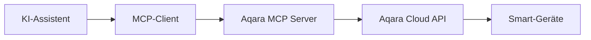

<div align="center" style="display: flex; align-items: center; justify-content: center; ">

  
  <h1>Aqara MCP Server</h1>

</div>

<div align="center">

[English](/readme/README.md) | [中文](/readme/README_CN.md) | [繁體中文](/readme/README_CHT.md) | [Français](/readme/README_FR.md) | [한국어](/readme/README_KR.md) | [Español](/readme/README_ES.md) | [日本語](/readme/README_JP.md) | Deutsch | [Italiano](/readme/README_IT.md)

[](https://github.com/aqara/aqara-mcp-server)
[](https://golang.org/dl/)
[](https://github.com/aqara/aqara-mcp-server/releases)
[](https://opensource.org/licenses/MIT)

</div>

Der Aqara MCP Server ist ein intelligenter Home-Control-Service, der auf dem [MCP (Model Context Protocol)](https://modelcontextprotocol.io/introduction) basiert. Er ermöglicht es jedem MCP-kompatiblen KI-Assistenten oder API (wie Claude, Cursor usw.), mit Ihren Aqara Smart-Home-Geräten zu interagieren und dabei Funktionen wie natürlichsprachliche Gerätesteuerung, Statusabfragen und Szenen-Ausführung zu realisieren.

## Inhaltsverzeichnis

- [Inhaltsverzeichnis](#inhaltsverzeichnis)
- [Features](#features)
- [Funktionsweise](#funktionsweise)
- [Schnellstart](#schnellstart)
  - [Voraussetzungen](#voraussetzungen)
  - [Installation](#installation)
    - [Option 1: Vorkompilierte Version herunterladen (Empfohlen)](#option-1-vorkompilierte-version-herunterladen-empfohlen)
    - [Option 2: Aus Quellcode erstellen](#option-2-aus-quellcode-erstellen)
  - [Aqara-Konto-Authentifizierung](#aqara-konto-authentifizierung)
  - [Client-Konfiguration](#client-konfiguration)
    - [Claude for Desktop Konfigurationsbeispiel](#claude-for-desktop-konfigurationsbeispiel)
    - [Konfigurationsparameter](#konfigurationsparameter)
    - [Andere MCP-Clients](#andere-mcp-clients)
  - [Service starten](#service-starten)
    - [Standard-Modus (Empfohlen)](#standard-modus-empfohlen)
    - [HTTP-Modus (`Demnächst verfügbar`)](#http-modus-demnächst-verfügbar)
- [API-Tools Übersicht](#api-tools-übersicht)
  - [Gerätesteuerung](#gerätesteuerung)
    - [device\_control](#device_control)
  - [Geräteabfragen](#geräteabfragen)
    - [device\_query](#device_query)
    - [device\_status\_query](#device_status_query)
    - [device\_log\_query](#device_log_query)
  - [Szenen-Management](#szenen-management)
    - [get\_scenes](#get_scenes)
    - [run\_scenes](#run_scenes)
  - [Home-Management](#home-management)
    - [get\_homes](#get_homes)
    - [switch\_home](#switch_home)
  - [Automatisierungskonfiguration](#automatisierungskonfiguration)
    - [automation\_config](#automation_config)
- [Projektstruktur](#projektstruktur)
  - [Verzeichnisstruktur](#verzeichnisstruktur)
  - [Kernkomponenten-Beschreibung](#kernkomponenten-beschreibung)
- [Entwicklungsleitfaden](#entwicklungsleitfaden)
- [Lizenz](#lizenz)

## Features

- ✨ **Umfassende Gerätesteuerung**: Unterstützt präzise Kontrolle verschiedener Eigenschaften von Aqara Smart-Geräten wie Ein/Aus, Helligkeit, Farbtemperatur, Modi und mehr
- 🔍 **Flexible Geräteabfragen**: Ermöglicht die Abfrage von Gerätelisten und deren detaillierten Status nach Raum und Gerätetyp
- 🎬 **Intelligentes Szenen-Management**: Unterstützt das Abfragen und Ausführen vordefinierter Smart-Home-Szenen
- 📈 **Geräteverlauf**: Abfrage historischer Statusänderungen von Geräten in bestimmten Zeiträumen
- ⏰ **Automatisierungskonfiguration**: Unterstützt die Konfiguration zeitgesteuerter oder verzögerter Gerätesteuerungsaufgaben
- 🏠 **Multi-Home-Unterstützung**: Unterstützt das Abfragen und Wechseln zwischen verschiedenen Haushalten unter einem Benutzerkonto
- 🔌 **MCP-Protokoll-Kompatibilität**: Vollständig konform mit MCP-Protokoll-Spezifikationen, einfache Integration mit verschiedenen KI-Assistenten
- 🔐 **Sichere Authentifizierung**: Nutzt Login-Autorisierung mit signaturbasierter Sicherheitsauthentifizierung zum Schutz von Benutzerdaten und Geräten
- 🌐 **Plattformübergreifend**: Entwickelt in Go, kompilierbar für mehrere Plattformen
- 🔧 **Einfach erweiterbar**: Modulares Design ermöglicht einfaches Hinzufügen neuer Tools und Funktionen

## Funktionsweise

Der Aqara MCP Server fungiert als Brücke zwischen KI-Assistenten und der Aqara Smart-Home-Plattform:



1. **KI-Assistent**: Benutzer geben Befehle über den KI-Assistenten (z.B. "Schalte das Wohnzimmerlicht ein")
2. **MCP-Client**: Analysiert Benutzerbefehle und ruft entsprechende Tools des Aqara MCP Servers gemäß MCP-Protokoll auf (z.B. `device_control`)
3. **Aqara MCP Server (dieses Projekt)**: Empfängt Client-Anfragen, kommuniziert mit der Aqara Cloud API unter Verwendung konfigurierter Anmeldedaten und führt tatsächliche Geräteoperationen oder Datenabfragen durch
4. **Antwort-Workflow**: Aqara Cloud API gibt Ergebnisse zurück, die über den Aqara MCP Server an den MCP-Client weitergeleitet und schließlich dem Benutzer präsentiert werden

## Schnellstart

### Voraussetzungen

- **Go** (Version 1.24 oder höher) - nur beim Erstellen aus dem Quellcode erforderlich
- **Git** (zum Erstellen aus dem Quellcode) - optional
- **Aqara-Konto** mit verbundenen Smart-Geräten
- **MCP-protokoll-kompatibler Client** (wie Claude for Desktop, Cursor usw.)

### Installation

Sie können wählen zwischen dem Herunterladen vorkompilierter ausführbarer Dateien oder dem Erstellen aus dem Quellcode.

#### Option 1: Vorkompilierte Version herunterladen (Empfohlen)

Besuchen Sie die GitHub Releases-Seite und laden Sie die neueste ausführbare Datei für Ihr Betriebssystem herunter:

**📥 [Zur Releases-Seite für Download](https://github.com/aqara/aqara-mcp-server/releases)**

Nach dem Herunterladen und Entpacken der entsprechenden Plattform-Archive können Sie diese direkt verwenden.

#### Option 2: Aus Quellcode erstellen

```bash
# Repository klonen
git clone https://github.com/aqara/aqara-mcp-server.git
cd aqara-mcp-server

# Abhängigkeiten herunterladen
go mod tidy

# Ausführbare Datei erstellen
go build -o aqara-mcp-server
```

Nach dem Erstellen wird eine ausführbare Datei `aqara-mcp-server` im aktuellen Verzeichnis generiert.

### Aqara-Konto-Authentifizierung

Damit der MCP Server auf Ihr Aqara-Konto zugreifen und Geräte steuern kann, müssen Sie zunächst eine Login-Autorisierung durchführen.

Bitte besuchen Sie die folgende Adresse, um die Login-Autorisierung abzuschließen:
**🔗 [https://cdn.aqara.com/app/mcpserver/login.html](https://cdn.aqara.com/app/mcpserver/login.html)**

Nach erfolgreichem Login erhalten Sie die notwendigen Authentifizierungsinformationen (wie `token`, `region`), die in den nachfolgenden Konfigurationsschritten verwendet werden.

> ⚠️ **Sicherheitshinweis**: Bewahren Sie Ihre `token`-Informationen sicher auf und geben Sie diese nicht an Dritte weiter.

### Client-Konfiguration

Die Konfigurationsmethoden variieren leicht zwischen verschiedenen MCP-Clients. Hier ist ein Beispiel für die Konfiguration von Claude for Desktop zur Verwendung dieses MCP Servers:

#### Claude for Desktop Konfigurationsbeispiel

1. **Öffnen Sie die Einstellungen (Settings) von Claude for Desktop**

    

2. **Wechseln Sie zum Developer-Tab und klicken Sie auf Edit Config, um die Konfigurationsdatei mit einem Texteditor zu öffnen**

    

3. **Fügen Sie die Konfigurationsinformationen von der "Login-Erfolg-Seite" zur Client-Konfigurationsdatei `claude_desktop_config.json` hinzu**

    ```json
    {
      "mcpServers": {
        "aqara": {
          "command": "/path/to/aqara-mcp-server",
          "args": ["run", "stdio"],
          "env": {
            "token": "your_token_here",
            "region": "your_region_here"
          }
        }
      }
    }
    ```

    

#### Konfigurationsparameter

- `command`: Vollständiger Pfad zur heruntergeladenen oder erstellten ausführbaren Datei `aqara-mcp-server`
- `args`: Verwenden Sie `["run", "stdio"]`, um den stdio-Übertragungsmodus zu starten
- `env`: Umgebungsvariablen-Konfiguration
  - `token`: Zugangs-Token von der Aqara-Login-Seite erhalten
  - `region`: Ihre Aqara-Konto-Region (Unterstützte Regionen: CN, US, EU, KR, SG, RU)

#### Andere MCP-Clients

Für andere MCP-protokoll-kompatible Clients (wie ChatGPT, Cursor usw.) ist die Konfiguration ähnlich:

- Stellen Sie sicher, dass der Client das MCP-Protokoll unterstützt
- Konfigurieren Sie den Pfad zur ausführbaren Datei und Startparameter
- Setzen Sie Umgebungsvariablen `token` und `region`
- Wählen Sie ein geeignetes Übertragungsprotokoll (empfohlen: `stdio`)

### Service starten

#### Standard-Modus (Empfohlen)

Starten Sie Claude for Desktop neu. Dann können Sie über natürliche Sprache Gerätesteuerung, Geräteabfragen, Szenen-Ausführung und andere Operationen durchführen.

Beispiel-Gespräche:

- "Schalte das Wohnzimmerlicht ein"
- "Stelle die Schlafzimmer-Klimaanlage auf Kühlmodus, 24 Grad"
- "Zeige alle Geräte in allen Räumen"
- "Führe die Gute-Nacht-Szene aus"


#### HTTP-Modus (`Demnächst verfügbar`)

## API-Tools Übersicht

MCP-Clients können diese Tools verwenden, um mit Aqara Smart-Home-Geräten zu interagieren.

### Gerätesteuerung

#### device_control

Steuert den Status oder die Eigenschaften von Smart-Home-Geräten (z.B. Ein/Aus, Temperatur, Helligkeit, Farbe, Farbtemperatur usw.).

**Parameter:**

- `endpoint_ids` _(Array\<Integer\>, erforderlich)_: Liste der zu steuernden Geräte-IDs
- `control_params` _(Object, erforderlich)_: Steuerungsparameter-Objekt mit spezifischen Operationen:
  - `action` _(String, erforderlich)_: Auszuführende Operation (wie `"on"`, `"off"`, `"set"`, `"up"`, `"down"`, `"cooler"`, `"warmer"`)
  - `attribute` _(String, erforderlich)_: Zu steuernde Geräteeigenschaft (wie `"on_off"`, `"brightness"`, `"color_temperature"`, `"ac_mode"`)
  - `value` _(String | Number, optional)_: Zielwert (erforderlich wenn action "set" ist)
  - `unit` _(String, optional)_: Einheit des Wertes (wie `"%"`, `"K"`, `"℃"`)

**Rückgabe:** Ergebnisnachricht der Gerätesteuerungsoperation

### Geräteabfragen

#### device_query

Ruft Gerätelisten basierend auf angegebenen Standorten (Räumen) und Gerätetypen ab (ohne Echtzeit-Statusinformationen).

**Parameter:**

- `positions` _(Array\<String\>, optional)_: Liste der Raumnamen. Leeres Array bedeutet Abfrage aller Räume
- `device_types` _(Array\<String\>, optional)_: Liste der Gerätetypen (wie `"Light"`, `"WindowCovering"`, `"AirConditioner"`, `"Button"`). Leeres Array bedeutet Abfrage aller Typen

**Rückgabe:** Geräteliste in Markdown-Format mit Gerätenamen und IDs

#### device_status_query

Ruft aktuelle Statusinformationen von Geräten ab (zur Abfrage von Farbe, Helligkeit, Ein/Aus und anderen Echtzeit-Statusinformationen).

**Parameter:**

- `positions` _(Array\<String\>, optional)_: Liste der Raumnamen. Leeres Array bedeutet Abfrage aller Räume
- `device_types` _(Array\<String\>, optional)_: Liste der Gerätetypen. Optionale Werte wie bei `device_query`. Leeres Array bedeutet Abfrage aller Typen

**Rückgabe:** Gerätestatusinformationen in Markdown-Format

#### device_log_query

Fragt historische Log-Informationen von Geräten ab.

**Parameter:**

- `endpoint_ids` _(Array\<Integer\>, erforderlich)_: Liste der Geräte-IDs für Verlaufsabfragen
- `start_datetime` _(String, optional)_: Startzeit der Abfrage, Format `YYYY-MM-DD HH:MM:SS` (z.B.: `"2023-05-16 12:00:00"`)
- `end_datetime` _(String, optional)_: Endzeit der Abfrage, Format `YYYY-MM-DD HH:MM:SS`
- `attributes` _(Array\<String\>, optional)_: Liste der abzufragenden Geräteeigenschaftsnamen (wie `["on_off", "brightness"]`). Wenn nicht angegeben, werden alle aufgezeichneten Eigenschaften abgefragt

**Rückgabe:** Historische Gerätestatusinformationen in Markdown-Format

### Szenen-Management

#### get_scenes

Fragt alle Szenen unter dem Benutzerhaushalt oder Szenen in bestimmten Räumen ab.

**Parameter:**

- `positions` _(Array\<String\>, optional)_: Liste der Raumnamen. Leeres Array bedeutet Abfrage aller Haushalts-Szenen

**Rückgabe:** Szenen-Informationen in Markdown-Format

#### run_scenes

Führt bestimmte Szenen basierend auf Szenen-IDs aus.

**Parameter:**

- `scenes` _(Array\<Integer\>, erforderlich)_: Liste der auszuführenden Szenen-IDs

**Rückgabe:** Ergebnisnachricht der Szenen-Ausführung

### Home-Management

#### get_homes

Ruft alle Haushalte unter dem Benutzerkonto ab.

**Parameter:** Keine

**Rückgabe:** Kommagetrennte Liste der Haushaltsnamen. Wenn keine Daten vorhanden sind, wird ein leerer String oder entsprechende Hinweisinformation zurückgegeben

#### switch_home

Wechselt den aktuell vom Benutzer bedienten Haushalt. Nach dem Wechsel werden nachfolgende Geräteabfragen, Steuerungen usw. auf den neu gewechselten Haushalt angewendet.

**Parameter:**

- `home_name` _(String, erforderlich)_: Name des Ziel-Haushalts

**Rückgabe:** Ergebnisnachricht der Wechsel-Operation

### Automatisierungskonfiguration

#### automation_config

Automatisierungskonfiguration (derzeit nur zeitgesteuerte oder verzögerte Gerätesteuerungsaufgaben unterstützt).

**Parameter:**

- `scheduled_time` _(String, erforderlich)_: Zeitpunkt für geplante Ausführung, verwendet Standard-Crontab-Format `"Minute Stunde Tag Monat Wochentag"`. Zum Beispiel: `"30 14 * * *"` (täglich um 14:30 ausführen), `"0 9 * * 1"` (jeden Montag um 9:00 ausführen)
- `endpoint_ids` _(Array\<Integer\>, erforderlich)_: Liste der Geräte-IDs für zeitgesteuerte Steuerung
- `control_params` _(Object, erforderlich)_: Gerätesteuerungsparameter, verwendet dasselbe Format wie das `device_control`-Tool (einschließlich action, attribute, value usw.)
- `task_name` _(String, erforderlich)_: Name oder Beschreibung dieser Automatisierungsaufgabe (zur Identifikation und Verwaltung)
- `execution_once` _(Boolean, optional)_: Ob nur einmal ausgeführt werden soll
  - `true`: Aufgabe nur zur angegebenen Zeit einmal ausführen (Standardwert)
  - `false`: Aufgabe periodisch wiederholt ausführen (wie täglich, wöchentlich usw.)

**Rückgabe:** Ergebnisnachricht der Automatisierungskonfiguration

## Projektstruktur

### Verzeichnisstruktur

```text
.
├── cmd.go                # Cobra CLI-Befehlsdefinitionen und Programm-Einstiegspunkt (enthält main-Funktion)
├── server.go             # MCP-Server Kernlogik, Tool-Definitionen und Request-Handling
├── smh.go                # Aqara Smart-Home-Plattform API-Interface-Wrapper
├── middleware.go         # Middleware: Benutzerauthentifizierung, Timeout-Kontrolle, Exception-Recovery
├── config.go             # Globale Konfigurationsverwaltung und Umgebungsvariablen-Handling
├── go.mod                # Go-Modul Abhängigkeitsverwaltungsdatei
├── go.sum                # Go-Modul Abhängigkeits-Checksummen-Datei
├── readme/               # README-Dokumentation und Bild-Ressourcen
│   ├── img/              # Bild-Ressourcen-Verzeichnis
│   └── *.md              # Mehrsprachige README-Dateien
├── LICENSE               # MIT Open-Source-Lizenz
└── README.md             # Haupt-Projektdokumentation
```

### Kernkomponenten-Beschreibung

- **`cmd.go`**: Cobra-Framework-basierte CLI-Implementierung, definiert `run stdio` und `run http` Startmodi sowie Haupt-Einstiegsfunktion
- **`server.go`**: MCP-Server Kern-Implementierung, zuständig für Tool-Registrierung, Request-Handling und Protokoll-Unterstützung
- **`smh.go`**: Aqara Smart-Home-Plattform API-Wrapper-Schicht, bietet Gerätesteuerung, Authentifizierung und Multi-Home-Unterstützung
- **`middleware.go`**: Request-Handling-Middleware, bietet Authentifizierungsvalidierung, Timeout-Kontrolle und Exception-Handling
- **`config.go`**: Globale Konfigurationsverwaltung, zuständig für Umgebungsvariablen-Handling und API-Konfiguration

## Entwicklungsleitfaden

Wir begrüßen Beiträge durch das Einreichen von Issues oder Pull Requests!

Vor dem Einreichen von Code stellen Sie bitte sicher, dass:

1. Der Code den Go-Sprach-Codierungsstandards entspricht
2. Relevante MCP-Tool- und Interface-Definitionen konsistent und klar bleiben
3. Unit-Tests hinzugefügt oder aktualisiert werden, um Ihre Änderungen abzudecken
4. Bei Bedarf relevante Dokumentation (wie diese README) aktualisiert wird
5. Ihre Commit-Nachrichten klar und verständlich sind

**🌟 Wenn dieses Projekt für Sie hilfreich ist, geben Sie uns bitte einen Star!**

**🤝 Willkommen in unserer Community - lassen Sie uns Smart Homes noch intelligenter machen!**

## Lizenz

Dieses Projekt ist unter der [MIT License](/LICENSE) lizenziert.

---

Copyright (c) 2025 Aqara-Copilot
