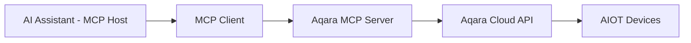

<div align="center" style="display: flex; align-items: center; justify-content: center; ">

  
  <h1>Aqara MCP Server</h1>

</div>

<div align="center">

[English](/README.md) | [中文](/readme/README_CN.md) | [繁體中文](/readme/README_CHT.md) | [Français](/readme/README_FR.md) | [한국어](/readme/README_KR.md) | Español | [日本語](/readme/README_JP.md) | [Deutsch](/readme/README_DE.md) | [Italiano](/readme/README_IT.md)

[](https://github.com/aqara/aqara-mcp-server)
[](https://golang.org/dl/)
[](https://github.com/aqara/aqara-mcp-server/releases)
[](https://opensource.org/licenses/MIT)
[](https://modelcontextprotocol.io/)

</div>

**Aqara MCP Server** es un servicio de control de automatización del hogar inteligente construido sobre el [Protocolo de Contexto de Modelo (MCP)](https://modelcontextprotocol.io/introduction). Esta plataforma permite una integración perfecta entre asistentes de IA (como Claude, Cursor, etc.) y el ecosistema de hogar inteligente de Aqara.

## Tabla de Contenidos

- [Tabla de Contenidos](#tabla-de-contenidos)
- [Características](#características)
- [Cómo Funciona](#cómo-funciona)
- [Inicio Rápido](#inicio-rápido)
  - [Requisitos Previos](#requisitos-previos)
  - [Paso 1: Autenticación de la Cuenta](#paso-1-autenticación-de-la-cuenta)
  - [Paso 2: Cómo Usar](#paso-2-cómo-usar)
    - [Opción A: Servidor MCP Remoto (Recomendado)](#opción-a-servidor-mcp-remoto-recomendado)
    - [Opción B: Servidor MCP Local](#opción-b-servidor-mcp-local)
  - [Paso 3: Verificación](#paso-3-verificación)
- [Referencia de la API](#referencia-de-la-api)
  - [Resumen de Herramientas Principales](#resumen-de-herramientas-principales)
  - [API de Control de Dispositivos](#api-de-control-de-dispositivos)
    - [`device_control`](#device_control)
  - [API de Consulta de Dispositivos](#api-de-consulta-de-dispositivos)
    - [`device_query`](#device_query)
    - [`device_status_query`](#device_status_query)
    - [`device_log_query`](#device_log_query)
  - [API de Gestión de Escenas](#api-de-gestión-de-escenas)
    - [`get_scenes`](#get_scenes)
    - [`run_scenes`](#run_scenes)
  - [API de Gestión del Hogar](#api-de-gestión-del-hogar)
    - [`get_homes`](#get_homes)
    - [`switch_home`](#switch_home)
  - [API de Configuración de Automatización](#api-de-configuración-de-automatización)
    - [`automation_config`](#automation_config)
- [Estructura del Proyecto](#estructura-del-proyecto)
  - [Estructura de Directorios](#estructura-de-directorios)
  - [Descripción de Archivos Principales](#descripción-de-archivos-principales)
- [Desarrollo y Contribución](#desarrollo-y-contribución)
  - [Configuración del Entorno de Desarrollo](#configuración-del-entorno-de-desarrollo)
  - [Estándares de Calidad del Código](#estándares-de-calidad-del-código)
  - [Guía de Contribución](#guía-de-contribución)
- [Licencia](#licencia)

## Características

- ✨ **Control Integral de Dispositivos**: Control detallado sobre varios atributos de los dispositivos inteligentes de Aqara, incluyendo encendido/apagado, brillo, temperatura de color y modos.
- 🔍 **Consulta Flexible de Dispositivos**: Capacidad para consultar listas de dispositivos y sus estados detallados por habitación o tipo de dispositivo.
- 🎬 **Gestión Inteligente de Escenas**: Soporta la consulta y ejecución de escenas de hogar inteligente predefinidas por el usuario.
- 📈 **Historial de Dispositivos**: Consulta los registros históricos de cambios de estado de los dispositivos dentro de un rango de tiempo especificado.
- ⏰ **Configuración de Automatización**: Soporta la configuración de tareas de control de dispositivos programadas o retardadas.
- 🏠 **Soporte Multi-Hogar**: Soporta la consulta y el cambio entre diferentes hogares bajo la cuenta de un usuario.
- 🔌 **Compatibilidad con el Protocolo MCP**: Totalmente compatible con la especificación MCP, lo que permite una fácil integración con varios asistentes de IA.
- 🔐 **Autenticación Segura**: Utiliza un mecanismo de seguridad basado en autorización de inicio de sesión + firma para proteger los datos del usuario y la seguridad de los dispositivos.
- 🌐 **Multiplataforma**: Desarrollado en Go, se puede compilar en ejecutables para múltiples plataformas.
- 🔧 **Fácilmente Extensible**: El diseño modular permite la adición conveniente de nuevas herramientas y características.

## Cómo Funciona

Aqara MCP Server actúa como un puente entre los asistentes de IA y la plataforma de hogar inteligente de Aqara:



1.  **Asistente de IA**: El usuario emite un comando a través de un asistente de IA (p. ej., "Enciende la luz de la sala").
2.  **Cliente MCP**: Analiza el comando del usuario y llama a la herramienta correspondiente proporcionada por el Servidor MCP de Aqara (p. ej., `device_control`) según el protocolo MCP.
3.  **Servidor MCP de Aqara (Este Proyecto)**: Recibe la solicitud del cliente, se comunica con la API en la Nube de Aqara utilizando las credenciales de Aqara configuradas y ejecuta la operación real del dispositivo o la consulta de datos.
4.  **Flujo de Respuesta**: La API en la Nube de Aqara devuelve el resultado, que se pasa de nuevo al cliente MCP a través del Servidor MCP de Aqara y finalmente se presenta al usuario.

---

## Inicio Rápido

### Requisitos Previos

-   **Cuenta de Aqara** con dispositivos inteligentes registrados.
-   **Cliente habilitado para MCP** (p. ej., Claude for Desktop, Cursor).
-   **Go 1.24+** (solo requerido para la implementación local desde el código fuente).

### Paso 1: Autenticación de la Cuenta

Independientemente del modo de implementación, primero debe obtener las credenciales de autenticación de Aqara:

1.  **Visite la Página de Inicio de Sesión**:
    🔗 [https://cdn.aqara.com/app/mcpserver/login.html](https://cdn.aqara.com/app/mcpserver/login.html)

2.  **Complete el Proceso de Inicio de Sesión**:
    -   Inicie sesión con sus credenciales de Aqara.
    -   Obtenga la `api_key` y la `base_url`.

3.  **Almacene las Credenciales de Forma Segura**:
    > ⚠️ Por favor, guarde su información de `api_key` de forma segura y no la revele a otros.

    

### Paso 2: Cómo Usar

Elija el método de implementación que se adapte a sus necesidades:

#### Opción A: Servidor MCP Remoto (Recomendado)

**Adecuado para**: Usuarios que desean comenzar rápidamente sin necesidad de configurar un entorno local.

**Ventajas**:

-   ✅ **Listo para Usar**: No es necesario descargar ni compilar; configure y use directamente.
-   ✅ **Actualizaciones Automáticas**: El servidor se mantiene y actualiza automáticamente.
-   ✅ **Alta Disponibilidad**: Operaciones profesionales garantizan la estabilidad del servicio.
-   ✅ **Compatibilidad Multiplataforma**: Sin restricciones de sistema operativo.

**Configure el Cliente MCP**:

1.  **Abra la Configuración**:
    -   Inicie Cursor.

    

2.  **Añada la Configuración del Servidor**:

    ```json
    {
      "mcpServers": {
        "aqara": {
          "type": "http",
          "url": "https://[mcp-server-domain]/echo/mcp",  // base_url
          "headers": {
            "Authorization": "[YOUR_API_KEY_HERE]"  // api_key
          }
        }
      }
    }
    ```

3.  **Reinicie la Aplicación**:
    -   Reinicie Cursor para que los cambios surtan efecto.

#### Opción B: Servidor MCP Local

**Adecuado para**: Usuarios que requieren soberanía de datos, configuraciones personalizadas o uso sin conexión.

**Ventajas**:

-   ✅ **Privacidad de Datos**: Todos los datos se procesan localmente.
-   ✅ **Control Total**: Configuración personalizable y características extensibles.
-   ✅ **Disponibilidad sin Conexión**: Las funciones básicas no se ven afectadas por interrupciones de la red.
-   ✅ **Sin Restricciones**: No está limitado por los servicios en la nube.

**Pasos de Instalación**:

1.  **Descargue el Programa** (elija uno):

    **Recomendado: Descargar Versión Precompilada**

    Visite [GitHub Releases](https://github.com/aqara/aqara-mcp-server/releases) para descargar la última versión para su sistema operativo.

    **Alternativamente: Compilar desde el Código Fuente**

    ```bash
    git clone https://github.com/aqara/aqara-mcp-server.git
    cd aqara-mcp-server
    go mod tidy
    go build -ldflags="-s -w" -o aqara-mcp-server
    ```

2.  **Establezca las Variables de Entorno**:

    ```bash
    export aqara_api_key="your_api_key_here"
    export aqara_base_url="your_base_url_here"
    ```

**Configure el Cliente MCP (p. ej., **Claude for Desktop**)**:

1.  **Abra la Configuración**:
    -   Inicie Claude for Desktop.
    -   Navegue a: Configuración → Desarrollador.

    

2.  **Edite el Archivo de Configuración**:
    -   Haga clic en "Editar Configuración".

    

3.  **Añada la Configuración del Servidor (claude_desktop_config.json)**:

    ```json
    {
      "mcpServers": {
        "aqara": {
          "command": "/path/to/aqara-mcp-server",
          "args": ["run", "stdio"],
          "env": {
            "aqara_api_key": "your_api_key_here",
            "aqara_base_url": "your_base_url_here"
          }
        }
      }
    }
    ```

4.  **Reinicie la Aplicación**:
    -   Reinicie Claude for Desktop para que los cambios surtan efecto.

### Paso 3: Verificación

Use los siguientes comandos de prueba para verificar que la configuración sea exitosa:

```
Usuario: "Muestra todos los dispositivos en mi casa"
Asistente: [Consulta la lista de dispositivos a través de MCP]

Usuario: "Enciende la luz de la sala"
Asistente: [Ejecuta el control del dispositivo a través de MCP]

Usuario: "Ejecuta la escena de la noche"
Asistente: [Ejecuta la escena a través de MCP]
```

Si ve un mensaje como "🔧 Conectado al Servidor MCP de Aqara", ¡la configuración es exitosa!

---

## Referencia de la API

### Resumen de Herramientas Principales

| Categoría de Herramienta | Herramienta | Descripción |
|---|---|---|
| **Control de Dispositivos** | `device_control` | Operaciones directas de dispositivos |
| **Consulta de Dispositivos** | `device_query`, `device_status_query`, `device_log_query` | Información completa de dispositivos |
| **Gestión de Escenas** | `get_scenes`, `run_scenes` | Control automatizado de escenas |
| **Gestión del Hogar** | `get_homes`, `switch_home` | Soporte para entornos multi-hogar |
| **Automatización** | `automation_config` | Configuración de tareas programadas |

### API de Control de Dispositivos

#### `device_control`

Controla el estado o los atributos de los dispositivos de hogar inteligente (p. ej., encendido/apagado, temperatura, brillo, color, temperatura de color).

**Parámetros:**

-   `endpoint_ids` _(Array\<Integer\>, requerido)_: Una lista de ID de dispositivos a controlar.
-   `control_params` _(Object, requerido)_: Un objeto de parámetros de control que contiene acciones específicas:
    -   `action` _(String, requerido)_: La acción a realizar (p. ej., `"on"`, `"off"`, `"set"`, `"up"`, `"down"`, `"cooler"`, `"warmer"`).
    -   `attribute` _(String, requerido)_: El atributo del dispositivo a controlar (p. ej., `"on_off"`, `"brightness"`, `"color_temperature"`, `"ac_mode"`).
    -   `value` _(String | Number, opcional)_: El valor objetivo (requerido cuando `action` es "set").
    -   `unit` _(String, opcional)_: La unidad del valor (p. ej., `"%"`, `"K"`, `"℃"`).

**Devuelve:** Un mensaje que indica el resultado de la operación de control del dispositivo.

### API de Consulta de Dispositivos

#### `device_query`

Recupera una lista completa de dispositivos basada en ubicaciones (habitaciones) y tipos de dispositivos especificados, con soporte para filtrado (no incluye información de estado en tiempo real).

**Parámetros:**

-   `positions` _(Array\<String\>, opcional)_: Una lista de nombres de habitaciones. Un array vacío consulta todas las habitaciones.
-   `device_types` _(Array\<String\>, opcional)_: Una lista de tipos de dispositivos (p. ej., `"Light"`, `"WindowCovering"`, `"AirConditioner"`, `"Button"`). Un array vacío consulta todos los tipos.

**Devuelve:** Una lista de dispositivos formateada en Markdown, incluyendo nombres e ID de los dispositivos.

#### `device_status_query`

Obtiene la información de estado actual de los dispositivos (se utiliza para consultar el estado en tiempo real como color, brillo, encendido/apagado).

**Parámetros:**

-   `positions` _(Array\<String\>, opcional)_: Una lista de nombres de habitaciones. Un array vacío consulta todas las habitaciones.
-   `device_types` _(Array\<String\>, opcional)_: Una lista de tipos de dispositivos. Mismas opciones que `device_query`. Un array vacío consulta todos los tipos.

**Devuelve:** Información de estado del dispositivo formateada en Markdown.

#### `device_log_query`

Consulta la información histórica del registro de los dispositivos.

**Parámetros:**

-   `endpoint_ids` _(Array\<Integer\>, requerido)_: Una lista de ID de dispositivos para los que se consultará el historial.
-   `start_datetime` _(String, opcional)_: La hora de inicio de la consulta en formato `YYYY-MM-DD HH:MM:SS` (p. ej., `"2023-05-16 12:00:00"`).
-   `end_datetime` _(String, opcional)_: La hora de finalización de la consulta en formato `YYYY-MM-DD HH:MM:SS`.
-   `attributes` _(Array\<String\>, opcional)_: Una lista de nombres de atributos de dispositivos a consultar (p. ej., `["on_off", "brightness"]`). Si no se proporciona, se consultan todos los atributos registrados.

**Devuelve:** Información histórica del estado del dispositivo formateada en Markdown.

### API de Gestión de Escenas

#### `get_scenes`

Consulta todas las escenas en el hogar de un usuario o las escenas en habitaciones específicas.

**Parámetros:**

-   `positions` _(Array\<String\>, opcional)_: Una lista de nombres de habitaciones. Un array vacío consulta las escenas de todo el hogar.

**Devuelve:** Información de la escena formateada en Markdown.

#### `run_scenes`

Ejecuta escenas especificadas por sus ID de escena.

**Parámetros:**

-   `scenes` _(Array\<Integer\>, requerido)_: Una lista de ID de escenas a ejecutar.

**Devuelve:** Un mensaje que indica el resultado de la ejecución de la escena.

### API de Gestión del Hogar

#### `get_homes`

Obtiene una lista de todos los hogares bajo la cuenta del usuario.

**Parámetros:** Ninguno

**Devuelve:** Una lista de nombres de hogares separados por comas. Devuelve una cadena vacía o un mensaje correspondiente si no hay datos disponibles.

#### `switch_home`

Cambia el hogar actualmente activo del usuario. Después de cambiar, las consultas, controles, etc. de dispositivos posteriores se dirigirán al nuevo hogar.

**Parámetros:**

-   `home_name` _(String, requerido)_: El nombre del hogar de destino.

**Devuelve:** Un mensaje que indica el resultado de la operación de cambio.

### API de Configuración de Automatización

#### `automation_config`

Configura la automatización (actualmente solo admite tareas de control de dispositivos programadas o retardadas).

**Parámetros:**

-   `scheduled_time` _(String, requerido)_: La hora de ejecución programada en formato Crontab estándar `"min hora día mes semana"`. P. ej., `"30 14 * * *"` (ejecutar a las 14:30 todos los días), `"0 9 * * 1"` (ejecutar a las 9:00 todos los lunes).
-   `endpoint_ids` _(Array\<Integer\>, requerido)_: Una lista de ID de dispositivos a controlar en un horario.
-   `control_params` _(Object, requerido)_: Parámetros de control del dispositivo, en el mismo formato que la herramienta `device_control` (incluyendo action, attribute, value, etc.).
-   `task_name` _(String, requerido)_: El nombre o la descripción de esta tarea de automatización (para identificación y gestión).
-   `execution_once` _(Boolean, opcional)_: Si se ejecuta solo una vez.
    -   `true`: Ejecuta la tarea solo una vez a la hora especificada (predeterminado).
    -   `false`: Ejecuta la tarea periódicamente (p. ej., diariamente, semanalmente).

**Devuelve:** Un mensaje que indica el resultado de la configuración de la automatización.

## Estructura del Proyecto

### Estructura de Directorios

```text
.
├── cmd.go                # Definiciones de comandos CLI de Cobra y punto de entrada del programa (contiene la función main)
├── server.go             # Lógica principal del servidor MCP, definiciones de herramientas y manejo de solicitudes
├── smh.go                # Envoltorio de la interfaz API de la plataforma de hogar inteligente de Aqara
├── middleware.go         # Middleware: autenticación de usuario, control de tiempo de espera, recuperación de pánico
├── config.go             # Gestión de la configuración global y manejo de variables de entorno
├── go.mod                # Archivo de gestión de dependencias de módulos de Go
├── go.sum                # Archivo de suma de verificación de dependencias de módulos de Go
├── readme/               # Documentos README y recursos de imágenes
│   ├── img/              # Directorio de recursos de imágenes
│   └── *.md              # Archivos README multilingües
├── LICENSE               # Licencia de código abierto MIT
└── README.md             # Documento principal del proyecto
```

### Descripción de Archivos Principales

-   **`cmd.go`**: Implementación de CLI basada en el framework Cobra, que define los modos de inicio `run stdio` y `run http` y la función de entrada principal.
-   **`server.go`**: Implementación principal del servidor MCP, responsable del registro de herramientas, el manejo de solicitudes y el soporte del protocolo.
-   **`smh.go`**: Capa de envoltura de la API de la plataforma de hogar inteligente de Aqara, que proporciona control de dispositivos, autenticación y soporte multi-hogar.
-   **`middleware.go`**: Middleware de manejo de solicitudes, que proporciona validación de autenticación, control de tiempo de espera y manejo de excepciones.
-   **`config.go`**: Gestión de la configuración global, responsable del manejo de variables de entorno y la configuración de la API.

## Desarrollo y Contribución

### Configuración del Entorno de Desarrollo

```bash
# Clonar el repositorio
git clone https://github.com/aqara/aqara-mcp-server.git
cd aqara-mcp-server

# Instalar dependencias
go mod tidy

# Ejecutar pruebas
go test ./...

# Compilación optimizada
go build -ldflags="-s -w" -o aqara-mcp-server
```

### Estándares de Calidad del Código

-   **Lenguaje Go**: Sigue los estándares de codificación oficiales de Go.
-   **Documentación**: Documentación completa de la API.
-   **Pruebas**: Cobertura de código mínima del 80%.
-   **Seguridad**: Auditorías de seguridad regulares.

### Guía de Contribución

1.  **Haga un fork del repositorio**
2.  **Cree una rama de características**: `git checkout -b feature/amazing-feature`
3.  **Confirme sus cambios**: `git commit -m 'Añadir alguna característica increíble'`
4.  **Envíe a la rama**: `git push origin feature/amazing-feature`
5.  **Abra una Pull Request**

---

## Licencia

Este proyecto está licenciado bajo la [Licencia MIT](/LICENSE) - vea el archivo [LICENSE](LICENSE) para más detalles.

---

**Copyright © 2025 Aqara-Copilot. Todos los derechos reservados.**
