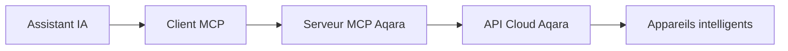

<div align="center" style="display: flex; align-items: center; justify-content: center; ">

  
  <h1>Serveur MCP Aqara</h1>

</div>

<div align="center">

[English](/readme/README.md) | [中文](/readme/README_CN.md) | [繁體中文](/readme/README_CHT.md) | Français | [한국어](/readme/README_KR.md) | [Español](/readme/README_ES.md) | [日本語](/readme/README_JP.md) | [Deutsch](/readme/README_DE.md) | [Italiano](/readme/README_IT.md)

[](https://github.com/aqara/aqara-mcp-server)
[](https://golang.org/dl/)
[](https://github.com/aqara/aqara-mcp-server/releases)
[](https://opensource.org/licenses/MIT)

</div>

Le Serveur MCP Aqara est un service de contrôle domotique intelligent développé sur le protocole [MCP (Model Context Protocol)](https://modelcontextprotocol.io/introduction). Il permet à tout assistant IA ou API compatible MCP (tel que Claude, Cursor, etc.) d'interagir avec vos appareils domotiques Aqara, offrant des fonctionnalités de contrôle par langage naturel, de consultation d'état et d'exécution de scénarios.

## Table des matières

- [Table des matières](#table-des-matières)
- [Fonctionnalités](#fonctionnalités)
- [Principe de fonctionnement](#principe-de-fonctionnement)
- [Démarrage rapide](#démarrage-rapide)
  - [Prérequis](#prérequis)
  - [Installation](#installation)
    - [Méthode 1 : Télécharger la version précompilée (recommandé)](#méthode-1--télécharger-la-version-précompilée-recommandé)
    - [Méthode 2 : Compilation depuis les sources](#méthode-2--compilation-depuis-les-sources)
  - [Authentification du compte Aqara](#authentification-du-compte-aqara)
  - [Configuration client](#configuration-client)
    - [Exemple de configuration Claude for Desktop](#exemple-de-configuration-claude-for-desktop)
    - [Description des paramètres de configuration](#description-des-paramètres-de-configuration)
    - [Autres clients MCP](#autres-clients-mcp)
  - [Démarrage du service](#démarrage-du-service)
    - [Mode standard (recommandé)](#mode-standard-recommandé)
    - [Mode HTTP (`prochainement disponible`)](#mode-http-prochainement-disponible)
- [Documentation des outils API](#documentation-des-outils-api)
  - [Contrôle d'appareils](#contrôle-dappareils)
    - [device\_control](#device_control)
  - [Requêtes d'appareils](#requêtes-dappareils)
    - [device\_query](#device_query)
    - [device\_status\_query](#device_status_query)
    - [device\_log\_query](#device_log_query)
  - [Gestion de scénarios](#gestion-de-scénarios)
    - [get\_scenes](#get_scenes)
    - [run\_scenes](#run_scenes)
  - [Gestion domestique](#gestion-domestique)
    - [get\_homes](#get_homes)
    - [switch\_home](#switch_home)
  - [Configuration d'automatisation](#configuration-dautomatisation)
    - [automation\_config](#automation_config)
- [Structure du projet](#structure-du-projet)
  - [Architecture des répertoires](#architecture-des-répertoires)
  - [Description des fichiers principaux](#description-des-fichiers-principaux)
- [Guide de développement](#guide-de-développement)
- [Licence](#licence)

## Fonctionnalités

- ✨ **Contrôle complet des appareils** : Prise en charge du contrôle précis de multiples attributs des appareils intelligents Aqara (marche/arrêt, luminosité, température de couleur, modes, etc.)
- 🔍 **Requêtes flexibles d'appareils** : Capacité de consulter les listes d'appareils et leurs états détaillés par pièce et type d'appareil
- 🎬 **Gestion intelligente de scénarios** : Prise en charge de la consultation et de l'exécution de scénarios domotiques prédéfinis
- 📈 **Historique des appareils** : Consultation des enregistrements de changements d'état historiques des appareils dans des plages temporelles spécifiées
- ⏰ **Configuration d'automatisation** : Prise en charge de la configuration de tâches de contrôle d'appareils programmées ou différées
- 🏠 **Support multi-domiciles** : Prise en charge de la consultation et du basculement entre différents domiciles sous un compte utilisateur
- 🔌 **Compatibilité protocole MCP** : Conformité totale aux spécifications du protocole MCP, facilitant l'intégration avec divers assistants IA
- 🔐 **Mécanisme d'authentification sécurisé** : Adoption d'une authentification sécurisée basée sur autorisation de connexion + signature pour protéger les données utilisateur et la sécurité des appareils
- 🌐 **Exécution multiplateforme** : Développé en Go, compilable en exécutables multiplateformes
- 🔧 **Facilement extensible** : Conception modulaire permettant l'ajout facile de nouveaux outils et fonctionnalités

## Principe de fonctionnement

Le Serveur MCP Aqara sert de pont entre les assistants IA et la plateforme domotique intelligente Aqara :



1. **Assistant IA** : L'utilisateur émet une commande via l'assistant IA (par exemple, "allumer la lumière du salon")
2. **Client MCP** : Analyse la commande utilisateur et appelle l'outil correspondant fourni par le Serveur MCP Aqara selon le protocole MCP (par exemple `device_control`)
3. **Serveur MCP Aqara (ce projet)** : Reçoit les requêtes du client, utilise les identifiants Aqara configurés pour communiquer avec l'API Cloud Aqara et exécuter les opérations réelles sur les appareils ou les requêtes de données
4. **Flux de réponse** : L'API Cloud Aqara retourne les résultats, transmis via le Serveur MCP Aqara au client MCP, puis présentés à l'utilisateur

## Démarrage rapide

### Prérequis

- **Go** (version 1.24 ou supérieure) - requis uniquement pour la compilation depuis les sources
- **Git** (pour la compilation depuis les sources) - optionnel
- **Compte Aqara** avec appareils intelligents associés
- **Client compatible protocole MCP** (tel que Claude for Desktop, Cursor, etc.)

### Installation

Vous pouvez choisir de télécharger l'exécutable précompilé ou compiler depuis les sources.

#### Méthode 1 : Télécharger la version précompilée (recommandé)

Visitez la page GitHub Releases pour télécharger le dernier exécutable pour votre système d'exploitation :

**📥 [Accéder à la page Releases pour télécharger](https://github.com/aqara/aqara-mcp-server/releases)**

Après avoir téléchargé l'archive correspondant à votre plateforme, décompressez-la pour utilisation.

#### Méthode 2 : Compilation depuis les sources

```bash
# Cloner le dépôt
git clone https://github.com/aqara/aqara-mcp-server.git
cd aqara-mcp-server

# Télécharger les dépendances
go mod tidy

# Compiler l'exécutable
go build -o aqara-mcp-server
```

Après compilation, l'exécutable `aqara-mcp-server` sera généré dans le répertoire courant.

### Authentification du compte Aqara

Pour permettre au Serveur MCP d'accéder à votre compte Aqara et de contrôler les appareils, vous devez d'abord procéder à l'autorisation de connexion.

Veuillez visiter l'adresse suivante pour compléter l'autorisation de connexion :
**🔗 [https://cdn.aqara.com/app/mcpserver/login.html](https://cdn.aqara.com/app/mcpserver/login.html)**

Après une connexion réussie, vous obtiendrez les informations d'authentification nécessaires (telles que `token`, `region`), qui seront utilisées dans les étapes de configuration suivantes.

> ⚠️ **Rappel de sécurité** : Veuillez conserver précieusement les informations `token` et ne les divulguez pas à autrui.

### Configuration client

Les méthodes de configuration varient légèrement selon les clients MCP. Voici un exemple de configuration de Claude for Desktop pour utiliser ce Serveur MCP :

#### Exemple de configuration Claude for Desktop

1. **Ouvrir les paramètres (Settings) de Claude for Desktop**

    

2. **Basculer vers l'onglet Développeur (Developer), puis cliquer sur Modifier la configuration (Edit Config) pour ouvrir le fichier de configuration avec un éditeur de texte**

    

3. **Ajouter les informations de configuration de la "page de réussite de connexion" au fichier de configuration client `claude_desktop_config.json`**

    ```json
    {
      "mcpServers": {
        "aqara": {
          "command": "/path/to/aqara-mcp-server",
          "args": ["run", "stdio"],
          "env": {
            "token": "your_token_here",
            "region": "your_region_here"
          }
        }
      }
    }
    ```

    

#### Description des paramètres de configuration

- `command` : Chemin complet vers l'exécutable `aqara-mcp-server` que vous avez téléchargé ou compilé
- `args` : Utiliser `["run", "stdio"]` pour démarrer le mode de transport stdio
- `env` : Configuration des variables d'environnement
  - `token` : Jeton d'accès obtenu depuis la page de connexion Aqara
  - `region` : Région de votre compte Aqara (régions supportées : CN, US, EU, KR, SG, RU)

#### Autres clients MCP

Pour d'autres clients compatibles protocole MCP (tels que ChatGPT, Cursor, etc.), la configuration est similaire :

- S'assurer que le client supporte le protocole MCP
- Configurer le chemin de l'exécutable et les paramètres de démarrage
- Définir les variables d'environnement `token` et `region`
- Choisir le protocole de transport approprié (recommandé : `stdio`)

### Démarrage du service

#### Mode standard (recommandé)

Redémarrer Claude for Desktop. Vous pourrez alors exécuter des opérations de contrôle d'appareils, de requêtes d'appareils, d'exécution de scénarios, etc., via le langage naturel.

Exemples de conversation :

- "Allumer la lumière du salon"
- "Régler la climatisation de la chambre en mode refroidissement, température 24 degrés"
- "Voir la liste des appareils de toutes les pièces"
- "Exécuter le scénario bonne nuit"


#### Mode HTTP (`prochainement disponible`)

## Documentation des outils API

Les clients MCP peuvent interagir avec les appareils domotiques intelligents Aqara en appelant ces outils.

### Contrôle d'appareils

#### device_control

Contrôler l'état ou les attributs des appareils domotiques intelligents (par exemple marche/arrêt, température, luminosité, couleur, température de couleur, etc.).

**Paramètres :**

- `endpoint_ids` _(Array\<Integer\>, requis)_ : Liste des ID d'appareils à contrôler
- `control_params` _(Object, requis)_ : Objet de paramètres de contrôle, contenant les opérations spécifiques :
  - `action` _(String, requis)_ : Opération à exécuter (comme `"on"`, `"off"`, `"set"`, `"up"`, `"down"`, `"cooler"`, `"warmer"`)
  - `attribute` _(String, requis)_ : Attribut d'appareil à contrôler (comme `"on_off"`, `"brightness"`, `"color_temperature"`, `"ac_mode"`)
  - `value` _(String | Number, optionnel)_ : Valeur cible (requis quand action est "set")
  - `unit` _(String, optionnel)_ : Unité de la valeur (comme `"%"`, `"K"`, `"℃"`)

**Retour :** Message de résultat d'opération de contrôle d'appareil

### Requêtes d'appareils

#### device_query

Obtenir la liste des appareils selon l'emplacement (pièce) et le type d'appareil spécifiés (sans informations d'état en temps réel).

**Paramètres :**

- `positions` _(Array\<String\>, optionnel)_ : Liste des noms de pièces. Tableau vide signifie requête de toutes les pièces
- `device_types` _(Array\<String\>, optionnel)_ : Liste des types d'appareils (comme `"Light"`, `"WindowCovering"`, `"AirConditioner"`, `"Button"`). Tableau vide signifie requête de tous les types

**Retour :** Liste d'appareils au format Markdown, incluant noms et ID des appareils

#### device_status_query

Obtenir les informations d'état actuel des appareils (pour requêter les informations d'état en temps réel comme couleur, luminosité, marche/arrêt, etc.).

**Paramètres :**

- `positions` _(Array\<String\>, optionnel)_ : Liste des noms de pièces. Tableau vide signifie requête de toutes les pièces
- `device_types` _(Array\<String\>, optionnel)_ : Liste des types d'appareils. Valeurs optionnelles identiques à `device_query`. Tableau vide signifie requête de tous les types

**Retour :** Informations d'état des appareils au format Markdown

#### device_log_query

Requêter les informations d'historique des appareils.

**Paramètres :**

- `endpoint_ids` _(Array\<Integer\>, requis)_ : Liste des ID d'appareils pour lesquels requêter l'historique
- `start_datetime` _(String, optionnel)_ : Heure de début de requête, format `YYYY-MM-DD HH:MM:SS` (exemple : `"2023-05-16 12:00:00"`)
- `end_datetime` _(String, optionnel)_ : Heure de fin de requête, format `YYYY-MM-DD HH:MM:SS`
- `attributes` _(Array\<String\>, optionnel)_ : Liste des noms d'attributs d'appareil à requêter (comme `["on_off", "brightness"]`). Si non fourni, requête tous les attributs enregistrés

**Retour :** Informations d'état historique des appareils au format Markdown

### Gestion de scénarios

#### get_scenes

Requêter tous les scénarios sous le domicile de l'utilisateur, ou les scénarios dans des pièces spécifiées.

**Paramètres :**

- `positions` _(Array\<String\>, optionnel)_ : Liste des noms de pièces. Tableau vide signifie requête des scénarios de tout le domicile

**Retour :** Informations de scénarios au format Markdown

#### run_scenes

Exécuter des scénarios spécifiés selon les ID de scénarios.

**Paramètres :**

- `scenes` _(Array\<Integer\>, requis)_ : Liste des ID de scénarios à exécuter

**Retour :** Message de résultat d'exécution de scénarios

### Gestion domestique

#### get_homes

Obtenir la liste de tous les domiciles sous le compte utilisateur.

**Paramètres :** Aucun

**Retour :** Liste de noms de domiciles séparés par des virgules. Si pas de données, retourne chaîne vide ou information d'invite correspondante

#### switch_home

Basculer le domicile actuellement opéré par l'utilisateur. Après basculement, les opérations suivantes de requête d'appareils, contrôle, etc., cibleront le nouveau domicile basculé.

**Paramètres :**

- `home_name` _(String, requis)_ : Nom du domicile cible

**Retour :** Message de résultat d'opération de basculement

### Configuration d'automatisation

#### automation_config

Configuration d'automatisation (actuellement ne supporte que les tâches de contrôle d'appareils programmées ou différées).

**Paramètres :**

- `scheduled_time` _(String, requis)_ : Point temporel d'exécution programmée, utilisant le format Crontab standard `"minute heure jour mois semaine"`. Exemple : `"30 14 * * *"` (exécuter chaque jour à 14:30), `"0 9 * * 1"` (exécuter chaque lundi à 9:00)
- `endpoint_ids` _(Array\<Integer\>, requis)_ : Liste des ID d'appareils à contrôler de manière programmée
- `control_params` _(Object, requis)_ : Paramètres de contrôle d'appareil, utilisant le même format que l'outil `device_control` (incluant action, attribute, value, etc.)
- `task_name` _(String, requis)_ : Nom ou description de cette tâche d'automatisation (pour identification et gestion)
- `execution_once` _(Boolean, optionnel)_ : S'il faut exécuter une seule fois
  - `true` : Exécuter la tâche une seule fois au moment spécifié (valeur par défaut)
  - `false` : Exécuter la tâche de manière cyclique et répétitive (comme quotidien, hebdomadaire, etc.)

**Retour :** Message de résultat de configuration d'automatisation

## Structure du projet

### Architecture des répertoires

```text
.
├── cmd.go                # Définition des commandes CLI Cobra et point d'entrée du programme (incluant la fonction main)
├── server.go             # Logique cœur du serveur MCP, définition d'outils et traitement des requêtes
├── smh.go                # Encapsulation de l'interface API de la plateforme domotique intelligente Aqara
├── middleware.go         # Middleware : authentification utilisateur, contrôle de timeout, récupération d'exception
├── config.go             # Gestion de configuration globale et traitement des variables d'environnement
├── go.mod                # Fichier de gestion des dépendances de modules Go
├── go.sum                # Fichier de somme de contrôle des dépendances de modules Go
├── readme/               # Documentation README et ressources d'images
│   ├── img/              # Répertoire de ressources d'images
│   └── *.md              # Fichiers README multilingues
├── LICENSE               # Licence open source MIT
└── README.md             # Document principal du projet
```

### Description des fichiers principaux

- **`cmd.go`** : Implémentation CLI basée sur le framework Cobra, définit les modes de démarrage `run stdio` et `run http` ainsi que la fonction d'entrée principale
- **`server.go`** : Implémentation cœur du serveur MCP, responsable de l'enregistrement d'outils, du traitement des requêtes et du support de protocole
- **`smh.go`** : Couche d'encapsulation API de la plateforme domotique intelligente Aqara, fournissant contrôle d'appareils, authentification et support multi-domiciles
- **`middleware.go`** : Middleware de traitement des requêtes, fournissant vérification d'authentification, contrôle de timeout et traitement d'exception
- **`config.go`** : Gestion de configuration globale, responsable du traitement des variables d'environnement et de la configuration API

## Guide de développement

Nous accueillons votre participation à la contribution du projet en soumettant des Issues ou des Pull Requests !

Avant de soumettre du code, veuillez vous assurer que :

1. Le code respecte les normes de codage du langage Go
2. Les définitions d'outils et d'interfaces MCP pertinentes maintiennent cohérence et clarté
3. Ajout ou mise à jour de tests unitaires pour couvrir vos modifications
4. Si nécessaire, mise à jour de la documentation pertinente (comme ce README)
5. S'assurer que vos messages de commit sont clairs et compréhensibles

**🌟 Si ce projet vous aide, donnez-nous une étoile !**

**🤝 Rejoignez notre communauté pour rendre la domotique plus intelligente ensemble !**

## Licence

Ce projet est sous licence [MIT License](/LICENSE).

---

Copyright (c) 2025 Aqara-Copilot
