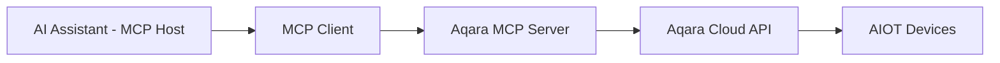

<div align="center" style="display: flex; align-items: center; justify-content: center; ">

  
  <h1>Aqara MCP Server</h1>

</div>

<div align="center">

[English](/README.md) | [中文](/readme/README_CN.md) | [繁體中文](/readme/README_CHT.md) | Français | [한국어](/readme/README_KR.md) | [Español](/readme/README_ES.md) | [日本語](/readme/README_JP.md) | [Deutsch](/readme/README_DE.md) | [Italiano](/readme/README_IT.md)

[](https://github.com/aqara/aqara-mcp-server)
[](https://golang.org/dl/)
[](https://github.com/aqara/aqara-mcp-server/releases)
[](https://opensource.org/licenses/MIT)
[](https://modelcontextprotocol.io/)

</div>

**Aqara MCP Server** est un service de contrôle d'automatisation de maison intelligente basé sur le [Protocole de Contexte de Modèle (MCP)](https://modelcontextprotocol.io/introduction). Cette plateforme permet une intégration transparente entre les assistants IA (comme Claude, Cursor, etc.) et l'écosystème de maison intelligente Aqara.

## Table des matières

- [Table des matières](#table-des-matières)
- [Fonctionnalités](#fonctionnalités)
- [Comment ça marche](#comment-ça-marche)
- [Démarrage rapide](#démarrage-rapide)
  - [Prérequis](#prérequis)
  - [Étape 1 : Authentification du compte](#étape-1--authentification-du-compte)
  - [Étape 2 : Comment utiliser](#étape-2--comment-utiliser)
    - [Option A : Serveur MCP distant (Recommandé)](#option-a--serveur-mcp-distant-recommandé)
    - [Option B : Serveur MCP local](#option-b--serveur-mcp-local)
  - [Étape 3 : Vérification](#étape-3--vérification)
- [Référence de l'API](#référence-de-lapi)
  - [Aperçu des outils principaux](#aperçu-des-outils-principaux)
  - [API de contrôle des appareils](#api-de-contrôle-des-appareils)
    - [`device_control`](#device_control)
  - [API de requête des appareils](#api-de-requête-des-appareils)
    - [`device_query`](#device_query)
    - [`device_status_query`](#device_status_query)
    - [`device_log_query`](#device_log_query)
  - [API de gestion des scènes](#api-de-gestion-des-scènes)
    - [`get_scenes`](#get_scenes)
    - [`run_scenes`](#run_scenes)
  - [API de gestion de la maison](#api-de-gestion-de-la-maison)
    - [`get_homes`](#get_homes)
    - [`switch_home`](#switch_home)
  - [API de configuration de l'automatisation](#api-de-configuration-de-lautomatisation)
    - [`automation_config`](#automation_config)
- [Structure du projet](#structure-du-projet)
  - [Structure des répertoires](#structure-des-répertoires)
  - [Description des fichiers principaux](#description-des-fichiers-principaux)
- [Développement et contribution](#développement-et-contribution)
  - [Configuration de l'environnement de développement](#configuration-de-lenvironnement-de-développement)
  - [Normes de qualité du code](#normes-de-qualité-du-code)
  - [Directives de contribution](#directives-de-contribution)
- [Licence](#licence)

## Fonctionnalités

- ✨ **Contrôle complet des appareils** : Contrôle précis de divers attributs des appareils intelligents Aqara, y compris marche/arrêt, luminosité, température de couleur et modes.
- 🔍 **Requête flexible des appareils** : Possibilité de requêter des listes d'appareils et leurs statuts détaillés par pièce ou type d'appareil.
- 🎬 **Gestion intelligente des scènes** : Prend en charge la requête et l'exécution de scènes de maison intelligente prédéfinies par l'utilisateur.
- 📈 **Historique des appareils** : Requête des enregistrements historiques des changements de statut des appareils dans une plage de temps spécifiée.
- ⏰ **Configuration de l'automatisation** : Prend en charge la configuration de tâches de contrôle d'appareils programmées ou différées.
- 🏠 **Support multi-maison** : Prend en charge la requête et le basculement entre différentes maisons sous le compte d'un utilisateur.
- 🔌 **Compatibilité avec le protocole MCP** : Entièrement conforme à la spécification MCP, permettant une intégration facile avec divers assistants IA.
- 🔐 **Authentification sécurisée** : Utilise un mécanisme de sécurité basé sur l'autorisation de connexion + signature pour protéger les données utilisateur et la sécurité des appareils.
- 🌐 **Multiplateforme** : Développé en Go, peut être compilé en exécutables pour plusieurs plateformes.
- 🔧 **Facilement extensible** : La conception modulaire permet l'ajout pratique de nouveaux outils et fonctionnalités.

## Comment ça marche

Aqara MCP Server agit comme un pont entre les assistants IA et la plateforme de maison intelligente Aqara :



1.  **Assistant IA** : L'utilisateur émet une commande via un assistant IA (par exemple, "Allume la lumière du salon").
2.  **Client MCP** : Analyse la commande de l'utilisateur et appelle l'outil correspondant fourni par le serveur MCP Aqara (par exemple, `device_control`) selon le protocole MCP.
3.  **Serveur MCP Aqara (ce projet)** : Reçoit la requête du client, communique avec l'API Cloud Aqara en utilisant les informations d'identification Aqara configurées, et exécute l'opération réelle sur l'appareil ou la requête de données.
4.  **Flux de réponse** : L'API Cloud Aqara renvoie le résultat, qui est transmis au client MCP via le serveur MCP Aqara et finalement présenté à l'utilisateur.

---

## Démarrage rapide

### Prérequis

-   **Compte Aqara** avec des appareils intelligents enregistrés.
-   **Client compatible MCP** (par exemple, Claude for Desktop, Cursor).
-   **Go 1.24+** (uniquement requis pour le déploiement local à partir des sources).

### Étape 1 : Authentification du compte

Quel que soit le mode de déploiement, vous devez d'abord obtenir les informations d'authentification Aqara :

1.  **Visitez la page de connexion** :
    🔗 [https://cdn.aqara.com/app/mcpserver/login.html](https://cdn.aqara.com/app/mcpserver/login.html)

2.  **Terminez le processus de connexion** :
    -   Connectez-vous avec vos identifiants Aqara.
    -   Obtenez la `api_key` et la `base_url`.

3.  **Stockez les informations d'identification en toute sécurité** :
    > ⚠️ Veuillez conserver vos informations `api_key` en lieu sûr et ne les divulguez pas à d'autres.

    

### Étape 2 : Comment utiliser

Choisissez la méthode de déploiement qui correspond à vos besoins :

#### Option A : Serveur MCP distant (Recommandé)

**Convient pour** : Les utilisateurs qui veulent démarrer rapidement sans configuration d'environnement local.

**Avantages** :

-   ✅ **Prêt à l'emploi** : Pas besoin de télécharger ou de compiler ; configurez et utilisez directement.
-   ✅ **Mises à jour automatiques** : Le serveur est automatiquement maintenu et mis à jour.
-   ✅ **Haute disponibilité** : Des opérations professionnelles garantissent la stabilité du service.
-   ✅ **Compatibilité multiplateforme** : Aucune restriction de système d'exploitation.

**Configurer le client MCP** :

1.  **Ouvrir les paramètres** :
    -   Lancez Cursor.

    

2.  **Ajouter la configuration du serveur** :

    ```json
    {
      "mcpServers": {
        "aqara": {
          "type": "http",
          "url": "https://[mcp-server-domain]/echo/mcp",  // base_url
          "headers": {
            "Authorization": "Bearer [YOUR_API_KEY_HERE]"  // api_key
          }
        }
      }
    }
    ```

3.  **Redémarrez l'application** :
    -   Redémarrez Cursor pour que les modifications prennent effet.

#### Option B : Serveur MCP local

**Convient pour** : Les utilisateurs qui ont besoin de souveraineté des données, de configurations personnalisées ou d'une utilisation hors ligne.

**Avantages** :

-   ✅ **Confidentialité des données** : Toutes les données sont traitées localement.
-   ✅ **Contrôle total** : Configuration personnalisable et fonctionnalités extensibles.
-   ✅ **Disponibilité hors ligne** : Les fonctions de base ne sont pas affectées par les interruptions réseau.
-   ✅ **Aucune restriction** : Non limité par les services cloud.

**Étapes d'installation** :

1.  **Téléchargez le programme** (choisissez-en un) :

    **Recommandé : Télécharger la version précompilée**

    Visitez les [versions GitHub](https://github.com/aqara/aqara-mcp-server/releases) pour télécharger la dernière version pour votre système d'exploitation.

    **Alternativement : Compiler à partir des sources**

    ```bash
    git clone https://github.com/aqara/aqara-mcp-server.git
    cd aqara-mcp-server
    go mod tidy
    go build -ldflags="-s -w" -o aqara-mcp-server
    ```

2.  **Définir les variables d'environnement** :

    ```bash
    export aqara_api_key="your_api_key_here"
    export aqara_base_url="your_base_url_here"
    ```

**Configurer le client MCP (par exemple, **Claude for Desktop**)** :

1.  **Ouvrir les paramètres** :
    -   Lancez Claude for Desktop.
    -   Naviguez vers : Paramètres → Développeur.

    

2.  **Modifier le fichier de configuration** :
    -   Cliquez sur "Modifier la configuration".

    

3.  **Ajouter la configuration du serveur (claude_desktop_config.json)** :

    ```json
    {
      "mcpServers": {
        "aqara": {
          "command": "/path/to/aqara-mcp-server",
          "args": ["run", "stdio"],
          "env": {
            "aqara_api_key": "your_api_key_here",
            "aqara_base_url": "your_base_url_here"
          }
        }
      }
    }
    ```

4.  **Redémarrez l'application** :
    -   Redémarrez Claude for Desktop pour que les modifications prennent effet.

### Étape 3 : Vérification

Utilisez les commandes de test suivantes pour vérifier que la configuration est réussie :

```
Utilisateur : "Affiche tous les appareils de ma maison"
Assistant : [Requête la liste des appareils via MCP]

Utilisateur : "Allume la lumière du salon"
Assistant : [Exécute le contrôle de l'appareil via MCP]

Utilisateur : "Exécute la scène du soir"
Assistant : [Exécute la scène via MCP]
```

Si vous voyez un message comme "🔧 Connecté au serveur MCP Aqara", la configuration est réussie !

---

## Référence de l'API

### Aperçu des outils principaux

| Catégorie d'outil | Outil | Description |
|---|---|---|
| **Contrôle des appareils** | `device_control` | Opérations directes sur les appareils |
| **Requête des appareils** | `device_query`, `device_status_query`, `device_log_query` | Informations complètes sur les appareils |
| **Gestion des scènes** | `get_scenes`, `run_scenes` | Contrôle automatisé des scènes |
| **Gestion de la maison** | `get_homes`, `switch_home` | Prise en charge de l'environnement multi-maison |
| **Automatisation** | `automation_config` | Configuration des tâches planifiées |

### API de contrôle des appareils

#### `device_control`

Contrôle l'état ou les attributs des appareils de maison intelligente (par exemple, marche/arrêt, température, luminosité, couleur, température de couleur).

**Paramètres :**

-   `endpoint_ids` _(Array\<Integer\>, requis)_ : Une liste d'ID d'appareils à contrôler.
-   `control_params` _(Object, requis)_ : Un objet de paramètres de contrôle contenant des actions spécifiques :
    -   `action` _(String, requis)_ : L'action à effectuer (par exemple, `"on"`, `"off"`, `"set"`, `"up"`, `"down"`, `"cooler"`, `"warmer"`).
    -   `attribute` _(String, requis)_ : L'attribut de l'appareil à contrôler (par exemple, `"on_off"`, `"brightness"`, `"color_temperature"`, `"ac_mode"`).
    -   `value` _(String | Number, optionnel)_ : La valeur cible (requise lorsque `action` est "set").
    -   `unit` _(String, optionnel)_ : L'unité de la valeur (par exemple, `"%"`, `"K"`, `"℃"`).

**Retourne :** Un message indiquant le résultat de l'opération de contrôle de l'appareil.

### API de requête des appareils

#### `device_query`

Récupère une liste complète d'appareils en fonction des emplacements (pièces) et des types d'appareils spécifiés, avec prise en charge du filtrage (n'inclut pas les informations d'état en temps réel).

**Paramètres :**

-   `positions` _(Array\<String\>, optionnel)_ : Une liste de noms de pièces. Un tableau vide interroge toutes les pièces.
-   `device_types` _(Array\<String\>, optionnel)_ : Une liste de types d'appareils (par exemple, `"Light"`, `"WindowCovering"`, `"AirConditioner"`, `"Button"`). Un tableau vide interroge tous les types.

**Retourne :** Une liste d'appareils formatée en Markdown, incluant les noms et les ID des appareils.

#### `device_status_query`

Obtient les informations d'état actuelles des appareils (utilisé pour interroger l'état en temps réel comme la couleur, la luminosité, marche/arrêt).

**Paramètres :**

-   `positions` _(Array\<String\>, optionnel)_ : Une liste de noms de pièces. Un tableau vide interroge toutes les pièces.
-   `device_types` _(Array\<String\>, optionnel)_ : Une liste de types d'appareils. Mêmes options que `device_query`. Un tableau vide interroge tous les types.

**Retourne :** Des informations sur l'état des appareils formatées en Markdown.

#### `device_log_query`

Interroge les informations de journal historiques des appareils.

**Paramètres :**

-   `endpoint_ids` _(Array\<Integer\>, requis)_ : Une liste d'ID d'appareils pour lesquels interroger l'historique.
-   `start_datetime` _(String, optionnel)_ : L'heure de début de la requête au format `YYYY-MM-DD HH:MM:SS` (par exemple, `"2023-05-16 12:00:00"`).
-   `end_datetime` _(String, optionnel)_ : L'heure de fin de la requête au format `YYYY-MM-DD HH:MM:SS`.
-   `attributes` _(Array\<String\>, optionnel)_ : Une liste de noms d'attributs d'appareils à interroger (par exemple, `["on_off", "brightness"]`). Si non fourni, tous les attributs enregistrés sont interrogés.

**Retourne :** Des informations sur l'état historique des appareils formatées en Markdown.

### API de gestion des scènes

#### `get_scenes`

Interroge toutes les scènes dans la maison d'un utilisateur ou les scènes dans des pièces spécifiées.

**Paramètres :**

-   `positions` _(Array\<String\>, optionnel)_ : Une liste de noms de pièces. Un tableau vide interroge les scènes pour toute la maison.

**Retourne :** Des informations sur les scènes formatées en Markdown.

#### `run_scenes`

Exécute des scènes spécifiées par leurs ID de scène.

**Paramètres :**

-   `scenes` _(Array\<Integer\>, requis)_ : Une liste d'ID de scènes à exécuter.

**Retourne :** Un message indiquant le résultat de l'exécution de la scène.

### API de gestion de la maison

#### `get_homes`

Obtient une liste de toutes les maisons sous le compte de l'utilisateur.

**Paramètres :** Aucun

**Retourne :** Une liste de noms de maisons séparés par des virgules. Retourne une chaîne vide ou un message correspondant si aucune donnée n'est disponible.

#### `switch_home`

Change la maison actuellement active de l'utilisateur. Après le changement, les requêtes, contrôles, etc. ultérieurs des appareils cibleront la nouvelle maison.

**Paramètres :**

-   `home_name` _(String, requis)_ : Le nom de la maison cible.

**Retourne :** Un message indiquant le résultat de l'opération de changement.

### API de configuration de l'automatisation

#### `automation_config`

Configure l'automatisation (ne prend actuellement en charge que les tâches de contrôle d'appareils programmées ou différées).

**Paramètres :**

-   `scheduled_time` _(String, requis)_ : L'heure d'exécution programmée au format Crontab standard `"min heure jour mois semaine"`. Ex : `"30 14 * * *"` (exécuter à 14:30 tous les jours), `"0 9 * * 1"` (exécuter à 9:00 tous les lundis).
-   `endpoint_ids` _(Array\<Integer\>, requis)_ : Une liste d'ID d'appareils à contrôler selon un calendrier.
-   `control_params` _(Object, requis)_ : Paramètres de contrôle de l'appareil, au même format que l'outil `device_control` (incluant action, attribute, value, etc.).
-   `task_name` _(String, requis)_ : Le nom ou la description de cette tâche d'automatisation (pour l'identification et la gestion).
-   `execution_once` _(Boolean, optionnel)_ : Exécuter une seule fois.
    -   `true` : Exécute la tâche une seule fois à l'heure spécifiée (par défaut).
    -   `false` : Exécute la tâche périodiquement (par exemple, quotidiennement, hebdomadairement).

**Retourne :** Un message indiquant le résultat de la configuration de l'automatisation.

## Structure du projet

### Structure des répertoires

```text
.
├── cmd.go                # Définitions des commandes CLI Cobra et point d'entrée du programme (contient la fonction main)
├── server.go             # Logique principale du serveur MCP, définitions des outils et gestion des requêtes
├── smh.go                # Wrapper de l'interface API de la plateforme de maison intelligente Aqara
├── middleware.go         # Middleware : authentification utilisateur, contrôle du timeout, récupération de panique
├── config.go             # Gestion de la configuration globale et traitement des variables d'environnement
├── go.mod                # Fichier de gestion des dépendances des modules Go
├── go.sum                # Fichier de somme de contrôle des dépendances des modules Go
├── readme/               # Documents README et ressources d'images
│   ├── img/              # Répertoire des ressources d'images
│   └── *.md              # Fichiers README multilingues
├── LICENSE               # Licence open source MIT
└── README.md             # Document principal du projet
```

### Description des fichiers principaux

-   **`cmd.go`** : Implémentation CLI basée sur le framework Cobra, définissant les modes de démarrage `run stdio` et `run http` et la fonction d'entrée principale.
-   **`server.go`** : Implémentation principale du serveur MCP, responsable de l'enregistrement des outils, de la gestion des requêtes et du support du protocole.
-   **`smh.go`** : Couche wrapper de l'API de la plateforme de maison intelligente Aqara, fournissant le contrôle des appareils, l'authentification et le support multi-maison.
-   **`middleware.go`** : Middleware de gestion des requêtes, fournissant la validation de l'authentification, le contrôle du timeout et la gestion des exceptions.
-   **`config.go`** : Gestion de la configuration globale, responsable du traitement des variables d'environnement et de la configuration de l'API.

## Développement et contribution

### Configuration de l'environnement de développement

```bash
# Cloner le dépôt
git clone https://github.com/aqara/aqara-mcp-server.git
cd aqara-mcp-server

# Installer les dépendances
go mod tidy

# Exécuter les tests
go test ./...

# Build optimisé
go build -ldflags="-s -w" -o aqara-mcp-server
```

### Normes de qualité du code

-   **Langage Go** : Suit les normes de codage officielles de Go.
-   **Documentation** : Documentation complète de l'API.
-   **Tests** : Couverture de code minimale de 80 %.
-   **Sécurité** : Audits de sécurité réguliers.

### Directives de contribution

1.  **Forker le dépôt**
2.  **Créer une branche de fonctionnalité** : `git checkout -b feature/amazing-feature`
3.  **Valider vos modifications** : `git commit -m 'Ajout d'une fonctionnalité incroyable'`
4.  **Pousser vers la branche** : `git push origin feature/amazing-feature`
5.  **Ouvrir une Pull Request**

---

## Licence

Ce projet est sous licence [MIT License](/LICENSE) - voir le fichier [LICENSE](LICENSE) pour plus de détails.

---

**Copyright © 2025 Aqara-Copilot. Tous droits réservés.**
