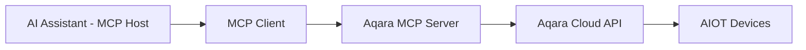

<div align="center" style="display: flex; align-items: center; justify-content: center; ">

  
  <h1>Aqara MCP Server</h1>

</div>

<div align="center">

[English](/README.md) | [中文](/readme/README_CN.md) | [繁體中文](/readme/README_CHT.md) | [Français](/readme/README_FR.md) | [한국어](/readme/README_KR.md) | [Español](/readme/README_ES.md) | [日本語](/readme/README_JP.md) | [Deutsch](/readme/README_DE.md) | Italiano

[](https://github.com/aqara/aqara-mcp-server)
[](https://golang.org/dl/)
[](https://github.com/aqara/aqara-mcp-server/releases)
[](https://opensource.org/licenses/MIT)
[](https://modelcontextprotocol.io/)

</div>

**Aqara MCP Server** è un servizio di controllo per l'automazione domestica intelligente basato sul [Model Context Protocol (MCP)](https://modelcontextprotocol.io/introduction). Questa piattaforma consente un'integrazione perfetta tra assistenti AI (come Claude, Cursor, ecc.) e l'ecosistema di casa intelligente Aqara.

## Indice

- [Indice](#indice)
- [Caratteristiche](#caratteristiche)
- [Come Funziona](#come-funziona)
- [Guida Rapida](#guida-rapida)
  - [Prerequisiti](#prerequisiti)
  - [Passo 1: Autenticazione dell'Account](#passo-1-autenticazione-dellaccount)
  - [Passo 2: Come Usare](#passo-2-come-usare)
    - [Opzione A: Server MCP Remoto (Consigliato)](#opzione-a-server-mcp-remoto-consigliato)
    - [Opzione B: Server MCP Locale](#opzione-b-server-mcp-locale)
  - [Passo 3: Verifica](#passo-3-verifica)
- [Riferimento API](#riferimento-api)
  - [Panoramica degli Strumenti Principali](#panoramica-degli-strumenti-principali)
  - [API di Controllo Dispositivi](#api-di-controllo-dispositivi)
    - [`device_control`](#device_control)
  - [API di Interrogazione Dispositivi](#api-di-interrogazione-dispositivi)
    - [`device_query`](#device_query)
    - [`device_status_query`](#device_status_query)
    - [`device_log_query`](#device_log_query)
  - [API di Gestione Scene](#api-di-gestione-scene)
    - [`get_scenes`](#get_scenes)
    - [`run_scenes`](#run_scenes)
  - [API di Gestione Casa](#api-di-gestione-casa)
    - [`get_homes`](#get_homes)
    - [`switch_home`](#switch_home)
  - [API di Configurazione Automazione](#api-di-configurazione-automazione)
    - [`automation_config`](#automation_config)
- [Struttura del Progetto](#struttura-del-progetto)
  - [Struttura delle Directory](#struttura-delle-directory)
  - [Descrizione dei File Principali](#descrizione-dei-file-principali)
- [Sviluppo e Contributi](#sviluppo-e-contributi)
  - [Configurazione dell'Ambiente di Sviluppo](#configurazione-dellambiente-di-sviluppo)
  - [Standard di Qualità del Codice](#standard-di-qualità-del-codice)
  - [Linee Guida per i Contributi](#linee-guida-per-i-contributi)
- [Licenza](#licenza)

## Caratteristiche

- ✨ **Controllo Completo dei Dispositivi**: Controllo granulare su vari attributi dei dispositivi intelligenti Aqara, inclusi on/off, luminosità, temperatura del colore e modalità.
- 🔍 **Interrogazione Flessibile dei Dispositivi**: Possibilità di interrogare elenchi di dispositivi e i loro stati dettagliati per stanza o tipo di dispositivo.
- 🎬 **Gestione Intelligente delle Scene**: Supporta l'interrogazione e l'esecuzione di scene di casa intelligente predefinite dall'utente.
- 📈 **Cronologia dei Dispositivi**: Interroga i record storici delle modifiche di stato dei dispositivi in un intervallo di tempo specificato.
- ⏰ **Configurazione dell'Automazione**: Supporta la configurazione di attività di controllo dei dispositivi programmate o ritardate.
- 🏠 **Supporto Multi-Casa**: Supporta l'interrogazione e il passaggio tra diverse case sotto l'account di un utente.
- 🔌 **Compatibilità con il Protocollo MCP**: Pienamente conforme alla specifica MCP, consentendo una facile integrazione con vari assistenti AI.
- 🔐 **Autenticazione Sicura**: Utilizza un meccanismo di sicurezza basato su autorizzazione di accesso + firma per proteggere i dati dell'utente e la sicurezza dei dispositivi.
- 🌐 **Multipiattaforma**: Sviluppato in Go, può essere compilato in eseguibili per più piattaforme.
- 🔧 **Facilmente Estensibile**: Il design modulare consente l'aggiunta comoda di nuovi strumenti e funzionalità.

## Come Funziona

Aqara MCP Server funge da ponte tra gli assistenti AI e la piattaforma di casa intelligente Aqara:



1.  **Assistente AI**: L'utente emette un comando tramite un assistente AI (es. "Accendi la luce del soggiorno").
2.  **Client MCP**: Analizza il comando dell'utente e chiama lo strumento corrispondente fornito da Aqara MCP Server (es. `device_control`) secondo il protocollo MCP.
3.  **Aqara MCP Server (Questo Progetto)**: Riceve la richiesta dal client, comunica con l'API Cloud di Aqara utilizzando le credenziali Aqara configurate ed esegue l'operazione effettiva sul dispositivo o l'interrogazione dei dati.
4.  **Flusso di Risposta**: L'API Cloud di Aqara restituisce il risultato, che viene passato al client MCP tramite Aqara MCP Server e infine presentato all'utente.

---

## Guida Rapida

### Prerequisiti

-   **Account Aqara** con dispositivi intelligenti registrati.
-   **Client abilitato per MCP** (es. Claude for Desktop, Cursor).
-   **Go 1.24+** (richiesto solo per l'installazione locale da sorgente).

### Passo 1: Autenticazione dell'Account

Indipendentemente dalla modalità di installazione, è necessario prima ottenere le credenziali di autenticazione di Aqara:

1.  **Visita la Pagina di Accesso**:
    🔗 [https://cdn.aqara.com/app/mcpserver/login.html](https://cdn.aqara.com/app/mcpserver/login.html)

2.  **Completa il Processo di Accesso**:
    -   Accedi con le tue credenziali Aqara.
    -   Ottieni `api_key` e `base_url`.

3.  **Conserva le Credenziali in Modo Sicuro**:
    > ⚠️ Conserva le tue informazioni `api_key` in un luogo sicuro e non divulgarle ad altri.

    

### Passo 2: Come Usare

Scegli il metodo di installazione che si adatta alle tue esigenze:

#### Opzione A: Server MCP Remoto (Consigliato)

**Adatto per**: Utenti che vogliono iniziare rapidamente senza configurare un ambiente locale.

**Vantaggi**:

-   ✅ **Pronto all'Uso**: Non è necessario scaricare o compilare; configura e usa direttamente.
-   ✅ **Aggiornamenti Automatici**: Il server viene mantenuto e aggiornato automaticamente.
-   ✅ **Alta Disponibilità**: Operazioni professionali garantiscono la stabilità del servizio.
-   ✅ **Compatibilità Multipiattaforma**: Nessuna restrizione del sistema operativo.

**Configura il Client MCP**:

1.  **Apri Impostazioni**:
    -   Avvia Cursor.

    

2.  **Aggiungi Configurazione Server**:

    ```json
    {
      "mcpServers": {
        "aqara": {
          "type": "http",
          "url": "https://[mcp-server-domain]/echo/mcp",  // base_url
          "headers": {
            "Authorization": "Bearer [YOUR_API_KEY_HERE]"  // api_key
          }
        }
      }
    }
    ```

3.  **Riavvia l'Applicazione**:
    -   Riavvia Cursor affinché le modifiche abbiano effetto.

#### Opzione B: Server MCP Locale

**Adatto per**: Utenti che richiedono sovranità dei dati, configurazioni personalizzate o uso offline.

**Vantaggi**:

-   ✅ **Privacy dei Dati**: Tutti i dati vengono elaborati localmente.
-   ✅ **Pieno Controllo**: Configurazione personalizzabile e funzionalità estensibili.
-   ✅ **Disponibilità Offline**: Le funzioni di base non sono influenzate dalle interruzioni di rete.
-   ✅ **Nessuna Restrizione**: Non limitato dai servizi cloud.

**Passaggi di Installazione**:

1.  **Scarica il Programma** (scegline uno):

    **Consigliato: Scarica la Versione Precompilata**

    Visita [GitHub Releases](https://github.com/aqara/aqara-mcp-server/releases) per scaricare l'ultima versione per il tuo sistema operativo.

    **In alternativa: Compila da Sorgente**

    ```bash
    git clone https://github.com/aqara/aqara-mcp-server.git
    cd aqara-mcp-server
    go mod tidy
    go build -ldflags="-s -w" -o aqara-mcp-server
    ```

2.  **Imposta le Variabili d'Ambiente**:

    ```bash
    export aqara_api_key="your_api_key_here"
    export aqara_base_url="your_base_url_here"
    ```

**Configura il Client MCP (es. **Claude for Desktop**)**:

1.  **Apri Impostazioni**:
    -   Avvia Claude for Desktop.
    -   Vai a: Impostazioni → Sviluppatore.

    

2.  **Modifica File di Configurazione**:
    -   Clicca su "Modifica Configurazione".

    

3.  **Aggiungi Configurazione Server (claude_desktop_config.json)**:

    ```json
    {
      "mcpServers": {
        "aqara": {
          "command": "/path/to/aqara-mcp-server",
          "args": ["run", "stdio"],
          "env": {
            "aqara_api_key": "your_api_key_here",
            "aqara_base_url": "your_base_url_here"
          }
        }
      }
    }
    ```

4.  **Riavvia l'Applicazione**:
    -   Riavvia Claude for Desktop affinché le modifiche abbiano effetto.

### Passo 3: Verifica

Usa i seguenti comandi di test per verificare che la configurazione sia andata a buon fine:

```
Utente: "Mostra tutti i dispositivi in casa mia"
Assistente: [Interroga l'elenco dei dispositivi tramite MCP]

Utente: "Accendi la luce del soggiorno"
Assistente: [Esegue il controllo del dispositivo tramite MCP]

Utente: "Esegui la scena serale"
Assistente: [Esegue la scena tramite MCP]
```

Se vedi un messaggio come "🔧 Connesso a Aqara MCP Server," la configurazione è riuscita!

---

## Riferimento API

### Panoramica degli Strumenti Principali

| Categoria Strumento | Strumento | Descrizione |
|---|---|---|
| **Controllo Dispositivi** | `device_control` | Operazioni dirette sui dispositivi |
| **Interrogazione Dispositivi** | `device_query`, `device_status_query`, `device_log_query` | Informazioni complete sui dispositivi |
| **Gestione Scene** | `get_scenes`, `run_scenes` | Controllo automatizzato delle scene |
| **Gestione Casa** | `get_homes`, `switch_home` | Supporto per ambienti multi-casa |
| **Automazione** | `automation_config` | Configurazione di attività programmate |

### API di Controllo Dispositivi

#### `device_control`

Controlla lo stato o gli attributi dei dispositivi di casa intelligente (es. on/off, temperatura, luminosità, colore, temperatura del colore).

**Parametri:**

-   `endpoint_ids` _(Array\<Integer\>, richiesto)_: Un elenco di ID di dispositivi da controllare.
-   `control_params` _(Object, richiesto)_: Un oggetto di parametri di controllo contenente azioni specifiche:
    -   `action` _(String, richiesto)_: L'azione da eseguire (es. `"on"`, `"off"`, `"set"`, `"up"`, `"down"`, `"cooler"`, `"warmer"`).
    -   `attribute` _(String, richiesto)_: L'attributo del dispositivo da controllare (es. `"on_off"`, `"brightness"`, `"color_temperature"`, `"ac_mode"`).
    -   `value` _(String | Number, opzionale)_: Il valore di destinazione (richiesto quando `action` è "set").
    -   `unit` _(String, opzionale)_: L'unità del valore (es. `"%"`, `"K"`, `"℃"`).

**Restituisce:** Un messaggio che indica il risultato dell'operazione di controllo del dispositivo.

### API di Interrogazione Dispositivi

#### `device_query`

Recupera un elenco completo di dispositivi in base a posizioni (stanze) e tipi di dispositivi specificati, con supporto per il filtraggio (non include informazioni sullo stato in tempo reale).

**Parametri:**

-   `positions` _(Array\<String\>, opzionale)_: Un elenco di nomi di stanze. Un array vuoto interroga tutte le stanze.
-   `device_types` _(Array\<String\>, opzionale)_: Un elenco di tipi di dispositivi (es. `"Light"`, `"WindowCovering"`, `"AirConditioner"`, `"Button"`). Un array vuoto interroga tutti i tipi.

**Restituisce:** Un elenco di dispositivi formattato in Markdown, inclusi nomi e ID dei dispositivi.

#### `device_status_query`

Ottiene le informazioni sullo stato attuale dei dispositivi (utilizzato per interrogare lo stato in tempo reale come colore, luminosità, on/off).

**Parametri:**

-   `positions` _(Array\<String\>, opzionale)_: Un elenco di nomi di stanze. Un array vuoto interroga tutte le stanze.
-   `device_types` _(Array\<String\>, opzionale)_: Un elenco di tipi di dispositivi. Stesse opzioni di `device_query`. Un array vuoto interroga tutti i tipi.

**Restituisce:** Informazioni sullo stato dei dispositivi formattate in Markdown.

#### `device_log_query`

Interroga le informazioni storiche del log dei dispositivi.

**Parametri:**

-   `endpoint_ids` _(Array\<Integer\>, richiesto)_: Un elenco di ID di dispositivi per cui interrogare la cronologia.
-   `start_datetime` _(String, opzionale)_: L'ora di inizio dell'interrogazione in formato `YYYY-MM-DD HH:MM:SS` (es. `"2023-05-16 12:00:00"`).
-   `end_datetime` _(String, opzionale)_: L'ora di fine dell'interrogazione in formato `YYYY-MM-DD HH:MM:SS`.
-   `attributes` _(Array\<String\>, opzionale)_: Un elenco di nomi di attributi del dispositivo da interrogare (es. `["on_off", "brightness"]`). Se non fornito, vengono interrogati tutti gli attributi registrati.

**Restituisce:** Informazioni storiche sullo stato dei dispositivi formattate in Markdown.

### API di Gestione Scene

#### `get_scenes`

Interroga tutte le scene nella casa di un utente o le scene in stanze specifiche.

**Parametri:**

-   `positions` _(Array\<String\>, opzionale)_: Un elenco di nomi di stanze. Un array vuoto interroga le scene per l'intera casa.

**Restituisce:** Informazioni sulle scene formattate in Markdown.

#### `run_scenes`

Esegue scene specifiche tramite i loro ID di scena.

**Parametri:**

-   `scenes` _(Array\<Integer\>, richiesto)_: Un elenco di ID di scene da eseguire.

**Restituisce:** Un messaggio che indica il risultato dell'esecuzione della scena.

### API di Gestione Casa

#### `get_homes`

Ottiene un elenco di tutte le case sotto l'account dell'utente.

**Parametri:** Nessuno

**Restituisce:** Un elenco di nomi di case separati da virgole. Restituisce una stringa vuota o un messaggio corrispondente se non ci sono dati disponibili.

#### `switch_home`

Cambia la casa attualmente attiva dell'utente. Dopo il cambio, le successive interrogazioni, controlli, ecc. dei dispositivi avranno come target la nuova casa.

**Parametri:**

-   `home_name` _(String, richiesto)_: Il nome della casa di destinazione.

**Restituisce:** Un messaggio che indica il risultato dell'operazione di cambio.

### API di Configurazione Automazione

#### `automation_config`

Configura l'automazione (attualmente supporta solo attività di controllo dei dispositivi programmate o ritardate).

**Parametri:**

-   `scheduled_time` _(String, richiesto)_: L'ora di esecuzione programmata in formato Crontab standard `"min ora giorno mese settimana"`. Es. `"30 14 * * *"` (esegui alle 14:30 ogni giorno), `"0 9 * * 1"` (esegui alle 9:00 ogni lunedì).
-   `endpoint_ids` _(Array\<Integer\>, richiesto)_: Un elenco di ID di dispositivi da controllare in modo programmato.
-   `control_params` _(Object, richiesto)_: Parametri di controllo del dispositivo, nello stesso formato dello strumento `device_control` (inclusi action, attribute, value, ecc.).
-   `task_name` _(String, richiesto)_: Il nome o la descrizione di questa attività di automazione (per identificazione e gestione).
-   `execution_once` _(Boolean, opzionale)_: Se eseguire solo una volta.
    -   `true`: Esegue l'attività solo una volta all'ora specificata (predefinito).
    -   `false`: Esegue l'attività periodicamente (es. giornalmente, settimanalmente).

**Restituisce:** Un messaggio che indica il risultato della configurazione dell'automazione.

## Struttura del Progetto

### Struttura delle Directory

```text
.
├── cmd.go                # Definizioni dei comandi CLI di Cobra e punto di ingresso del programma (contiene la funzione main)
├── server.go             # Logica principale del server MCP, definizioni degli strumenti e gestione delle richieste
├── smh.go                # Wrapper dell'interfaccia API della piattaforma di casa intelligente Aqara
├── middleware.go         # Middleware: autenticazione utente, controllo timeout, ripristino da panico
├── config.go             # Gestione della configurazione globale e gestione delle variabili d'ambiente
├── go.mod                # File di gestione delle dipendenze dei moduli Go
├── go.sum                # File di checksum delle dipendenze dei moduli Go
├── readme/               # Documenti README e risorse di immagini
│   ├── img/              # Directory delle risorse di immagini
│   └── *.md              # File README multilingue
├── LICENSE               # Licenza open source MIT
└── README.md             # Documento principale del progetto
```

### Descrizione dei File Principali

-   **`cmd.go`**: Implementazione CLI basata sul framework Cobra, che definisce le modalità di avvio `run stdio` e `run http` e la funzione di ingresso principale.
-   **`server.go`**: Implementazione principale del server MCP, responsabile della registrazione degli strumenti, della gestione delle richieste e del supporto del protocollo.
-   **`smh.go`**: Livello wrapper dell'API della piattaforma di casa intelligente Aqara, che fornisce controllo dei dispositivi, autenticazione e supporto multi-casa.
-   **`middleware.go`**: Middleware di gestione delle richieste, che fornisce convalida dell'autenticazione, controllo del timeout e gestione delle eccezioni.
-   **`config.go`**: Gestione della configurazione globale, responsabile della gestione delle variabili d'ambiente e della configurazione dell'API.

## Sviluppo e Contributi

### Configurazione dell'Ambiente di Sviluppo

```bash
# Clona il repository
git clone https://github.com/aqara/aqara-mcp-server.git
cd aqara-mcp-server

# Installa le dipendenze
go mod tidy

# Esegui i test
go test ./...

# Build ottimizzata
go build -ldflags="-s -w" -o aqara-mcp-server
```

### Standard di Qualità del Codice

-   **Linguaggio Go**: Segue gli standard di codifica ufficiali di Go.
-   **Documentazione**: Documentazione API completa.
-   **Test**: Copertura del codice minima dell'80%.
-   **Sicurezza**: Audit di sicurezza regolari.

### Linee Guida per i Contributi

1.  **Fai un fork del repository**
2.  **Crea un branch per la funzionalità**: `git checkout -b feature/amazing-feature`
3.  **Esegui il commit delle tue modifiche**: `git commit -m 'Aggiunta di una funzionalità straordinaria'`
4.  **Fai il push al branch**: `git push origin feature/amazing-feature`
5.  **Apri una Pull Request**

---

## Licenza

Questo progetto è concesso in licenza con la [Licenza MIT](/LICENSE) - vedi il file [LICENSE](LICENSE) per i dettagli.

---

**Copyright © 2025 Aqara-Copilot. Tutti i diritti riservati.**
