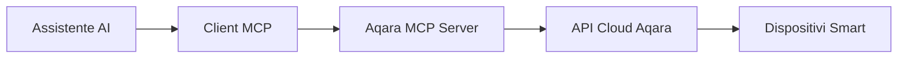

<div align="center" style="display: flex; align-items: center; justify-content: center; ">

  
  <h1>Aqara MCP Server</h1>

</div>

<div align="center">

[English](/readme/README.md) | [中文](/readme/README_CN.md) | [繁體中文](/readme/README_CHT.md) | [Français](/readme/README_FR.md) | [한국어](/readme/README_KR.md) | [Español](/readme/README_ES.md) | [日本語](/readme/README_JP.md) | [Deutsch](/readme/README_DE.md) | Italiano

[](https://github.com/aqara/aqara-mcp-server)
[](https://golang.org/dl/)
[](https://github.com/aqara/aqara-mcp-server/releases)
[](https://opensource.org/licenses/MIT)

</div>

Aqara MCP Server è un servizio di controllo domotico intelligente sviluppato basato sul protocollo [MCP (Model Context Protocol)](https://modelcontextprotocol.io/introduction). Consente a qualsiasi assistente AI o API che supporti il protocollo MCP (come Claude, Cursor, ecc.) di interagire con i tuoi dispositivi smart home Aqara, abilitando il controllo dei dispositivi tramite linguaggio naturale, query di stato ed esecuzione di scenari.

## Indice

- [Indice](#indice)
- [Caratteristiche](#caratteristiche)
- [Come Funziona](#come-funziona)
- [Guida Rapida](#guida-rapida)
  - [Prerequisiti](#prerequisiti)
  - [Installazione](#installazione)
    - [Metodo 1: Scarica Versione Precompilata (Consigliato)](#metodo-1-scarica-versione-precompilata-consigliato)
    - [Metodo 2: Compila dal Codice Sorgente](#metodo-2-compila-dal-codice-sorgente)
  - [Autenticazione Account Aqara](#autenticazione-account-aqara)
  - [Configurazione Client](#configurazione-client)
    - [Esempio Configurazione Claude for Desktop](#esempio-configurazione-claude-for-desktop)
    - [Descrizione Parametri di Configurazione](#descrizione-parametri-di-configurazione)
    - [Altri Client MCP](#altri-client-mcp)
  - [Avvio del Servizio](#avvio-del-servizio)
    - [Modalità Standard (Consigliata)](#modalità-standard-consigliata)
    - [Modalità HTTP (`Prossimamente`)](#modalità-http-prossimamente)
- [Descrizione Strumenti API](#descrizione-strumenti-api)
  - [Controllo Dispositivi](#controllo-dispositivi)
    - [device\_control](#device_control)
  - [Query Dispositivi](#query-dispositivi)
    - [device\_query](#device_query)
    - [device\_status\_query](#device_status_query)
    - [device\_log\_query](#device_log_query)
  - [Gestione Scenari](#gestione-scenari)
    - [get\_scenes](#get_scenes)
    - [run\_scenes](#run_scenes)
  - [Gestione Famiglia](#gestione-famiglia)
    - [get\_homes](#get_homes)
    - [switch\_home](#switch_home)
  - [Configurazione Automazione](#configurazione-automazione)
    - [automation\_config](#automation_config)
- [Struttura del Progetto](#struttura-del-progetto)
  - [Struttura Directory](#struttura-directory)
  - [Descrizione File Principali](#descrizione-file-principali)
- [Guida allo Sviluppo](#guida-allo-sviluppo)
- [Licenza](#licenza)

## Caratteristiche

- ✨ **Controllo Completo dei Dispositivi**: Supporta controlli granulari per interruttori, luminosità, temperatura colore, modalità e altre proprietà dei dispositivi smart Aqara
- 🔍 **Query Flessibili dei Dispositivi**: Capacità di interrogare elenchi dispositivi e stati dettagliati per stanza e tipo di dispositivo
- 🎬 **Gestione Intelligente degli Scenari**: Supporta query ed esecuzione di scenari smart home preconfigurati dall'utente
- 📈 **Storico Dispositivi**: Query dei record di modifiche dello stato storico dei dispositivi entro intervalli di tempo specificati
- ⏰ **Configurazione Automazione**: Supporta configurazione di attività di controllo dispositivi programmate o ritardate
- 🏠 **Supporto Multi-Casa**: Supporta query e cambio tra diverse famiglie sotto l'account utente
- 🔌 **Compatibilità Protocollo MCP**: Completamente conforme alle specifiche del protocollo MCP, facile integrazione con vari assistenti AI
- 🔐 **Meccanismo di Autenticazione Sicuro**: Adotta autenticazione sicura basata su autorizzazione login + firma per proteggere dati utente e sicurezza dispositivi
- 🌐 **Esecuzione Multi-Piattaforma**: Sviluppato in Go, può essere compilato in eseguibili per più piattaforme
- 🔧 **Facilmente Estensibile**: Design modulare che consente aggiunta semplice di nuovi strumenti e funzionalità

## Come Funziona

Aqara MCP Server funziona come ponte tra assistenti AI e la piattaforma smart home Aqara:



1. **Assistente AI**: L'utente invia comandi tramite l'assistente AI (es. "Accendi le luci del soggiorno")
2. **Client MCP**: Analizza i comandi utente e chiama gli strumenti appropriati forniti da Aqara MCP Server secondo il protocollo MCP (es. `device_control`)
3. **Aqara MCP Server (questo progetto)**: Riceve richieste dal client, utilizza credenziali Aqara configurate per comunicare con le API cloud Aqara ed eseguire operazioni effettive sui dispositivi o query dati
4. **Flusso di Risposta**: Le API cloud Aqara restituiscono risultati, passati tramite Aqara MCP Server al client MCP e infine presentati all'utente

## Guida Rapida

### Prerequisiti

- **Go** (versione 1.24 o superiore) - Necessario solo per compilazione da sorgente
- **Git** (per compilazione da sorgente) - Opzionale
- **Account Aqara** con dispositivi smart collegati
- **Client che supporta protocollo MCP** (come Claude for Desktop, Cursor, ecc.)

### Installazione

Puoi scegliere di scaricare file eseguibili precompilati o compilare dal codice sorgente.

#### Metodo 1: Scarica Versione Precompilata (Consigliato)

Visita la pagina GitHub Releases per scaricare l'ultimo file eseguibile per il tuo sistema operativo:

**📥 [Vai alla Pagina Releases per Scaricare](https://github.com/aqara/aqara-mcp-server/releases)**

Dopo aver scaricato l'archivio compresso per la tua piattaforma, estrailo per l'uso.

#### Metodo 2: Compila dal Codice Sorgente

```bash
# Clona il repository
git clone https://github.com/aqara/aqara-mcp-server.git
cd aqara-mcp-server

# Scarica dipendenze
go mod tidy

# Compila eseguibile
go build -o aqara-mcp-server
```

Dopo la compilazione, verrà generato il file eseguibile `aqara-mcp-server` nella directory corrente.

### Autenticazione Account Aqara

Per consentire al MCP Server di accedere al tuo account Aqara e controllare i dispositivi, devi prima completare l'autorizzazione di accesso.

Visita il seguente indirizzo per completare l'autorizzazione di accesso:
**🔗 [https://cdn.aqara.com/app/mcpserver/login.html](https://cdn.aqara.com/app/mcpserver/login.html)**

Dopo un accesso riuscito, otterrai le informazioni di autenticazione necessarie (come `token`, `region`), che verranno utilizzate nei passaggi di configurazione successivi.

> ⚠️ **Promemoria di Sicurezza**: Conserva con cura le informazioni `token` e non divulgarle ad altri.

### Configurazione Client

I metodi di configurazione differiscono leggermente tra diversi client MCP. Ecco un esempio di come configurare Claude for Desktop per utilizzare questo MCP Server:

#### Esempio Configurazione Claude for Desktop

1. **Apri le Impostazioni (Settings) di Claude for Desktop**

    

2. **Passa alla scheda Sviluppatore (Developer), quindi clicca Modifica Configurazione (Edit Config) per aprire il file di configurazione con un editor di testo**

    

3. **Aggiungi le informazioni di configurazione dalla "pagina di accesso riuscito" al file di configurazione del client `claude_desktop_config.json`**

    ```json
    {
      "mcpServers": {
        "aqara": {
          "command": "/path/to/aqara-mcp-server",
          "args": ["run", "stdio"],
          "env": {
            "token": "your_token_here",
            "region": "your_region_here"
          }
        }
      }
    }
    ```

    

#### Descrizione Parametri di Configurazione

- `command`: Percorso completo al file eseguibile `aqara-mcp-server` scaricato o compilato
- `args`: Usa `["run", "stdio"]` per avviare la modalità di trasporto stdio
- `env`: Configurazione variabili d'ambiente
  - `token`: Token di accesso ottenuto dalla pagina di accesso Aqara
  - `region`: Regione dell'account Aqara (regioni supportate: CN, US, EU, KR, SG, RU)

#### Altri Client MCP

Per altri client che supportano il protocollo MCP (come ChatGPT, Cursor, ecc.), il metodo di configurazione è simile:

- Assicurati che il client supporti il protocollo MCP
- Configura il percorso del file eseguibile e i parametri di avvio
- Imposta variabili d'ambiente `token` e `region`
- Scegli protocollo di trasporto appropriato (consigliato `stdio`)

### Avvio del Servizio

#### Modalità Standard (Consigliata)

Riavvia Claude for Desktop. Quindi puoi eseguire controllo dispositivi, query dispositivi, esecuzione scenari e altre operazioni tramite linguaggio naturale.

Esempi di conversazione:

- "Accendi le luci del soggiorno"
- "Imposta il condizionatore della camera da letto in modalità raffreddamento, temperatura 24 gradi"
- "Visualizza l'elenco dei dispositivi in tutte le stanze"
- "Esegui scenario buonanotte"


#### Modalità HTTP (`Prossimamente`)

## Descrizione Strumenti API

I client MCP possono interagire con i dispositivi smart home Aqara chiamando questi strumenti.

### Controllo Dispositivi

#### device_control

Controlla lo stato o le proprietà dei dispositivi smart home (es. interruttori, temperatura, luminosità, colore, temperatura colore, ecc.).

**Parametri:**

- `endpoint_ids` _(Array\<Integer\>, richiesto)_: Elenco ID dispositivi da controllare
- `control_params` _(Object, richiesto)_: Oggetto parametri di controllo contenente operazioni specifiche:
  - `action` _(String, richiesto)_: Operazione da eseguire (es. `"on"`, `"off"`, `"set"`, `"up"`, `"down"`, `"cooler"`, `"warmer"`)
  - `attribute` _(String, richiesto)_: Proprietà dispositivo da controllare (es. `"on_off"`, `"brightness"`, `"color_temperature"`, `"ac_mode"`)
  - `value` _(String | Number, opzionale)_: Valore target (richiesto quando action è "set")
  - `unit` _(String, opzionale)_: Unità del valore (es. `"%"`, `"K"`, `"℃"`)

**Restituisce:** Messaggio risultato operazione controllo dispositivo

### Query Dispositivi

#### device_query

Ottiene elenco dispositivi basato su posizioni specificate (stanze) e tipi di dispositivo (non include informazioni stato in tempo reale).

**Parametri:**

- `positions` _(Array\<String\>, opzionale)_: Elenco nomi stanze. Array vuoto significa query tutte le stanze
- `device_types` _(Array\<String\>, opzionale)_: Elenco tipi dispositivo (es. `"Light"`, `"WindowCovering"`, `"AirConditioner"`, `"Button"`). Array vuoto significa query tutti i tipi

**Restituisce:** Elenco dispositivi formato Markdown contenente nomi dispositivi e ID

#### device_status_query

Ottiene informazioni stato corrente dei dispositivi (per query informazioni stato in tempo reale come colore, luminosità, interruttori, ecc.).

**Parametri:**

- `positions` _(Array\<String\>, opzionale)_: Elenco nomi stanze. Array vuoto significa query tutte le stanze
- `device_types` _(Array\<String\>, opzionale)_: Elenco tipi dispositivo. Valori opzionali stessi di `device_query`. Array vuoto significa query tutti i tipi

**Restituisce:** Informazioni stato dispositivi formato Markdown

#### device_log_query

Query informazioni log storiche dispositivi.

**Parametri:**

- `endpoint_ids` _(Array\<Integer\>, richiesto)_: Elenco ID dispositivi per cui fare query record storici
- `start_datetime` _(String, opzionale)_: Tempo di inizio query, formato `YYYY-MM-DD HH:MM:SS` (es.: `"2023-05-16 12:00:00"`)
- `end_datetime` _(String, opzionale)_: Tempo di fine query, formato `YYYY-MM-DD HH:MM:SS`
- `attributes` _(Array\<String\>, opzionale)_: Elenco nomi proprietà dispositivo da interrogare (es. `["on_off", "brightness"]`). Quando non fornito, interroga tutte le proprietà registrate

**Restituisce:** Informazioni stato storico dispositivi formato Markdown

### Gestione Scenari

#### get_scenes

Query tutti gli scenari sotto la famiglia utente, o scenari entro stanze specificate.

**Parametri:**

- `positions` _(Array\<String\>, opzionale)_: Elenco nomi stanze. Array vuoto significa query scenari dell'intera famiglia

**Restituisce:** Informazioni scenari formato Markdown

#### run_scenes

Esegue scenari specificati basati su ID scenario.

**Parametri:**

- `scenes` _(Array\<Integer\>, richiesto)_: Elenco ID scenari da eseguire

**Restituisce:** Messaggio risultato esecuzione scenario

### Gestione Famiglia

#### get_homes

Ottiene tutte le famiglie sotto l'account utente.

**Parametri:** Nessuno

**Restituisce:** Elenco nomi famiglie separati da virgole. Se nessun dato, restituisce stringa vuota o messaggio appropriato

#### switch_home

Cambia la famiglia su cui l'utente sta operando attualmente. Dopo il cambio, operazioni successive come query dispositivi, controllo, ecc. saranno mirate alla nuova famiglia cambiata.

**Parametri:**

- `home_name` _(String, richiesto)_: Nome della famiglia target

**Restituisce:** Messaggio risultato operazione cambio

### Configurazione Automazione

#### automation_config

Configurazione automazione (attualmente supporta solo attività controllo dispositivi programmate o ritardate).

**Parametri:**

- `scheduled_time` _(String, richiesto)_: Punto temporale per esecuzione programmata, usa formato Crontab standard `"minuto ora giorno mese settimana"`. Es.: `"30 14 * * *"` (esegui ogni giorno alle 14:30), `"0 9 * * 1"` (esegui ogni lunedì alle 9:00)
- `endpoint_ids` _(Array\<Integer\>, richiesto)_: Elenco ID dispositivi da controllare programmati
- `control_params` _(Object, richiesto)_: Parametri controllo dispositivo, usa stesso formato dello strumento `device_control` (include action, attribute, value, ecc.)
- `task_name` _(String, richiesto)_: Nome o descrizione di questa attività automazione (per identificazione e gestione)
- `execution_once` _(Boolean, opzionale)_: Se eseguire solo una volta
  - `true`: Esegui attività solo al tempo specificato (valore predefinito)
  - `false`: Esecuzione ripetuta periodica (come giornaliera, settimanale, ecc.)

**Restituisce:** Messaggio risultato configurazione automazione

## Struttura del Progetto

### Struttura Directory

```text
.
├── cmd.go                # Definizioni comando Cobra CLI e punto ingresso programma (include funzione main)
├── server.go             # Logica core server MCP, definizioni strumenti e gestione richieste
├── smh.go                # Incapsulamento interfacce API piattaforma smart home Aqara
├── middleware.go         # Middleware: autenticazione utente, controllo timeout, recupero eccezioni
├── config.go             # Gestione configurazione globale e elaborazione variabili d'ambiente
├── go.mod                # File gestione dipendenze modulo Go
├── go.sum                # File checksum dipendenze modulo Go
├── readme/               # Documentazione README e risorse immagini
│   ├── img/              # Directory risorse immagini
│   └── *.md              # File README multilingua
├── LICENSE               # Licenza open source MIT
└── README.md             # Documento principale progetto
```

### Descrizione File Principali

- **`cmd.go`**: Implementazione CLI basata su framework Cobra, definisce modalità avvio `run stdio` e `run http` e funzione ingresso principale
- **`server.go`**: Implementazione core server MCP, responsabile registrazione strumenti, gestione richieste e supporto protocollo
- **`smh.go`**: Livello incapsulamento API piattaforma smart home Aqara, fornisce controllo dispositivi, autenticazione e supporto multi-famiglia
- **`middleware.go`**: Middleware elaborazione richieste, fornisce verifica autenticazione, controllo timeout e gestione eccezioni
- **`config.go`**: Gestione configurazione globale, responsabile elaborazione variabili d'ambiente e configurazione API

## Guida allo Sviluppo

Benvenuti a partecipare al contributo del progetto inviando Issue o Pull Request!

Prima di inviare codice, assicurati che:

1. Il codice segua le convenzioni di codifica del linguaggio Go
2. Le definizioni degli strumenti MCP correlati e delle interfacce mantengano coerenza e chiarezza
3. Aggiungi o aggiorna test unitari per coprire le tue modifiche
4. Se necessario, aggiorna la documentazione relativa (come questo README)
5. Assicurati che i tuoi messaggi di commit siano chiari e comprensibili

**🌟 Se questo progetto ti aiuta, per favore dacci una Stella!**

**🤝 Benvenuto nella nostra community, rendiamo insieme la casa intelligente più smart!**

## Licenza

Questo progetto è autorizzato sotto [MIT License](/LICENSE).

---

Copyright (c) 2025 Aqara-Copilot
