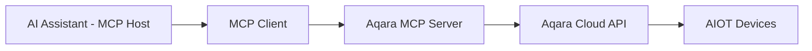

<div align="center" style="display: flex; align-items: center; justify-content: center; ">

  
  <h1>Aqara MCP Server</h1>

</div>

<div align="center">

[English](/README.md) | [中文](/readme/README_CN.md) | [繁體中文](/readme/README_CHT.md) | [Français](/readme/README_FR.md) | [한국어](/readme/README_KR.md) | [Español](/readme/README_ES.md) | 日本語 | [Deutsch](/readme/README_DE.md) | [Italiano](/readme/README_IT.md)

[](https://github.com/aqara/aqara-mcp-server)
[](https://golang.org/dl/)
[](https://github.com/aqara/aqara-mcp-server/releases)
[](https://opensource.org/licenses/MIT)
[](https://modelcontextprotocol.io/)

</div>

**Aqara MCP Server**は、[モデルコンテキストプロトコル (MCP)](https://modelcontextprotocol.io/introduction)に基づいて構築されたスマートホームオートメーション制御サービスです。このプラットフォームは、AIアシスタント（Claude、Cursorなど）とAqaraスマートホームエコシステムとのシームレスな統合を実現します。

## 目次

- [目次](#目次)
- [特徴](#特徴)
- [仕組み](#仕組み)
- [クイックスタート](#クイックスタート)
  - [前提条件](#前提条件)
  - [ステップ1：アカウント認証](#ステップ1アカウント認証)
  - [ステップ2：使用方法](#ステップ2使用方法)
    - [オプションA：リモートMCPサーバー（推奨）](#オプションaリモートmcpサーバー推奨)
    - [オプションB：ローカルMCPサーバー](#オプションbローカルmcpサーバー)
  - [ステップ3：検証](#ステップ3検証)
- [APIリファレンス](#apiリファレンス)
  - [コアツールの概要](#コアツールの概要)
  - [デバイス制御API](#デバイス制御api)
    - [`device_control`](#device_control)
  - [デバイスクエリAPI](#デバイスクエリapi)
    - [`device_query`](#device_query)
    - [`device_status_query`](#device_status_query)
    - [`device_log_query`](#device_log_query)
  - [シーン管理API](#シーン管理api)
    - [`get_scenes`](#get_scenes)
    - [`run_scenes`](#run_scenes)
  - [ホーム管理API](#ホーム管理api)
    - [`get_homes`](#get_homes)
    - [`switch_home`](#switch_home)
  - [自動化設定API](#自動化設定api)
    - [`automation_config`](#automation_config)
- [プロジェクト構造](#プロジェクト構造)
  - [ディレクトリ構造](#ディレクトリ構造)
  - [コアファイルの説明](#コアファイルの説明)
- [開発と貢献](#開発と貢献)
  - [開発環境のセットアップ](#開発環境のセットアップ)
  - [コード品質基準](#コード品質基準)
  - [貢献ガイドライン](#貢献ガイドライン)
- [ライセンス](#ライセンス)

## 特徴

- ✨ **包括的なデバイス制御**：Aqaraスマートデバイスのオン/オフ、明るさ、色温度、モードなど、さまざまな属性をきめ細かく制御
- 🔍 **柔軟なデバイスクエリ**：部屋やデバイスタイプごとにデバイスリストとその詳細なステータスを照会可能
- 🎬 **スマートシーン管理**：ユーザーが事前に設定したスマートホームシーンの照会と実行をサポート
- 📈 **デバイス履歴**：指定した期間内のデバイスのステータス変更履歴を照会
- ⏰ **自動化設定**：スケジュールまたは遅延デバイス制御タスクの設定をサポート
- 🏠 **マルチホームサポート**：ユーザーアカウント下の異なるホームの照会と切り替えをサポート
- 🔌 **MCPプロトコル互換**：MCPプロトコル仕様に完全に準拠し、さまざまなAIアシスタントと容易に統合可能
- 🔐 **安全な認証メカニズム**：ログイン認証+署名ベースのセキュリティ認証を採用し、ユーザーデータとデバイスのセキュリティを保護
- 🌐 **クロスプラットフォーム実行**：Go言語で開発され、複数のプラットフォーム用の実行可能ファイルにコンパイル可能
- 🔧 **拡張が容易**：モジュール化された設計により、新しいツールや機能を簡単に追加可能

## 仕組み

Aqara MCP Serverは、AIアシスタントとAqaraスマートホームプラットフォームの間の橋渡し役として機能します：



1.  **AIアシスタント**：ユーザーがAIアシスタントを通じて指示を出します（例：「リビングの電気をつけて」）。
2.  **MCPクライアント**：ユーザーの指示を解析し、MCPプロトコルに従ってAqara MCP Serverが提供する対応ツール（例：`device_control`）を呼び出します。
3.  **Aqara MCP Server (本プロジェクト)**：クライアントからのリクエストを受け取り、設定されたAqaraの認証情報を使用してAqaraクラウドAPIと通信し、実際のデバイス操作やデータ照会を実行します。
4.  **応答フロー**：AqaraクラウドAPIが結果を返し、Aqara MCP Server経由でMCPクライアントに渡され、最終的にユーザーに提示されます。

---

## クイックスタート

### 前提条件

-   **Aqaraアカウント**と登録済みのスマートデバイス
-   **MCP対応クライアント**（例：Claude for Desktop、Cursorなど）
-   **Go 1.24+**（ソースからのローカルデプロイメントにのみ必要）

### ステップ1：アカウント認証

どのデプロイメントモードを選択しても、まずAqaraの認証情報を取得する必要があります：

1.  **ログインページにアクセス**:
    🔗 [https://cdn.aqara.com/app/mcpserver/login.html](https://cdn.aqara.com/app/mcpserver/login.html)

2.  **ログインプロセスを完了**:
    -   Aqaraの認証情報でログイン
    -   `api_key`と`base_url`を取得

3.  **認証情報を安全に保管**:
    > ⚠️ `api_key`情報は安全に保管し、他人に漏らさないでください。

    

### ステップ2：使用方法

ニーズに合ったデプロイメント方法を選択してください：

#### オプションA：リモートMCPサーバー（推奨）

**対象**: ローカル環境の設定なしで、すぐに始めたいユーザー。

**利点**:

-   ✅ **すぐに使える**：ダウンロードやコンパイルは不要。設定するだけで直接使用可能
-   ✅ **自動更新**：サーバー側で自動的にメンテナンスおよび更新
-   ✅ **高可用性**：専門的な運用によりサービスの安定性を保証
-   ✅ **マルチプラットフォーム互換**：オペレーティングシステムの制限なし

**MCPクライアントの設定**:

1.  **設定を開く**:
    -   Cursorを起動

    

2.  **サーバー設定を追加**:

    ```json
    {
      "mcpServers": {
        "aqara": {
          "type": "http",
          "url": "https://[mcp-server-domain]/echo/mcp",  // base_url
          "headers": {
            "Authorization": "[YOUR_API_KEY_HERE]"  // api_key
          }
        }
      }
    }
    ```

3.  **アプリケーションを再起動**:
    -   Cursorを再起動して設定を有効にします。

#### オプションB：ローカルMCPサーバー

**対象**: データの主権、カスタム設定、またはオフラインでの使用が必要なユーザー。

**利点**:

-   ✅ **データプライバシー**：すべてのデータ処理はローカルで行われます
-   ✅ **完全な制御**：設定のカスタマイズと機能の拡張が可能
-   ✅ **オフライン利用可能**：ネットワークが中断しても基本機能に影響なし
-   ✅ **無制限**：クラウドサービスの制限を受けません

**インストール手順**:

1.  **プログラムをダウンロード**（いずれかを選択）：

    **推奨：プリコンパイル済みバージョンをダウンロード**

    [GitHub Releases](https://github.com/aqara/aqara-mcp-server/releases)にアクセスし、お使いのオペレーティングシステム用の最新バージョンをダウンロードします。

    **または：ソースからビルド**

    ```bash
    git clone https://github.com/aqara/aqara-mcp-server.git
    cd aqara-mcp-server
    go mod tidy
    go build -ldflags="-s -w" -o aqara-mcp-server
    ```

2.  **環境変数を設定**:

    ```bash
    export aqara_api_key="your_api_key_here"
    export aqara_base_url="your_base_url_here"
    ```

**MCPクライアントの設定（**Claude for Desktop**の場合）**:

1.  **設定を開く**:
    -   Claude for Desktopを起動
    -   設定 → 開発者 に移動

    

2.  **設定ファイルを編集**:
    -   「設定を編集」をクリック

    

3.  **サーバー設定を追加（claude_desktop_config.json）**:

    ```json
    {
      "mcpServers": {
        "aqara": {
          "command": "/path/to/aqara-mcp-server",
          "args": ["run", "stdio"],
          "env": {
            "aqara_api_key": "your_api_key_here",
            "aqara_base_url": "your_base_url_here"
          }
        }
      }
    }
    ```

4.  **アプリケーションを再起動**:
    -   Claude for Desktopを再起動して設定を有効にします。

### ステップ3：検証

以下のテストコマンドを使用して、設定が成功したかを確認します：

```
ユーザー：「家の中のすべてのデバイスを表示して」
アシスタント：[MCP経由でデバイスリストを照会]

ユーザー：「リビングの電気をつけて」
アシスタント：[MCP経由でデバイス制御を実行]

ユーザー：「夜のシーンを実行して」
アシスタント：[MCP経由でシーンを実行]
```

「🔧 Aqara MCP Serverに接続しました」のようなメッセージが表示されれば、設定は成功です！

---

## APIリファレンス

### コアツールの概要

| ツールカテゴリ | ツール | 説明 |
|---|---|---|
| **デバイス制御** | `device_control` | 直接的なデバイス操作 |
| **デバイスクエリ** | `device_query`, `device_status_query`, `device_log_query` | 包括的なデバイス情報 |
| **シーン管理** | `get_scenes`, `run_scenes` | 自動化されたシーン制御 |
| **ホーム管理** | `get_homes`, `switch_home` | マルチホーム環境のサポート |
| **自動化** | `automation_config` | スケジュールタスクの設定 |

### デバイス制御API

#### `device_control`

スマートホームデバイスの状態や属性（オン/オフ、温度、明るさ、色、色温度など）を制御します。

**パラメータ：**

-   `endpoint_ids` _(Array\<Integer\>, 必須)_：制御するデバイスIDのリスト
-   `control_params` _(Object, 必須)_：具体的な操作を含む制御パラメータオブジェクト：
    -   `action` _(String, 必須)_：実行する操作（例：`"on"`, `"off"`, `"set"`, `"up"`, `"down"`, `"cooler"`, `"warmer"`）
    -   `attribute` _(String, 必須)_：制御するデバイスの属性（例：`"on_off"`, `"brightness"`, `"color_temperature"`, `"ac_mode"`）
    -   `value` _(String | Number, オプション)_：目標値（actionが"set"の場合に必須）
    -   `unit` _(String, オプション)_：値の単位（例：`"%"`, `"K"`, `"℃"`）

**戻り値：** デバイス制御の操作結果メッセージ

### デバイスクエリAPI

#### `device_query`

指定された場所（部屋）とデバイスタイプに基づいて包括的なデバイスリストを取得し、フィルタリング機能をサポートします（リアルタイムのステータス情報は含まれません）。

**パラメータ：**

-   `positions` _(Array\<String\>, オプション)_：部屋名のリスト。空の配列はすべての部屋を照会
-   `device_types` _(Array\<String\>, オプション)_：デバイスタイプのリスト（例：`"Light"`, `"WindowCovering"`, `"AirConditioner"`, `"Button"`）。空の配列はすべてのタイプを照会

**戻り値：** デバイス名とIDを含むMarkdown形式のデバイスリスト

#### `device_status_query`

デバイスの現在のステータス情報を取得します（色、明るさ、オン/オフなどのリアルタイムステータス情報の照会に使用）。

**パラメータ：**

-   `positions` _(Array\<String\>, オプション)_：部屋名のリスト。空の配列はすべての部屋を照会
-   `device_types` _(Array\<String\>, オプション)_：デバイスタイプのリスト。選択可能な値は`device_query`と同じ。空の配列はすべてのタイプを照会

**戻り値：** Markdown形式のデバイスステータス情報

#### `device_log_query`

デバイスの履歴ログ情報を照会します。

**パラメータ：**

-   `endpoint_ids` _(Array\<Integer\>, 必須)_：履歴を照会するデバイスIDのリスト
-   `start_datetime` _(String, オプション)_：照会開始時刻、`YYYY-MM-DD HH:MM:SS`形式（例：`"2023-05-16 12:00:00"`）
-   `end_datetime` _(String, オプション)_：照会終了時刻、`YYYY-MM-DD HH:MM:SS`形式
-   `attributes` _(Array\<String\>, オプション)_：照会するデバイス属性名のリスト（例：`["on_off", "brightness"]`）。指定しない場合は記録されているすべての属性を照会

**戻り値：** Markdown形式のデバイス履歴ステータス情報

### シーン管理API

#### `get_scenes`

ユーザーのホームにあるすべてのシーン、または指定された部屋のシーンを照会します。

**パラメータ：**

-   `positions` _(Array\<String\>, オプション)_：部屋名のリスト。空の配列は家全体のシーンを照会

**戻り値：** Markdown形式のシーン情報

#### `run_scenes`

シーンIDに基づいて指定されたシーンを実行します。

**パラメータ：**

-   `scenes` _(Array\<Integer\>, 必須)_：実行するシーンIDのリスト

**戻り値：** シーン実行の結果メッセージ

### ホーム管理API

#### `get_homes`

ユーザーアカウント下のすべてのホームのリストを取得します。

**パラメータ：** なし

**戻り値：** カンマ区切りのホーム名リスト。データがない場合は空文字列または対応するプロンプトメッセージを返します

#### `switch_home`

ユーザーが現在操作しているホームを切り替えます。切り替え後、後続のデバイスクエリ、制御などは新しく切り替えたホームを対象とします。

**パラメータ：**

-   `home_name` _(String, 必須)_：対象のホーム名

**戻り値：** 切り替え操作の結果メッセージ

### 自動化設定API

#### `automation_config`

自動化設定（現在、スケジュールまたは遅延デバイス制御タスクのみサポート）。

**パラメータ：**

-   `scheduled_time` _(String, 必須)_：スケジュール実行時刻。標準のCrontab形式`"分 時 日 月 週"`を使用。例：`"30 14 * * *"`（毎日14:30に実行）、`"0 9 * * 1"`（毎週月曜9:00に実行）
-   `endpoint_ids` _(Array\<Integer\>, 必須)_：スケジュール制御するデバイスIDのリスト
-   `control_params` _(Object, 必須)_：`device_control`ツールと同じ形式のデバイス制御パラメータ（action, attribute, valueなどを含む）
-   `task_name` _(String, 必須)_：この自動化タスクの名前または説明（識別および管理用）
-   `execution_once` _(Boolean, オプション)_：一度だけ実行するかどうか
    -   `true`：指定した時間にタスクを一度だけ実行（デフォルト）
    -   `false`：タスクを周期的に繰り返し実行（毎日、毎週など）

**戻り値：** 自動化設定の結果メッセージ

## プロジェクト構造

### ディレクトリ構造

```text
.
├── cmd.go                # Cobra CLIコマンド定義とプログラムエントリポイント（main関数を含む）
├── server.go             # MCPサーバーのコアロジック、ツール定義、リクエスト処理
├── smh.go                # AqaraスマートホームプラットフォームAPIインターフェースラッパー
├── middleware.go         # ミドルウェア：ユーザー認証、タイムアウト制御、パニック回復
├── config.go             # グローバル設定管理と環境変数処理
├── go.mod                # Goモジュール依存関係管理ファイル
├── go.sum                # Goモジュール依存関係チェックサムファイル
├── readme/               # READMEドキュメントと画像リソース
│   ├── img/              # 画像リソースディレクトリ
│   └── *.md              # 多言語READMEファイル
├── LICENSE               # MITオープンソースライセンス
└── README.md             # プロジェクトのメインドキュメント
```

### コアファイルの説明

-   **`cmd.go`**: Cobraフレームワークに基づくCLI実装。`run stdio`および`run http`起動モードとメインエントリ関数を定義
-   **`server.go`**: MCPサーバーのコア実装。ツールの登録、リクエスト処理、プロトコルサポートを担当
-   **`smh.go`**: AqaraスマートホームプラットフォームAPIラッパーレイヤー。デバイス制御、認証、マルチホームサポートを提供
-   **`middleware.go`**: リクエスト処理ミドルウェア。認証検証、タイムアウト制御、例外処理を提供
-   **`config.go`**: グローバル設定管理。環境変数処理とAPI設定を担当

## 開発と貢献

### 開発環境のセットアップ

```bash
# リポジトリをクローン
git clone https://github.com/aqara/aqara-mcp-server.git
cd aqara-mcp-server

# 依存関係をインストール
go mod tidy

# テストを実行
go test ./...

# 最適化されたビルド
go build -ldflags="-s -w" -o aqara-mcp-server
```

### コード品質基準

-   **Go言語**: 公式のGoコーディング標準に準拠
-   **ドキュメント**: 包括的なAPIドキュメント
-   **テスト**: 最低80%のコードカバレッジ
-   **セキュリティ**: 定期的なセキュリティ監査

### 貢献ガイドライン

1.  **リポジトリをフォーク**
2.  **機能ブランチを作成**: `git checkout -b feature/amazing-feature`
3.  **変更をコミット**: `git commit -m '素晴らしい機能を追加'`
4.  **ブランチにプッシュ**: `git push origin feature/amazing-feature`
5.  **プルリクエストを開く**

---

## ライセンス

このプロジェクトは[MITライセンス](/LICENSE)の下でライセンスされています - 詳細は[LICENSE](LICENSE)ファイルを参照してください。

---

**Copyright © 2025 Aqara-Copilot. All rights reserved.**
