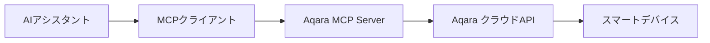

<div align="center" style="display: flex; align-items: center; justify-content: center; ">

  
  <h1>Aqara MCP Server</h1>

</div>

<div align="center">

[English](/readme/README.md) | [中文](/readme/README_CN.md) | [繁體中文](/readme/README_CHT.md) | [Français](/readme/README_FR.md) | [한국어](/readme/README_KR.md) | [Español](/readme/README_ES.md) | 日本語 | [Deutsch](/readme/README_DE.md) | [Italiano](/readme/README_IT.md)

[](https://github.com/aqara/aqara-mcp-server)
[](https://golang.org/dl/)
[](https://github.com/aqara/aqara-mcp-server/releases)
[](https://opensource.org/licenses/MIT)

</div>

Aqara MCP Serverは、[MCP (Model Context Protocol)](https://modelcontextprotocol.io/introduction)プロトコルに基づいて開発されたスマートホーム制御サービスです。MCPプロトコルをサポートするAIアシスタントやAPI（Claude、Cursorなど）がAqaraスマートホームデバイスと相互作用し、自然言語によるデバイス制御、状態照会、シーン実行などの機能を実現します。

## 目次

- [目次](#目次)
- [特徴](#特徴)
- [動作原理](#動作原理)
- [クイックスタート](#クイックスタート)
  - [前提条件](#前提条件)
  - [インストール](#インストール)
    - [方法1：プリコンパイル版のダウンロード（推奨）](#方法1プリコンパイル版のダウンロード推奨)
    - [方法2：ソースコードからのビルド](#方法2ソースコードからのビルド)
  - [Aqaraアカウント認証](#aqaraアカウント認証)
  - [クライアント設定](#クライアント設定)
    - [Claude for Desktop 設定例](#claude-for-desktop-設定例)
    - [設定パラメータの説明](#設定パラメータの説明)
    - [その他のMCPクライアント](#その他のmcpクライアント)
  - [サービス起動](#サービス起動)
    - [標準モード（推奨）](#標準モード推奨)
    - [HTTPモード（`近日サポート予定`）](#httpモード近日サポート予定)
- [APIツール説明](#apiツール説明)
  - [デバイス制御カテゴリ](#デバイス制御カテゴリ)
    - [device\_control](#device_control)
  - [デバイス照会カテゴリ](#デバイス照会カテゴリ)
    - [device\_query](#device_query)
    - [device\_status\_query](#device_status_query)
    - [device\_log\_query](#device_log_query)
  - [シーン管理カテゴリ](#シーン管理カテゴリ)
    - [get\_scenes](#get_scenes)
    - [run\_scenes](#run_scenes)
  - [ホーム管理カテゴリ](#ホーム管理カテゴリ)
    - [get\_homes](#get_homes)
    - [switch\_home](#switch_home)
  - [自動化設定カテゴリ](#自動化設定カテゴリ)
    - [automation\_config](#automation_config)
- [プロジェクト構造](#プロジェクト構造)
  - [ディレクトリ構造](#ディレクトリ構造)
  - [コアファイルの説明](#コアファイルの説明)
- [開発ガイド](#開発ガイド)
- [ライセンス](#ライセンス)

## 特徴

- ✨ **包括的なデバイス制御**：Aqaraスマートデバイスのオン/オフ、明度、色温度、モードなど、多様な属性の精密制御をサポート
- 🔍 **柔軟なデバイス照会**：部屋、デバイスタイプ別にデバイスリストとその詳細状態を照会
- 🎬 **インテリジェントシーン管理**：ユーザーが事前設定したスマートホームシーンの照会と実行をサポート
- 📈 **デバイス履歴記録**：指定期間内のデバイス状態変更履歴を照会
- ⏰ **自動化設定**：スケジュールまたは遅延デバイス制御タスクの設定をサポート
- 🏠 **マルチホームサポート**：ユーザーアカウント下の異なるホームの照会と切り替えをサポート
- 🔌 **MCPプロトコル互換**：MCPプロトコル仕様を完全遵守し、各種AIアシスタントとの統合が容易
- 🔐 **安全認証メカニズム**：ログイン認証+署名ベースのセキュア認証を採用し、ユーザーデータとデバイスの安全を保護
- 🌐 **クロスプラットフォーム実行**：Go言語で開発され、マルチプラットフォーム実行ファイルにコンパイル可能
- 🔧 **拡張性**：モジュラー設計により、新しいツールと機能の追加が容易

## 動作原理

Aqara MCP ServerはAIアシスタントとAqaraスマートホームプラットフォーム間のブリッジとして機能します：



1. **AIアシスタント**：ユーザーがAIアシスタントを通じて指示を発行（例：「リビングのライトをつけて」）
2. **MCPクライアント**：ユーザー指示を解析し、MCPプロトコルに基づいてAqara MCP Serverの対応ツール（例：`device_control`）を呼び出し
3. **Aqara MCP Server（本プロジェクト）**：クライアントからのリクエストを受信し、設定されたAqara認証情報を使用してAqaraクラウドAPIと通信し、実際のデバイス操作やデータ照会を実行
4. **レスポンスフロー**：AqaraクラウドAPIが結果を返し、Aqara MCP Serverを通じてMCPクライアントに伝達され、最終的にユーザーに表示

## クイックスタート

### 前提条件

- **Go**（バージョン1.24以上）- ソースコードからビルドする場合のみ必要
- **Git**（ソースコードからビルドする場合）- オプション
- **Aqaraアカウント**および登録済みスマートデバイス
- **MCPプロトコル対応クライアント**（Claude for Desktop、Cursorなど）

### インストール

プリコンパイル実行ファイルのダウンロードまたはソースコードからのビルドを選択できます。

#### 方法1：プリコンパイル版のダウンロード（推奨）

GitHub Releasesページにアクセスし、お使いのオペレーティングシステムに対応した最新実行ファイルをダウンロードしてください：

**📥 [Releasesページでダウンロード](https://github.com/aqara/aqara-mcp-server/releases)**

対応プラットフォームの圧縮ファイルをダウンロード後、解凍してご利用ください。

#### 方法2：ソースコードからのビルド

```bash
# リポジトリをクローン
git clone https://github.com/aqara/aqara-mcp-server.git
cd aqara-mcp-server

# 依存関係をダウンロード
go mod tidy

# 実行ファイルをビルド
go build -o aqara-mcp-server
```

ビルド完了後、現在のディレクトリに`aqara-mcp-server`実行ファイルが生成されます。

### Aqaraアカウント認証

MCP ServerがAqaraアカウントにアクセスしてデバイスを制御できるようにするため、まずログイン認証を行う必要があります。

以下のアドレスにアクセスしてログイン認証を完了してください：
**🔗 [https://cdn.aqara.com/app/mcpserver/login.html](https://cdn.aqara.com/app/mcpserver/login.html)**

ログイン成功後、必要な認証情報（`token`、`region`など）を取得できます。これらの情報は後続の設定ステップで使用されます。

> ⚠️ **セキュリティ注意**：`token`情報を適切に管理し、他者に漏洩しないよう注意してください。

### クライアント設定

MCPクライアントによって設定方法が若干異なります。以下は、Claude for DesktopでこのMCP Serverを使用するための設定例です：

#### Claude for Desktop 設定例

1. **Claude for Desktopの設定（Settings）を開く**

    

2. **開発者（Developer）タブに切り替え、設定編集（Edit Config）をクリックし、テキストエディタで設定ファイルを開く**

    

3. **「ログイン成功ページ」の設定情報を、クライアントの設定ファイル`claude_desktop_config.json`に追加**

    ```json
    {
      "mcpServers": {
        "aqara": {
          "command": "/path/to/aqara-mcp-server",
          "args": ["run", "stdio"],
          "env": {
            "token": "your_token_here",
            "region": "your_region_here"
          }
        }
      }
    }
    ```

    

#### 設定パラメータの説明

- `command`: ダウンロードまたはビルドした`aqara-mcp-server`実行ファイルの完全パス
- `args`: `["run", "stdio"]`を使用してstdio転送モードで起動
- `env`: 環境変数設定
  - `token`: Aqaraログインページから取得したアクセストークン
  - `region`: Aqaraアカウントの所在地域（サポート地域：CN、US、EU、KR、SG、RU）

#### その他のMCPクライアント

その他のMCPプロトコル対応クライアント（ChatGPT、Cursorなど）の場合も、設定方法は類似しています：

- クライアントがMCPプロトコルをサポートしていることを確認
- 実行ファイルパスと起動パラメータを設定
- 環境変数`token`と`region`を設定
- 適切な転送プロトコルを選択（`stdio`を推奨）

### サービス起動

#### 標準モード（推奨）

Claude for Desktopを再起動してください。その後、自然言語でデバイス制御、デバイス照会、シーン実行などの操作を実行できます。

対話例：

- 「リビングのライトをつけて」
- 「寝室のエアコンを冷房モード、温度24度に設定して」
- 「すべての部屋のデバイスリストを表示して」
- 「おやすみシーンを実行して」


#### HTTPモード（`近日サポート予定`）

## APIツール説明

MCPクライアントは、これらのツールを呼び出してAqaraスマートホームデバイスと相互作用できます。

### デバイス制御カテゴリ

#### device_control

スマートホームデバイスの状態や属性（オン/オフ、温度、明度、色、色温度など）を制御します。

**パラメータ：**

- `endpoint_ids` _(Array\<Integer\>, 必須)_：制御対象デバイスIDリスト
- `control_params` _(Object, 必須)_：制御パラメータオブジェクト、具体的操作を含む：
  - `action` _(String, 必須)_：実行する操作（`"on"`, `"off"`, `"set"`, `"up"`, `"down"`, `"cooler"`, `"warmer"`など）
  - `attribute` _(String, 必須)_：制御するデバイス属性（`"on_off"`, `"brightness"`, `"color_temperature"`, `"ac_mode"`など）
  - `value` _(String | Number, オプション)_：目標値（actionが"set"の場合必須）
  - `unit` _(String, オプション)_：値の単位（`"%"`, `"K"`, `"℃"`など）

**戻り値：** デバイス制御の操作結果メッセージ

### デバイス照会カテゴリ

#### device_query

指定された場所（部屋）とデバイスタイプに基づいてデバイスリストを取得（リアルタイム状態情報は含まない）。

**パラメータ：**

- `positions` _(Array\<String\>, オプション)_：部屋名リスト。空の配列はすべての部屋を照会
- `device_types` _(Array\<String\>, オプション)_：デバイスタイプリスト（`"Light"`, `"WindowCovering"`, `"AirConditioner"`, `"Button"`など）。空の配列はすべてのタイプを照会

**戻り値：** Markdown形式のデバイスリスト（デバイス名とIDを含む）

#### device_status_query

デバイスの現在の状態情報を取得（色、明度、オン/オフなどのリアルタイム状態情報の照会用）。

**パラメータ：**

- `positions` _(Array\<String\>, オプション)_：部屋名リスト。空の配列はすべての部屋を照会
- `device_types` _(Array\<String\>, オプション)_：デバイスタイプリスト。`device_query`と同じ選択肢。空の配列はすべてのタイプを照会

**戻り値：** Markdown形式のデバイス状態情報

#### device_log_query

デバイスの履歴ログ情報を照会。

**パラメータ：**

- `endpoint_ids` _(Array\<Integer\>, 必須)_：履歴記録を照会するデバイスIDリスト
- `start_datetime` _(String, オプション)_：照会開始時刻、形式は`YYYY-MM-DD HH:MM:SS`（例：`"2023-05-16 12:00:00"`）
- `end_datetime` _(String, オプション)_：照会終了時刻、形式は`YYYY-MM-DD HH:MM:SS`
- `attributes` _(Array\<String\>, オプション)_：照会するデバイス属性名リスト（`["on_off", "brightness"]`など）。未提供時はすべての記録済み属性を照会

**戻り値：** Markdown形式のデバイス履歴状態情報

### シーン管理カテゴリ

#### get_scenes

ユーザーホーム下のすべてのシーン、または指定部屋内のシーンを照会。

**パラメータ：**

- `positions` _(Array\<String\>, オプション)_：部屋名リスト。空の配列はホーム全体のシーンを照会

**戻り値：** Markdown形式のシーン情報

#### run_scenes

シーンIDに基づいて指定されたシーンを実行。

**パラメータ：**

- `scenes` _(Array\<Integer\>, 必須)_：実行するシーンIDリスト

**戻り値：** シーン実行の結果メッセージ

### ホーム管理カテゴリ

#### get_homes

ユーザーアカウント下のすべてのホームリストを取得。

**パラメータ：** なし

**戻り値：** カンマ区切りのホーム名リスト。データがない場合は空文字列または対応する通知情報を返す

#### switch_home

ユーザーの現在操作対象ホームを切り替え。切り替え後、後続のデバイス照会、制御などの操作は新しく切り替えたホームを対象とする。

**パラメータ：**

- `home_name` _(String, 必須)_：対象ホームの名前

**戻り値：** 切り替え操作の結果メッセージ

### 自動化設定カテゴリ

#### automation_config

自動化設定（現在はスケジュールまたは遅延デバイス制御タスクのみサポート）。

**パラメータ：**

- `scheduled_time` _(String, 必須)_：スケジュール実行時刻、標準Crontab形式`"分 時 日 月 週"`を使用。例：`"30 14 * * *"`（毎日14:30実行）、`"0 9 * * 1"`（毎週月曜9:00実行）
- `endpoint_ids` _(Array\<Integer\>, 必須)_：スケジュール制御対象デバイスIDリスト
- `control_params` _(Object, 必須)_：デバイス制御パラメータ、`device_control`ツールと同じ形式を使用（action、attribute、valueなどを含む）
- `task_name` _(String, 必須)_：この自動化タスクの名前または説明（識別と管理用）
- `execution_once` _(Boolean, オプション)_：一度だけ実行するかどうか
  - `true`：指定時刻に一度だけタスクを実行（デフォルト値）
  - `false`：周期的に繰り返しタスクを実行（毎日、毎週など）

**戻り値：** 自動化設定結果メッセージ

## プロジェクト構造

### ディレクトリ構造

```text
.
├── cmd.go                # Cobra CLI コマンド定義とプログラムエントリーポイント（main関数を含む）
├── server.go             # MCP サーバーコアロジック、ツール定義とリクエスト処理
├── smh.go                # Aqara スマートホームプラットフォーム API インターフェース封装
├── middleware.go         # ミドルウェア：ユーザー認証、タイムアウト制御、例外復旧
├── config.go             # グローバル設定管理と環境変数処理
├── go.mod                # Go モジュール依存関係管理ファイル
├── go.sum                # Go モジュール依存関係チェックサムファイル
├── readme/               # README ドキュメントと画像リソース
│   ├── img/              # 画像リソースディレクトリ
│   └── *.md              # 多言語 README ファイル
├── LICENSE               # MIT オープンソースライセンス
└── README.md             # プロジェクトメインドキュメント
```

### コアファイルの説明

- **`cmd.go`**：CobraフレームワークベースのCLI実装、`run stdio`と`run http`起動モードおよびメインエントリー関数を定義
- **`server.go`**：MCPサーバーコア実装、ツール登録、リクエスト処理、プロトコルサポートを担当
- **`smh.go`**：Aqaraスマートホームプラットフォーム API 封装レイヤー、デバイス制御、認証、マルチホームサポートを提供
- **`middleware.go`**：リクエスト処理ミドルウェア、認証検証、タイムアウト制御、例外処理を提供
- **`config.go`**：グローバル設定管理、環境変数処理とAPI設定を担当

## 開発ガイド

IssueまたはPull Requestの提出によるプロジェクト貢献を歓迎します！

コード提出前に、以下を確認してください：

1. コードがGo言語のコーディング規範に準拠している
2. 関連するMCPツールとインターフェース定義の一貫性と明確性を保持
3. 変更をカバーする単体テストを追加または更新
4. 必要に応じて関連ドキュメント（このREADMEなど）を更新
5. コミットメッセージが明確である

**🌟 このプロジェクトがお役に立ちましたら、ぜひStarをお願いします！**

**🤝 コミュニティへの参加を歓迎し、一緒にスマートホームをより賢くしましょう！**

## ライセンス

本プロジェクトは[MIT License](/LICENSE)に基づいてライセンスされています。

---

Copyright (c) 2025 Aqara-Copilot
