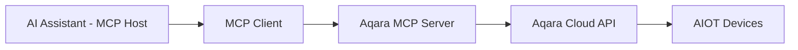

<div align="center" style="display: flex; align-items: center; justify-content: center; ">

  
  <h1>Aqara MCP Server</h1>

</div>

<div align="center">

[English](/README.md) | [中文](/readme/README_CN.md) | [繁體中文](/readme/README_CHT.md) | [Français](/readme/README_FR.md) | 한국어 | [Español](/readme/README_ES.md) | [日本語](/readme/README_JP.md) | [Deutsch](/readme/README_DE.md) | [Italiano](/readme/README_IT.md)

[](https://github.com/aqara/aqara-mcp-server)
[](https://golang.org/dl/)
[](https://github.com/aqara/aqara-mcp-server/releases)
[](https://opensource.org/licenses/MIT)
[](https://modelcontextprotocol.io/)

</div>

**Aqara MCP Server**는 [모델 컨텍스트 프로토콜(MCP)](https://modelcontextprotocol.io/introduction)을 기반으로 구축된 스마트 홈 자동화 제어 서비스입니다. 이 플랫폼은 AI 어시스턴트(예: Claude, Cursor 등)와 Aqara 스마트 홈 생태계 간의 원활한 통합을 구현합니다.

## 목차

- [목차](#목차)
- [특징](#특징)
- [작동 원리](#작동-원리)
- [빠른 시작](#빠른-시작)
  - [전제 조건](#전제-조건)
  - [1단계: 계정 인증](#1단계-계정-인증)
  - [2단계: 사용 방법](#2단계-사용-방법)
    - [옵션 A: 원격 MCP 서버(권장)](#옵션-a-원격-mcp-서버권장)
    - [옵션 B: 로컬 MCP 서버](#옵션-b-로컬-mcp-서버)
  - [3단계: 확인](#3단계-확인)
- [API 참조](#api-참조)
  - [핵심 도구 개요](#핵심-도구-개요)
  - [장치 제어 API](#장치-제어-api)
    - [`device_control`](#device_control)
  - [장치 조회 API](#장치-조회-api)
    - [`device_query`](#device_query)
    - [`device_status_query`](#device_status_query)
    - [`device_log_query`](#device_log_query)
  - [장면 관리 API](#장면-관리-api)
    - [`get_scenes`](#get_scenes)
    - [`run_scenes`](#run_scenes)
  - [홈 관리 API](#홈-관리-api)
    - [`get_homes`](#get_homes)
    - [`switch_home`](#switch_home)
  - [자동화 구성 API](#자동화-구성-api)
    - [`automation_config`](#automation_config)
- [프로젝트 구조](#프로젝트-구조)
  - [디렉토리 구조](#디렉토리-구조)
  - [핵심 파일 설명](#핵심-파일-설명)
- [개발 및 기여](#개발-및-기여)
  - [개발 환경 설정](#개발-환경-설정)
  - [코드 품질 표준](#코드-품질-표준)
  - [기여 가이드라인](#기여-가이드라인)
- [라이선스](#라이선스)

## 특징

- ✨ **포괄적인 장치 제어**: Aqara 스마트 장치의 전원, 밝기, 색온도, 모드 등 다양한 속성을 정밀하게 제어 지원
- 🔍 **유연한 장치 조회**: 방, 장치 유형별로 장치 목록 및 상세 상태 조회 가능
- 🎬 **스마트 장면 관리**: 사용자가 미리 설정한 스마트 홈 장면 조회 및 실행 지원
- 📈 **장치 이력 기록**: 지정된 시간 범위 내의 장치 상태 변경 이력 조회
- ⏰ **자동화 구성**: 예약 또는 지연 장치 제어 작업 구성 지원
- 🏠 **다중 홈 지원**: 사용자 계정 하의 여러 홈 조회 및 전환 지원
- 🔌 **MCP 프로토콜 호환**: MCP 프로토콜 사양을 완벽하게 준수하여 다양한 AI 어시스턴트와 쉽게 통합 가능
- 🔐 **보안 인증 메커니즘**: 로그인 인증 + 서명 기반의 보안 인증을 채택하여 사용자 데이터 및 장치 보안 보호
- 🌐 **크로스 플랫폼 실행**: Go 언어로 개발되어 여러 플랫폼용 실행 파일로 컴파일 가능
- 🔧 **쉬운 확장성**: 모듈식 설계로 새로운 도구와 기능을 쉽게 추가 가능

## 작동 원리

Aqara MCP Server는 AI 어시스턴트와 Aqara 스마트 홈 플랫폼 간의 다리 역할을 합니다:



1.  **AI 어시스턴트**: 사용자가 AI 어시스턴트를 통해 명령을 내립니다(예: "거실 불 켜줘").
2.  **MCP 클라이언트**: 사용자 명령을 분석하고 MCP 프로토콜에 따라 Aqara MCP Server가 제공하는 해당 도구(예: `device_control`)를 호출합니다.
3.  **Aqara MCP Server (본 프로젝트)**: 클라이언트로부터 요청을 받아 구성된 Aqara 자격 증명을 사용하여 Aqara 클라우드 API와 통신하고 실제 장치 조작 또는 데이터 조회를 수행합니다.
4.  **응답 흐름**: Aqara 클라우드 API가 결과를 반환하고, Aqara MCP Server를 통해 MCP 클라이언트로 전달되어 최종적으로 사용자에게 표시됩니다.

---

## 빠른 시작

### 전제 조건

-   **Aqara 계정** 및 등록된 스마트 장치
-   **MCP 지원 클라이언트** (예: Claude for Desktop, Cursor 등)
-   **Go 1.24+** (소스 코드 빌드를 위한 로컬 배포 시에만 필요)

### 1단계: 계정 인증

어떤 배포 모드를 선택하든 먼저 Aqara 인증 정보를 얻어야 합니다:

1.  **로그인 페이지 방문**:
    🔗 [https://cdn.aqara.com/app/mcpserver/login.html](https://cdn.aqara.com/app/mcpserver/login.html)

2.  **로그인 절차 완료**:
    -   Aqara 자격 증명으로 로그인
    -   `api_key`와 `base_url` 획득

3.  **자격 증명 안전하게 저장**:
    > ⚠️ `api_key` 정보를 안전하게 보관하고 다른 사람에게 유출하지 마십시오.

    

### 2단계: 사용 방법

필요에 맞는 배포 방식을 선택하십시오:

#### 옵션 A: 원격 MCP 서버(권장)

**적합 대상**: 로컬 환경 설정 없이 빠르게 시작하고 싶은 사용자.

**장점**:

-   ✅ **즉시 사용 가능**: 다운로드나 컴파일 없이 바로 구성하여 사용 가능
-   ✅ **자동 업데이트**: 서버 측에서 자동 유지보수 및 업데이트
-   ✅ **고가용성**: 전문적인 운영으로 서비스 안정성 보장
-   ✅ **다중 플랫폼 호환**: 운영 체제 제한 없음

**MCP 클라이언트 구성**:

1.  **설정 열기**:
    -   Cursor 실행

    

2.  **서버 구성 추가**:

    ```json
    {
      "mcpServers": {
        "aqara": {
          "type": "http",
          "url": "https://[mcp-server-domain]/echo/mcp",  // base_url
          "headers": {
            "Authorization": "Bearer [YOUR_API_KEY_HERE]"  // api_key
          }
        }
      }
    }
    ```

3.  **애플리케이션 다시 시작**:
    -   Cursor를 다시 시작하여 구성을 적용합니다.

#### 옵션 B: 로컬 MCP 서버

**적합 대상**: 데이터 주권, 사용자 지정 구성 또는 오프라인 사용이 필요한 사용자.

**장점**:

-   ✅ **데이터 프라이버시**: 모든 데이터 처리가 로컬에서 이루어짐
-   ✅ **완전한 제어**: 구성 및 기능 확장 가능
-   ✅ **오프라인 사용 가능**: 네트워크 중단이 기본 기능에 영향을 미치지 않음
-   ✅ **제한 없음**: 클라우드 서비스 제한 없음

**설치 단계**:

1.  **프로그램 다운로드** (둘 중 하나 선택):

    **권장: 사전 컴파일된 버전 다운로드**

    [GitHub Releases](https://github.com/aqara/aqara-mcp-server/releases)에서 운영 체제에 맞는 최신 버전을 다운로드하십시오.

    **또는: 소스에서 빌드**

    ```bash
    git clone https://github.com/aqara/aqara-mcp-server.git
    cd aqara-mcp-server
    go mod tidy
    go build -ldflags="-s -w" -o aqara-mcp-server
    ```

2.  **환경 변수 설정**:

    ```bash
    export aqara_api_key="your_api_key_here"
    export aqara_base_url="your_base_url_here"
    ```

**MCP 클라이언트 구성(**Claude for Desktop** 예시)**:

1.  **설정 열기**:
    -   Claude for Desktop 실행
    -   설정 → 개발자로 이동

    

2.  **구성 파일 편집**:
    -   "구성 편집" 클릭

    

3.  **서버 구성 추가(claude_desktop_config.json)**:

    ```json
    {
      "mcpServers": {
        "aqara": {
          "command": "/path/to/aqara-mcp-server",
          "args": ["run", "stdio"],
          "env": {
            "aqara_api_key": "your_api_key_here",
            "aqara_base_url": "your_base_url_here"
          }
        }
      }
    }
    ```

4.  **애플리케이션 다시 시작**:
    -   Claude for Desktop을 다시 시작하여 구성을 적용합니다.

### 3단계: 확인

다음 테스트 명령을 사용하여 구성이 성공했는지 확인하십시오:

```
사용자: "우리 집 모든 장치 보여줘"
어시스턴트: [MCP를 통해 장치 목록 조회]

사용자: "거실 불 켜줘"
어시스턴트: [MCP를 통해 장치 제어 실행]

사용자: "저녁 장면 실행해"
어시스턴트: [MCP를 통해 장면 실행]
```

"🔧 Aqara MCP Server에 연결되었습니다"와 같은 메시지가 표시되면 구성이 성공한 것입니다!

---

## API 참조

### 핵심 도구 개요

| 도구 범주 | 도구 | 설명 |
|---|---|---|
| **장치 제어** | `device_control` | 직접 장치 조작 |
| **장치 조회** | `device_query`, `device_status_query`, `device_log_query` | 포괄적인 장치 정보 |
| **장면 관리** | `get_scenes`, `run_scenes` | 자동화된 장면 제어 |
| **홈 관리** | `get_homes`, `switch_home` | 다중 홈 환경 지원 |
| **자동화** | `automation_config` | 예약 작업 구성 |

### 장치 제어 API

#### `device_control`

스마트 홈 장치의 상태나 속성(예: 전원, 온도, 밝기, 색상, 색온도 등)을 제어합니다.

**매개변수:**

-   `endpoint_ids` _(Array\<Integer\>, 필수)_: 제어할 장치 ID 목록
-   `control_params` _(Object, 필수)_: 구체적인 작업을 포함하는 제어 매개변수 객체:
    -   `action` _(String, 필수)_: 수행할 작업 (예: `"on"`, `"off"`, `"set"`, `"up"`, `"down"`, `"cooler"`, `"warmer"`)
    -   `attribute` _(String, 필수)_: 제어할 장치 속성 (예: `"on_off"`, `"brightness"`, `"color_temperature"`, `"ac_mode"`)
    -   `value` _(String | Number, 선택)_: 목표 값 (action이 "set"일 때 필수)
    -   `unit` _(String, 선택)_: 값의 단위 (예: `"%"`, `"K"`, `"℃"`)

**반환:** 장치 제어 작업 결과 메시지

### 장치 조회 API

#### `device_query`

지정된 위치(방) 및 장치 유형에 따라 포괄적인 장치 목록을 검색하며, 필터링 기능을 지원합니다(실시간 상태 정보는 포함하지 않음).

**매개변수:**

-   `positions` _(Array\<String\>, 선택)_: 방 이름 목록. 빈 배열은 모든 방을 조회
-   `device_types` _(Array\<String\>, 선택)_: 장치 유형 목록 (예: `"Light"`, `"WindowCovering"`, `"AirConditioner"`, `"Button"`). 빈 배열은 모든 유형을 조회

**반환:** 장치 이름과 ID를 포함하는 Markdown 형식의 장치 목록

#### `device_status_query`

장치의 현재 상태 정보를 가져옵니다(색상, 밝기, 전원 등 실시간 상태 정보 조회용).

**매개변수:**

-   `positions` _(Array\<String\>, 선택)_: 방 이름 목록. 빈 배열은 모든 방을 조회
-   `device_types` _(Array\<String\>, 선택)_: 장치 유형 목록. `device_query`와 선택 값 동일. 빈 배열은 모든 유형을 조회

**반환:** Markdown 형식의 장치 상태 정보

#### `device_log_query`

장치의 이력 로그 정보를 조회합니다.

**매개변수:**

-   `endpoint_ids` _(Array\<Integer\>, 필수)_: 이력을 조회할 장치 ID 목록
-   `start_datetime` _(String, 선택)_: 조회 시작 시간, `YYYY-MM-DD HH:MM:SS` 형식 (예: `"2023-05-16 12:00:00"`)
-   `end_datetime` _(String, 선택)_: 조회 종료 시간, `YYYY-MM-DD HH:MM:SS` 형식
-   `attributes` _(Array\<String\>, 선택)_: 조회할 장치 속성 이름 목록 (예: `["on_off", "brightness"]`). 제공되지 않으면 기록된 모든 속성을 조회

**반환:** Markdown 형식의 장치 이력 상태 정보

### 장면 관리 API

#### `get_scenes`

사용자 홈의 모든 장면 또는 지정된 방의 장면을 조회합니다.

**매개변수:**

-   `positions` _(Array\<String\>, 선택)_: 방 이름 목록. 빈 배열은 전체 홈의 장면을 조회

**반환:** Markdown 형식의 장면 정보

#### `run_scenes`

장면 ID에 따라 지정된 장면을 실행합니다.

**매개변수:**

-   `scenes` _(Array\<Integer\>, 필수)_: 실행할 장면 ID 목록

**반환:** 장면 실행 결과 메시지

### 홈 관리 API

#### `get_homes`

사용자 계정의 모든 홈 목록을 가져옵니다.

**매개변수:** 없음

**반환:** 쉼표로 구분된 홈 이름 목록. 데이터가 없으면 빈 문자열 또는 해당 프롬프트 메시지를 반환

#### `switch_home`

사용자의 현재 작업 홈을 전환합니다. 전환 후, 후속 장치 조회, 제어 등의 작업은 새로 전환된 홈을 대상으로 합니다.

**매개변수:**

-   `home_name` _(String, 필수)_: 대상 홈의 이름

**반환:** 전환 작업 결과 메시지

### 자동화 구성 API

#### `automation_config`

자동화 구성(현재 예약 또는 지연 장치 제어 작업만 지원).

**매개변수:**

-   `scheduled_time` _(String, 필수)_: 예약 실행 시간, 표준 Crontab 형식 `"분 시 일 월 주"` 사용. 예: `"30 14 * * *"`(매일 14:30 실행), `"0 9 * * 1"`(매주 월요일 9:00 실행)
-   `endpoint_ids` _(Array\<Integer\>, 필수)_: 예약 제어할 장치 ID 목록
-   `control_params` _(Object, 필수)_: `device_control` 도구와 동일한 형식의 장치 제어 매개변수(action, attribute, value 등 포함)
-   `task_name` _(String, 필수)_: 이 자동화 작업의 이름 또는 설명(식별 및 관리용)
-   `execution_once` _(Boolean, 선택)_: 한 번만 실행할지 여부
    -   `true`: 지정된 시간에 작업을 한 번만 실행(기본값)
    -   `false`: 주기적으로 작업 반복 실행(예: 매일, 매주 등)

**반환:** 자동화 구성 결과 메시지

## 프로젝트 구조

### 디렉토리 구조

```text
.
├── cmd.go                # Cobra CLI 명령 정의 및 프로그램 진입점 (main 함수 포함)
├── server.go             # MCP 서버 핵심 로직, 도구 정의 및 요청 처리
├── smh.go                # Aqara 스마트 홈 플랫폼 API 인터페이스 래퍼
├── middleware.go         # 미들웨어: 사용자 인증, 타임아웃 제어, 예외 복구
├── config.go             # 전역 구성 관리 및 환경 변수 처리
├── go.mod                # Go 모듈 의존성 관리 파일
├── go.sum                # Go 모듈 의존성 체크섬 파일
├── readme/               # README 문서 및 이미지 리소스
│   ├── img/              # 이미지 리소스 디렉토리
│   └── *.md              # 다국어 README 파일
├── LICENSE               # MIT 오픈 소스 라이선스
└── README.md             # 프로젝트 주 문서
```

### 핵심 파일 설명

-   **`cmd.go`**: Cobra 프레임워크 기반의 CLI 구현, `run stdio` 및 `run http` 시작 모드 및 주 진입 함수 정의
-   **`server.go`**: MCP 서버 핵심 구현, 도구 등록, 요청 처리 및 프로토콜 지원 담당
-   **`smh.go`**: Aqara 스마트 홈 플랫폼 API 래퍼 계층, 장치 제어, 인증 및 다중 홈 지원 제공
-   **`middleware.go`**: 요청 처리 미들웨어, 인증 검증, 타임아웃 제어 및 예외 처리 제공
-   **`config.go`**: 전역 구성 관리, 환경 변수 처리 및 API 구성 담당

## 개발 및 기여

### 개발 환경 설정

```bash
# 저장소 복제
git clone https://github.com/aqara/aqara-mcp-server.git
cd aqara-mcp-server

# 의존성 설치
go mod tidy

# 테스트 실행
go test ./...

# 최적화된 빌드
go build -ldflags="-s -w" -o aqara-mcp-server
```

### 코드 품질 표준

-   **Go 언어**: 공식 Go 코딩 표준 준수
-   **문서**: 포괄적인 API 문서
-   **테스트**: 최소 80% 코드 커버리지
-   **보안**: 정기적인 보안 감사

### 기여 가이드라인

1.  **저장소 포크**
2.  **기능 브랜치 생성**: `git checkout -b feature/amazing-feature`
3.  **변경 사항 커밋**: `git commit -m '놀라운 기능 추가'`
4.  **브랜치에 푸시**: `git push origin feature/amazing-feature`
5.  **Pull Request 열기**

---

## 라이선스

이 프로젝트는 [MIT 라이선스](/LICENSE)에 따라 라이선스가 부여됩니다 - 자세한 내용은 [LICENSE](LICENSE) 파일을 참조하십시오.

---

**Copyright © 2025 Aqara-Copilot. All rights reserved.**
